# Eldra Starter · Spec 1: Foundations and core components

This spec covers the design foundations (tokens, type, space, motion, focus) and every **core component**: the buttons, form controls, selects, cards, overlays and navigation parts the blocks are built from. **Spec 2** (`02-blocks.md`) covers the CMS blocks and sample pages, and uses only what is defined here.

It is framework-neutral. Build the components in whatever stack the project uses. Everything a component needs is in its section: its parts, properties, sizes in rem, states as colour **roles** (never raw colours), behaviour, keyboard map, accessibility semantics and a testable acceptance checklist. The reference images in `images/core/` show the intended result, rendered with the webfont pairing described under Typography.

**How to read the images.** Small uppercase labels in the images (such as "VARIANTS · MD" or "STATES") name the row; they aren't part of the component. Where an image shows a focus ring on an element that isn't actually focused, it illustrates the focus-visible state. The flat coloured shapes stand in for product photography.

## Contents

1. [Non-negotiables](#non-negotiables)
2. [Foundations](#foundations): colour, typography, spacing and layout, radius and shadow, motion, focus ring, iconography, imagery, voice
3. [Accessibility requirements (WCAG 2.2 AA)](#accessibility-requirements-wcag-22-aa)
4. [Component conventions](#component-conventions)
5. [Actions and forms](#actions-and-forms): Button, Link, Input, Textarea, Field wrapper, Form layout, Checkbox, Radio group, Switch, Select, Multi-select, Quantity stepper, Variant picker, Search bar
6. [Display, commerce and layout](#display-commerce-and-layout): Badge, Price, Rating, Avatar, Logo item, Product card, Content card, Feature card, Container and section, Image, Skeleton, Empty and error states
7. [Overlays, navigation and feedback](#overlays-navigation-and-feedback): Dialog, Drawer, Lightbox, Search modal, Accordion, Tabs, Tooltip, Toast, Breadcrumb, Pagination, Carousel
8. [Definition of done](#definition-of-done)

---

## Non-negotiables

1. **WCAG 2.2 level AA, for colour and keyboard, on every component.** Every acceptance checklist below must pass before a component counts as done. There are no "visual only" exceptions.
2. **Every modal surface is a native `<dialog>` element opened as a modal** (with the platform's modal method, not by toggling the `open` attribute). That covers Dialog, Drawer (cart, mobile menu, filters), Lightbox, Search modal and any confirmation step. Rely on the platform for the inert background, `Esc` to close and the backdrop. Never build a modal from a `<div role="dialog">` or a custom focus trap. Non-modal popups (select panels, search results panel, mega-menus, tooltips) are **not** dialogs.
3. **Colours are roles, never values.** Components reference token names (`text`, `muted`, `primary`...). Store owners can change the values, and nothing may hard-code a colour.
4. **Custom selects, never the native select UI.** Select and Multi-select are custom controls with search, groups and rich options. A native `<select>` may stay hidden underneath as progressive enhancement, so forms post and work without scripting.
5. **One focus ring everywhere** (see [Focus ring](#focus-ring)). Never remove it, and never replace it with a colour change.
6. **Compact controls.** Form controls are 2.5rem tall. Only primary action buttons grow to 2.75rem on narrow screens.
7. **Motion is calm and optional.** 150–250ms, easing out, nothing bounces, nothing moves on its own, and everything respects reduced motion.

---

## Foundations

All values are also in `tokens.json` (W3C design-tokens format) next to this file. Light theme only.

### Colour

Components use these roles. The contrast ratios in the notes were computed against the default values and are the basis of every contrast claim in this spec.

| Role | Default | Usage and contrast |
| --- | --- | --- |
| `background` | `#fcfbf8` | Page ground (warm paper). Every block without a section background sits on it. text 16.9:1, muted 7.4:1. |
| `surface` | `#f4f1eb` | Quiet section background, cards, input read-only fill, image placeholder. text 15.5:1, muted 6.8:1. |
| `surface-strong` | `#e9e4da` | Stronger band: footer, skeletons, neutral badge fill, selected rows. text 13.8:1, muted 6.1:1, border-strong 3.6:1. |
| `border` | `#ddd6ca` | DECORATIVE dividers only: card outlines, table rules, section hairlines. Below 3:1 on purpose, never the only boundary of a control. |
| `border-strong` | `#7d7466` | ADDED ROLE. Boundaries of interactive controls (inputs, checkboxes, switch track, outline button, unselected pills). 4.5:1 on background, 4.1:1 on surface, 3.6:1 on surface-strong (WCAG 1.4.11 needs 3:1). |
| `text` | `#1c1917` | Body copy and headings on background (16.9:1), surface (15.5:1) and surface-strong (13.8:1). |
| `muted` | `#595249` | Secondary text: help text, meta lines, captions, placeholders, compare-at prices. 7.4:1 on background, 6.8:1 on surface, 6.1:1 on surface-strong. |
| `primary` | `#24201c` | Brand slot (default: deep ink). Primary buttons, selected states, links, the 'new' badge, primary section background. Customers drop their brand colour in here; keep primary-contrast at 4.5:1+ against it. |
| `primary-contrast` | `#fcfbf8` | Text and icons on primary fills (15.6:1). |
| `accent` | `#9c3f24` | Clay accent. Secondary buttons, sale badge and sale price, eyebrows, accent section background. 6.4:1 on background, 5.3:1 on surface-strong, so it is safe as text too. |
| `accent-contrast` | `#ffffff` | Text and icons on accent fills (6.7:1). |
| `success` | `#0e6b62` | In stock, order delivered, form success. Teal rather than green so it separates from danger for red-green colour blindness; always paired with an icon and a word. 6.2:1 on background, 5.0:1 on surface-strong; background text on it 6.2:1. |
| `warning` | `#8a5300` | Low stock, back-order, shipping delays. Always with an icon and a word. 6.1:1 on background, 5.0:1 on surface-strong; background text on it 6.1:1. |
| `danger` | `#b0261c` | Errors, destructive actions, sold out. Always with an icon and a word. 6.5:1 on background, 5.3:1 on surface-strong; background text on it 6.5:1. |
| `focus` | `#1c1917` | ADDED ROLE. The dark outer ring of the keyboard focus indicator (2px, drawn outside a 2px focus-inner infill). 16.9:1 on background, 15.5:1 on surface, 13.8:1 on surface-strong; 17.5:1 against focus-inner. On dark grounds (primary, accent, overlay, photos) the white infill carries the contrast instead, so the pair is visible on every surface without per-section overrides. |
| `focus-inner` | `#ffffff` | ADDED ROLE. The white infill between a focused control and the focus ring. 16.2:1 against primary, 6.7:1 against accent, 17.5:1 against focus. Never used for anything else. |
| `overlay` | `rgba(28, 25, 23, 0.7)` | ADDED ROLE. Scrim behind dialogs and drawers, and the tint under text laid over images (hero image-background). At 0.7 even a pure white photo leaves primary-contrast text at 6.2:1. |

Rules:

- `text` and `muted` go only on `background`, `surface` or `surface-strong`. On a `primary` or `accent` background, text, links, ghost and link buttons switch to `primary-contrast` / `accent-contrast`. The primary button inverts, and outline buttons draw in the contrast colour.
- Body text on `background` must reach **7:1** (it is 16.9:1). All other text reaches at least **4.5:1**, and control boundaries, focus indicators and meaningful icons at least **3:1**.
- Status is never colour alone. `success`, `warning` and `danger` always come with an icon and a word ("In stock", "Low stock: only 3 left", "Sold out").
- Text over a photo always sits on the `overlay` scrim or on a solid `background` panel.
- When a store changes `primary`, the admin must check that `primary-contrast` still reaches 4.5:1 against it, and block the change if it doesn't.

### Typography

Two families plus mono. **By default the theme uses the system sans-serif stack.** The optional upgrade is a free webfont pairing: **Bricolage Grotesque** for headings and **Instrument Sans** for body text. Both family stacks name the webfont first and fall back to the system stack, so the upgrade only means loading the font files. The reference images show the upgrade.

| Family | Stack |
| --- | --- |
| `heading` | "Bricolage Grotesque", ui-sans-serif, system-ui, -apple-system, "Segoe UI", sans-serif |
| `body` | "Instrument Sans", ui-sans-serif, system-ui, -apple-system, "Segoe UI", sans-serif |
| `mono` | ui-monospace, SFMono-Regular, Menlo, Consolas, monospace |

| Style | Family | Size | Line height | Weight | Tracking | Use |
| --- | --- | --- | --- | --- | --- | --- |
| `display` | heading | 3.5rem | 1.05 | 700 | -0.02em | Hero heading only. 2.5rem below 48rem container width. |
| `h1` | heading | 2.75rem | 1.1 | 700 | -0.02em | Page title, one per page. 2.125rem below 48rem. |
| `h2` | heading | 2rem | 1.15 | 700 | -0.015em | Block heading. 1.625rem below 48rem. |
| `h3` | heading | 1.5rem | 1.25 | 600 | -0.01em | Card group titles, plan names, article subheads. |
| `h4` | heading | 1.125rem | 1.35 | 600 | 0 | Card titles, product names, feature titles. |
| `body-lg` | body | 1.125rem | 1.6 | 400 | 0 | Lead paragraphs, hero subheading. |
| `body` | body | 1rem | 1.6 | 400 | 0 | Default copy, inputs, buttons md/lg. |
| `body-sm` | body | 0.875rem | 1.5 | 400 | 0 | Help text, meta lines, small buttons, table cells. |
| `caption` | body | 0.8125rem | 1.4 | 400 | 0.01em | Image captions, legal line, badge text. |
| `overline` | body | 0.75rem | 1.3 | 600 | 0.12em | Eyebrows above headings. Uppercase via CSS, never typed in caps. |
| `label` | body | 0.875rem | 1.4 | 600 | 0 | Form labels, tab labels, filter group titles. |
| `code` | mono | 0.875rem | 1.6 | 400 | 0 | Inline code and code blocks in the Article block. |

- Responsive step-down when the **block** is narrower than 48rem: `display` 2.5rem, `h1` 2.125rem, `h2` 1.625rem, `h3` 1.25rem.
- Headings use balanced wrapping. Eyebrows (`overline`) are typed in sentence case, set in uppercase by styling and coloured `accent`.
- One block uses at most three type sizes. The article rich text is the one documented exception.
- Text must survive the WCAG 1.4.12 text-spacing overrides (line height 1.5, paragraph spacing 2em, letter spacing 0.12em, word spacing 0.16em) without clipping. Never give text boxes fixed heights.

### Spacing and layout

| Token | Value | Usage |
| --- | --- | --- |
| `space-1` | `0.25rem` | Icon-to-text gap inside badges; tight inline gaps. |
| `space-2` | `0.5rem` | Gap between button icon and label, chip gaps, dropdown trigger icon gap. |
| `space-3` | `0.75rem` | Gap inside control groups, list item gaps. |
| `space-4` | `1rem` | Card padding (sm), mobile gutter, gap between form rows. |
| `space-5` | `1.25rem` | STACK: default vertical rhythm between elements in a block. |
| `space-6` | `1.5rem` | Card padding (md), tablet gutter, grid gap. |
| `space-8` | `2rem` | Desktop gutter, gap between block header and block body. |
| `space-12` | `3rem` | Large grid gaps, split-content column gap. |
| `space-16` | `4rem` | Gap between rows in split content on desktop. |

| Token | Value | Usage |
| --- | --- | --- |
| `container-narrow` | `40rem` | Text-first blocks: article body, newsletter, quote, FAQ. |
| `container-content` | `64rem` | Most marketing blocks, product detail, cart page. |
| `container-wide` | `80rem` | Header, footer, grids, collection pages. |
| `container-full` | `100%` | Edge-to-edge media: hero image-background, gallery carousel. |
| `gutter-mobile` | `1rem` | Side padding below 48rem. |
| `gutter-tablet` | `1.5rem` | Side padding 48 to 64rem. |
| `gutter-desktop` | `2rem` | Side padding from 64rem. |
| `section-sm` | `clamp(2rem, 1.5rem + 2vw, 3rem)` | Section spacing sm: announcement-adjacent strips, trust strip. |
| `section-md` | `clamp(3rem, 2rem + 4vw, 6rem)` | Section spacing md (default for every block). |
| `section-lg` | `clamp(4rem, 2.5rem + 6vw, 8rem)` | Section spacing lg: hero, final CTA. |
| `target-min` | `1.5rem` | WCAG 2.5.8 floor for any pointer target (24px). |
| `target-touch` | `2.75rem` | Primary actions (buttons) below 48rem (44px). |
| `control-height` | `2.5rem` | Default height of inputs, selects, dropdown triggers, steppers and size pills (40px). |
| `control-height-sm` | `2rem` | Compact controls: toolbar sorts, cart quantity, dense filters (32px). |
| `control-height-lg` | `3rem` | Large controls: hero newsletter field, checkout email (48px). |
| `focus-width` | `2px` | Width of the dark focus ring (focus). |
| `focus-offset` | `2px` | Width of the white infill (focus-inner) between the control and the ring; also the ring's outline-offset. |

**Breakpoints** are measured on the **width of the block or container** a component sits in, not on the viewport. So a component or block renders its narrow layout in a narrow page-builder column too.

| Name | Width |
| --- | --- |
| mobile | below 48rem |
| tablet | 48rem to 64rem |
| desktop | from 64rem |
| wide | from 80rem |

Two exceptions use the **viewport**: form-field text grows to 1rem below a 48rem viewport (so iOS doesn't zoom into a focused field), and the full-screen variants of Drawer, Lightbox and Search modal apply below a 48rem viewport.

### Radius and shadow

| Token | Value | Usage |
| --- | --- | --- |
| `radius-sm` | `0.375rem` | Badges, checkboxes, tooltips, chips. |
| `radius-md` | `0.5rem` | Buttons, inputs, selects, small cards. |
| `radius-lg` | `0.75rem` | Cards, images inside cards, dialogs. |
| `radius-xl` | `1rem` | Hero media, feature panels, CTA banner. |
| `radius-full` | `9999px` | Pills, avatars, swatches, switch. |
| `shadow-sm` | `0 1px 2px rgba(28, 25, 23, 0.06), 0 1px 3px rgba(28, 25, 23, 0.08)` | Sticky header on scroll, hovered product card. |
| `shadow-md` | `0 12px 32px -8px rgba(28, 25, 23, 0.18), 0 2px 6px rgba(28, 25, 23, 0.06)` | Dialogs, drawers, menus, popovers, toasts. |

Cards at rest have no shadow; they sit on whitespace or on a `border` hairline.

### Motion

| Token | Value | Usage |
| --- | --- | --- |
| `duration-fast` | `150ms` | Hover and colour changes, focus, switches. |
| `duration-base` | `200ms` | Accordion, tabs, dropdowns, toasts. |
| `duration-slow` | `250ms` | Drawers and dialogs entering. With prefers-reduced-motion every duration becomes 0ms and slides become fades. |
| `ease-out` | `cubic-bezier(0.2, 0, 0, 1)` | All entering motion and state changes. Nothing bounces. |
| `ease-in` | `cubic-bezier(0.4, 0, 1, 1)` | Exiting drawers and dialogs only. |

- Entering motion uses `ease-out`; only exits use `ease-in`. Nothing bounces.
- Nothing moves on its own. Carousels never autoplay by default; if a store turns autoplay on, a visible Pause button is required (WCAG 2.2.2).
- **Reduced motion** (`prefers-reduced-motion: reduce`): durations drop to about 0ms, slides become short fades, skeleton shimmer stops, the button spinner pulses instead of spinning, the focus ring appears instantly, and smooth scrolling is off.

### Layering

| Token | Value | Usage |
| --- | --- | --- |
| `z-sticky` | `20` | Sticky header and sticky buy bar. |
| `z-drawer` | `40` | Drawers and their scrim. |
| `z-dialog` | `50` | Dialogs and lightbox. |
| `z-toast` | `60` | Toasts, above everything. |

Native modal dialogs render in the browser's top layer above all of these. The z-index scale is only for sticky bars and non-modal popups.

### Focus ring

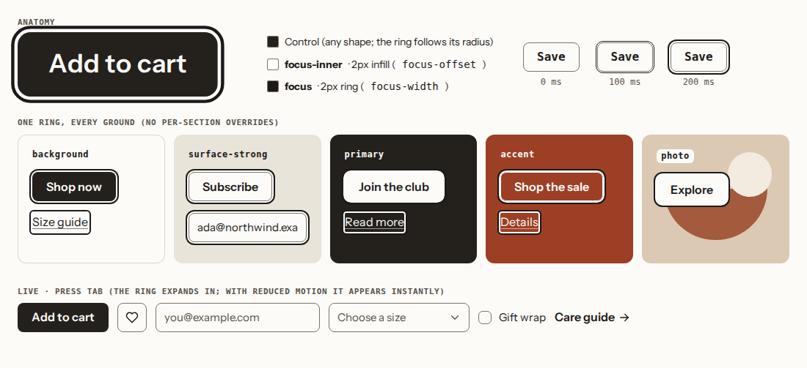

*Top: anatomy (control, 2px white infill, 2px dark ring) and the ring growing in over 0, 100 and 200ms. Middle: the same ring on `background`, `surface-strong`, `primary`, `accent` and a photo. Bottom: a row of controls to tab through.*

Every interactive element uses one two-tone focus indicator:

1. A **2px infill in `focus-inner`** (white) hugging the element, following its corner radius. Its width is `focus-offset`.
2. A **2px ring in `focus`** (dark ink) outside the infill. Its width is `focus-width`.

On light backgrounds the dark ring carries the contrast (16.9:1 on `background`, 13.8:1 on `surface-strong`). On dark or coloured backgrounds (`primary`, `accent`, the `overlay` scrim, photos) the white infill does (16.2:1 on `primary`, 6.7:1 on `accent`). The two against each other are 17.5:1. So the **ring never changes colour** from one section to another.

- **When it shows.** On keyboard focus (focus-visible) for all controls. Text fields (Input, Textarea, Search bar, a select's search field) show it on *any* focus, pointer included, because a caret alone is easy to miss.
- **Motion.** The ring and the infill grow from 0 to 2px over `duration-base` with `ease-out` as the element gains focus. They disappear instantly on blur. With reduced motion they appear at full size immediately.
- **Inset variant.** Where an outer ring would be clipped by a scrolling or rounded container, or would touch a neighbour (tabs, quantity-stepper parts, the search field inside a select or the Search modal, the video play button, full-width media links), draw it just **inside** the edge: the 2px infill at the edge, then the 2px ring inside it.
- **Proxy focus.** When the focusable element is visually hidden (the radio inside a size pill, the stretched link of a card), draw the ring on the visible shape (the pill, the whole card), not on the hidden element.
- **Forced-colours mode.** The ring uses the system Highlight colour. The infill may disappear; that's acceptable.
- **Not obscured.** Sticky headers and bars must never cover the focused element (WCAG 2.4.11). Pages add scroll padding equal to the sticky header's height.
- This meets WCAG 2.4.7 Focus Visible and 2.4.11 Focus Not Obscured, and also 2.4.13 Focus Appearance (AAA): a 2px solid perimeter at 3:1 or more against its surroundings.

### Iconography

Tabler Icons, outline style, stroke 1.75 (the filled style only for rating stars). Sizes: 1rem (small), 1.25rem (default), 1.5rem (feature tiles), 2rem (empty states). Icons take the current text colour. Decorative icons are hidden from assistive technology. An icon that is the only content of a control makes that control need an accessible name ("Add Merino crew sweater to wishlist"). Icons used in this spec include: search, user, shopping-bag, menu-2, x, chevron-down/up/left/right, arrow-right, arrow-left, arrow-up-right, external-link, check, minus, plus, trash, heart, info-circle, alert-triangle, alert-circle, circle-check, circle-x, truck, arrow-back-up, lock, credit-card, mail, phone, map-pin, clock, star (outline and filled), star-half (filled), player-play, quote, zoom-in, adjustments-horizontal, arrows-sort, package, leaf, recycle, gift, the brand icons (instagram, facebook, pinterest, tiktok, youtube, visa, mastercard, paypal, apple), world, calendar, photo, file-text, eye, receipt, home, shirt, bowl, cup, tools-kitchen-2, needle-thread, shield-check, discount, copy, link, maximize.

### Imagery

Images come from the CMS with alt text and optional framing (a focal point and a zoom), which render as the image's position and scale inside its frame. The aspect presets are auto, 1:1, 4:3, 3:2, 16:9 and 3:4, plus 4:5 for product cards. No component depends on a particular source aspect ratio; every slot crops to its preset. A missing image shows a hatched `surface` placeholder with a photo icon in the editor, and is left out on the live site. Product photography should be natural light on plain linen, stone or wood.

### Voice and content

Plain and warm, like a good shop assistant. Use short sentences, "you" for the customer and "we" for the shop, and sentence case everywhere (buttons too). Button labels are a verb plus an object ("Add to cart", "Notify me"). Links say where they go. Numbers are specific and true, with no fake urgency, timers or pre-ticked extras. No emoji. The demo store throughout is **Northwind Goods**, a fictional home and lifestyle brand selling knitwear, ceramics and kitchen goods.

---

## Accessibility requirements (WCAG 2.2 AA)

These apply to every component and block. Each section's acceptance checklist repeats the component-specific parts.

**Colour and contrast**
- Text at least 4.5:1 (body text on `background` 7:1); large text (24px, or 19px bold) at least 3:1 (1.4.3).
- Control boundaries, focus indicators, icons that carry meaning and chart marks at least 3:1 (1.4.11). Use `border-strong` for anything interactive; `border` is decorative only.
- No information by colour alone (1.4.1). Pair status with an icon and a word; mark selection with a fill *and* a check, weight or underline; link text in running prose is underlined.
- Disabled controls are exempt from contrast rules, but must still be legible and explain themselves nearby ("Sold out in Oat / M").

**Keyboard**
- Everything that works with a pointer works with a keyboard (2.1.1), in a logical order that follows the visual order (2.4.3).
- No keyboard traps (2.1.2). The only place focus is contained is a modal `<dialog>`, which `Esc` always closes.
- Composite widgets (tabs, listboxes, menus, carousels, radio groups) take one tab stop and use arrow keys inside, following the WAI-ARIA Authoring Practices patterns named in each section.
- Visible focus on every stop, using the focus ring (2.4.7, 2.4.11, 2.4.13).
- Single-character shortcuts (`/` for search) don't fire while typing in a field, and there's always another way to reach the same thing (2.1.4).

**Modal dialogs**: always the native `<dialog>`, opened as a modal.
- **On open**: focus moves to the element marked for initial focus, else the first meaningful control (never the close button when the dialog has a primary field).
- **While open**: the page behind is inert and doesn't scroll, and the backdrop is `overlay`.
- **Closing**: `Esc` (the dialog's `cancel` event) and the visible close button always close it; a click on the backdrop closes it unless the dialog holds unsaved input. Focus then returns to the element that opened it.
- Never stack two modals.
- A toast raised while a modal is open is rendered inside the open dialog, so it isn't inert.

**Names, roles, values**
- Every control has an accessible name that includes its visible label (2.5.3). Names, roles and states (expanded, selected, checked, pressed, invalid, busy) are exposed and updated (4.1.2).
- Status changes (results counts, "Added to cart", errors after submit) are announced through live regions without moving focus, unless the task requires it (4.1.3).
- Every field has a visible label; help and error text are linked to it. Errors are described in text and say how to fix them (3.3.1, 3.3.2). Required fields are marked in text as well as with the asterisk.

**Pointer and touch**
- Targets at least 24×24 CSS px (`target-min`, 2.5.8); primary actions 44px tall (`target-touch`) on narrow screens.
- No hover-only affordances. Anything revealed on hover is also revealed on focus, can be dismissed with `Esc`, and stays while the pointer moves over it (1.4.13).

**Layout and motion**
- Reflows to 320 CSS px without two-dimensional scrolling (1.4.10). Works at 200% zoom. Honours the text-spacing overrides (1.4.12).
- Respects reduced motion. Nothing moving, blinking or auto-updating for more than 5 seconds without a pause control (2.2.2).
- Works in forced-colours / high-contrast modes: borders are real borders, and icons take the current text colour.

**Testing protocol** (for every component and block)
1. Run an automated accessibility checker against each state of each component. Zero violations.
2. Keyboard-only pass: reach, operate and leave every part using exactly the keys in the section's table.
3. Screen-reader pass on one desktop and one mobile screen reader: names, roles, states and announcements match the Accessibility notes.
4. Contrast: check every text and non-text pair in the states table against the ratios in the colour table (recompute if the store changed a colour).
5. 200% zoom and a 320px-wide viewport; reduced motion on; forced colours on.

---

## Component conventions

- **Properties** are listed with neutral types. `value (two-way)` means the component both receives and reports its value. Events carry the new value as their payload. Map these onto your framework's own idioms.
- **Parts** are named in each Anatomy list; use those names in code so this spec and the implementation read the same way.
- **Sizes** are in rem, based on a 16px root. Never convert to px in the implementation.
- **States** are given per part as colour roles. Hover colours for filled buttons are a mix: `primary` mixed 14% toward `background`, and `accent` or `danger` mixed 15% toward `text`, so they follow whatever colour a store sets.
- Every component must render correctly with **long content** (twice the example length), **no optional content**, and in a **narrow container**.

---

## Actions and forms

Shared rules for every component in this group:

- **Focus.** Every interactive part uses the standard focus ring unless a section says "inset focus ring". Text fields (Input, Textarea, Search bar) show the ring on *any* focus, pointer included, because a caret alone is easy to miss. Every other control shows it on keyboard focus only (`:focus-visible`).
- **Compact controls.** Text inputs, select triggers, steppers and size pills share one box: `control-height` 2.5rem (sm `control-height-sm` 2rem, lg `control-height-lg` 3rem), radius `radius-md`, 1px `border-strong` boundary, 0.9375rem text on a 1.5rem line. Below a **48rem viewport** the text of inputs, textareas, select triggers and select search fields is 1rem, so iOS never zooms into a focused field. Controls keep their height on mobile. Only primary action buttons grow to `target-touch` (2.75rem).
- **Reduced motion.** With `prefers-reduced-motion: reduce`, every transition and animation runs in about 0ms: things simply appear in their end state. The only special cases are the button spinner, which pulses at 60–100% opacity instead of spinning, and skeleton shimmer, which is switched off.
- **Forced colours.** Borders stay as real borders, so they stay visible in forced-colours mode. The focus ring uses the system Highlight colour.

---

### Button

The one control for actions such as Add to cart, Submit, Open a drawer or Remove item. When the target is another page and it shouldn't look like a button, use **Link**. When an action should read like text ("Size guide", "Clear all"), use the `link` variant of Button, not a Link.

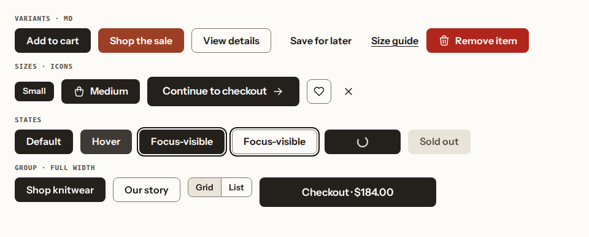

*Top to bottom: the six variants at md; sm / md with a leading icon / lg with a trailing arrow / icon-only outline / icon-only ghost; states; a primary + outline pair, an attached Grid/List toggle group and a block (full-width) button.*

**Anatomy**

```
┌──────────────────────────────────────┐
│ [leading icon]  Label  [trailing icon] │  height per size, radius-md, 1px border
└──────────────────────────────────────┘
    └ gap 0.5rem (0.375rem at sm)   └ weight 600, line-height 1.2, never wraps
```

1. **Container**: a native `<button>` (or `<a href>` when it navigates). 1px border (transparent unless the variant draws one), radius `radius-md`.
2. **Leading icon** (optional), 1.25rem, `aria-hidden`.
3. **Label**: weight 600, line-height 1.2, `white-space: nowrap`. Shorten the label rather than wrapping it.
4. **Trailing icon** (optional), 1.25rem, `aria-hidden`.
5. **Spinner** (loading only): 1.125rem circle, 2px stroke in the label colour, centred over the hidden label.

**Properties**

| Name | Type | Default | Description |
| --- | --- | --- | --- |
| `variant` | `"primary" \| "secondary" \| "outline" \| "ghost" \| "link" \| "danger"` | required | Visual weight and meaning (see Variants). |
| `size` | `"sm" \| "md" \| "lg"` | `"md"` | See Sizes. |
| `type` | `"button" \| "submit" \| "reset"` | `"button"` | The native button type. Ignored when `href` is set. |
| `href` | string | none | When set, renders an `<a href>` styled as a button. Use it only for navigation. |
| `iconLeft` | icon name | none | Leading icon. |
| `iconRight` | icon name | none | Trailing icon, for example `arrow-right` on "Continue to checkout". |
| `iconOnly` | boolean | `false` | Square button with only an icon. `label` is required. |
| `icon` | icon name | none | The icon for `iconOnly`. |
| `label` | string | none | Accessible name. Required with `iconOnly` ("Add Merino crew sweater to wishlist"). Also used as the name while `loading` ("Adding to cart"). |
| `loading` | boolean | `false` | Shows the spinner, sets `aria-busy="true"` and keeps the button's width and focus. |
| `block` | boolean | `false` | Full width of its container. |
| `pressed` | boolean \| undefined | undefined | For toggle buttons only: sets `aria-pressed`. Leave it undefined for ordinary buttons. |
| `disabled` | boolean | `false` | Native `disabled`. See the accessibility note on sold-out buttons. |
| content | text | none | The label. |

**Button group** (a layout helper): a flex row that wraps, with a 0.75rem (`space-3`) gap, items centred. **Attached** group (segmented control): gap 0, inner corners square, only the outer corners keep `radius-md`, neighbours overlap by 1px, and the focused button is raised above its neighbours so its ring is never covered. The attached group carries `role="group"` and an `aria-label` ("View").

**Events**

- `click`: the native click. Suppressed while `disabled`. While `loading`, the owner decides; the Add to cart flow ignores repeat clicks.

**Sizes**

| Size | Height | Horizontal padding | Font size | Icon | Gap | Use |
| --- | --- | --- | --- | --- | --- | --- |
| `sm` | 2rem | 0.75rem | 0.875rem | 1.25rem | 0.375rem | Toolbars, card quick-add, filter chips. Never for a primary action on mobile. |
| `md` (default) | 2.5rem; **2.75rem (`target-touch`) when its container is narrower than 48rem** | 1.125rem | 1rem | 1.25rem | 0.5rem | Almost everything. |
| `lg` | 3rem | 1.5rem | 1.0625rem | 1.25rem | 0.5rem | Hero calls to action, Add to cart, Checkout. |
| icon-only | square: width = height of its size (2rem / 2.5rem / 3rem) | 0 | n/a | 1.25rem | n/a | Wishlist, close, carousel arrows. |
| `link` variant | min 1.5rem (`target-min`), line box | 0 | per size | 1.25rem | per size | Text-like actions. It never grows to 2.75rem. |

Radius `radius-md`, border 1px, weight 600, line-height 1.2 at every size. The 2.75rem growth is measured against the nearest container (the block's width), not the viewport. `sm`, `lg` and the `link` variant don't change.

**Variants**

| Variant | Default look | Use |
| --- | --- | --- |
| `primary` | fill `primary`, text `primary-contrast` | The one main action in a view: Add to cart, Checkout, Subscribe. At most one per block. |
| `secondary` | fill `accent`, text `accent-contrast` | Promotions only: "Shop the sale". Use sparingly. |
| `outline` | fill `background`, 1px `border-strong`, text `text` | The second action next to a primary: "Our story", "View details". |
| `ghost` | no fill, text `text` | Low-emphasis actions in dense UI: "Save for later", header icons. |
| `link` | no fill, text `text`, 1px underline at 0.2em offset | An action that reads like text: "Size guide", "Clear all". |
| `danger` | fill `danger`, text `background` | Destructive, hard to undo: "Remove item", "Cancel order". If it can't be undone, confirm it in a Dialog (native `<dialog>` opened as a modal). |

**On coloured sections.** Inside a `primary` section, the primary button inverts to a `primary-contrast` fill with `primary` text. Inside an `accent` section it becomes an `accent-contrast` fill with `accent` text. Outline buttons on either section are transparent with a `currentColor` border and text, and on hover they fill with 12% of `currentColor`. The secondary button on an accent section becomes transparent with a `currentColor` border. Ghost and link buttons inherit the section's text colour. The focus ring doesn't change.

**States**

| State | primary | secondary | outline | ghost | link | danger |
| --- | --- | --- | --- | --- | --- | --- |
| Default | bg `primary`, text `primary-contrast` | bg `accent`, text `accent-contrast` | bg `background`, border `border-strong`, text `text` | bg none, text `text` | text `text`, 1px underline | bg `danger`, text `background` |
| Hover | bg `primary` mixed 14% toward `background` | bg `accent` mixed 15% toward `text` | border `text`, bg `surface` | bg `text` at 6% | underline 2px | bg `danger` mixed 15% toward `text` |
| Active (pressed down) | moves down 1px | moves down 1px | moves down 1px | bg `text` at 11%, moves down 1px | moves down 1px | moves down 1px |
| Focus-visible | standard focus ring | same | same | same | same | same |
| Toggle pressed (`aria-pressed="true"`) | n/a | n/a | bg `surface-strong` fill, border `border-strong` (a fill, not only a colour shift) | n/a | n/a | n/a |
| Disabled | bg `surface-strong`, text `muted`, border transparent, cursor not-allowed, no press movement | same | same | bg none, text `muted` | bg none, text `muted` | same as primary |
| Loading | `aria-busy="true"`, cursor progress. The label and icons are hidden but keep their space (width doesn't change). The spinner is centred in the label colour. | same | same | same | n/a | same |

Hover colours are computed from the current token values (a colour mix), so they follow any brand colour placed in `primary` or `accent`.

**Behaviour & motion**

- Background, border, text colour and the 1px press movement transition over `duration-fast` with `ease-out`.
- The focus ring expands in over `duration-base` with `ease-out`.
- The spinner turns once every 700ms, linear, without end. With reduced motion it pulses (opacity 0.6 ↔ 1 over 1.2s) instead, and colour changes are instant.
- A button in the loading state keeps its focus. The outcome is announced by a Toast (`role="status"`), not by the button.

**Keyboard**

| Key | Action |
| --- | --- |
| `Tab` / `Shift+Tab` | Move focus to and from the button. Disabled buttons are skipped. |
| `Enter` | Activates a `<button>`. Follows an `<a>` button. |
| `Space` | Activates a `<button>` (not `<a>`). Toggles `aria-pressed` on a toggle button. |

**Accessibility**

- Always a real `<button type="button|submit">`, or an `<a href>` when it navigates. Never a `<div>` with a click handler.
- Icon-only buttons have an `aria-label` that names the action *and* the object ("Add Merino crew sweater to wishlist"). The icon is `aria-hidden`.
- Toggle buttons (grid/list view) use `aria-pressed`. The pressed one is filled, so the state isn't shown by colour alone.
- Loading: `aria-busy="true"`, and the accessible name becomes the `label` ("Adding to cart"). Focus stays on the button.
- Disabled buttons can't be focused, so screen-reader users can miss them. For sold-out items, keep the disabled button *and* state the reason in visible text beside it ("Sold out in Oat / M").
- Contrast (WCAG 1.4.3): `primary-contrast` on `primary` 15.6:1, `accent-contrast` on `accent` 6.7:1, `background` on `danger` 6.5:1, `text` on `background` 16.9:1 (outline, ghost, link). The outline border `border-strong` is 4.5:1 on `background` (1.4.11). Hover fills must keep at least 4.5:1 for the label when `primary` is rebranded. Disabled buttons are exempt.
- Focus ring: `focus` is 16.9:1 on `background` and 13.8:1 on `surface-strong`, and `focus-inner` is 16.2:1 against `primary` and 6.7:1 against `accent`, so the ring is visible on every surface (2.4.7, 2.4.11, 2.4.13).
- Target size: 2rem minimum (sm), above the 1.5rem floor of 2.5.8. Primary actions are 2.75rem tall below a 48rem container.

**Acceptance criteria**

- [ ] Renders `<button>` by default and `<a href>` only when `href` is set. `type` defaults to `button`.
- [ ] Heights are 2rem / 2.5rem / 3rem for sm / md / lg. md is 2.75rem when its container is narrower than 48rem. Icon-only buttons are square.
- [ ] Labels never wrap (`nowrap`).
- [ ] Label contrast is ≥ 4.5:1 for each variant in default and hover (15.6:1, 6.7:1, 6.5:1, 16.9:1). The outline boundary is ≥ 3:1 (4.5:1) (1.4.3, 1.4.11).
- [ ] The standard focus ring shows on keyboard focus for every variant, on `background`, `surface`, `primary` and `accent` sections, and in an attached group it is never covered by a neighbour (2.4.7, 2.4.11, 2.4.13).
- [ ] `Enter` and `Space` activate buttons. `Enter` follows link-buttons. Disabled buttons are not focusable (2.1.1).
- [ ] Icon-only buttons have an accessible name that names the action and the object. Icons are `aria-hidden` (4.1.2).
- [ ] Loading sets `aria-busy="true"`, keeps focus and width, swaps the name to the loading label and shows the spinner. With reduced motion the spinner pulses instead of spinning (2.2.2).
- [ ] Toggle buttons expose `aria-pressed`, and the pressed state is a fill, not only a hue (1.4.1).
- [ ] All targets are ≥ 1.5rem (2.5.8).
- [ ] At 200% zoom and at 320px width, labels stay readable and buttons stack or wrap in their group without horizontal scrolling (1.4.4, 1.4.10).
- [ ] Hover colours follow a rebranded `primary` and `accent` without new tokens.

**Do / Don't**

- Do write labels as verb + object: "Add to cart", "Subscribe", "Shop knitwear".
- Do put the primary action first (left) in a group. On mobile, full-width buttons stack with the primary on top.
- Don't put two primary buttons in one block.
- Don't use `secondary` (accent) for anything that isn't promotional. It competes with sale badges.
- Don't disable a submit button to show that a form is incomplete. Let it submit and show the errors.

---

### Link

Text navigation to another page or anchor. It comes in three forms: inline inside copy, standalone with a trailing arrow ("Shop all knitwear →"), or external with an out-of-site icon. For actions use **Button** (the `link` variant when it should read like text).

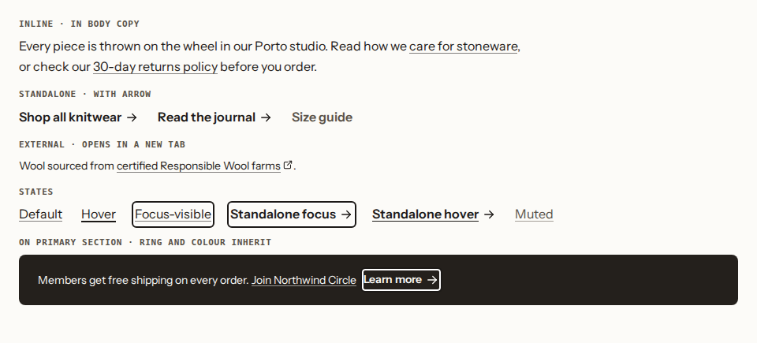

**Anatomy**

```
Inline:      ...read how we [care for stoneware]...     underline always visible
                            └ text, 1px underline at 55% of the text colour → 2px, 100% on hover

Standalone:  [Shop all knitwear →]
              └ label (600) └ arrow-right icon 1.125rem, gap 0.25rem

External:    [certified Responsible Wool farms ↗]
              └ label       └ external-link icon 0.875rem + visually hidden "(opens in a new tab)"
```

1. **Label**: the link text, in the surrounding font size.
2. **Underline**: 1px, offset 0.2em, `text` at 55%. Always visible on inline and external links.
3. **Arrow** (standalone): `arrow-right` icon, 1.125rem, 0.25rem (`space-1`) gap, `aria-hidden`.
4. **External icon**: `external-link` icon, 0.875rem, 0.15em left margin, sitting on the text baseline (−0.1em), `aria-hidden`, plus visually hidden text "(opens in a new tab)".

**Properties**

| Name | Type | Default | Description |
| --- | --- | --- | --- |
| `href` | string | required | Destination. If no destination exists, render plain text instead of a link. |
| `variant` | `"inline" \| "standalone"` | `"inline"` | Inline in a sentence, or standalone with weight 600 and an optional arrow. |
| `arrow` | boolean | `false` | Standalone only: adds the trailing `arrow-right` icon. |
| `external` | boolean | `false` | Adds `target="_blank"`, `rel="noopener"`, the external icon and the visually hidden "(opens in a new tab)". |
| `tone` | `"default" \| "muted"` | `"default"` | Muted is for footer and meta-line links ("Size guide", "Privacy"). |
| content | text | none | Link text. It must make sense out of context. |

**Events**

- None beyond native navigation.

**Sizes**

Links inherit their font size from context (body, body-sm, caption). The focus ring corner radius is 2px for every variant.

| Variant | Height | Padding | Font size | Icon |
| --- | --- | --- | --- | --- |
| Inline | line box | 0 | inherited | none |
| Standalone | min 1.5rem (`target-min`), inline-flex, centred | 0 | inherited, weight 600 | arrow 1.125rem, gap 0.25rem |
| External | line box | 0 | inherited | 0.875rem, 0.15em left margin |

**Variants**

| Variant | Use |
| --- | --- |
| Inline | Inside a sentence. The underline is always shown (WCAG 1.4.1: never colour alone). |
| Standalone | "Shop all", "Read the journal", block-heading actions. No underline at rest. Bold weight + arrow identify it. Underlined (1px, 0.2em offset) on hover. |
| External | Leaves the store. Always `target="_blank" rel="noopener"` + visually hidden "(opens in a new tab)". |
| Muted | Tertiary links in footers and meta lines. `muted` text, turning `text` on hover. Underline as inline. |

**States**

| State | Text | Underline | Icon |
| --- | --- | --- | --- |
| Default | `text` | 1px, `text` at 55% (standalone: none) | `text` |
| Hover | `text` | 2px, full `text` (standalone: 1px appears) | standalone arrow moves 2px right |
| Focus-visible | `text` | as default | standard focus ring, 2px corner radius |
| Active | `text` | 2px | none |
| Muted default / hover | `muted` / `text` | as above | inherits |
| On a `primary` / `accent` section | inherits `primary-contrast` / `accent-contrast` | inherits colour | standard focus ring; the `focus-inner` infill carries the contrast on the dark ground |

Links have no disabled state.

**Behaviour & motion**

- The underline colour and thickness, and the arrow's movement, transition over `duration-fast` with `ease-out`. With reduced motion the arrow simply sits 2px further right on hover.

**Keyboard**

| Key | Action |
| --- | --- |
| `Tab` / `Shift+Tab` | Focus the link. |
| `Enter` | Follow the link. |

**Accessibility**

- A native `<a href>`. Never use a link for an action.
- Link text makes sense on its own ("Read the care guide", not "Click here"). In a card that repeats its title, one stretched link carries the name. Don't wrap a whole card that contains buttons in a link.
- The inline underline satisfies 1.4.1. The standalone link is identified by weight and arrow, and underlined on hover.
- Contrast: `text` on `background` 16.9:1, on `surface` 15.5:1. `muted` on `background` 7.4:1, on `surface-strong` 6.1:1 (1.4.3).
- External: the visually hidden "(opens in a new tab)" warns about the change of context (3.2.5, advisory). The icon is `aria-hidden`.
- Target: inline links in a sentence are exempt from 2.5.8. Standalone links are at least 1.5rem tall.

**Acceptance criteria**

- [ ] Inline and external links show an underline at rest. The underline thickens to 2px at full colour on hover (1.4.1).
- [ ] Standalone links are weight 600, at least 1.5rem tall, with a 1.125rem arrow that moves 2px right on hover. With reduced motion the move is instant.
- [ ] External links have `target="_blank"`, `rel="noopener"`, an `aria-hidden` icon and visually hidden "(opens in a new tab)".
- [ ] Text contrast is ≥ 4.5:1 in every tone and on every section background (16.9:1, 7.4:1, 6.1:1 and so on) (1.4.3).
- [ ] The standard focus ring with a 2px corner radius is visible on every ground, including `primary` and `accent` sections (2.4.7, 2.4.11, 2.4.13).
- [ ] `Tab` reaches every link and `Enter` follows it (2.1.1).
- [ ] No link is used for an in-page action. A missing destination renders as plain text.
- [ ] Links wrap naturally at 320px and 200% zoom without clipping (1.4.10, 1.4.12).

**Do / Don't**

- Do keep inline links underlined. Do use standalone links for "see more" at the end of a block.
- Do set `rel="noopener"` on every external link.
- Don't signal links with the `accent` or `primary` colour alone. The underline, or bold + arrow, is the affordance.
- Don't put two standalone links with the same text pointing to different places on one page.
- Don't wrap a whole card in a link when it contains buttons.

---

### Input

Single-line text entry for names, emails, numbers, codes and search. It always sits in a **Field wrapper** so it has a visible label. For multi-line text use **Textarea**, for quantities use **Quantity stepper**, and for live product search use **Search bar**.

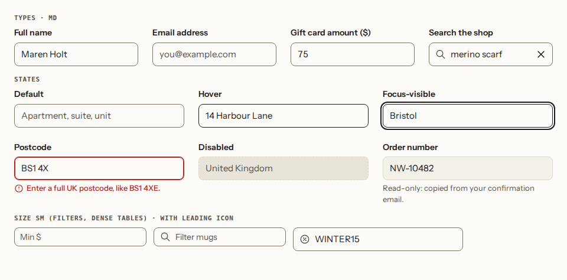

**Anatomy**

```
Email address                  ← label (Field wrapper)
┌──────────────────────────────┐
│ ⌕  merino scarf          ✕ │  ← the field box
└──────────────────────────────┘
  │  │                     └ clear button (ghost icon button, only when there is a value)
  │  └ value / placeholder (muted)
  └ leading icon (muted, decorative, ignores the pointer)
Help or error text             ← help / error (Field wrapper)
```

1. **Field box**: the native `<input>`, full width.
2. **Leading icon** (optional): 1.125rem, `muted`, placed 0.6875rem from the start edge, `aria-hidden`, ignores the pointer.
3. **Value / placeholder**: the placeholder is in `muted`.
4. **Trailing action** (optional): a ghost icon button 2rem square, 0.25rem from the end edge. Used as the clear button on search inputs.

**Properties**

| Name | Type | Default | Description |
| --- | --- | --- | --- |
| `value` | string | `""` | The value (two-way). |
| `type` | `"text" \| "email" \| "tel" \| "number" \| "search" \| "url" \| "password"` | `"text"` | Native type. |
| `size` | `"sm" \| "md" \| "lg"` | `"md"` | See Sizes. |
| `id` / `name` | string | none | `id` comes from the Field wrapper and ties the label. |
| `placeholder` | string | none | An example only, never the label. |
| `autocomplete` | string | none | Always set it for personal data (`name`, `email`, `address-line1`, `postal-code`…). |
| `inputmode` | string | none | For example `numeric`. |
| `min` / `max` / `step` | number | none | For `number`. |
| `leadingIcon` | icon name | none | Decorative icon at the start (`search`, `mail`, `discount`). |
| `clearable` | boolean | `false` (`true` for `type="search"`) | Shows the clear button while there is a value. |
| `invalid` | boolean | `false` | Sets `aria-invalid="true"`. Usually passed down from the Field wrapper's `error`. |
| `describedBy` | string | none | `aria-describedby` ids, supplied by the Field wrapper (error id first). |
| `required` | boolean | `false` | Native `required`. |
| `readonly` | boolean | `false` | Native `readonly`. The value stays focusable and selectable. |
| `disabled` | boolean | `false` | Native `disabled`. |

**Events**

- `input`: fires with the new value on every keystroke.
- `change`: fires with the committed value (native change).
- `clear`: fires when the clear button empties the field. It also fires `input` with `""`.

**Sizes**

| Size | Min height | Padding (block / inline) | Font size / line height | Icon | Radius |
| --- | --- | --- | --- | --- | --- |
| sm | 2rem (`control-height-sm`) | 0.1875rem / 0.5625rem | 0.875rem / 1.5rem | 1.125rem | `radius-md` |
| md (default) | 2.5rem (`control-height`) | 0.4375rem / 0.6875rem. With a leading icon, the start padding is 2.25rem. With a trailing action, the end padding is 2.5rem. | 0.9375rem / 1.5rem (**1rem below a 48rem viewport**) | leading icon 1.125rem at 0.6875rem; trailing action 2rem square at 0.25rem | `radius-md` |
| lg | 3rem (`control-height-lg`) | 0.6875rem / 0.6875rem | 1rem / 1.5rem | 1.125rem | `radius-md` |

Use md in every checkout, account and contact form. Use lg for a hero newsletter field or the checkout email. sm is for dense desktop filter bars only. Border 1px `border-strong`. Inputs keep their height on mobile.

**Variants**

| Variant | Notes |
| --- | --- |
| `text` | Set `autocomplete` (name, address-line1, postal-code…). |
| `email` | `type="email" autocomplete="email"`. Validate on submit or blur, never on every keystroke. |
| `number` | `inputmode="numeric"`, `min` / `max` / `step`, tabular numerals. For quantities use Quantity stepper. |
| `search` | Leading `search` icon. The browser's own clear button is hidden, and the component's clear button shows only when there is a value. |
| Leading icon | Any decorative icon before the value (promo code `discount`, `mail`). The label names the field. |

**States**

| State | Background | Border | Text | Icon / extra |
| --- | --- | --- | --- | --- |
| Default | `background` | 1px `border-strong` | `text`, placeholder `muted` | icon `muted` |
| Hover | `background` | 1px `text` | `text` | none |
| Focus (any focus, pointer too) | `background` | 1px `text` | `text` | standard focus ring |
| Error (`aria-invalid="true"`) | `background` | 2px `danger` (1px border + 1px inset line). On focus the inset line sits inside the `focus-inner` infill. | `text` | error message below: `alert-circle` icon + text in `danger` |
| Disabled | `surface-strong` | 1px **dashed** `border` | `muted` | cursor not-allowed |
| Read-only | `surface` | 1px `border` | `text` | focusable and selectable, focus ring on focus |

**Behaviour & motion**

- Border colour and box shadow transition over `duration-fast` with `ease-out`. The focus ring grows from 0 to full over `duration-base`.
- The clear button appears and disappears instantly as the value becomes non-empty or empty. Clicking it empties the field and returns focus to the input.
- The error appears without motion.

**Keyboard**

| Key | Action |
| --- | --- |
| `Tab` / `Shift+Tab` | Move into and out of the field. From a search input with a value, `Tab` reaches the clear button next. |
| `Enter` | Submits the surrounding form (native). In a search input it submits the search. |
| `Enter` / `Space` on the clear button | Clears the value and returns focus to the input. |
| `ArrowUp` / `ArrowDown` | In `type="number"`, step the value (native). |

**Accessibility**

- A native `<input>` with a visible `<label for>` (Field wrapper). Placeholders are examples, never the label (3.3.2).
- Help and error text are linked with `aria-describedby`, with the error id first. On error, set `aria-invalid="true"` and say in words what to do (3.3.1, 3.3.3). The red border is never the only signal (1.4.1).
- The clear button is a real `<button type="button" aria-label="Clear search">` (name it for the field). Its icon is `aria-hidden`.
- Correct `type`, `inputmode` and `autocomplete` (1.3.5).
- Contrast: value `text` on `background` 16.9:1, placeholder `muted` 7.4:1, read-only `text` on `surface` 15.5:1, error text `danger` 6.5:1 (1.4.3). The boundary `border-strong` is 4.5:1 on `background` and 4.1:1 on `surface` (1.4.11). Disabled fields are exempt, which is why they use the decorative dashed `border`.
- Target: 2.5rem md, 2rem sm, clear button 2rem (2.5.8).

**Acceptance criteria**

- [ ] Min heights are 2rem / 2.5rem / 3rem. md text is 0.9375rem, and 1rem below a 48rem viewport (no iOS zoom).
- [ ] Every input has a visible, programmatically tied label. A placeholder is never the only label (1.3.1, 3.3.2).
- [ ] The standard focus ring shows on any focus, pointer and keyboard (2.4.7, 2.4.11, 2.4.13).
- [ ] The error state shows a 2px `danger` boundary plus an icon and message, sets `aria-invalid="true"`, and puts the error first in `aria-describedby` (1.4.1, 3.3.1).
- [ ] The boundary is ≥ 3:1 against its ground (4.5:1 / 4.1:1) (1.4.11). Text ≥ 4.5:1 (1.4.3).
- [ ] The clear button shows only with a value, has an accessible name, and clearing returns focus to the input (4.1.2, 2.4.3).
- [ ] Read-only values stay focusable and selectable. Disabled fields are skipped by `Tab`.
- [ ] `autocomplete` is set on personal-data fields (1.3.5).
- [ ] At 320px width and 200% zoom, the field fills its column without horizontal scroll and the text isn't clipped (1.4.10, 1.4.4).
- [ ] With reduced motion, the ring and border changes are instant.

**Do / Don't**

- Do keep one input per line on mobile. Pair short fields (first / last name) only in the two-column form layout.
- Do put format hints in help text ("Like BS1 4XE"), not in the placeholder.
- Don't disable a field to show a fixed value. Use read-only so it can still be read and copied.
- Don't validate while the customer is still typing their first attempt.

---

### Textarea

Multi-line text entry that grows with its content from 5rem up to 16rem and then scrolls, with an optional character counter. For a single short value use **Input**.

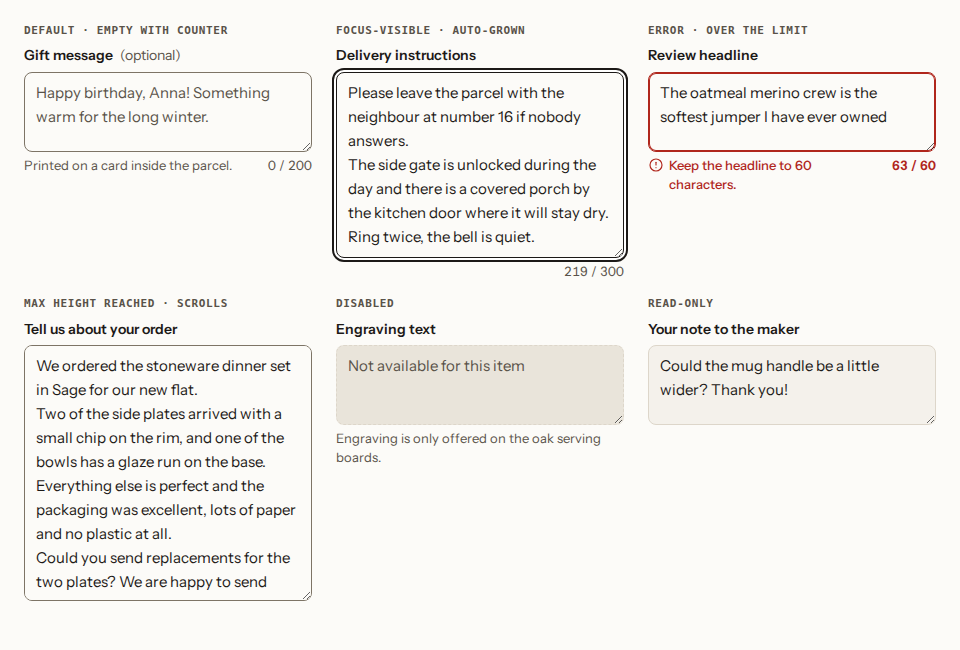

**Anatomy**

```
Gift message (optional)                         ← label + optional mark (Field wrapper)
┌─────────────────────────────────────────────┐
│ Happy birthday, Anna! Something warm for     │ ← the text box, grows with its content
│ the long winter.                          ◢ │ ← vertical resize handle
└─────────────────────────────────────────────┘
Printed on a card inside the parcel.   0 / 200  ← foot row: help (start) + counter (end)
```

1. **Text box**: a native `<textarea>`.
2. **Resize handle**: vertical only.
3. **Foot row** (from the Field wrapper): help or error on the start side, counter pushed to the end.
4. **Counter** (optional): "n / max".

**Properties**

| Name | Type | Default | Description |
| --- | --- | --- | --- |
| `value` | string | `""` | The text (two-way). |
| `placeholder` | string | none | An example of a good answer. |
| `maxLength` | number | none | The character limit shown by the counter. |
| `counter` | boolean | `false` | Shows "n / maxLength" in the foot row. |
| `hardLimit` | boolean | `false` | Also sets the native `maxlength`, so typing stops at the limit. Use it when the backend truncates (engraving, monograms). |
| `minHeight` | rem | `5rem` | Size to the expected answer (3 lines for notes, more for reviews). |
| `invalid` | boolean | `false` | Sets `aria-invalid="true"`. |
| `required` / `readonly` / `disabled` | boolean | `false` | Native attributes. |

**Events**

- `input`: fires with the new value on every keystroke. The counter updates.
- `change`: fires with the committed value.

**Sizes**

| Part | Value |
| --- | --- |
| Min height | 5rem (about 3 lines). Blocks may raise it (the Contact form uses 8rem, and 11rem from a 48rem block width). |
| Max height | 16rem, then the content scrolls |
| Padding | 0.5rem block / 0.6875rem inline |
| Font size / line height | 0.9375rem / 1.5rem (1rem below a 48rem viewport) |
| Border / radius | 1px `border-strong` / `radius-md` |
| Counter | 0.8125rem, line-height 1.5, tabular numerals, never wraps |

**Variants**

| Variant | Notes |
| --- | --- |
| Auto-grow (default) | Height follows the content (CSS `field-sizing: content` where supported. Elsewhere, set the height to the scroll height on input, clamped to 16rem). |
| With counter, soft limit (default) | Typing past the limit is allowed. The counter turns `danger` weight 600, and the field errors on submit with a message. |
| Hard limit | Native `maxlength` as well, so the value can't exceed it. |

**States**

| State | Background | Border | Text | Extra |
| --- | --- | --- | --- | --- |
| Default | `background` | 1px `border-strong` | `text`, placeholder `muted` | counter `muted` |
| Hover | `background` | 1px `text` | `text` | none |
| Focus (any focus, pointer too) | `background` | 1px `text` | `text` | standard focus ring |
| Error / over limit | `background` | 2px `danger` (1px border + 1px inset line, inside the infill on focus) | `text` | error message with icon, counter `danger` weight 600 |
| Disabled | `surface-strong` | 1px dashed `border` | `muted` | cursor not-allowed |
| Read-only | `surface` | 1px `border` | `text` | focusable, selectable |

**Behaviour & motion**

- Border colour transitions over `duration-fast` with `ease-out`. The focus ring grows in over `duration-base`.
- Growth is instant, with no height animation, so it never lags the caret. Nothing special is needed for reduced motion.
- The counter reads "n / max" and updates on every input.
- Screen-reader announcement of the limit: one polite, visually hidden live region announces once when the count reaches 80% of the limit ("20 characters left") and once when the limit is passed ("Over the limit by 3"). It never announces every keystroke.

**Keyboard**

| Key | Action |
| --- | --- |
| `Tab` / `Shift+Tab` | Move into and out of the field (Tab is never captured). |
| `Enter` | Inserts a new line. It never submits the form. |

**Accessibility**

- A native `<textarea>` labelled with `<label for>`. Help, error and counter are all linked with `aria-describedby` (error first), so the limit is announced on focus.
- The counter itself has **no** `aria-live`. Use the separate threshold announcements above.
- Over-limit is stated in words in the error message (3.3.1) and shown by weight, not only colour (1.4.1).
- Contrast: `text` 16.9:1, placeholder and counter `muted` 7.4:1, `danger` 6.5:1 on `background` (1.4.3). Boundary `border-strong` 4.5:1 (1.4.11).

**Acceptance criteria**

- [ ] Starts at 5rem, grows with its content without animation, stops at 16rem and then scrolls. Vertical resize only.
- [ ] `Enter` inserts a newline and never submits. `Tab` leaves the field (2.1.2).
- [ ] The standard focus ring shows on any focus (2.4.7, 2.4.11, 2.4.13).
- [ ] The counter shows "n / max" with tabular numerals, is in `aria-describedby`, and turns `danger` 600 when over the limit, and an error message in words appears on submit (1.4.1, 3.3.1).
- [ ] The live announcement fires only at 80% and when the limit is passed, never on every keystroke (4.1.3).
- [ ] A soft limit allows typing past the limit. A hard limit stops input at `maxlength`.
- [ ] Contrast: text ≥ 4.5:1, boundary ≥ 3:1 (1.4.3, 1.4.11).
- [ ] At 320px width and 200% zoom there is no horizontal scroll. The foot row wraps the help text while the counter stays whole (1.4.10).

**Do / Don't**

- Do size the min height to the expected answer.
- Do say what the text is used for ("Printed on a card inside the parcel.").
- Don't block typing at the limit silently. Show the count and the message.
- Don't use a textarea for a single short value.

---

### Field wrapper

The wrapper every form control sits in. It stacks the label, the required or optional mark, the control, help text, error text with an icon, and an optional character counter. For groups of checkboxes or radios, use a `<fieldset>` with a `<legend>` styled as the label instead.

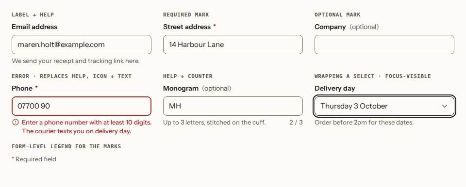

**Anatomy**

```
Phone *                               ← label + required mark (aria-hidden) | "(optional)"
┌─────────────────────────────┐
│ 07700 90                    │       ← the control (Input, Select, Multi-select, Textarea…)
└─────────────────────────────┘
ⓘ Enter a phone number with…         ← error (alert-circle icon + text), replaces help while invalid
Up to 3 letters…         2 / 3        ← foot row: help (start) + counter (end)
```

1. **Label**: a `<label for>`, or the element a custom trigger names itself with through `aria-labelledby`.
2. **Required mark** `*` (`aria-hidden`), or the **optional mark** "(optional)".
3. **Control**.
4. **Help** text.
5. **Error** text with an `alert-circle` icon.
6. **Foot row** with a **counter** (optional).

**Properties**

| Name | Type | Default | Description |
| --- | --- | --- | --- |
| `label` | string | required | Visible label, written as a noun ("Postcode"). |
| `id` | string | generated | The control's id. The wrapper passes `id`, `describedBy` and `invalid` down to the control. |
| `required` | boolean | `false` | Shows `*` and sets native `required` on the control. |
| `optional` | boolean | `false` | Shows "(optional)". Mark only the minority per form. |
| `help` | string | none | Short instruction ("Like BS1 4XE"). |
| `error` | string | none | When set: error shown with icon, control `aria-invalid="true"`, error id first in `aria-describedby`. |
| `counter` | `{ max: number }` | none | Shows the "n / max" counter in the foot row. |
| `full` | boolean | `false` | Spans both columns in the two-column form layout. |
| content | control | none | The control. |

**Events**

- None of its own.

**Sizes**

| Part | Font size / line height | Weight | Colour token | Spacing |
| --- | --- | --- | --- | --- |
| Label | 0.875rem / 1.4 | 600 | `text` | 0.125rem bottom margin |
| Required mark `*` | inherits the label | 600 | `danger` | 0.125rem start margin |
| Optional mark | inherits the label | 400 | `muted` | 0.25rem start margin |
| Help | 0.8125rem / 1.45 | 400 | `muted` | none |
| Error | 0.8125rem / 1.45 | 500 | `danger`; icon 1rem, nudged 0.1em down, top-aligned | 0.3125rem icon-to-text gap |
| Counter | 0.8125rem / 1.5, tabular numerals, no wrap | 400 (600 when over) | `muted` / `danger` | pushed to the end of the foot row |
| Vertical rhythm | Grid with a 0.25rem gap: label → control 0.375rem (gap + label margin), control → help/error 0.25rem | | | |
| Foot row | help and counter on one line, 0.75rem (`space-3`) gap | | | |

Fieldset variant: no border, padding or min-width, grid with a 0.75rem (`space-3`) gap, and the legend has a 0.5rem (`space-2`) bottom margin.

**Variants**

| Variant | Notes |
| --- | --- |
| Label + control | Default. |
| Required | `*` plus `required` on the control. Long forms show a one-line legend "* Required field" at the top (0.8125rem, `muted`). |
| Optional | "(optional)". One convention per form, marking the minority: checkout marks optional fields, sign-up marks required ones. |
| Help | Linked with `aria-describedby`. |
| Error | Replaces help while invalid (keep help too only if it adds something the error doesn't say). |
| Counter | Foot row with help at the start and the counter at the end. |
| Group | `<fieldset>` + `<legend>` (label styling) for checkbox and radio groups. |
| Full width | Spans both columns in the two-column form layout. |

**States**

| State | Label | Control | Below the control |
| --- | --- | --- | --- |
| Default | `text` | control default | help `muted` |
| Focus-visible | `text` | standard focus ring (text fields show it on any focus) | help |
| Error | `text` (unchanged) | 2px `danger` boundary | error: `alert-circle` + message in `danger` 500 |
| Disabled | `text` | disabled control | help in `muted` explaining why |
| Read-only | `text` | read-only control | optional help |
| Over counter limit | `text` | error boundary | counter `danger` 600 + error message |

**Behaviour & motion**

- No motion of its own. The error appears instantly (no slide), so the layout shift is a single step.
- On submit, focus moves to the first invalid field (or to an error summary at the top of long forms).
- Never clear the customer's input on error.

**Keyboard**

| Key | Action |
| --- | --- |
| Pointer click on the label | Focuses the control (native), or the custom select trigger. |
| Others | As the control. |

**Accessibility**

- The label is always visible and programmatically tied: `for`/`id` for native controls. The custom select and multi-select triggers use `aria-labelledby` pointing to the label, and clicking the label focuses the trigger (1.3.1, 3.3.2, 2.5.3).
- `aria-describedby="<error-id> <help-id> <counter-id>"`: the error comes first and is announced on focus.
- Errors say what went wrong and how to fix it, in text (3.3.1, 3.3.3), with an icon and weight, so colour isn't the only signal (1.4.1).
- The asterisk is `aria-hidden`. The native `required` attribute announces "required".
- Contrast: label `text` 16.9:1, help `muted` 7.4:1, error and required mark `danger` 6.5:1 on `background`. On `surface` the pairs are 15.5:1 and 6.8:1 (1.4.3).

**Acceptance criteria**

- [ ] Every control has a visible label tied by `for`/`id` or `aria-labelledby`, and clicking the label focuses the control (1.3.1, 3.3.2).
- [ ] The accessible name contains the visible label text (2.5.3).
- [ ] Help, error and counter ids are in `aria-describedby`, with the error first. The error sets `aria-invalid="true"` on the control (3.3.1, 4.1.2).
- [ ] The error shows an icon and text, the label doesn't turn red, and the required `*` is `aria-hidden` while the control has `required` (1.4.1).
- [ ] Spacing is label → control 0.375rem and control → help 0.25rem. The type sizes and weights match the Sizes table.
- [ ] On submit with errors, focus moves to the first invalid field or to the summary (2.4.3).
- [ ] Text contrast is ≥ 4.5:1 for label, help, error and counter (1.4.3).
- [ ] At 320px width and 200% zoom, the label, help and error wrap without overlap or loss (1.4.10, 1.4.12).

**Do / Don't**

- Do write labels as nouns ("Postcode") and help as a short instruction ("Like BS1 4XE").
- Do keep help visible alongside the error only when it adds something.
- Don't turn the label red on error. The border and message are enough, and red labels read as "required".
- Don't rely on placeholder text instead of a label.

---

### Form layout

Arranges Field wrappers into a single column, a responsive two-column grid, or an inline row (newsletter), and closes the form with a row of actions: a primary action and optional secondary and tertiary actions.


**Anatomy**

```
form (grid, 1rem row gap)
├─ heading (optional, h4 style)
├─ Field wrapper ×n
│     two-column: pairs sit side by side from a 36rem container; full-width fields span both
└─ actions row  [← Return to basket]          [Save for later] [Continue to shipping]
                  tertiary link (start)        secondary        primary (last, end)

inline form (flex, wraps, bottom-aligned)
[ Email address ______________________ ] [Subscribe]
  field: grows, shrinks, basis 14rem      button
  error: full-width row below both when invalid
```

1. **Form**: a real `<form>`.
2. **Heading** (optional): h4 style (1.125rem, 600), referenced by `aria-labelledby`.
3. **Fields**.
4. **Actions row**: buttons and an optional back link.

**Properties**

| Name | Type | Default | Description |
| --- | --- | --- | --- |
| `layout` | `"single" \| "two" \| "inline"` | `"single"` | See Variants. |
| `heading` | string | none | Visible heading that names the form. |
| `ariaLabel` | string | none | Name when there is no visible heading ("Newsletter sign-up"). |
| `action` / `method` | string | none | Native form attributes, so the form posts without scripting. |
| `novalidate` | boolean | `true` | Uses the component's consistent, translated messages instead of browser bubbles. |
| `submitting` | boolean | `false` | Primary button loading, other actions disabled. |
| content | fields | none | Field wrappers (use `full` on the ones that span both columns). |
| `actions` | content | none | The actions row: Button primary (type submit), Button outline or link, optional back Link. |

**Events**

- `submit`: fires with the form data after client validation passes.
- `invalid`: fires with the list of invalid fields when validation fails. Focus has already moved to the first one.

**Sizes**

| Part | Value |
| --- | --- |
| Row gap | 1rem (`space-4`) |
| Column gap (two-column) | 1rem (`space-4`) |
| Two-column breakpoint | the form's container ≥ 36rem (measured on the containing block, so it works in narrow page-builder columns) |
| Inline gap | 0.5rem (`space-2`). The field grows from a 14rem basis, and the button wraps below when there's less room. |
| Actions row | 0.75rem (`space-3`) gap, wraps, items centred, 0.25rem (`space-1`) extra top padding |
| Recommended max width | single column 28–40rem (`container-narrow` is 40rem); two-column up to 48rem |

**Variants**

| Variant | Use |
| --- | --- |
| Single column | Contact, login, account details. |
| Two-column | Addresses, checkout details. Full-width fields for the address line, checkboxes and headings. The actions row always spans both columns. Below a 36rem container everything stacks in one column. |
| Inline | One field and one button: newsletter, promo code, postcode lookup. The button aligns to the bottom of the field, and an error message takes a full row below both. |
| Actions row | The primary action is last (at the end) on wide layouts. A tertiary back link ("← Return to basket", standalone Link) comes first and the row uses space-between. On narrow containers the buttons are full width (Button `block`) and the primary is first (top). |

**States**

| State | What changes |
| --- | --- |
| Default | Fields in their own default states. |
| Invalid on submit | Each invalid field shows its error. Focus moves to the first invalid field. Long forms add an error summary alert at the top (`surface` fill, 1px `danger` border, `danger` icon) that lists a link to each error. |
| Submitting | Primary button loading (`aria-busy="true"`, spinner). Other actions disabled. Fields stay editable but aren't re-validated. |
| Success | Replace the form with a confirmation message (newsletter) or navigate (checkout), and announce it in a polite live region. |
| Narrow container (< 36rem) | Two-column collapses to one column. Block buttons stack full width, primary first. |

Colours come from the fields and buttons (`background`, `border-strong`, `text`, `danger`, `primary` / `primary-contrast`).

**Behaviour & motion**

- The layout itself doesn't animate. Error messages appear without motion. The submit spinner follows the reduced-motion rule (it pulses instead of spinning).
- Validate on submit, then on blur for fields that were invalid after the first submit.

**Keyboard**

| Key | Action |
| --- | --- |
| `Tab` / `Shift+Tab` | Moves through fields and actions in DOM order, row by row (DOM order = visual order). |
| `Enter` in any single-line field | Submits the form. |
| `Enter` / `Space` on buttons | As Button. |

**Accessibility**

- A real `<form>` named by `aria-labelledby` its heading (or `aria-label`, for the newsletter), with a `<button type="submit">`.
- Never reorder fields visually with CSS. The tab order must match the reading order (1.3.2, 2.4.3).
- `novalidate` plus the component's own messages, so they are consistent and translated (3.3.1, 3.3.3). Checkout lets people review before paying (3.3.4).
- Selects are the custom Select / Multi-select. The native `<select>` stays hidden inside the form and in sync, so a plain form post works.
- Offer "Billing address is the same" rather than asking twice (3.3.7 Redundant entry).
- Targets: inputs and selects are 2.5rem, and primary buttons 2.75rem below a 48rem container (2.5.8).

**Acceptance criteria**

- [ ] Two-column switches on the form's container width (≥ 36rem), not the viewport. Full-width fields and the actions row span both columns (1.4.10).
- [ ] At 320px and 200% zoom, every layout is a single column with full-width buttons, primary first, and nothing scrolls horizontally (1.4.10).
- [ ] The inline form keeps the field ≥ 14rem before the button wraps, and its error sits on its own row.
- [ ] The form has an accessible name, a submit button, and `Enter` in a single-line field submits (4.1.2, 2.1.1).
- [ ] Tab order matches visual order (2.4.3, 1.3.2).
- [ ] On failed submit, focus goes to the first invalid field or to the summary, and each error is text + icon (3.3.1, 1.4.1).
- [ ] While submitting, the primary button shows `aria-busy="true"` and the other actions are disabled.
- [ ] Success is announced in a polite live region (4.1.3).
- [ ] The form still posts without scripting (native selects included).

**Do / Don't**

- Do keep one primary action per form. Secondary actions are outline or link buttons.
- Do label the primary with the outcome ("Continue to shipping", "Subscribe"), not "Submit".
- Don't put more than two fields on one row.
- Don't place the primary action before the secondary on wide layouts. Keep it last.

---

### Checkbox

Toggles one or more independent options, either alone (consent) or in a group (filters, preferences). For a setting that applies immediately use **Switch**. For one choice from a set use **Radio group**. For more than about 6 options in tight space use **Multi-select**.

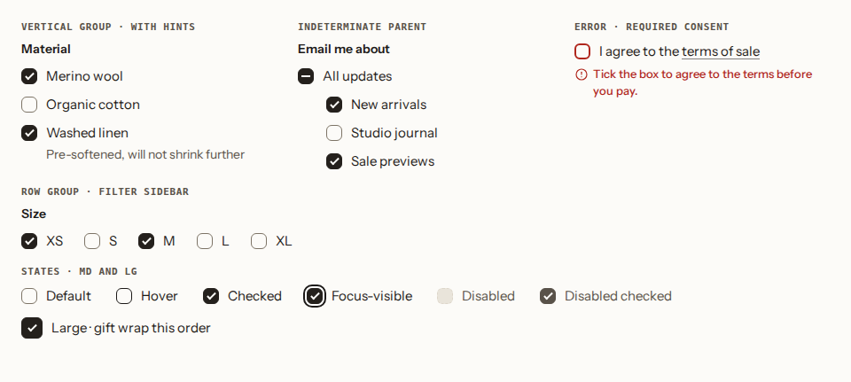

**Anatomy**

```
Material                      ← legend (label style) inside <fieldset>
☑ Merino wool                 ← <label> = box + text
☐ Organic cotton
☑ Washed linen
  Pre-softened, will not…     ← hint (muted, 0.875rem)
```

1. **Box**: a native `<input type="checkbox">` with custom appearance.
2. **Mark**: a tick (checked) or a dash (indeterminate).
3. **Label text**: the whole `<label>` is the click target.
4. **Hint** (optional): a second line inside the label.

**Properties**

Checkbox:

| Name | Type | Default | Description |
| --- | --- | --- | --- |
| `checked` | boolean | `false` | Checked state (two-way). |
| `indeterminate` | boolean | `false` | Shows the dash and exposes "mixed". Use it for a parent whose children are only partly checked. |
| `value` / `name` | string | none | Native form values. |
| `size` | `"md" \| "lg"` | `"md"` | Box 1.125rem or 1.5rem. |
| `hint` | string | none | Secondary line under the label. |
| `invalid` | boolean | `false` | `aria-invalid="true"`. |
| `required` / `disabled` | boolean | `false` | Native attributes. |
| `controls` | string | none | For an indeterminate parent: the ids of its children (`aria-controls`). |
| content | text | none | Label text. |

Checkbox group:

| Name | Type | Default | Description |
| --- | --- | --- | --- |
| `value` | string[] | `[]` | Checked values (two-way). |
| `legend` | string | required | Group question ("Material"). |
| `options` | `{ value, label, hint?, disabled? }[]` | required | The options. |
| `layout` | `"vertical" \| "row"` | `"vertical"` | Row is for short labels (sizes) and wraps. |
| `error` | string | none | Group error message. |

**Events**

- `change`: fires with the new `checked` boolean (checkbox) or the new array of values (group).

**Sizes**

| Size | Box | Border | Mark | Row min height | Label | Radius |
| --- | --- | --- | --- | --- | --- | --- |
| md (default) | 1.125rem, nudged 0.1875rem down to align with the first text line | 1.5px | tick 0.3125 × 0.625rem, 2px stroke; dash 0.625rem wide, 2px | 1.5rem (`target-min`) | 0.9375rem / 1.5rem, 0.625rem box-to-text gap | `radius-sm` |
| lg | 1.5rem, top-aligned | 1.5px | same mark | 1.5rem | 0.9375rem / 1.5rem | `radius-sm` |

Hint: 0.875rem, `muted`, on its own line. Vertical group gap 0.5rem (`space-2`). Row group gap 0.5rem × 1.5rem (`space-2` × `space-6`), wrapping. The whole label is the target, so even a one-word option is at least 1.5rem tall and as wide as its text plus about 1.75rem.

**Variants**

| Variant | Notes |
| --- | --- |
| Vertical group | Default. |
| Row group | Short labels (sizes). Wraps. |
| With hint | Secondary line in `muted`. |
| Indeterminate parent | Parent of a nested group when some children are checked. Shows a dash. Children are indented under it. |
| Single consent | One checkbox inside a Field wrapper, with the error below when required. |

**States**

| State | Box background | Box border | Mark | Label |
| --- | --- | --- | --- | --- |
| Unchecked | `background` | 1.5px `border-strong` | none | `text` |
| Hover | `background` | `text` | none | `text` |
| Checked | `primary` | `primary` | `primary-contrast` tick | `text` |
| Indeterminate | `primary` | `primary` | `primary-contrast` dash | `text` |
| Focus-visible | as state | as state | as state | standard focus ring around the box |
| Error (`aria-invalid="true"`) | `background` | **2px** `danger` | none | error message with icon below |
| Disabled | `surface-strong` | 1.5px **dashed** `border` | none | `muted`, cursor not-allowed |
| Disabled checked | `muted` | solid `muted` | `primary-contrast` tick | `muted` |

**Behaviour & motion**

- The tick scales in from 0 over `duration-fast` with `ease-out`. The background and border colours fade over the same duration. With reduced motion the tick simply appears.
- An indeterminate parent: activating it checks all its children. Activating it again clears all. Its state is recomputed from the children after each change.

**Keyboard**

| Key | Action |
| --- | --- |
| `Tab` / `Shift+Tab` | Move to the next or previous checkbox (each checkbox is a tab stop). |
| `Space` | Toggle the focused checkbox. |
| Pointer on label text | Toggles. |

**Accessibility**

- A native `<input type="checkbox">` inside its `<label>`. Groups use `<fieldset>` + `<legend>`, so the question is read with each option (1.3.1).
- Indeterminate is exposed as "mixed" (native `indeterminate`). The parent lists its children in `aria-controls`.
- Required consent: `required`, `aria-invalid="true"` and `aria-describedby` pointing to an error that says what to do (3.3.1). The error is shown by a thicker `danger` border **and** icon + text (1.4.1).
- Contrast: box border `border-strong` 4.5:1 on `background` (1.4.11). The checked fill `primary` vs `background` is 15.6:1. The tick `primary-contrast` on `primary` is 15.6:1. Label `text` 16.9:1, hint `muted` 7.4:1. Checked differs by fill and tick shape, not only colour.
- The label click area meets 2.5.8 (≥ 1.5rem tall).

**Acceptance criteria**

- [ ] Uses native checkboxes. `Space` toggles and clicking the label toggles (2.1.1).
- [ ] Groups are a `<fieldset>` with a `<legend>` (1.3.1).
- [ ] The standard focus ring surrounds the box on keyboard focus (2.4.7, 2.4.11, 2.4.13).
- [ ] Unchecked boundary ≥ 3:1 (4.5:1). Checked state is shown by fill + tick. Indeterminate by fill + dash, exposed as "mixed" (1.4.11, 1.4.1, 4.1.2).
- [ ] Error: 2px `danger` border, icon + message, `aria-invalid="true"` and `aria-describedby` (3.3.1).
- [ ] Each row is at least 1.5rem tall and the whole label is clickable (2.5.8).
- [ ] With reduced motion, the tick appears without scaling.
- [ ] A row group wraps at 320px, and labels and hints wrap at 200% zoom without overlap (1.4.10).

**Do / Don't**

- Do use a checkbox for independent choices and for consent.
- Do phrase labels positively ("Email me about new arrivals").
- Don't use a checkbox to apply a setting immediately. That is a Switch.
- Don't pre-tick marketing consent.

---

### Radio group

Choose exactly one option from a short visible set, either as plain radios or as cards for options that carry detail, such as a shipping method and its price. For more than about 6 options use **Select** (searchable past 10). For product sizes and colours use **Variant picker**.


**Anatomy**

```
Shipping method                                   ← legend (label style)
┌────────────────────────────────────────────┐
│ ◉ Standard                           Free │   ← card (selected)
│   3 to 5 business days · carbon-neutral    │
└────────────────────────────────────────────┘
  │ └ card body: title + hint
  └ radio                              └ meta (price)
┌────────────────────────────────────────────┐
│ ○ Express                           $12.00 │
└────────────────────────────────────────────┘
```

1. **Fieldset + legend**.
2. **Radio**: a native `<input type="radio">` with custom appearance, always visible.
3. **Label**: plain text (plain rows), or the whole card (cards).
4. **Card body**: title (600) + hint (`muted`).
5. **Meta** (cards): price or note, at the end, tabular numerals.

**Properties**

| Name | Type | Default | Description |
| --- | --- | --- | --- |
| `value` | string | none | The selected value (two-way). |
| `name` | string | generated | Shared native `name`. |
| `legend` | string | required | The question. |
| `options` | `{ value, label, hint?, meta?, disabled? }[]` | required | For cards, `label` is the title and `meta` is the price ("Free", "$12.00"). |
| `layout` | `"vertical" \| "row" \| "cards"` | `"vertical"` | See Variants. |
| `size` | `"md" \| "lg"` | `"md"` | Radio 1.125rem or 1.5rem (plain layouts). |
| `required` | boolean | `false` | Native `required`. |
| `error` | string | none | Group error message. Sets `aria-invalid="true"` on the radios. |

**Events**

- `change`: fires with the newly selected value.

**Sizes**

| Part | Size |
| --- | --- |
| Radio | 1.125rem circle (1.5rem at lg), 1.5px border, 0.5rem dot, nudged 0.1875rem down at md |
| Plain row | min height 1.5rem, 0.625rem radio-to-label gap, 0.9375rem / 1.5rem text |
| Card | padding 0.75rem block / 1rem inline, 0.625rem gap, radius `radius-md`, 1px border, about 3.5rem tall with a hint line. Cards are stacked with a 0.5rem (`space-2`) gap. |
| Card title / hint / meta | 1rem 600 (line-height 1.4) / 0.875rem `muted` / 1rem 600 tabular, no wrap, pushed to the end |
| Group gaps | vertical 0.5rem; row 0.5rem × 1.5rem, wrapping |

**Variants**

| Variant | Use |
| --- | --- |
| Vertical | Default. Gift wrap, delivery options without detail. |
| Horizontal (row) | 2 to 4 short labels (Fit: Slim / Regular / Relaxed). Wraps. |
| Cards | Shipping and payment method, subscription frequency. The whole card is the label. |

**States**

| State | Radio | Card background | Card border | Text |
| --- | --- | --- | --- | --- |
| Unselected | `background` fill, 1.5px `border-strong` | `background` | 1px `border-strong` | `text`, hint `muted` |
| Hover | border `text` | `background` | 1px `text` | unchanged |
| Selected | `primary` fill, `primary-contrast` dot | `surface` | 2px `primary` (1px border + 1px inset line) | `text` |
| Focus-visible | standard focus ring around the radio | unchanged | unchanged | unchanged |
| Error | 2px `danger` border on every radio | unchanged | 1px `danger` | error message with icon under the group |
| Disabled | `surface-strong`, 1.5px dashed `border` | `background` | 1px dashed `border`, no hover | `muted`, reason in the hint, cursor not-allowed |
| Disabled selected | `muted` fill and border, `primary-contrast` dot | as disabled | as disabled | `muted` |

**Behaviour & motion**

- The dot scales in over `duration-fast` with `ease-out`. Card border and background fade over the same. With reduced motion everything is instant.

**Keyboard**

| Key | Action |
| --- | --- |
| `Tab` | Moves into the group (to the checked radio, or the first one if none is checked). `Tab` again leaves the group. |
| `ArrowDown` / `ArrowRight` | Move to the next option and select it (wraps, skips disabled ones). |
| `ArrowUp` / `ArrowLeft` | Move to the previous option and select it. |
| `Space` | Selects the focused radio if it isn't selected. |

**Accessibility**

- Native radios sharing a `name`, in `<fieldset>` + `<legend>` (1.3.1). Card radios keep the native input visible, and the whole card is its `<label>`, so the price and hint are part of the accessible name.
- Group error: `aria-invalid="true"` on the radios and `aria-describedby` from the fieldset to the error text (3.3.1). The error is also shown by the thicker border and words (1.4.1).
- The selected card differs by filled radio, thicker border and `surface` fill, never by colour alone (1.4.1).
- Contrast: radio and card border `border-strong` 4.5:1 on `background` (1.4.11). The selected card's `primary` border vs `surface` is well above 3:1. Title `text` on `surface` 15.5:1, hint `muted` on `surface` 6.8:1 (1.4.3).
- Say why an option is disabled in its hint ("Unavailable: your basket includes a made-to-order item").
- Targets: plain rows ≥ 1.5rem, cards about 3.5rem (2.5.8).

**Acceptance criteria**

- [ ] Uses native radios in a fieldset with a legend. Arrow keys move and select, and the group is a single tab stop (2.1.1).
- [ ] The standard focus ring is visible around the focused radio in every layout (2.4.7, 2.4.11, 2.4.13).
- [ ] The whole card is clickable, and its accessible name includes title, hint and price (4.1.2).
- [ ] Selection is shown by dot + fill + border weight (+ `surface` on cards), not colour alone (1.4.1).
- [ ] Unselected boundaries ≥ 3:1 (4.5:1). Text ≥ 4.5:1 on `background` and `surface` (1.4.11, 1.4.3).
- [ ] The error puts a 2px `danger` border on every radio plus an icon + message linked by `aria-describedby` (3.3.1).
- [ ] Disabled options are dashed and `muted`, and give their reason in text.
- [ ] Rows ≥ 1.5rem. Cards about 3.5rem (2.5.8).
- [ ] At 320px and 200% zoom, cards keep the meta visible (the title wraps) and row groups wrap (1.4.10).
- [ ] With reduced motion, the dot appears instantly.

**Do / Don't**

- Do preselect the most common safe option (Standard shipping) when there is one.
- Do show the price in the card meta, aligned to the end, so options compare at a glance.
- Don't use radios for more than about 6 options. Use Select (searchable once it passes 10).
- Don't hide the radio inside cards. It tells people only one can be chosen.

---

### Switch

An on/off control for a setting that takes effect immediately, such as "In stock only" in a filter bar or a notification preference. If the choice is submitted with a form, use **Checkbox**.

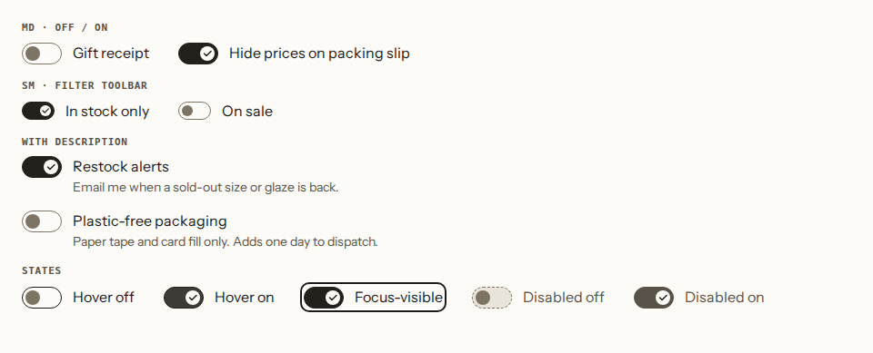

**Anatomy**

```
<button role="switch" aria-checked="true">
 ┌───────────┐
 │ ░░░░░ (✓) │  Restock alerts                              ← label (button content)
 └───────────┘  Email me when a sold-out size is back.       ← description (aria-describedby)
   │     └ thumb with a check icon (visible when on)
   └ track
```

1. **Button**: `<button type="button" role="switch">`, a transparent container holding the track and the label.
2. **Track**: a pill with a 1.5px border.
3. **Thumb**: a circle, with a check icon when on.
4. **Label**: the visible text.
5. **Description** (optional): a `muted` second line.

**Properties**

| Name | Type | Default | Description |
| --- | --- | --- | --- |
| `checked` | boolean | `false` | On/off (two-way). Reflected as `aria-checked`. |
| `size` | `"md" \| "sm"` | `"md"` | See Sizes. |
| `description` | string | none | Second line, linked with `aria-describedby`. |
| `disabled` | boolean | `false` | Native `disabled`. |
| content | text | required | The label: the setting's name, the same in both states. |

**Events**

- `change`: fires with the new boolean after each toggle.

**Sizes**

| Size | Track (w × h) | Thumb | Travel | Check icon | Label | Radius |
| --- | --- | --- | --- | --- | --- | --- |
| md (default) | 2.75 × 1.5rem, 1.5px border | 1rem, 0.1875rem from the track's start edge | 1.25rem | 0.75rem, 3px stroke | 1rem | `radius-full` |
| sm | 2.25 × 1.25rem | 0.75rem | 1rem | 0.625rem | 0.875rem / 1.5 | `radius-full` |

Track-to-label gap 0.75rem (`space-3`). The button's minimum height is 1.5rem and it covers the full label width. Its focus-ring corner radius is `radius-sm`. With a description, the label and description stack with a 0.125rem gap (line-height 1.4), the description is 0.875rem `muted`, and the track aligns to the top of the label.

**Variants**

| Variant | Notes |
| --- | --- |
| Label only | Label text directly inside the button. |
| With description | Label + description. The track top-aligns to the label. |
| sm | Filter bars and dense settings lists on desktop. |

**States**

| State | Track background | Track border | Thumb | Label |
| --- | --- | --- | --- | --- |
| Off | `background` | `border-strong` | `border-strong` fill, no icon, at the start | `text` |
| Off hover | `background` | `text` | as off | `text` |
| On | `primary` | `primary` | `primary-contrast` fill, check icon in `primary`, at the end | `text` |
| On hover | `primary` mixed 14% toward `background` | same | as on | `text` |
| Focus-visible | unchanged | unchanged | unchanged | standard focus ring around the whole button (track + label), `radius-sm` corners |
| Disabled off | `surface-strong` | dashed `border-strong` | `border-strong` | `muted`, cursor not-allowed |
| Disabled on | `muted` | solid `muted` | `primary-contrast` with check | `muted` |

On vs off is carried by the thumb's position and the check icon, not only by the track colour (1.4.1).

**Behaviour & motion**

- The thumb slides and the track fills over `duration-fast` with `ease-out`. With reduced motion the thumb jumps and the colours change instantly.
- The change applies immediately. If it triggers a reload (filter results), announce the result count in a polite live region elsewhere, not on the switch.

**Keyboard**

| Key | Action |
| --- | --- |
| `Tab` / `Shift+Tab` | Focus the switch. |
| `Space` / `Enter` | Toggle. |

**Accessibility**

- `<button type="button" role="switch" aria-checked="true|false">`. The visible label is the button's content, so the accessible name matches the screen (2.5.3). The description is referenced by `aria-describedby`.
- Contrast: off track border `border-strong` and off thumb `border-strong` are 4.5:1 on `background` (1.4.11). The on track `primary` vs `background` is 15.6:1, and it must stay ≥ 3:1 if `primary` is rebranded. The check `primary` on the `primary-contrast` thumb is 15.6:1. Label `text` 16.9:1, description `muted` 7.4:1.
- Target ≥ 1.5rem including the label (2.5.8).

**Acceptance criteria**

- [ ] The element is a `<button>` with `role="switch"` and `aria-checked` that updates on every toggle (4.1.2).
- [ ] `Space` and `Enter` toggle. A pointer click on the label or track toggles (2.1.1).
- [ ] The standard focus ring surrounds the track and label (2.4.7, 2.4.11, 2.4.13).
- [ ] On/off is shown by the thumb position and the check icon as well as colour (1.4.1). Boundaries ≥ 3:1 (1.4.11).
- [ ] The label doesn't change between states. No "On/Off" words inside the track.
- [ ] The whole button is ≥ 1.5rem tall (2.5.8).
- [ ] With reduced motion, the thumb jumps without sliding.
- [ ] Toggling never moves focus or triggers navigation (3.2.2).
- [ ] The label and description wrap at 320px and 200% zoom, and the track doesn't shrink (1.4.10).

**Do / Don't**

- Do write the label as the setting ("Restock alerts"), not as a question or an action.
- Do keep the label the same in both states. The switch shows the state.
- Don't use a switch for a choice that needs Save. Don't put On/Off words inside the track.
- Don't use a switch for consent to terms.

---

### Select

Choose one value from a list with a **custom** dropdown, never the platform's native select UI. Options can be plain text, a searchable list with groups for long lists such as countries, or rich options with a swatch, icon, hint line or stock note. For several values use **Multi-select**. For 2 to 5 options that fit on screen use **Radio group** or **Variant picker**.

**Progressive enhancement.** A real `<select>` with its `<option>`s (and `<optgroup>`s) is rendered in the form. When scripting runs, the custom control is built from it. The native `<select>` stays underneath: `hidden`, `aria-hidden="true"`, `tabindex="-1"`, and kept in sync with every change (it fires a bubbling `change` event). So forms post the value and existing listeners keep working. Without scripting, the native select shows in the same box (same height, border, radius and padding, 2.5rem end padding, and a 1.125rem chevron 0.75rem from the end edge) and uses the operating system's picker.


**Anatomy**

```
Country                                        ← label (Field wrapper); clicking it focuses the trigger
┌────────────────────────────────────────┐
│ ◍  United States                 ✕  ⌄ │     ← trigger (role=combobox)
└────────────────────────────────────────┘
  │   │                            │  └ chevron (muted, turns 180° when open)
  │   │                            └ clear button (clearable only, "Clear Country")
  │   └ value (swatch / icon + value text, or the placeholder in muted)
  └ optional leading icon (1.125rem, muted)
          ↕ 0.25rem
┌────────────────────────────────────────┐     ← popover (background, 1px border, radius-md, shadow-md, max 20rem tall)
│ ⌕  ic                                  │     ← search field (searchable only)
├────────────────────────────────────────┤
│ MOST USED                              │     ← group heading
│▓ Ic̲eland ▓▓▓▓▓▓▓▓▓▓▓▓▓▓▓▓▓▓▓▓▓▓▓▓▓▓▓▓│     ← active row (surface-strong), match bold + underlined
│ ALL COUNTRIES                          │
│ Ic̲eland                              ✓ │     ← selected: weight 600 + check
│ ◍ M̶o̶s̶s̶                       Sold out  │     ← disabled: muted, struck through, meta in danger
└────────────────────────────────────────┘
   list role=listbox · options role=option
   empty state: "No matches for “teal”"
<select hidden aria-hidden="true" tabindex="-1">  ← native select, kept in sync for form posts
```

1. **Trigger**: a focusable element with `role="combobox"` (not a native select), full width.
2. **Leading icon** (optional, decorative).
3. **Value**: the chosen option's swatch or icon plus its label (truncated with an ellipsis), or the placeholder.
4. **Clear button** (clearable): a separate `<button>` beside the chevron. It is not inside the trigger.
5. **Chevron**: `chevron-down`, `aria-hidden`.
6. **Popover**: a non-modal panel (not a dialog) holding:
7. **Search field** (searchable),
8. **Listbox** with **group headings** and **options** (swatch, icon, label + hint, meta, check),
9. **Empty state** text.
10. **Native `<select>`**, hidden.

**Properties**

| Name | Type | Default | Description |
| --- | --- | --- | --- |
| `value` | string | the native select's selected option | Selected value (two-way). |
| `options` | `{ value, label, group?, hint?, meta?, metaTone?: "warning" \| "danger", swatch?, icon?, disabled? }[]` | required | The options. `group` builds `<optgroup>` headings. `swatch` is a colour from product data. |
| `name` | string | none | Form field name (on the native select). |
| `id` | string | generated | Ties the Field wrapper's label. |
| `size` | `"sm" \| "md" \| "lg"` | `"md"` | See Sizes. |
| `searchable` | boolean | `true` when there are more than 10 options, else `false` | Adds the search field. |
| `searchPlaceholder` | string | `"Search"` | Placeholder and accessible name of the search field ("Search countries"). |
| `clearable` | boolean | `false` | Shows the clear button while there is a value. |
| `placeholder` | string | `"Select"` | Shown in `muted` when there is no value. Use it only when there is no sensible default. It is not an option in the list. |
| `leadingIcon` | icon name | none | Decorative icon in the trigger (`world`, `arrows-sort`). |
| `invalid` | boolean | `false` | Error state. Usually passed down from the Field wrapper. |
| `describedBy` | string | none | Copied to the trigger as `aria-describedby`. |
| `required` | boolean | `false` | `aria-required="true"` on the trigger and `required` on the native select. |
| `disabled` | boolean | `false` | Not focusable, doesn't open. |
| `readonly` | boolean | `false` | The value is readable but fixed: no chevron, doesn't open. |
| `placement` | `"auto" \| "above"` | `"auto"` | `auto` flips above when there's no room below (see Behaviour). The footer's selectors use `above`. |

**Events**

- `change`: fires with the new value when an option is chosen or the value is cleared. A bubbling native `change` also fires on the hidden `<select>`.
- `clear`: fires when the clear button, `Backspace` or `Delete` empties the value.

**Sizes**

All sizes share the box of Input, so selects and text fields line up in a row.

| Size | Trigger height | Padding (start / end) | Font size | Icons | Radius |
| --- | --- | --- | --- | --- | --- |
| sm | 2rem (`control-height-sm`) | 0.5625rem / 0.625rem | 0.875rem | chevron 1.125rem | `radius-md` |
| md (default) | 2.5rem (`control-height`) | 0.6875rem / 0.625rem | 0.9375rem, line-height 1.5rem (**1rem below a 48rem viewport**) | leading icon and chevron 1.125rem, swatch 1rem | `radius-md` |
| lg | 3rem (`control-height-lg`) | 0.6875rem / 0.625rem | 1rem | 1.125rem | `radius-md` |

| Part | Measure |
| --- | --- |
| Trigger inner gap | 0.5rem between icon, value and chevron |
| Clear button | 1.5rem square, 1rem icon, `radius-sm`, vertically centred on the trigger, 2rem from the end edge. While it shows, the value gets 1.75rem extra end padding. |
| Popover | 0.25rem below the trigger (or above when flipped). Min width = trigger, grows to fit its content up to min(22rem, 90vw). Max height 20rem: the list scrolls while the search field (and Multi-select footer) stay put. Stacks above page content and the sticky header (z-index 30; the sticky header is 20). 1px `border`, `radius-md`, `shadow-md`, `background`. |
| Search field | 2.5rem tall, 0.875rem text (1rem below a 48rem viewport), search icon 1rem at 0.625rem from the start, text starting at 2.125rem, 0.75rem end padding, 1px `border` hairline below. Top corners follow the popover's radius. Inset focus ring. |
| List | 0.25rem padding. Scrolling is contained (it doesn't chain to the page). |
| Option row | min 2.25rem tall, padding 0.375rem 0.5rem, 0.9375rem text on a 1.35 line, 0.5rem gap, `radius-sm`. Hint and meta 0.8125rem. Icon and check 1.125rem. Swatch 1rem with a 1px inner edge of `text` at 30%. Meta has a 0.75rem start margin, tabular numerals. |
| Group heading | 0.75rem, 600, uppercase, 0.06em tracking, `muted`, padding 0.5rem 0.5rem 0.25rem. Every group after the first gets a 1px `border` hairline and 0.25rem gap above it (top padding 0.625rem). |
| Empty state | 0.875rem, `muted`, centred, padding 1rem 0.75rem |

**Variants**

| Variant | How | When |
| --- | --- | --- |
| Single (default) | `options` | Topic, sort order, shipping speed, any list of about 6 to 10 plain options. |
| Searchable | automatic over 10 options, or `searchable` | Country, region, long product lists. The search field is at the top of the popover. Matching ignores case and diacritics ("island" finds "Ísland"). The matched part is bold with a 2px underline. Group headings with no matches hide. |
| Groups | `group` on options | Put the 3 to 5 most likely answers first ("Most used"), then the full list. |
| Rich options | `swatch`, `icon`, `hint`, `meta`, `metaTone` | Glaze colours with a swatch, shipping speeds with a hint line, stock notes aligned to the end. The chosen swatch or icon also shows in the trigger. |
| Disabled option | `disabled` on an option | Sold-out colour: `muted`, label struck through, reason in the meta ("Sold out", `danger` tone). Arrow keys skip it. |
| Clearable | `clearable` | Optional fields and filters. The clear button shows when there is a value. `Backspace` / `Delete` on the closed trigger also clear. |
| Placeholder | `placeholder` | Only when there is no sensible default ("Choose a size"). It is invalid on submit if required. |
| Leading icon | `leadingIcon` | Language / region, sort. Decorative. The label names the field. |
| Read-only | `readonly` | The value is fixed but must stay readable. |

**States**

| State | Background | Border | Text | Icon / extra |
| --- | --- | --- | --- | --- |
| Default | `background` | 1px `border-strong` | `text`, placeholder `muted` | chevron `muted` |
| Hover | `background` | 1px `text` | `text` | none |
| Open | `background` | 1px `text` | `text` | chevron turned 180°. Popover shown. |
| Focus-visible | `background` | `border-strong` (`text` when open or hovered) | `text` | standard focus ring |
| Error (`aria-invalid="true"`) | `background` | 2px `danger` (1px border + 1px inset line, inside the infill on focus) | `text` | error message below: `alert-circle` + text in `danger` |
| Disabled | `surface-strong` | 1px dashed `border` | `muted` | not focusable, cursor not-allowed, clear button hidden |
| Read-only | `surface` | 1px `border` | `text` | no chevron, cursor default, doesn't open |
| Clear button hover | `text` at 6% | none | icon `muted` → `text` | none |
| Option active | `surface-strong` | none | `text` | none |
| Option selected | transparent | none | `text`, weight 600 | check mark in `text` (never colour alone) |
| Option filtered match | none | none | matched characters weight 700, 2px underline at 0.15em offset | none |
| Option meta | none | none | `muted`. Warning tone `warning` 600. Danger tone `danger` 600. | none |
| Option disabled | none | none | `muted`, label struck through (1px) | cursor not-allowed, skipped by arrow keys, can't be chosen |
| No matches | none | none | `muted` "No matches for “…”" | none |

**Behaviour & motion**

- **Opening**: the popover enters over `duration-base` (200ms) with `ease-out`: it fades in from 0 while sliding 0.25rem and scaling vertically from 98% from its top edge (from its bottom edge when flipped). Closing is instant. The chevron turns over `duration-base`. The border colour changes over `duration-fast`. The focus ring expands in over `duration-base`. With reduced motion all of this is instant.
- **Only one open at a time**: opening a select closes any other open select or multi-select.
- **Active option on open**: the selected option, or else the first enabled one. The active option is scrolled into view with a 0.25rem margin whenever it changes.
- **Placement (flip above)**: it opens below by default. On every open, measure the room: needed = min(the popover's content height, 20rem) + 0.5rem. If the room below the trigger (to the viewport bottom) is less than needed **and** the room above is greater than the room below, open above instead (0.25rem above the trigger, growing upward from its bottom edge). The `above` placement always opens above.
- **Search**: opening clears any old query and shows every option. Typing filters as you type. The first visible enabled option becomes active after each change. Groups with no visible options hide. With no matches, the empty state "No matches for “<query>”" shows as real text, and the query stays in the field for editing.
- **Selecting**: sets the value, updates the trigger (the swatch or icon plus the label), syncs the native select, fires `change`, closes, and returns focus to the trigger.
- **Closing without a choice**: `Escape`, `Tab`, clicking outside, or focus leaving the component closes the popover without changing the value. Pointer presses inside the list don't blur the focused element.
- **Label**: clicking the Field wrapper's label focuses the trigger (it doesn't open it).

**Keyboard**

Pattern: WAI-ARIA APG **select-only combobox** for the plain select, and **editable combobox with listbox popup** (list autocomplete) for the searchable one.

Closed (focus on the trigger):

| Key | Action |
| --- | --- |
| `ArrowDown`, `Enter`, `Space` | Open, with the selected option (or the first) active. Searchable: focus moves into the search field. |
| `ArrowUp` | Open. Non-searchable: the last option is active. Searchable: the selected (or first) option is active. |
| Printable character | Opens. Searchable: starts the query with that character, in the search field. Non-searchable: typeahead jumps to the next option whose label starts with the typed letters (the buffer resets after 0.6s, and matching ignores case and diacritics). |
| `Backspace` / `Delete` | Clear the value (clearable only, when there is a value). |
| `Tab` | Moves on. |

Open:

| Key | Action |
| --- | --- |
| `ArrowDown` / `ArrowUp` | Move the active option by one, skipping disabled and filtered-out options. It stops at the ends and doesn't wrap. |
| `PageDown` / `PageUp` | Move by 10. |
| `Home` / `End` | Non-searchable: first / last option. In the search field they move the caret instead. |
| `Enter` | Select the active option, close and return focus to the trigger. |
| `Space` | Non-searchable: same as `Enter`. In the search field: types a space. |
| `Alt+ArrowUp` | Select the active option and close. |
| `Escape` | With a query: clear the query first. Otherwise close and return focus to the trigger without changing the value. |
| `Tab` | Close (the value doesn't change) and let focus move on. |
| Printable character | Non-searchable: typeahead. Searchable: types into the query. |

Pointer: clicking the trigger toggles, clicking an option selects it, hovering an enabled option makes it active, and clicking outside closes.

**Accessibility**

Roles and properties:

- **Trigger**: `role="combobox"`, `tabindex="0"` (−1 when disabled), `aria-haspopup="listbox"`, `aria-expanded` (`true` while open), `aria-controls` = the listbox id, `aria-labelledby` = the visible label's id (fallback: an `aria-label`). `aria-describedby`, `aria-invalid` and `aria-required` are copied from the field. `aria-disabled="true"` / `aria-readonly="true"` in those states.
- **Non-searchable**: focus stays on the trigger while open. The trigger carries `aria-activedescendant` = the active option's id (removed when closed).
- **Searchable**: opening moves focus into the search `<input type="text">`, which has `role="combobox"`, `aria-autocomplete="list"`, `aria-expanded="true"`, `aria-controls` = the listbox id, `aria-activedescendant` = the active option, `autocomplete="off"`, `spellcheck="false"`, and an accessible name equal to its placeholder ("Search countries").
- **Popup**: `role="listbox"`, labelled by the field label (`aria-labelledby`). Options have `role="option"`, a unique id and `aria-selected`. Disabled ones have `aria-disabled="true"`. Group headings are `role="presentation"`. Swatches, icons, the chevron and the check are `aria-hidden`. Hint and meta are real text inside the option, so stock notes are announced ("Moss, Sold out"). The popup is not a dialog and has no `role="dialog"`.
- **Clear button**: a real `<button type="button">` named "Clear <label>" ("Clear Country"). After clearing, focus returns to the trigger.
- **Native `<select>`**: `hidden`, `aria-hidden="true"`, `tabindex="-1"`, updated on every change.
- Focus is never trapped: `Tab` always leaves, and focus moving outside closes the popover (2.1.2).
- Selection is shown by weight + check, errors by icon + words, disabled by strike-through + a word, and the active row by fill (1.4.1).
- Contrast: trigger text `text` 16.9:1 and placeholder `muted` 7.4:1 on `background`. Active row `text` 13.8:1 and `muted` 6.1:1 on `surface-strong`. Meta `warning` 6.1:1, `danger` 6.5:1 on `background` (5.0:1 / 5.3:1 on `surface-strong`). Boundary `border-strong` 4.5:1 (1.4.11). Swatch edges carry a 1px inner edge so pale colours stay visible.
- Targets: trigger 2.5rem md / 2rem sm, option rows 2.25rem, clear button 1.5rem, all ≥ 1.5rem (2.5.8). The 2.75rem touch size is only for primary action buttons.

**Acceptance criteria**

- [ ] The native select UI never appears once scripting runs. The trigger is `role="combobox"` with `aria-haspopup="listbox"`, `aria-expanded`, `aria-controls` and `aria-labelledby` (4.1.2).
- [ ] The hidden native `<select>` stays in the form, in sync, and fires a bubbling `change`. Submitting the form posts the chosen value. With scripting off, the native select works with the OS picker in the same box.
- [ ] Every key in the Keyboard tables behaves as written, including typeahead with a 0.6s buffer, `PageUp`/`PageDown` by 10, `Alt+ArrowUp`, and `Escape` clearing the query before closing (2.1.1).
- [ ] Non-searchable: focus stays on the trigger and `aria-activedescendant` tracks the active option. Searchable: focus moves into the search combobox (`aria-autocomplete="list"`), and `aria-activedescendant` is on it.
- [ ] Selecting or `Escape` returns focus to the trigger. `Tab` closes without changing the value. Clicking outside closes. There is never a keyboard trap (2.1.2, 2.4.3).
- [ ] Filtering ignores case and diacritics, underlines the match in bold, hides empty groups, and shows "No matches for “…”" as text.
- [ ] Disabled options are struck through with a reason, skipped by the arrow keys, and can't be chosen.
- [ ] The popover flips above when there's not enough room below and there's more room above. It never extends beyond the viewport width (min(22rem, 90vw)).
- [ ] The standard focus ring shows on the trigger, and the inset ring on the search field (2.4.7, 2.4.11, 2.4.13).
- [ ] The error state shows a 2px `danger` boundary + icon + text, and the trigger has `aria-invalid="true"` (3.3.1, 1.4.1).
- [ ] Contrast pairs meet ≥ 4.5:1 for text and ≥ 3:1 for boundaries as listed (1.4.3, 1.4.11).
- [ ] Targets ≥ 1.5rem (2.5.8).
- [ ] With reduced motion, the popover and chevron change instantly.
- [ ] At 320px and 200% zoom, the trigger truncates long values with an ellipsis and the popover fits the viewport and scrolls internally (1.4.10).
- [ ] Opening doesn't change the value or move the page (3.2.2).

**Do / Don't**

- Do render the native `<select>` first. The custom control is a progressive upgrade, and the native control is the fallback.
- Do make lists of more than 10 options searchable, and put the likeliest answers in a first group.
- Do keep a placeholder only when there's no sensible default, and make it invalid on submit.
- Do show sold-out colours as disabled options with a "Sold out" note rather than hiding them.
- Don't use a select for 2 to 5 options that fit on screen. Use Radio group or Variant picker.
- Don't put interactive content (links, buttons) inside options.
- Don't place a select inside a container that clips overflow, because it would cut off the popover.

---

### Multi-select

Choose any number of values from a **custom** dropdown with a checkbox per option, a live count, and removable tags under the control. It shares every measure, state and key of **Select**, and only the differences are listed here. Like Select, it is built from a native `<select multiple>` that stays hidden underneath, in sync, so forms post every selected value and the control works without scripting (as a native multiple select).


**Anatomy**

```
Categories                                     ← label (Field wrapper); clicking it focuses the trigger
┌────────────────────────────────────────┐
│ Sweaters, Cardigans (+2)         ✕  ⌄ │     ← trigger (role=combobox)
└────────────────────────────────────────┘
   │                    │          └ clear button ("Clear Categories")
   │                    └ "+N" pill (surface-strong)
   └ summary: first 2 labels, comma-separated; placeholder "Any" when empty
┌────────────────────────────────────────┐     ← popover
│ ⌕  Search categories                   │     ← search field (searchable)
├────────────────────────────────────────┤
│ KNITWEAR                               │     ← group heading
│ ■ Sweaters                          18 │     ← checkbox (checked: primary) · meta (count)
│▓□ Scarves & wraps ▓▓▓▓▓▓▓▓▓▓▓▓▓▓▓▓▓ 12▓│     ← active row (surface-strong)
│ ...                                    │     ← listbox, aria-multiselectable=true
├────────────────────────────────────────┤
│ 4 selected              Clear  [ Done ]│     ← footer: live count · Clear (link button) · Done (primary sm)
└────────────────────────────────────────┘
( Sweaters × ) ( Cardigans × ) ( Mugs & cups × ) ( Merino wool × )   ← tags (small chips)
```

**Properties** (in addition to Select's; `searchable`, `size`, `invalid`, `disabled`, `readonly`, `leadingIcon` and `options` behave the same)

| Name | Type | Default | Description |
| --- | --- | --- | --- |
| `value` | string[] | `[]` | Selected values (two-way). |
| `placeholder` | string | `"Any"` | Shown in `muted` when nothing is selected ("Any colour"). |
| `showTags` | boolean | `true` | Shows the removable tag list under the control. `false` for compact toolbars. |
| `maxSummary` | number | `2` | How many labels the trigger lists before the "+N" pill. |

The clear button is always available when something is selected (no `clearable` property needed).

**Events**

- `change`: fires with the new array on **every** toggle (and on clear or tag removal). A bubbling native `change` also fires on the hidden `<select multiple>`.
- `clear`: fires when the footer Clear, the trigger's clear button, `Backspace`/`Delete` or tag removals empty the selection.
- `close`: fires when the popover closes (Done, `Escape`, focus leaving the component, outside click).

**Sizes**

Trigger, popover, search field, option rows and group headings are identical to Select: sm 2rem / 0.875rem, md 2.5rem / 0.9375rem (1rem below a 48rem viewport), lg 3rem / 1rem. The popover is at most 20rem tall and sits 0.25rem from the trigger. Option rows are at least 2.25rem.

| Part | Measure |
| --- | --- |
| Checkbox in option | 1rem square, 1.5px `border-strong`, 0.25rem radius, `background` fill. Checked: `primary` fill and border with a `primary-contrast` tick (0.25 × 0.5rem, 2px stroke). `aria-hidden`. |
| "+N" pill | min width 1.5rem, 1.25rem tall, 0 0.3125rem padding, 0.75rem 600 tabular, `surface-strong` fill, `radius-full` |
| Footer | padding 0.375rem (0.75rem at the start), 1px `border` hairline above, `background`, 0.5rem (`space-2`) gap. The count is 0.8125rem `muted` tabular and pushes the buttons to the end. Clear = Button link sm (0.5rem side padding), Done = Button primary sm. It stays put while the list scrolls. |
| Tags | small chips: min 1.75rem tall, 0.8125rem text, 0.625rem start padding, `surface-strong` fill, `radius-full`. Remove button 1.5rem circle with a 0.875rem icon (hover `text` at 11%). The list wraps with a 0.375rem gap, 0.25rem below the control. |

**Variants**

| Variant | How | When |
| --- | --- | --- |
| Default | `options` | Filters and form fields with more than about 6 options. |
| Searchable | automatic over 10 options, or `searchable` | Categories, materials, stockists. Filtering, match style, hidden empty groups and the "No matches for “…”" state are the same as Select. |
| Groups / rich options | `group`, `meta` (result counts), `swatch`, `hint`, `disabled` | Facet counts ("18") aligned to the end in `muted`. Colour filters with swatches. |
| Without tags | `showTags: false` | Compact toolbars where the trigger summary is enough. |
| sm | `size: "sm"` | Dense desktop filter bars. |
| Placeholder | `placeholder` | Shown in `muted` when nothing is selected. |

Multi-select vs checkbox group:

| Use a checkbox group (Checkbox) when | Use Multi-select when |
| --- | --- |
| 2 to 6 options, and seeing them all helps the decision | More than 6 options, or the list comes from the catalogue and can grow |
| The filter panel has room (collection filter drawer on mobile, sidebar facets) | Space is tight: a toolbar, a form row, a filter bar above the grid |
| Each option needs a long description | Options are short labels, optionally with a count or swatch |

Clear, Done and Apply:

- Changes apply immediately. Every toggle updates the value and the native select, and fires `change`. There is no pending state inside the popover.
- Done only closes the popover and returns focus to the trigger. It commits nothing.
- The footer's Clear empties the selection and keeps the popover open, with focus in the search field (or on the trigger when not searchable). The trigger's clear button does the same when closed, with focus on the trigger.
- Inside the collection filter Drawer, the drawer's own Apply button governs. The multi-select updates the drawer's draft state immediately, and nothing reaches the product grid until Apply.

**States**

As Select (default, hover, open, focus-visible, error, disabled, read-only, option active, filtered match, disabled option, no matches), plus:

| State | Treatment |
| --- | --- |
| Option selected | box filled `primary` with a `primary-contrast` tick. Label weight 500 (not 600). No check mark on the end. The box carries the state, not colour alone. |
| Some selected (closed) | the trigger lists the first 2 labels, comma-separated and truncated with an ellipsis, plus a "+N" pill for the rest. Tags below. The clear button shows. |
| None selected | placeholder in `muted`. Footer count "None selected". Tag list hidden. Clear button hidden. |

**Behaviour & motion**

- The popover enters over `duration-base` with `ease-out`, like Select. The checkbox fill and tick scale over `duration-fast`. The chevron turns over `duration-base`. The focus ring expands in over `duration-base`. Closing is instant. With reduced motion everything is instant.
- Toggling keeps the popover open, and the toggled row stays active.
- The trigger's clear button, `Backspace`/`Delete` on the closed trigger, and the footer's Clear all empty the whole selection.
- Removing a tag deselects that value, fires `change` and returns focus to the trigger.
- The same placement (flip above), one-open-at-a-time rule and outside-click and focus-out closing as Select.

**Keyboard**

The same keys as Select, with these differences:

| Key | Action |
| --- | --- |
| `Enter` (and `Space` when not searchable) | Toggle the active option. The popover stays open. |
| `Alt+ArrowUp` | Toggle the active option and close. |
| `Escape` | Clear the query first, then close and return focus to the trigger. |
| `Tab` | Moves from the search field (or the trigger) to the footer's Clear, then Done, with the popover still open. `Tab` past Done, or `Shift+Tab` out of the component, closes it. Nothing is reverted. |
| `Backspace` / `Delete` on the closed trigger | Clear all. |
| `Enter` / `Space` on Done | Close and return focus to the trigger (as does `Escape`). |
| `Enter` / `Space` on the footer's Clear | Empty the selection and keep the popover open; focus returns to the search field (or the trigger). |
| `Enter` / `Space` on a tag's remove button | Remove that value. Focus returns to the trigger. |

**Accessibility**

- The same combobox + listbox structure as Select: a trigger with `role="combobox"`, `aria-haspopup="listbox"`, `aria-expanded`, `aria-controls` and `aria-labelledby`. When searchable, a search input with `role="combobox"` and `aria-autocomplete="list"` carries `aria-activedescendant`.
- The listbox has `aria-multiselectable="true"`. Each option's `aria-selected` reflects its checkbox. The checkbox graphic is `aria-hidden`.
- The footer count ("4 selected" / "None selected") is an `aria-live="polite"` region, so every toggle is confirmed without moving focus (4.1.3).
- Tags: a `<ul>` named "Selected <label>" ("Selected categories"). Each chip's remove control is a real `<button type="button">` named "Remove <label>" ("Remove Sweaters"). The trigger's clear button is named "Clear <label>".
- Focus is never trapped. Clicking outside or focus leaving closes the popover (2.1.2).
- Contrast: "+N" and tag text `text` on `surface-strong` 13.8:1. Count `muted` on `background` 7.4:1. Checkbox border `border-strong` 4.5:1 on `background` and 3.6:1 on the `surface-strong` active row (1.4.11). Other pairs as Select.
- Targets: trigger 2.5rem, options 2.25rem, footer buttons 2rem, tag remove buttons 1.5rem (2.5.8).

**Acceptance criteria**

- [ ] The listbox has `aria-multiselectable="true"`, and every option's `aria-selected` matches its box (4.1.2).
- [ ] With the popover open, `Tab` reaches the footer's Clear and Done buttons without closing it; leaving the component by keyboard or pointer closes it (2.1.1, 2.1.2).
- [ ] `Enter` (and `Space` when not searchable) toggles without closing. `Alt+ArrowUp` toggles and closes. `Escape` clears the query, then closes (2.1.1).
- [ ] Every toggle updates the value and the hidden native `<select multiple>`, fires `change`, and updates the live count ("n selected" / "None selected"), which is announced politely (4.1.3).
- [ ] Done only closes and returns focus to the trigger. Clear empties the selection and keeps the popover open. Nothing is applied beyond the value itself (3.2.2).
- [ ] The closed trigger shows up to 2 labels and a "+N" pill. Tags list every value, with remove buttons named "Remove <label>" that return focus to the trigger.
- [ ] Selected options show a filled box with a tick, not colour alone (1.4.1).
- [ ] The popover flips above when there's no room below and more room above. The footer stays visible while the list scrolls.
- [ ] Focus ring visible on the trigger, the search field (inset), footer buttons and tag remove buttons (2.4.7, 2.4.11, 2.4.13).
- [ ] No keyboard trap. `Tab` out of the component closes it (2.1.2).
- [ ] Targets ≥ 1.5rem (2.5.8).
- [ ] The form posts every selected value with scripting on and off.
- [ ] At 320px and 200% zoom, the tags wrap and the popover fits within 90vw (1.4.10).
- [ ] With reduced motion, the box fill, the tick and the popover appear instantly.

**Do / Don't**

- Do use it for filters with more than 6 options and for form fields like "Interests" or "Channels".
- Do show result counts as meta so customers can avoid empty results.
- Do keep tags visible in forms so the whole selection can be reviewed and edited.
- Don't add an Apply button inside the popover. Changes are live, and the surrounding drawer or form owns committing.
- Don't use it for 2 to 6 options that fit on screen. Use a checkbox group.
- Don't cap the selection silently. If there's a limit, say it in help text.

---

### Quantity stepper

A number input between a decrease button and an increase button, for choosing how many of an item to add to the basket or keep in a cart line. It never goes to 0 to remove an item. Removal is a separate "Remove" button.


**Anatomy**

```
┌──────┬──────┬──────┐
│  −   │  4   │  +   │     one bordered group, radius-md
└──────┴──────┴──────┘
  │       │      └ increase button  aria-label="Increase quantity"
  │       └ input type=number inputmode=numeric min max  aria-label="Quantity"
  └ decrease button  aria-label="Decrease quantity"
```

1. **Group**: an inline flex container with a 1px border.
2. **Decrease button**: `<button type="button">` with a `minus` icon.
3. **Input**: `<input type="number">`, centred, weight 600, tabular numerals, no native spin buttons.
4. **Increase button**: `<button type="button">` with a `plus` icon.

**Properties**

| Name | Type | Default | Description |
| --- | --- | --- | --- |
| `value` | number | `min` | Quantity (two-way). |
| `min` | number | `1` | Lowest value. Never 0 on a cart line. |
| `max` | number | `99` | Stock or a per-order limit. Show the limit in help text ("Limit 10 per order"). |
| `size` | `"md" \| "sm"` | `"md"` | See Sizes. |
| `itemName` | string | none | Appended to the button names in lists ("Increase quantity, Stoneware mug"). |
| `name` | string | none | Form field name on the input. |
| `disabled` | boolean | `false` | Sold out: the whole stepper is disabled. |
| `error` | string | none | Server rejection message shown below ("Only 3 left"), with the new max. |

**Events**

- `change`: fires with the clamped number after a button press or a committed typed value (blur or `Enter`), not on every keystroke. The cart owner debounces requests (about 400ms), so rapid clicks send one request.

**Sizes**

| Size | Height | Buttons | Input width | Font size | Icon | Radius |
| --- | --- | --- | --- | --- | --- | --- |
| md (default) | 2.5rem (`control-height`) | 2.5 × 2.5rem | 2.75rem | 0.9375rem, 600, tabular | 1.25rem | `radius-md` (buttons' inner radius is `radius-md` minus 1px) |
| sm | 2rem (`control-height-sm`) | 2 × 2rem | 2.25rem | 0.875rem | 1rem | `radius-md` |

Use md in forms and sm in cart drawers and cart lines on desktop. Blocks may enlarge it: the Product detail block sets it to 3rem beside the 3rem Add to cart button, and cart lines grow sm to 2.75rem (buttons 2.75rem square) below a 48rem block width.

**Variants**

| Variant | Notes |
| --- | --- |
| Product page | md. Default min 1, max = stock or a per-order limit shown in help text. |
| Cart line | sm. 0 isn't allowed, and removal is a separate "Remove" Button (link variant). Button names include the product name. |

**States**

| State | Group | Buttons | Input |
| --- | --- | --- | --- |
| Default | `background`, 1px `border-strong` | icon `text` | `text` 600 |
| Button hover | none | fill `text` at 6% | none |
| Focus-visible (button or input) | none | inset focus ring, drawn inside the part so it never collides with its neighbour | same inset ring |
| At min / at max | none | that button has `aria-disabled="true"`: icon `muted` at 55% opacity, cursor not-allowed, no hover fill, ignores clicks, **stays focusable** | value unchanged |
| Disabled (sold out) | `surface-strong`, 1px dashed `border`, cursor not-allowed | both disabled | `muted` |
| Error (server rejected) | none | none | error message below the stepper (icon + text) with the new max |

**Behaviour & motion**

- Pressing a button adds or subtracts 1, clamps to [min, max], updates the input, and fires `change`.
- A typed value is rounded to a whole number and clamped on change. A non-number becomes `min`. No error is shown for "0" or "99". It is simply corrected.
- After every change, the decrease button is `aria-disabled` at min and the increase button at max.
- Button hover fill transitions over `duration-fast` with `ease-out`. The inset focus ring expands in over `duration-base`. The number doesn't animate. Nothing special is needed for reduced motion.
- Cart updates are announced in a polite live region near the cart total ("Quantity updated, subtotal $112.00"), once per settled update, never per keypress.

**Keyboard**

| Key | Action |
| --- | --- |
| `Tab` | Order: decrease → input → increase. |
| `Enter` / `Space` on a button | Step by 1 (ignored at the limit, and focus stays). |
| Digits in the input | Type a quantity. It is clamped on blur or `Enter`. |
| `ArrowUp` / `ArrowDown` in the input | Step by 1 (native). |

**Accessibility**

- Buttons are named by `aria-label` ("Decrease quantity" / "Increase quantity", plus ", <product name>" in lists). Icons are `aria-hidden`. The input is named "Quantity" (or by a visible label).
- At a limit the button gets `aria-disabled="true"`, not `disabled`, so keyboard focus is never lost when you reach min or max.
- The input exposes its value, `min` and `max` natively (4.1.2).
- Contrast: group border `border-strong` 4.5:1 on `background` (1.4.11). Value `text` 16.9:1. Icons `text` 16.9:1. The limit button's dimmed icon is an inactive state and is exempt.
- Targets: 2.5rem md, 2rem sm, 2.75rem in cart lines below 48rem (2.5.8).

**Acceptance criteria**

- [ ] The tab order is decrease, input, increase. Every part shows the **inset** focus ring, which never overlaps a neighbour (2.4.7, 2.4.11, 2.4.13).
- [ ] Buttons step by 1 and clamp to [min, max]. Typed values are rounded and clamped. Non-numbers become min.
- [ ] At min or max the relevant button is `aria-disabled="true"`, visibly dimmed, ignores activation and keeps focus (2.1.1, 2.4.3).
- [ ] The buttons have accessible names that include the product name in lists. Icons are hidden (4.1.2).
- [ ] The value can never reach 0 on a cart line.
- [ ] The group boundary is ≥ 3:1 and the value text ≥ 4.5:1 (1.4.11, 1.4.3).
- [ ] Cart updates are announced once in a polite live region, not per keypress (4.1.3).
- [ ] Targets are ≥ 1.5rem (2.5.8).
- [ ] The disabled (sold-out) state is dashed, `muted` and not operable, with the reason in text nearby.
- [ ] At 320px and 200% zoom, the stepper stays whole on one line (1.4.10).

**Do / Don't**

- Do debounce cart updates (about 400ms) so rapid clicks send one request.
- Do clamp typed values instead of showing an error for "0" or "99".
- Don't let the stepper reach 0 to remove an item. Use a Remove button.
- Don't hide the input. People with many items want to type.

---

### Variant picker

Choose a product option (size, colour) from visible pills or swatches. The legend spells out the current choice, and sold-out options stay selectable so a back-in-stock notice can be offered. For more than about 12 options, or long names, use **Select** with rich options (swatch + stock note as meta), searchable when there are more than 10.


**Anatomy**

```
<fieldset>
  Colour: Oatmeal                        ← legend: option name (600) + current value (muted)
  (◉) ( ● ) ( ● ) ( ⊘ ) ( ○ )            ← swatch options (label > radio + visible disc)
                    └ sold out: diagonal line + visually hidden ", sold out"
  Size: M
  [XS] [S] [▮M▮] [L̸] [XL]                ← pill options (label > radio + visible pill)
                  └ sold out: dashed border + diagonal line, muted text, visually hidden ", sold out"
```

1. **Fieldset**: no border or padding.
2. **Legend**: the option name (weight 600) + the current value (weight 400, `muted`), with a 0.5rem gap, baseline-aligned.
3. **Options row**: wraps, 0.5rem (`space-2`) gap.
4. **Option**: a `<label>` holding a native radio (transparent, covering the whole option, so the whole option is the click target) and the visible pill or swatch.

**Properties**

| Name | Type | Default | Description |
| --- | --- | --- | --- |
| `value` | string | the first available option | Selected value (two-way). |
| `name` | string | required | Option name ("Size", "Colour"). Used in the legend and as the radio group name. |
| `type` | `"pills" \| "swatches"` | `"pills"` | Pills for text values, swatches for colours. |
| `options` | `{ value, label, swatch?, available }[]` | required | `swatch` is a colour from product data (the only per-item colour). `available: false` marks sold out or an unavailable combination. |

**Events**

- `change`: fires with the new value. The product page updates the legend, price, image, URL and Add to cart state. Focus doesn't move.

**Sizes**

| Part | Height | Padding | Font size | Radius |
| --- | --- | --- | --- | --- |
| Pill | min 2.5rem (`control-height`), min width 3rem | 0 1rem (`space-4`) | 0.9375rem, 500 (600 selected) | `radius-md` |
| Swatch | 2.75 × 2.75rem outer; a 2px ring (transparent at rest), then a 3px gap, then the colour disc with a 1px inner `border-strong` edge | none | none | `radius-full` |
| Legend | none | 0.75rem (`space-3`) bottom margin | 0.875rem; name 600, value 400 `muted` | none |
| Option gap | 0.5rem (`space-2`) | | | |

Blocks may tune pills (the Collection grid's size filter uses a 2.75rem min width and 0.75rem padding, and 2.5rem squares in the desktop sidebar).

**Variants**

| Variant | Use |
| --- | --- |
| Pills | Sizes, capacities (250ml / 400ml), pack counts, anything text. |
| Swatches | Colours and glazes. The colour name lives in visually hidden text inside the label and in the legend. |
| Select fallback | More than about 12 options, or long names: Select with rich options. |

**States**

| State | Pill background | Pill border | Pill text | Swatch |
| --- | --- | --- | --- | --- |
| Default | `background` | 1px `border-strong` | `text`, 500 | disc with a 1px `border-strong` edge, no ring |
| Hover | `background` | 1px `text` | `text` | ring `border-strong` |
| Selected | `primary` | `primary` | `primary-contrast`, 600 | 2px ring `text` |
| Focus-visible | standard focus ring on the visible pill | | | standard focus ring around the swatch |
| Sold out | `background` + a 1px diagonal `border-strong` line (bottom-left to top-right) | 1px **dashed** `border-strong` | `muted` | 2px diagonal line in `text` with a 1.5px `background` halo, from 4px inside the top to 4px inside the bottom, rotated 45° |
| Sold out + selected | `surface-strong` | **2px** solid `text` | `text`, 600 | 2px ring `text` + the line |
| Unavailable combination (sold out given the other chosen option) | same as sold out | | | |

Selected is shown by fill, weight and the legend text. Sold out is shown by the line, the dashed border and words (1.4.1).

**Behaviour & motion**

- Border and background transition over `duration-fast` with `ease-out`. With reduced motion they are instant.
- On change, the legend value updates ("Size: M", "Colour: Clay, sold out"). When a sold-out option is selected, the product page swaps Add to cart for "Email me when it's back" and shows a `danger` status line with an icon and text ("Clay in L is sold out").
- Combinations that are sold out given the other chosen option are crossed out (L in Clay).
- Price changes are announced in a polite live region near the price. Focus never moves.

**Keyboard**

| Key | Action |
| --- | --- |
| `Tab` | Into the group (to the selected option), then out of the group. |
| `ArrowRight` / `ArrowDown` | Next option, which is also selected (native radio behaviour, wraps). |
| `ArrowLeft` / `ArrowUp` | Previous option, selected. |
| `Space` | Select the focused option. |

No custom key handling is needed. Sold-out options are included (they are not disabled).

**Accessibility**

- Each option set is a native radio group in `<fieldset>` + `<legend>`. The legend repeats the current value, so both sighted and screen-reader users know the choice. Update it on `change`.
- Sold-out options stay **enabled** and include visually hidden ", sold out" in their name.
- Swatches: the colour name is visually hidden text inside the label, so it isn't conveyed by colour alone (1.4.1). The disc edge uses `border-strong`, so pale swatches (Ecru, Chalk) keep a 3:1 boundary (1.4.11).
- The focus ring is drawn on the visible pill or disc when its (transparent) radio has keyboard focus.
- Contrast: pill text `text` 16.9:1. Selected `primary-contrast` on `primary` 15.6:1. Sold-out `muted` 7.4:1 on `background`. Pill border `border-strong` 4.5:1 (1.4.3, 1.4.11). The legend value is `muted` 7.4:1.
- Targets: pills 2.5rem tall (min width 3rem), swatches 2.75rem (2.5.8).

**Acceptance criteria**

- [ ] Each option set is a native radio group in a fieldset. Arrow keys move and select, and it is a single tab stop (2.1.1).
- [ ] The legend always shows "Name: Value" and adds ", sold out" when the selected value is sold out.
- [ ] Sold-out options are selectable, have ", sold out" in their accessible name, and are shown by line + dashed border (pills) or line (swatches), not colour alone (1.4.1, 4.1.2).
- [ ] Swatch accessible names contain the colour name. Pale swatches keep a ≥ 3:1 edge (1.4.11).
- [ ] The standard focus ring shows on the visible pill or disc on keyboard focus (2.4.7, 2.4.11, 2.4.13).
- [ ] Selected pills are `primary` filled with weight 600. Selected swatches have a 2px `text` ring.
- [ ] Changing a variant never moves focus. The price change is announced politely (3.2.2, 4.1.3).
- [ ] Pills ≥ 2.5rem and swatches 2.75rem (2.5.8).
- [ ] At 320px and 200% zoom, options wrap onto more rows without horizontal scroll (1.4.10).
- [ ] With reduced motion, the state changes are instant.

**Do / Don't**

- Do preselect the first available variant, and always show the selected value in the legend.
- Do cross out combinations that are sold out given the other chosen option.
- Don't disable or hide sold-out options. Customers want to request them.
- Don't rely on swatch colour alone. The name must be in the legend and in the accessible name.

---

### Search bar

A search field that shows live, grouped results in a panel right below it as the shopper types: products, collections, journal and help pages, plus a "See all results" row that opens the Search page. Use it inline: in the header's centred variant, at the top of the Search block (size lg), in a collection toolbar, or on a help page. When there's no room for a field, use **SearchModal**, which is the same component inside a native `<dialog>`. The results panel of the search bar is a **listbox popup, not a dialog**.

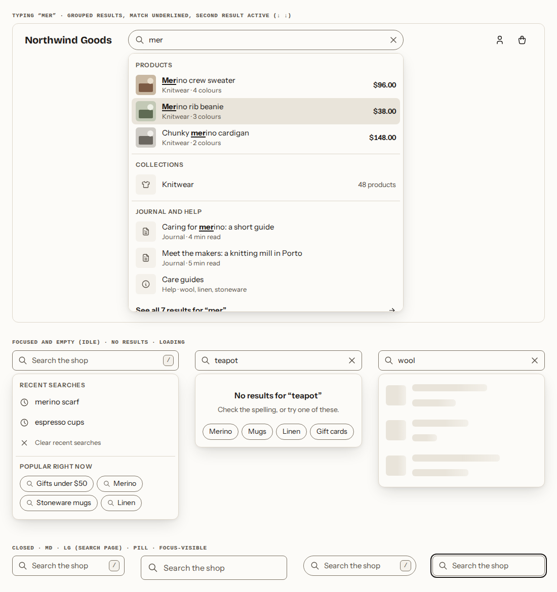

*Top: typing with grouped results. Middle: idle, no results and loading. Bottom: closed sizes and the focus ring.*

**Anatomy**

```
┌─ field ─────────────────────────────────────────────────┐
│ ⌕  mer|                                        [×] [/]│  input type=search, role=combobox
└────────────────────────────────────────────────────────┘
┌─ panel (role=listbox) ─────────────────────────────────┐  0.375rem below, radius-lg, shadow-md
│ PRODUCTS                                   heading     │
│ [img] Merino crew sweater         $96.00   option      │  thumb 2.5rem · title · sub · meta
│ [img] Merino rib beanie ▓▓▓▓▓▓▓▓ $38.00 → active      │
│ ───────────────────────────────────────────────────── │
│ COLLECTIONS                                            │
│ [ic]  Knitwear                  48 products            │
│ ───────────────────────────────────────────────────── │
│ JOURNAL AND HELP                                       │
│ [ic]  Caring for merino: a short guide                 │
│ See all 12 results for “mer”                      →    │  "See all" row
└────────────────────────────────────────────────────────┘
```

1. **Search landmark**: `role="search"` on the wrapper (or a `<form role="search" action="/search">`).
2. **Search icon**: `muted`, decorative.
3. **Input**: `<input type="search">` with Input styling. The browser's own clear and decoration are hidden.
4. **Keyboard hint**: `/` in a keyboard-key chip, `aria-hidden`, hidden once there is text.
5. **Clear button**: ghost icon button, shown only when there is text.
6. **Panel**: a listbox popup with one of four views.
7. **Group**: a heading + options.
8. **Option**: a link row with a thumbnail (products) or an icon tile (collections, pages), title, sub line, meta, and an arrow that shows when active.
9. **Chips**: recent or popular searches (also options).
10. **"See all" row**: always the last option in results.
11. **Live region**: visually hidden, polite.

The panel has four views. Exactly one shows at a time:

| View | When | Content |
| --- | --- | --- |
| `idle` | Focused, empty query | "Recent searches" (up to 5 rows, then a "Clear recent searches" row), then "Popular right now" chips. Neither list shows if it's empty. |
| `results` | Query with matches | Groups in this fixed order: Products (max 4), Collections (max 3), Journal and help (max 3). Empty groups are hidden. "See all N results for “q”" is always the last row. |
| `none` | Query without matches | "No results for “q”", one line of advice ("Check the spelling, or try one of these."), and suggestion chips (popular searches). |
| `loading` | A request has been in flight for more than 300ms | Three skeleton rows (a 2.5rem square + two text lines). Earlier results stay on screen while the next request runs, so the panel doesn't flicker. |

**Properties**

| Name | Type | Default | Description |
| --- | --- | --- | --- |
| `value` | string | `""` | The query (two-way). |
| `size` | `"md" \| "lg"` | `"md"` | md in the header and toolbars, lg on the Search page. |
| `pill` | boolean | `false` | Fully rounded field (header). |
| `action` | string | `"/search"` | Form action. The query is submitted as a URL parameter. |
| `label` | string | `"Search the shop"` | Accessible name (visible label or `aria-label`). |
| `placeholder` | string | `"Search the shop"` | Placeholder. |
| `results` | `{ products[], collections[], articles[], pages[], total }` | empty | From the predictive-search endpoint. |
| `loading` | boolean | `false` | Request in flight. The loading view shows only after 300ms. |
| `recent` | string[] | from browser storage | Up to 5 recent queries. |
| `popular` | string[] | from store analytics or site settings | Popular searches, max 6. |
| `showRecent` | boolean | `true` | Shows the recent-searches list. |
| `resultTypes` | (`"products" \| "collections" \| "articles" \| "pages"`)[] | all | Which groups appear. |
| `shortcut` | boolean | `true` in the header | Enables the `/` shortcut and its hint. |
| `autofocus` | boolean | `false` | Only on the Search page itself. |

Page-builder settings where the bar is a block setting: `showRecent` (bool, default on), `popularSearches` (list of string, max 6), `placeholder` (string, default "Search the shop"), `resultTypes` (select, multiple: products, collections, articles, pages).

**Events**

- `input`: fires with the query as it changes (the owner debounces fetching).
- `select`: fires with the chosen option (`{ type, url }`) before navigating.
- `submit`: fires with the query when `Enter` is pressed with no active option. The form then goes to the Search page.

**Sizes**

| Size | Field height | Text | Icon | Start padding (text) | Where |
| --- | --- | --- | --- | --- | --- |
| md (default) | 2.5rem (`control-height`) | 0.9375rem (1rem below a 48rem viewport) | 1.125rem at 0.75rem | 2.375rem | Header, toolbars |
| lg | 3rem (`control-height-lg`) | 1rem | 1.25rem at 0.875rem | 2.75rem | Search page |
| pill | any size, `radius-full` | as size | at 0.875rem | 2.5rem | Header |

End padding 2.75rem (room for the clear button or hint).

| Part | Measure |
| --- | --- |
| Panel | Matches the field's width. 0.375rem gap below it. 0.375rem padding. Max height min(32rem, 70vh), scrolls inside (scrolling doesn't chain to the page). 1px `border`, `radius-lg`, `shadow-md`, `background`. Stacks above page content (z-index 30). |
| Group | 0.125rem block padding. Each group after the first has a 1px `border` hairline above, 0.25rem margin and 0.375rem top padding. |
| Group heading | 0.75rem, 600, uppercase, 0.06em tracking, `muted`, min 1.75rem row, padding 0.25rem 0.5rem. It can hold a link button at the end (0.8125rem, 500, no uppercase, 1.5rem tall). |
| Option | min 2.5rem, padding 0.375rem 0.5rem, 0.75rem gap, `radius-md` |
| Thumbnail / icon tile | 2.5rem square, `radius-sm`. Thumbnails sit on `surface-strong`. Icon tiles are `surface` with a 1.125rem `muted` icon. Recent-search rows use a 1.125rem `muted` leading icon instead. |
| Title / sub / meta | 0.9375rem `text` / 0.8125rem `muted` / 0.875rem 600 tabular. Title and sub truncate with an ellipsis on one line. The line height of the text stack is 1.35. Muted meta ("48 products"): 400, `muted`. Minor rows ("Clear recent searches"): title 0.8125rem `muted`. |
| Active arrow | 1rem `arrow-right`, `text`, at the end of the row. Visible only on the active row (always visible on "See all"). |
| "See all" row | 600, 0.9375rem, 0.25rem top margin, arrow pushed to the end |
| Chips | min 2rem, padding 0 0.75rem, 1px `border-strong`, `radius-full`, 0.875rem, 0.375rem gap between chips (row padding 0.25rem 0.5rem 0.5rem), optional 0.875rem `muted` icon. Centred under the no-results message. |
| No-results message | centred, padding 1.5rem 1rem 0.75rem. Title 1rem 600 (long queries break anywhere). Advice 0.875rem `muted`. |
| Keyboard hint | `/` in a keyboard-key chip: monospace, 0.75rem, `surface` fill, 1px `border-strong`, `radius-sm`, `muted` text, 0.625rem from the end edge |
| Clear | 2rem ghost icon button, 0.25rem from the end edge, icon `muted` → `text` on hover, round in the pill variant |

**Variants**

| Variant | Notes |
| --- | --- |
| md | Header (centred header variant), collection toolbar, help page. |
| lg | Search block / Search page. May autofocus there. |
| pill | Header style. |
| SearchModal | The same component inside a native `<dialog>` opened as a modal, for narrow headers. Specified separately. |

**States**

| State | Field | Panel |
| --- | --- | --- |
| Default | `background`, 1px `border-strong`, placeholder `muted`, hint visible | closed |
| Hover | border `text` | none |
| Focus | standard focus ring (on any focus), border `text` | opens (idle, or results for an existing query) |
| Typing | clear button appears, hint hides | results / none / loading |
| Active option | none | `surface-strong` fill, and the arrow appears at the end. Also exposed through `aria-activedescendant`, so it isn't shown by colour alone. |
| Active chip | none | `surface-strong` fill, border `text` |
| Match | none | the matched part of each title is weight 700 with a 2px underline at 0.15em offset (a `<mark>` with no background), never colour alone |
| Disabled | as Input | not used on storefronts |

Options show no focus ring of their own, because focus stays in the input and the active row is the visual cue.

**Behaviour & motion**

- **Opening**: the panel opens when the field gets focus, on click, on typing, and on `ArrowDown`. It never opens on hover. It enters with a fade and a 0.25rem slide from its top edge over `duration-base` with `ease-out`. It closes instantly. The row arrow fades in over `duration-fast`. With reduced motion everything is instant.
- **Rendering**: an empty query shows the idle view and clears the live region. A non-empty query filters and highlights: matching ignores case and accents ("linen" finds "Línen"). It shows the results or none view, updates the count in "See all N results for “q”", and resets the active option.
- **Data**: production calls the store's predictive-search endpoint with a 150ms debounce and a minimum of 2 characters. It cancels requests that are out of date and caches by query. The response is `{ products[], collections[], articles[], pages[], total }`. Recent searches are stored per browser (max 5) and never sent to the server. Popular searches come from store analytics or from a list in site settings.
- **Choosing**: product, collection, page and "See all" options are links and navigate. Recent-search rows and popular or suggestion chips fill the field with their text and run the search (they don't navigate), and focus stays in the input. "Clear recent searches" hides the recent group and keeps focus in the input.
- **Closing**: `Tab`, `Escape` (in steps), and pointer presses outside the component close the panel. A pointer press on an option doesn't blur the field.
- **Announcements**: a visually hidden `aria-live="polite"` region announces "4 results for mer" (singular "1 result for mer") or "No results for teapot", debounced until typing pauses (400ms).
- **Shortcut**: `/` anywhere on the page (when focus isn't in a text field, select, combobox or editable area) focuses the header search. If the page uses SearchModal instead, it opens that.

**Keyboard**

Pattern: WAI-ARIA **combobox with listbox popup**, editable, `aria-autocomplete="list"`. Focus stays in the input the whole time.

| Key | Action |
| --- | --- |
| `ArrowDown` | Opens the panel if closed. Moves the active option down through all options, across groups and chips (from none: the first). Stops at the last. |
| `ArrowUp` | Moves the active option up (from none: the last). Stops at the first. |
| `Enter` | With an active option: follow it (link), or fill and search (recent or chip). With no active option: submit the form to the Search page with the query. |
| `Escape` | First clears the active option, then the query, then closes the panel. Focus stays in the field throughout. |
| `Tab` | Closes the panel and moves on. Options are never in the tab order. From a field with text, the clear button is the next tab stop. |
| `/` (outside text fields) | Focuses the header search (or opens SearchModal). |
| `Enter` / `Space` on the clear button | Empties the query, shows the idle view and returns focus to the input. |

**Accessibility**

- A search landmark: `role="search"` on the wrapper, or `<form role="search" action="/search">`.
- The input is `type="search"` with `role="combobox"`, `aria-controls` = the panel id, `aria-expanded` (`true` while the panel shows), `aria-autocomplete="list"`, `aria-activedescendant` = the active option's id (removed when none), `autocomplete="off"`, `spellcheck="false"`. It has a real name: a visible label, or `aria-label="Search the shop"` in the header.
- The panel is `role="listbox"` named "Search suggestions". Each group is `role="group"` labelled by its heading (`aria-labelledby`). Every row, chip and "See all" is an `<a role="option">` with a unique id, so a pointer click follows the link. Options never contain other buttons or links.
- The panel is a non-modal popup: no `<dialog>`, no `role="dialog"`, no focus trap.
- The keyboard hint and all icons are `aria-hidden`. The clear button is a `<button type="button">` named "Clear search".
- Contrast: titles `text` 13.8:1 on the `surface-strong` active row, and the `muted` sub line 6.1:1 there. On `background`: `text` 16.9:1, `muted` 7.4:1. Field boundary `border-strong` 4.5:1. Chip border `border-strong` 4.5:1 (1.4.3, 1.4.11).
- Targets: options 2.5rem, chips 2rem, clear button 2rem, all above 1.5rem (2.5.8).
- Don't autofocus the field on page load, except on the Search page itself.

**Acceptance criteria**

- [ ] The wrapper is a search landmark. The input has `role="combobox"`, `aria-expanded`, `aria-controls`, `aria-autocomplete="list"` and an accessible name (1.3.1, 4.1.2).
- [ ] The panel is `role="listbox"` with `role="group"` sections named by their headings, and every row, chip and "See all" is an `<a role="option">`. It is never a dialog.
- [ ] Focus never leaves the input while moving through options. `aria-activedescendant` always points at the visibly active option, and the active option scrolls into view.
- [ ] `ArrowDown`/`ArrowUp`, `Enter` (follow / fill / submit), `Escape` (active → query → close) and `Tab` (close and move on) behave exactly as in the Keyboard table (2.1.1, 2.1.2).
- [ ] Exactly one view (idle, results, none, loading) shows at a time. Loading shows only after 300ms and keeps earlier results. Empty groups hide. "See all" is always last.
- [ ] Results are capped at 4 products, 3 collections and 3 journal and help rows.
- [ ] Matches are marked by weight + underline, and the active row by fill + arrow + `aria-activedescendant`, never colour alone (1.4.1).
- [ ] The polite live region announces the result count or "No results for …" after a 400ms pause, not on every keystroke (4.1.3).
- [ ] The standard focus ring shows on the field on any focus and on the clear button on keyboard focus (2.4.7, 2.4.11, 2.4.13).
- [ ] The panel opens on focus, typing or `ArrowDown`, never on hover. Clicking outside closes it. Choosing a recent or popular chip doesn't navigate (3.2.2).
- [ ] Contrast pairs as listed: ≥ 4.5:1 text, ≥ 3:1 boundaries (1.4.3, 1.4.11).
- [ ] Targets ≥ 1.5rem (2.5.8).
- [ ] At 320px and 200% zoom, the panel matches the field width, titles truncate with an ellipsis, and the panel scrolls within min(32rem, 70vh) with no horizontal page scroll (1.4.10).
- [ ] With reduced motion, the panel and row arrow appear instantly.
- [ ] The field doesn't autofocus on page load except on the Search page. The `/` shortcut is ignored while typing in another field.

**Do / Don't**

- Do show real prices and thumbnails for products, because that's what people are looking for.
- Do keep "See all results" as the last row, even when there are only a few matches.
- Don't open the panel on hover, and don't run the search on every keystroke without a debounce.
- Don't put buttons or links inside an option. The whole row is the option.
- Don't use more than four product rows. The Search page is where the full list lives.

---

## Display, commerce and layout

Shared rules for everything in this group:

- **Focus**: every interactive part uses the standard focus ring unless a section says otherwise. Cards with a stretched title link draw the standard focus ring around the **whole card** (following the card's `radius-lg` corners) while the title link has keyboard focus; the link itself draws no ring of its own.
- **Reduced motion**: with `prefers-reduced-motion: reduce`, every transition and animation becomes instant (effectively 0ms, one iteration). Skeleton shimmer is removed entirely. Nothing in this group depends on motion to convey meaning.
- **Cards** (Product card, Content card, Feature card) share one root: an `<article>` (or plain element for unlinked feature cards) laid out as a vertical flex column, `background` fill, `text` colour, `radius-lg` corners, positioned so a stretched link can cover it. The **stretched link** is the title's `<a>`; an invisible layer drawn from it covers the whole card (inheriting the card radius, stacking level 1), so the entire card is the click target while the accessible name is just the title. Buttons inside a card sit above the stretched layer (stacking level 2). Hovering anywhere on the card (which is hovering the link) underlines the title 1px with a 0.2em offset.
- **Cards on primary/accent sections** keep their own `background` fill and normal `text` / `muted` colours; they do not switch to the contrast colour. Blocks that lay cards straight onto their own ground (collection grid, product carousel, search results) make the card fill transparent.
- **Block width**: anything described as changing "below 48rem" measures the width of the enclosing block, not the viewport (see Container and section).

---

### Badge

A short, non-interactive label for product flags (Sale, New, Sold out), categories, materials and order states, plus the inline **stock status line** (icon + words, no fill). Use it to flag; never to act. If the label must filter or be removed, use a chip or a Button instead.

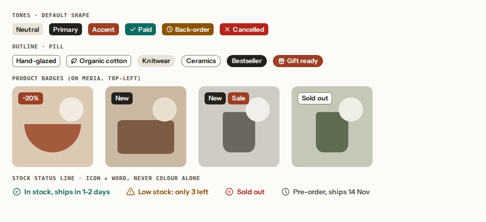

*Top to bottom: six tones; outline and pill shapes; badges stacked top-left on product media; stock status lines with icon and words.*

**Anatomy**

1. Container: inline row, vertically centred.
2. Icon (optional, leading), decorative.
3. Label text.
4. Visually hidden suffix (optional) completing a symbol, for example "−20%" + hidden " off".

Stock status line: 1. icon (leading), 2. status words. No container fill.

**Properties**

Badge

| Name | Type | Default | Description |
|---|---|---|---|
| label | string | — | Visible text (content). Sentence case. |
| tone | `neutral` \| `primary` \| `accent` \| `success` \| `warning` \| `danger` | `neutral` | Fill colour. `success` / `warning` / `danger` require an icon. |
| variant | `none` \| `sale` \| `new` | `none` | Product flags. `sale` renders like `accent`, `new` like `primary`. Overrides `tone`. |
| outline | boolean | `false` | `background` fill with a 1px inset `border-strong` boundary. Used for "Sold out" on media and low-emphasis tags. |
| pill | boolean | `false` | Fully rounded ends, wider padding. Category chips in content, filter summaries. |
| icon | string \| null | `null` | Name of a decorative leading icon. |
| hiddenSuffix | string \| null | `null` | Visually hidden text appended to the label, e.g. `" off"` after "−20%". |

Stock status line

| Name | Type | Default | Description |
|---|---|---|---|
| level | `in` \| `low` \| `out` \| `preorder` | — | Picks colour and icon: `in` = `success` + circle-check, `low` = `warning` + alert-triangle, `out` = `danger` + circle-x, `preorder` = `muted` + clock. |
| quantity | number \| null | `null` | Shown in the low-stock copy ("only 3 left"). |
| message | string | per level | Words shown after the icon. Defaults: "In stock, ships in 1–2 days", "Low stock: only 3 left", "Sold out", "Pre-order, ships 14 Nov". |

**Events**: None.

**Sizes**

| Part | Value |
|---|---|
| Badge min-height | 1.5rem |
| Badge padding-inline | 0.5rem (pill 0.625rem); no block padding |
| Badge text | 0.8125rem, weight 600, line-height 1, letter-spacing 0.01em, no wrapping |
| Badge icon | 0.875rem, stroke 2.25 |
| Gap icon–label | `space-1` (0.25rem) |
| Badge radius | `radius-sm` (pill `radius-full`) |
| Status line text | 0.875rem, weight 600 |
| Status line icon | 1.125rem; gap icon–text 0.375rem |
| Badge stack on product media | top and left `space-3` (0.75rem) from the media corner, wraps, gap `space-1` |

Inside commerce blocks (collection grid, product detail, product carousel, collection header, cart, search) badge and status text snap to 0.875rem so each block keeps at most three type sizes.

**Variants**

| Variant | Use |
|---|---|
| Neutral | Tags and materials ("Hand-glazed", "Knitwear") |
| Primary | Emphasis ("Bestseller") |
| Accent | Promotional ("Gift ready") |
| Success / Warning / Danger | Order and payment states ("Paid", "Back-order", "Cancelled"), always with an icon |
| Outline | Low emphasis on busy imagery; "Sold out" on product media; "Organic cotton" with leaf icon |
| Pill | Category chips in content ("Knitwear", "Ceramics"); combinable with any tone or outline |
| Sale | Product discount ("−20%" or "Sale") |
| New | "New" product flag |
| Stock status line | Stock on the product page and cards: In stock / Low stock / Sold out / Pre-order |

**States**: badges are static; they have no hover, focus, pressed or disabled state.

| Variant | Background | Border | Text | Icon |
|---|---|---|---|---|
| Neutral | `surface-strong` | none | `text` | `text` |
| Outline | `background` | inset 1px `border-strong` | `text` | `text` |
| Primary / New | `primary` | none | `primary-contrast` | `primary-contrast` |
| Accent / Sale | `accent` | none | `accent-contrast` | `accent-contrast` |
| Success | `success` | none | `background` | `background` |
| Warning | `warning` | none | `background` | `background` |
| Danger | `danger` | none | `background` | `background` |
| Status line | none | none | `success` / `warning` / `danger` / `muted` | same as its text |

**Behaviour & motion**

- None. Badges appear with their parent; never animate, pulse or blink them.
- On product media, badges always sit on their own solid fill, never as bare text on the photo.
- A product shows at most two badges, ordered New, then Sale.

**Keyboard**

| Key | Action |
|---|---|
| — | Not focusable; no keyboard interaction. |

**Accessibility**

- Render as inline text (`<span>`); no role. Icons inside badges and status lines are `aria-hidden="true"`.
- Symbols carry a hidden word: "−20%" is announced "−20% off".
- 1.4.1: tone is never the only signal. Stock status always pairs an icon with words ("Low stock: only 3 left"); sale uses the word or percentage, and the Price also strikes through the compare-at amount; order states always carry an icon and a word.
- 1.4.3 contrast (badge text is 0.8125rem bold, treat it as normal text): `text` on `surface-strong` 13.8:1; `primary-contrast` on `primary` 15.6:1; `accent-contrast` on `accent` 6.7:1; `background` on `success` 6.2:1, on `warning` 6.1:1, on `danger` 6.5:1; `text` on `background` 16.9:1 (outline). Status line text: `success` 6.2:1, `warning` 6.1:1, `danger` 6.5:1, `muted` 7.4:1 on `background` (5.0:1 / 5.0:1 / 5.3:1 / 6.1:1 on `surface-strong`).
- 1.4.11: the outline boundary is `border-strong`, 4.5:1 on `background`.

**Acceptance criteria**

- [ ] Every tone renders with the exact token pair in the States table; each text pair meets 4.5:1 (1.4.3) with the ratios above.
- [ ] Badges and status lines are not focusable and are not links or buttons; Tab never lands on them (2.1.1 not applicable, no traps).
- [ ] Success, warning and danger badges and every stock status line show an icon and a word; removing colour (greyscale) leaves the meaning intact (1.4.1).
- [ ] "−20%" is announced with a hidden "off"; icons are hidden from assistive technology (1.3.1, 4.1.2).
- [ ] Badges on product media sit top-left at 0.75rem from the corner on a solid fill; a third badge is never rendered.
- [ ] At 200% zoom and in a 320px-wide column, badges and status lines stay readable; a badge stack wraps instead of overflowing the media (1.4.4, 1.4.10).
- [ ] With 1.4.12 text spacing overrides applied, badge text is not clipped (min-height grows with content).
- [ ] No animation of any kind is applied to badges.

**Do / Don't**

- Do limit a product to two badges: New, then Sale.
- Do write the stock line in plain words, with the count when low.
- Don't use a coloured dot alone for stock.
- Don't use `danger` for sale; sale is promotional (`accent`), not an error.
- Don't make badges links or buttons.

---

### Price

The formatted price of a product or line item, with sale compare-at, "From" and per-unit variants, formatted for the store locale and currency. Always use it for money; never concatenate a currency symbol by hand.

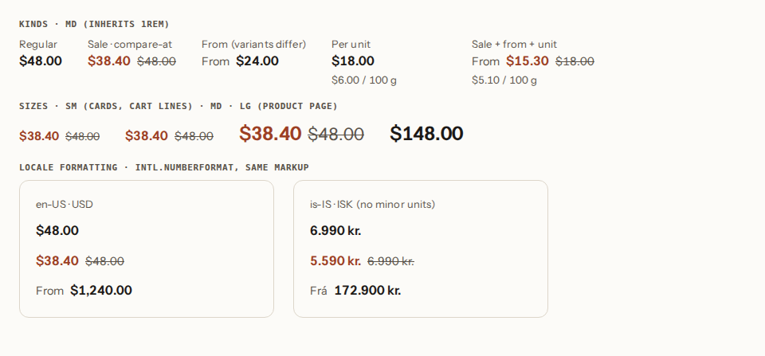

*Kinds at md, the three sizes (sale and regular), and the same markup formatted for en-US (USD) and is-IS (ISK, no minor units).*

**Anatomy**

```
[From] $38.40  $̶4̶8̶.̶0̶0̶
  1      2        3
$5.10 / 100 g
  4
```

1. From label (optional), `muted`.
2. Current price. Preceded by a visually hidden "Sale price" when on sale.
3. Compare-at price (sale only), a real `<s>` element, preceded by a visually hidden "Regular price".
4. Unit price (optional), on its own full-width second line.

The container is an inline row that wraps, with parts aligned on their text baseline.

**Properties**

| Name | Type | Default | Description |
|---|---|---|---|
| amount | integer | — | Current price in minor units (cents); for zero-decimal currencies, whole units as the currency defines. |
| compareAt | integer \| null | `null` | Regular price in minor units. Sale state turns on automatically only when `compareAt > amount`; otherwise it is ignored. |
| currency | string (ISO 4217) | store currency | E.g. `USD`, `ISK`. |
| locale | string (BCP 47) | store locale | E.g. `en-US`, `is-IS`. |
| size | `sm` \| `md` \| `lg` | `md` | See Sizes. |
| from | boolean | `false` | Shows the "From" label, for products whose variants differ in price. |
| unitPrice | `{ amount: integer, per: string }` \| null | `null` | Renders "$6.00 / 100 g" on a second line. |
| labels | `{ sale, regular, from }` | "Sale price", "Regular price", "From" | Localised label text (is-IS: "Tilboðsverð", "Fullt verð", "Frá"). |
| lang | string \| null | `null` | Set on the container when the price language differs from the page. |
| loading | boolean | `false` | Renders a text skeleton at 35% width instead of the price. |

**Events**: None.

**Sizes**

| Size | Current | Compare-at / From (0.9em) | Unit | Use |
|---|---|---|---|---|
| sm | 0.9375rem | 0.84rem | 0.8125rem | Cards, cart lines |
| md | inherits parent (1rem by default) | 0.9rem | 0.8125rem | Default |
| lg | 1.5rem | 1.35rem | 0.8125rem | Product page |

- Gap between parts: 0.5rem (`space-2`) inline, 0 between lines.
- Numerals are tabular (`font-variant-numeric: tabular-nums`).
- Weight: current 600; compare-at, from and unit 400.
- Compare-at strike-through line 1px.
- Inside commerce blocks, compare-at, from and unit snap to 0.875rem, and `sm` current to 1rem.

**Variants**

| Variant | What renders |
|---|---|
| Regular | Current only |
| Sale | Hidden "Sale price" + current in `accent` + hidden "Regular price" + struck-through compare-at |
| From | "From" + current |
| Per unit | Current + unit line ("$6.00 / 100 g"), required by law in some markets |
| Combined | From + sale + unit ("From $15.30 ~~$18.00~~ / $5.10 / 100 g") |
| Locale | Format with the platform's number formatter (`Intl.NumberFormat(locale, { style: 'currency', currency })`). en-US: `$48.00`, `$1,240.00`. is-IS: `6.990 kr.`, `172.900 kr.` (ISK has no minor units; "." groups thousands). Structure is identical. |

**States**

| State | Background | Border | Text | Icon |
|---|---|---|---|---|
| Regular | none | none | current `text` | — |
| Sale | none | none | current `accent`; compare-at `muted`, line-through | — |
| From / unit | none | none | label and unit `muted`; current `text` | — |
| Sold out | none | none | unchanged (the card badge and button say "Sold out") | — |
| Loading | text skeleton (`surface-strong`) at 35% width | — | — | — |
| On primary / accent section, not inside a card | none | none | all parts inherit `primary-contrast` / `accent-contrast`; sale colour is dropped; strike-through and hidden labels remain | — |

**Behaviour & motion**

- No motion. When a variant change updates the price, swap the text without animation; the product form's `aria-live="polite"` region announces it.
- Show the compare-at only when it is higher than the current price.

**Keyboard**

| Key | Action |
|---|---|
| — | Not interactive; no keyboard interaction. |

**Accessibility**

- Render as `<p>` or `<span>`. Keep the hidden "Sale price" / "Regular price" labels and use a real `<s>` for the compare-at; many screen readers do not announce strike-through.
- 1.4.1: sale is shown three ways: `accent` colour, strike-through and the hidden labels.
- 1.4.3: `text` 16.9:1 and `accent` 6.4:1 on `background`; `accent` 5.9:1 on `surface`, 5.3:1 on `surface-strong`; `muted` 7.4:1 on `background`, 6.8:1 on `surface`, 6.1:1 on `surface-strong`; `primary-contrast` on `primary` 15.6:1; `accent-contrast` on `accent` 6.7:1.
- Set `lang` on the container when the price language differs from the page (e.g. `lang="is"`).

**Acceptance criteria**

- [ ] Prices are formatted by the locale-aware number formatter; `$48.00`, `$1,240.00`, `6.990 kr.` and `172.900 kr.` render exactly; no ".00" is added to ISK or JPY.
- [ ] Sale state appears only when `compareAt > amount`; the current price is `accent`, the compare-at is `muted` and struck through, and a screen reader reads "Sale price $38.40 Regular price $48.00" (1.3.1, 1.4.1).
- [ ] All text pairs meet the ratios listed above (1.4.3).
- [ ] On a primary or accent section (outside a card) every part uses the contrast colour and the sale colour is not applied.
- [ ] Price changes after a variant change are announced once via the form's polite live region (4.1.3) and are not animated.
- [ ] Parts wrap onto new lines instead of overflowing at 200% zoom and in a 320px column (1.4.4, 1.4.10); text spacing overrides do not clip (1.4.12).
- [ ] Numerals are tabular so prices align in lists.

**Do / Don't**

- Do format with the store locale and currency.
- Do show the compare-at only when it is higher than the current price.
- Don't colour a regular price `accent` to make it "pop".
- Don't drop the hidden labels to save markup.
- Don't add trailing ".00" to ISK or JPY; let the formatter decide minor units.

---

### Rating

A read-only five-star rating in half steps, with optional numeric value and review count, a linked form that jumps to reviews, and a no-reviews state. For writing a review, use a Radio group of five options instead.

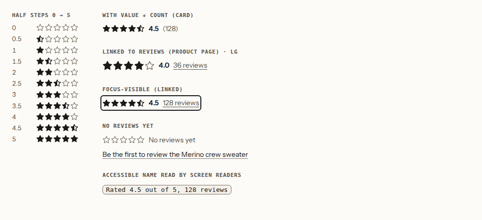

*Left: every half step. Right: card form, linked (lg) form, its focus ring, the no-reviews state and the name a screen reader hears.*

**Anatomy**

```
★ ★ ★ ★ ⯪   4.5   (128)
    1        2      3
```

1. Stars: five icons, each filled, half-filled or empty (outline).
2. Value (optional): one decimal.
3. Count (optional): "(128)" on cards; "128 reviews" underlined when linked.

The wrapper carries the accessible name.

**Properties**

| Name | Type | Default | Description |
|---|---|---|---|
| value | number (0–5) | — | Average rating. Stars round to the nearest 0.5; the value shows one decimal (4.0, 4.5). |
| count | integer | `0` | Number of reviews. `0` renders the no-reviews state. |
| showValue | boolean | `true` | Shows the numeric value. |
| showCount | boolean | `true` | Shows the count. `showValue` and `showCount` both false = stars only. |
| size | `md` \| `lg` | `md` | Star size. |
| href | string \| null | `null` | Renders the linked variant (e.g. `#reviews`). |
| emptyAction | content \| null | `null` | Optional link in the no-reviews state, e.g. "Be the first to review the Merino crew sweater". |

**Events**: None (the linked variant is a plain link).

**Sizes**

| Size | Star | Gap between stars | Text |
|---|---|---|---|
| md | 1rem | 1px | 0.875rem |
| lg | 1.25rem | 1px | 0.875rem (inherit a larger size from the parent if needed) |

Gap stars → value → count: 0.5rem (`space-2`). Value weight 600. Inside commerce blocks rating text is 0.875rem.

**Variants**

| Variant | Use |
|---|---|
| Stars only | Dense lists; still carries the full accessible name |
| Stars + value + count | Product cards: "4.5 (128)" |
| Linked | Product page: whole rating is one link to the reviews; count reads "128 reviews", underlined |
| No reviews | Five empty stars (or none) + "No reviews yet"; optional "Be the first to review …" link below |

**States**

| State | Background | Border | Text | Icon |
|---|---|---|---|---|
| Filled / half star | none | none | — | `text` |
| Empty star (and empty half) | none | none | — | `border-strong` outline |
| Value | none | none | `text` | — |
| Count / "No reviews yet" | none | none | `muted` | — |
| Linked, hover | none | none | count underline thickens from 1px to 2px | — |
| Linked, focus-visible | none | standard focus ring around the whole rating | unchanged | — |
| On primary / accent section, not in a card | none | none | inherits `primary-contrast` / `accent-contrast` | filled stars inherit; empty stars inherit at 55% opacity |

**Behaviour & motion**

- No motion. Underline change on hover is instant apart from the link's `duration-fast` colour transition.
- Linked: activating it navigates to the reviews anchor.

**Keyboard**

| Key | Action |
|---|---|
| Tab / Shift+Tab | Linked variant only: one tab stop for the whole rating. Stars are never separate tab stops. |
| Enter | Linked variant: follows the link to the reviews. |

**Accessibility**

- Static: the wrapper has `role="img"` and `aria-label="Rated 4.5 out of 5, 128 reviews"`; stars, value and count are `aria-hidden="true"`. No reviews: the text "No reviews yet" is read as normal text.
- Linked: an `<a>`; the stars are `aria-hidden`; the link text is the visible value + "128 reviews" + visually hidden ", rated 4.5 out of 5".
- 1.4.1: the value or the accessible name carries the rating, not the star colour.
- 1.4.11: empty stars use `border-strong` (4.5:1 on `background`, 4.1:1 on `surface`, 3.6:1 on `surface-strong`). On primary sections empty stars reach 5.7:1, on accent 3.1:1.
- 1.4.3: value `text` 16.9:1; count `muted` 7.4:1 on `background`.
- 2.5.8: a linked rating is at least 1.5rem tall.

**Acceptance criteria**

- [ ] Values round to the nearest half star; 4.5 shows four filled and one half star with value "4.5".
- [ ] A screen reader hears exactly "Rated 4.5 out of 5, 128 reviews" for the static rating and nothing from the individual stars (1.1.1, 4.1.2).
- [ ] The linked rating is a single tab stop, activates with Enter, shows the standard focus ring around the whole rating (2.4.7, 2.4.11, 2.4.13), and is at least 1.5rem tall (2.5.8).
- [ ] Empty stars meet 3:1 against every ground they appear on (1.4.11); text pairs meet 1.4.3.
- [ ] Stars are `text` colour, never yellow or brand colour.
- [ ] `count = 0` renders "No reviews yet" (and the optional action link), never "0.0".
- [ ] Parts wrap without overflow at 200% zoom and in a 320px column (1.4.10).

**Do / Don't**

- Do show the count; 5.0 from 1 review is not 5.0 from 300.
- Do hide the rating on cards when the store has no reviews at all.
- Don't colour stars yellow or brand colour; they stay `text` so the component works with any `primary`.
- Don't make each star a separate tab stop in a read-only rating.

---

### Avatar

A round image, initials or generic user icon that identifies a person: review authors, makers, testimonial bylines and the account menu. Use it only for people; for brands use Logo item.

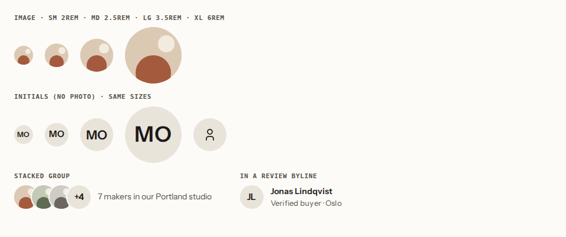

**Anatomy**

1. Circle: clips its content, `surface-strong` fill.
2. Content, one of: image (covers the circle, centred crop), initials (two letters) or user icon.
3. Group (optional): a row of up to three avatars plus a "+N" counter avatar, overlapping, each with a 2px `background` ring.

**Properties**

Avatar

| Name | Type | Default | Description |
|---|---|---|---|
| src | media \| null | `null` | Photo. Falls back to initials, then to the user icon. |
| name | string \| null | `null` | Person's name; used for initials (first letter of given and family name, uppercase) and the accessible name. |
| size | `sm` \| `md` \| `lg` \| `xl` | `md` | See Sizes. |
| decorative | boolean | `true` | `true` when the name is printed next to the avatar: the avatar is hidden from assistive technology. `false` for a standalone avatar: it gets `role="img"` and `aria-label` = name. |

Avatar group

| Name | Type | Default | Description |
|---|---|---|---|
| people | list of `{ src, name }` | — | People to show. |
| max | integer | `3` | Avatars shown before the "+N" counter. Never more than four circles in total. |
| label | string | — | Group label prefix, e.g. "Makers"; produces "Makers: Ingrid, Tomas, Maya and 4 more". |

**Events**: None.

**Sizes**

| Size | Diameter | Initials (38% of diameter) |
|---|---|---|
| sm | 2rem | 0.76rem |
| md | 2.5rem | 0.95rem |
| lg | 3.5rem | 1.33rem |
| xl | 6rem | 2.28rem |

Initials weight 600, letter-spacing 0.02em. Icon: 1.5rem in lg (scale proportionally). Group overlap: each following avatar is pulled back by 25% of the diameter; each avatar has a 2px `background` ring.

**Variants**

| Variant | Use |
|---|---|
| Image | Customer or maker photo; square upload, face centred via the focal point |
| Initials | No photo ("MO", "JL") |
| Icon | Anonymous or signed-out user |
| Group | Up to 3 avatars + "+N" |

**States**: avatars are static. When wrapped in a link or button (account menu), the wrapper owns the states.

| State | Background | Border | Text | Icon |
|---|---|---|---|---|
| Image | the image; `surface-strong` while loading | none | — | — |
| Initials / "+N" | `surface-strong` | none | `text` | — |
| Icon | `surface-strong` | none | — | `text` |
| In a group | as above | 2px ring `background` | as above | as above |
| Wrapper focus-visible | as above | standard focus ring on the wrapper | — | — |

**Behaviour & motion**: none.

**Keyboard**

| Key | Action |
|---|---|
| — | Not focusable by itself. As the account-menu trigger it sits inside a button, which takes Tab / Enter / Space. |

**Accessibility**

- 1.1.1: name printed next to it (review byline "Jonas Lindqvist · Verified buyer · Oslo") → image `alt=""` and avatar `aria-hidden="true"`. Standalone → `role="img"`, `aria-label="Maya Okafor"`, initials `aria-hidden`.
- A group gets one name: `role="group"`, `aria-label="Makers: Ingrid, Tomas, Maya and 4 more"`; the individual avatars and "+4" are hidden.
- 1.4.3: initials `text` on `surface-strong` 13.8:1.
- 2.5.8: as the account trigger, wrap it in a 2.75rem button with an accessible name ("Account").

**Acceptance criteria**

- [ ] Fallback order is image → initials → user icon; initials are two uppercase letters.
- [ ] Diameters and initials sizes match the Sizes table.
- [ ] A byline avatar is not announced; a standalone avatar is announced once by name; a group is announced once with its full label (1.1.1, 4.1.2).
- [ ] Initials meet 13.8:1 against their fill (1.4.3).
- [ ] Groups never show more than four circles; the overflow shows as "+N".
- [ ] When used as a trigger, the wrapping button is at least 2.75rem, has a name, and shows the standard focus ring (2.4.7, 2.5.8).
- [ ] Avatars do not distort at 200% zoom; the image always covers the circle without stretching.

**Do / Don't**

- Do use a square crop with the face centred.
- Do keep initials to two letters.
- Don't colour-code avatars by person; one neutral fill works with any brand.
- Don't stack more than four in a group; show the rest as "+N".

---

### Logo item

One logo in a logo cloud (stockists, press, partners), shown in a calm monochrome treatment, optionally linked. Falls back to a text wordmark when no logo file is uploaded. For people use Avatar.

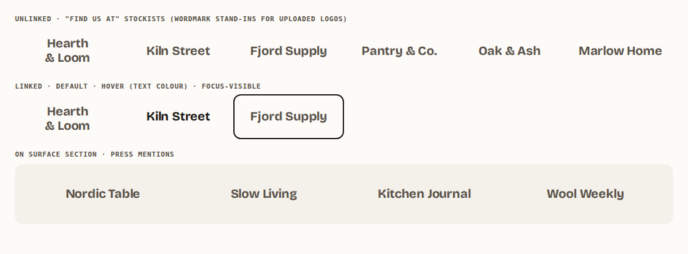

*The wordmarks stand in for uploaded logo files. Second row: default, hover (wordmark turns `text`), focus-visible.*

**Anatomy**

1. Cell: a centred grid cell (`<li>`, or an `<a>` inside the `<li>` when linked).
2. Logo image (greyscale, 75% opacity), or
3. Wordmark text (fallback).
4. Visually hidden link context (linked, off-site only), e.g. " (stockist site)".

**Properties**

| Name | Type | Default | Description |
|---|---|---|---|
| name | string | — | Company name. Used as the image `alt` and as the wordmark text. |
| logo | media \| null | `null` | SVG or transparent PNG. When empty, the wordmark renders. |
| href | string \| null | `null` | Renders the cell as a link. |
| linkContext | string \| null | `" (stockist site)"` when `href` is external | Visually hidden text appended to the link name. |

**Events**: None (linked items are plain links).

**Sizes**

| Part | Value |
|---|---|
| Cell min-height | 4rem |
| Cell padding | 0.75rem block (`space-3`), 1rem inline (`space-4`) |
| Logo image | max-height 2.5rem, max-width 9rem, width auto, contained (never cropped or stretched) |
| Wordmark | heading family, 1.25rem, weight 700, line-height 1.15, letter-spacing −0.01em, centred, balanced wrapping |
| Linked corner radius (focus ring shape) | `radius-md` |

Monochrome treatment on the image: greyscale 100% and contrast 110%, at 75% opacity.

**Variants**

| Variant | What renders |
|---|---|
| Unlinked | `<li>` containing the image (or wordmark) |
| Linked | `<li>` containing an `<a>` cell |
| Wordmark | Text instead of the image, when no logo file exists or for stockists that only have a name |

**States**

| State | Background | Border | Text (wordmark) | Image |
|---|---|---|---|---|
| Default | none | none | `muted` | greyscale, 75% opacity |
| Hover (linked) | none | none | `text` | 100% opacity |
| Focus-visible (linked) | none | standard focus ring, `radius-md` | `muted` | unchanged |
| On surface section | none | none | `muted` (6.8:1) | unchanged |

**Behaviour & motion**

- Wordmark colour and image opacity transition over `duration-fast`, `ease-out`. Instant with reduced motion.
- The cloud is always introduced by a heading that says what the logos are ("Find us at"), so hover is not the only affordance.

**Keyboard**

| Key | Action |
|---|---|
| Tab / Shift+Tab | Linked items: one tab stop each. Unlinked items are not focusable. |
| Enter | Follows the link. |

**Accessibility**

- Render the cloud as `<ul role="list">` so the count is announced.
- 1.1.1: image `alt` is the company name only ("Kiln Street"), never "logo". Off-site links add the hidden context.
- 1.4.3: wordmark `muted` 7.4:1 on `background`, 6.8:1 on `surface`. Logo images are identification; choose the partner's dark logo version so it stays legible at 75% opacity.
- 2.5.8: linked cells are at least 4rem tall.

**Acceptance criteria**

- [ ] Images keep their aspect ratio within 9rem × 2.5rem and are shown in greyscale at 75% opacity; hover on a linked item raises them to 100%.
- [ ] A missing logo renders the wordmark, never an empty cell.
- [ ] Linked items are single tab stops, activate with Enter, and show the standard focus ring with `radius-md` corners (2.1.1, 2.4.7, 2.4.11).
- [ ] Link names are the company name plus hidden context for off-site links (2.4.4, 4.1.2); images never say "logo".
- [ ] Wordmark text meets 7.4:1 on `background` and 6.8:1 on `surface` (1.4.3).
- [ ] Cells are at least 4rem tall (2.5.8).
- [ ] Long wordmarks wrap (balanced) instead of overflowing at 200% zoom and in a 320px column (1.4.10).
- [ ] Hover transitions are instant with reduced motion.

**Do / Don't**

- Do keep logos similar in visual weight; trim transparent padding before upload.
- Do use the wordmark fallback rather than an empty cell.
- Don't show full-colour logos in the default treatment; they fight the products.
- Don't use logos as the only proof of a claim; pair the cloud with a heading.

---

### Product card

The product tile used in every grid, carousel and search result: image, badges, optional vendor, title, price, rating, colour dots and an optional quick-add button. The whole card links to the product. For editorial items use Content card.

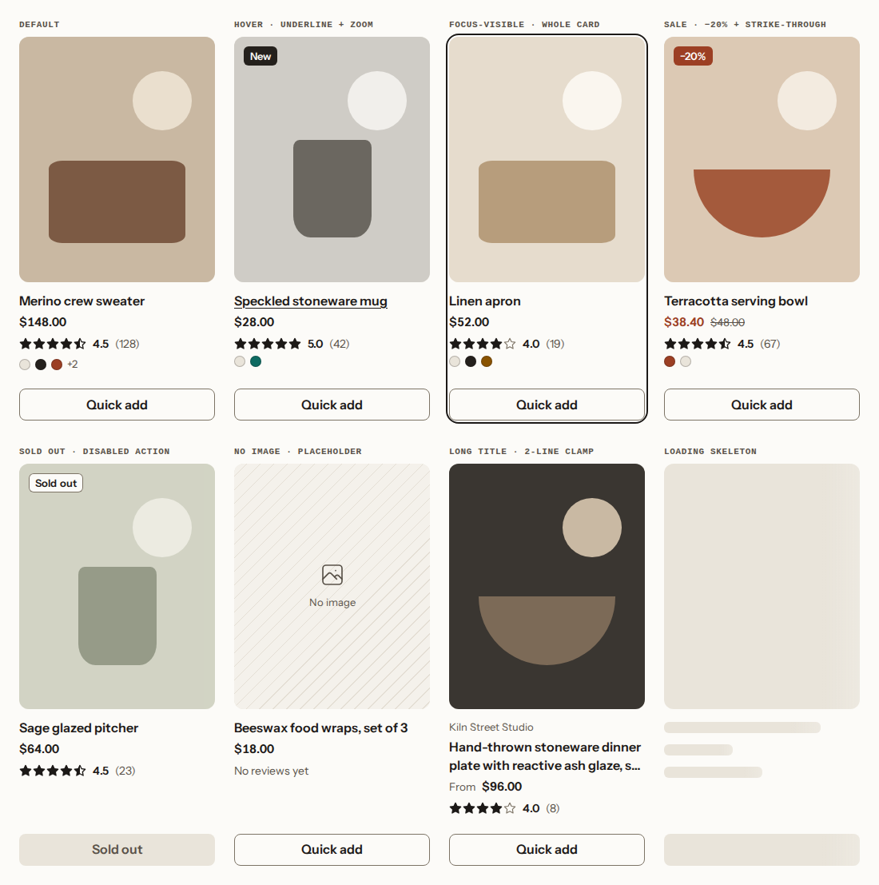

*Row 1: default, hover, focus-visible, sale. Row 2: sold out (disabled action), no-image placeholder, long title clamped to two lines, loading.*

**Anatomy**

```
┌─────────────────────────┐
│[−20%][New]         (2)  │
│        image       (1)  │
└─────────────────────────┘
 Kiln Street Studio   (3)
 Merino crew sweater  (4)
 $38.40 $̶4̶8̶.̶0̶0̶        (5)
 ★★★★⯪ 4.5 (128)      (6)
 ● ● ● +2             (7)
┌─────────────────────────┐
│        Quick add   (8)  │
└─────────────────────────┘
```

1. Media: Image, 4:5, `radius-lg`; placeholder when there is no image.
2. Badge stack (optional), absolutely placed top-left over the media: Badge `sale` / `new` / `outline` "Sold out".
3. Vendor (optional).
4. Title: heading (h3 under a block h2) containing the stretched link; two-line clamp.
5. Price, size `sm`.
6. Rating (optional), stars + value + count.
7. Colour dots (optional): up to three dots + "+N", with hidden "Available in 5 colours".
8. Quick add (optional): Button outline md, full width, pinned to the bottom of the card.

Body (3–7) grows to fill the card so every card in a row aligns its quick-add button.

**Properties**

| Name | Type | Default | Description |
|---|---|---|---|
| product | object | — | `title`, `url`, `vendor`, `featuredImage` (media + alt), `price` (Price inputs: `amount`, `compareAt`, `from`), `rating` (`value`, `count`), `colours` (list of `{ name, value }`), `availableForSale` (boolean), `tags` (includes `new`). |
| showVendor | boolean | `false` | Shows the vendor line. |
| showRating | boolean | `true` | Shows the Rating. Hide when the store has no reviews at all. |
| showSwatches | boolean | `true` | Shows the colour dots. |
| quickAdd | boolean | `true` | Shows the quick-add button. |
| ratio | `4x5` \| `1x1` \| `3x4` | `4x5` | Media aspect ratio; one ratio per grid. |
| headingLevel | 2–6 | `3` | Title heading level; follows the block. |
| loading | boolean | `false` | Renders the loading skeleton. |

Derived automatically: Sale badge and sale price when `compareAt > amount` (badge reads the rounded percentage, "−20%"); New badge when tagged `new`; sold-out state when `availableForSale` is false; placeholder when `featuredImage` is empty.

**Colour dots**: each dot's colour comes from the product's colour option data (the `value` of each colour), never from theme tokens.

**Events**

- `quickAdd`: fires with the product when the quick-add button is activated. The result is announced by the cart Toast (`role="status"`).

**Sizes**

| Part | Value |
|---|---|
| Card | fills its grid column; minimum 14rem recommended |
| Media | 4:5 default, `radius-lg` |
| Badge stack | top and left 0.75rem, gap 0.25rem, wraps |
| Gap media → body → button | 0.75rem (`space-3`) |
| Body gap | 0.25rem (0.375rem inside commerce blocks) |
| Vendor | 0.8125rem, `muted` |
| Title | 1rem, line-height 1.4, weight 600, clamp 2 lines |
| Price | `sm`: 0.9375rem current |
| Rating | stars 1rem, text 0.875rem |
| Colour dots | 0.875rem circles, gap 0.375rem, max 3 + "+N" (0.8125rem, `muted`) |
| Quick add | Button md: 2.5rem tall, 2.75rem below 48rem block width; full width; extra 0.5rem (`space-2`) above |

The card uses three text sizes: 1rem title, 0.9375rem price, 0.875 / 0.8125rem meta. Inside commerce blocks the meta sizes snap to 0.875rem and the title and price to 1rem.

**Variants**

| Variant | What changes |
|---|---|
| Default | All parts |
| Sale | Badge sale "−20%" + Price sale with compare-at |
| New | Badge new |
| Sold out | Image at 60% opacity; Badge outline "Sold out"; quick add disabled and reads "Sold out" |
| No image | Image placeholder (photo icon + "No image"), same ratio |
| From price | Price shows "From" when variants differ |
| Long title | Clamped at two lines with an ellipsis; full title stays in the link name |
| Minimal | Title + price only (rating, dots, quick add off) |
| Loading | Skeleton media (same ratio, `radius-lg`), three text lines at 80% / 35% / 50%, and a 2.5rem button bar (`radius-md`); the card is `role="group"`, `aria-busy="true"`, `aria-label="Loading product"` |

**States**

| State | Background | Border | Text | Icon / image |
|---|---|---|---|---|
| Default | `background` | none | title `text`, vendor and count `muted`, price `text` | stars `text` |
| Hover (pointer anywhere on card) | unchanged, no shadow | none | title underlined 1px | image scales to 1.03 × its zoom |
| Focus-visible (title link) | unchanged | standard focus ring around the whole card | unchanged | — |
| Quick add hover | `surface` | 1px `text` | `text` | — |
| Quick add focus-visible | `background` | 1px `border-strong` + standard focus ring on the button | `text` | — |
| Quick add pressed | moves down 1px | unchanged | unchanged | — |
| Sale | unchanged | none | current price `accent`, compare-at `muted` struck through | badge `accent` / `accent-contrast` |
| Sold out | image at 60% opacity | badge inset 1px `border-strong` | quick add `muted` on `surface-strong`, no border | — |
| No image | placeholder `surface` with diagonal `border` hatching | none | "No image" `muted` | photo icon `muted` |
| Loading | skeletons `surface-strong` with shimmer | none | — | — |

**Behaviour & motion**

- Image zoom on hover: transform over `duration-base` (200ms), `ease-out`, scaling from the image's focal point. Removed with reduced motion (instant).
- Title underline appears instantly.
- Skeleton shimmer 1.4s; removed with reduced motion.
- Quick add sits above the stretched link, so clicking it never navigates.
- Hover is decoration only; every action is available without hover.

**Keyboard**

| Key | Action |
|---|---|
| Tab / Shift+Tab | Two tab stops at most: the title link (the product), then quick add. Badges, rating and dots are not focusable. |
| Enter | On the title link: opens the product page. On quick add: adds to cart. |
| Space | On quick add: adds to cart. |

**Accessibility**

- Root `<article>`; title is a heading at `headingLevel` containing the link.
- 2.4.7: the ring is drawn around the whole card while the link has keyboard focus, because the link's own outline would only wrap the title.
- 1.1.1: the image `alt` describes product and colour ("Oatmeal merino crew sweater, folded"); `alt=""` when it would only repeat the title. The no-image placeholder is decorative (the title sits next to it).
- 1.4.1: sale = badge word or percentage + strike-through + hidden labels; sold out = the words "Sold out" on badge and button, not only the faded image.
- Colour dots are `aria-hidden`, summarised by hidden "Available in 5 colours".
- Quick add names the product: "Quick add" + hidden " Merino crew sweater". Sold out: native `disabled` button reading "Sold out".
- 1.4.3: title `text` 16.9:1, vendor / count `muted` 7.4:1, sale price `accent` 6.4:1 on `background`; badge pairs as in Badge; quick add label `text` on `background` 16.9:1.
- 1.4.11: quick-add boundary `border-strong` 4.5:1 on `background`. Colour dots have a 1px inset hairline (`text` at 25% strength) so pale colours stay visible; they are supplementary (the hidden text carries the information).
- 2.5.8: quick add at least 2.5rem (2.75rem below 48rem block width); the whole card is the link target.

**Acceptance criteria**

- [ ] Card tab order is title link then quick add; nothing else in the card receives focus (2.1.1, 2.4.3).
- [ ] Keyboard focus on the title link draws the standard focus ring around the whole card with `radius-lg` corners; the link shows no separate ring (2.4.7, 2.4.11, 2.4.13).
- [ ] Clicking anywhere on the card except quick add opens the product; clicking quick add never navigates.
- [ ] Quick add is announced as "Quick add Merino crew sweater", fires `quickAdd`, and the outcome is announced by a status toast (4.1.2, 4.1.3).
- [ ] Sold-out cards show "Sold out" on the badge and a disabled "Sold out" button; the image is at 60% opacity (1.4.1).
- [ ] Sale cards show the percentage badge, `accent` price and struck compare-at with hidden labels (1.4.1).
- [ ] All text and control-boundary pairs meet the ratios above (1.4.3, 1.4.11).
- [ ] Quick add is at least 2.5rem tall, 2.75rem when the block is narrower than 48rem (2.5.8).
- [ ] Long titles clamp to two lines; the link's accessible name contains the full title.
- [ ] Cards in a row keep identical structure so titles, prices and buttons align; the button is pinned to the card bottom.
- [ ] Missing image renders the hatched placeholder at the same ratio; the grid does not shift.
- [ ] Hover zoom and shimmer are absent with reduced motion.
- [ ] At 200% zoom and in a 320px column the card stays single-column with no horizontal scroll (1.4.10).
- [ ] Colour dots take their colours from product data and are hidden from assistive technology, with the hidden count read instead.

**Do / Don't**

- Do keep every card in a row the same structure so titles and buttons align.
- Do let long titles clamp at two lines.
- Don't nest other links inside the card; quick add is the only other control.
- Don't hide quick add until hover; show it or leave it out.
- Don't put text directly on the product image.

---

### Content card

A card for journal articles, recipes, guides and collections: optional image, eyebrow, title, excerpt and meta, with the whole card as one link. For products use Product card; for short value propositions use Feature card.

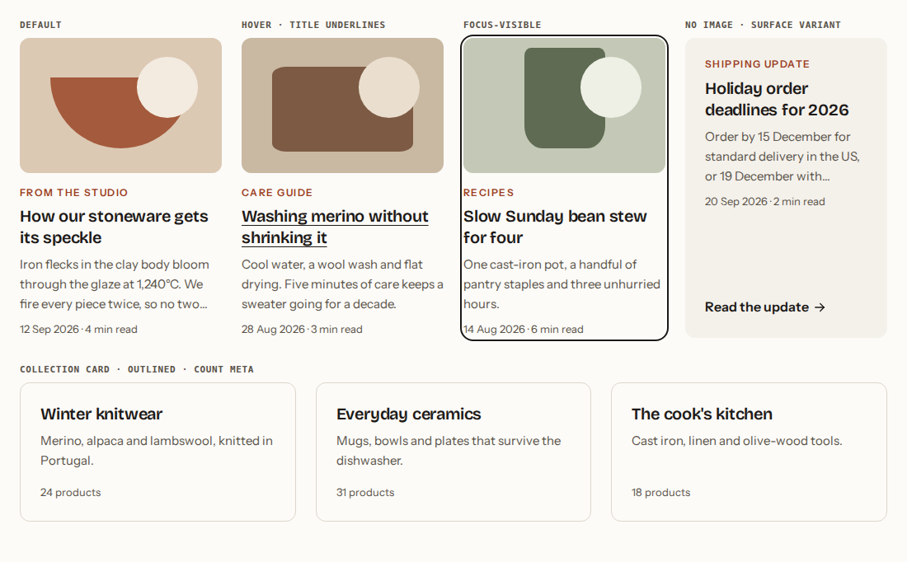

**Anatomy**

1. Media (optional): Image, 3:2 default, `radius-lg`.
2. Body (grows to fill):
   1. Eyebrow (optional): overline text in `accent`.
   2. Title: heading containing the stretched link.
   3. Excerpt (optional): `muted`, clamped to three lines.
   4. Meta (optional): date as `<time datetime>` + " · 4 min read", `muted`.
3. Link cue (surface variant, optional): "Read the update →", pinned to the bottom, hidden from assistive technology.
4. Count meta (outlined collection variant): "24 products", pinned to the bottom.

**Properties**

| Name | Type | Default | Description |
|---|---|---|---|
| title | string | — | Card title; also the link text. |
| href | string | — | Destination. |
| image | media \| null | `null` | With `alt`; usually `alt=""` because the image repeats the title. |
| ratio | `3x2` \| `4x3` \| `16x9` | `3x2` | Media ratio. |
| eyebrow | string \| null | `null` | Sentence case; displayed uppercase. |
| excerpt | string \| null | `null` | About 160 characters maximum. |
| date | ISO date \| null | `null` | Rendered as "12 Sep 2026" in a `<time datetime>`. |
| meta | string \| null | `null` | Extra meta after the date ("4 min read") or the count ("24 products"). |
| variant | `plain` \| `surface` \| `outlined` | `plain` | `plain` with no image becomes `surface` automatically. |
| cue | string \| null | `null` | Link cue text for the surface variant ("Read the update"). |
| headingLevel | 2–6 | `3` | Follows the block. |
| loading | boolean | `false` | Skeleton media + three text lines. |

**Events**: None (the card is a plain link).

**Sizes**

| Part | Value |
|---|---|
| Media | 3:2 default (4:3 and 16:9 allowed), `radius-lg` |
| Gap media → body | 1rem (`space-4`) |
| Body gap | 0.5rem (`space-2`) |
| Eyebrow | 0.75rem, weight 600, letter-spacing 0.12em, line-height 1.3, uppercase via styling |
| Title | heading family, 1.25rem, line-height 1.3, weight 600, letter-spacing −0.01em |
| Excerpt | 0.9375rem, clamp 3 lines |
| Meta | 0.8125rem |
| Link cue | standalone link style: weight 600, arrow icon 1.125rem, gap 0.25rem, min-height 1.5rem |
| Surface / outlined padding | 1.5rem (`space-6`) |

**Variants**

| Variant | What changes |
|---|---|
| Image (plain, default) | Media on top, no padding, `background` fill |
| No image · surface | `surface` fill, 1.5rem padding; optional link cue pinned to the bottom |
| Outlined (collection) | 1px `border`, 1.5rem padding; title + excerpt, count meta pinned to the bottom |

**States**

| State | Background | Border | Text | Icon |
|---|---|---|---|---|
| Default | `background` (surface variant: `surface`) | none (outlined: 1px `border`) | title `text`, eyebrow `accent`, excerpt and meta `muted` | — |
| Hover | unchanged | unchanged | title underlined 1px | cue arrow moves 2px right (`duration-fast`) |
| Focus-visible | unchanged | standard focus ring around the whole card | unchanged | — |
| Loading | skeleton media + 3 text lines (`surface-strong`, shimmer) | — | — | — |

**Behaviour & motion**: none beyond the instant title underline; no image zoom.

**Keyboard**

| Key | Action |
|---|---|
| Tab / Shift+Tab | One tab stop: the title link. |
| Enter | Opens the article or collection. |

**Accessibility**

- Root `<article>`; heading at `headingLevel` wraps the stretched link. The cue is `aria-hidden="true"` so the destination is not read twice. No separate "Read more" link.
- 2.4.7: ring drawn on the card while the link has keyboard focus.
- 1.1.1: article images usually repeat the title → `alt=""` unless the image adds information.
- 1.4.3: eyebrow `accent` 6.4:1 on `background`, 5.9:1 on `surface`; excerpt and meta `muted` 7.4:1 on `background`, 6.8:1 on `surface`; title `text` 16.9:1 / 15.5:1.
- Dates use `<time datetime="2026-09-12">`.

**Acceptance criteria**

- [ ] Each card is exactly one tab stop; Enter opens it; the whole card is clickable (2.1.1).
- [ ] Keyboard focus shows the standard focus ring around the whole card (2.4.7, 2.4.11, 2.4.13).
- [ ] The link cue and eyebrow are not duplicated in the link's accessible name beyond the title (2.4.4).
- [ ] Text pairs meet the ratios above on both `background` and `surface` (1.4.3); the outlined border is decorative and the card's affordance does not depend on it.
- [ ] Excerpts clamp at three lines; titles wrap fully.
- [ ] A plain card with no image renders as the surface variant.
- [ ] At 200% zoom and in a 320px column the card reflows without horizontal scroll (1.4.10); text spacing overrides do not clip the title (1.4.12).
- [ ] Dates are machine-readable (`<time datetime>`).

**Do / Don't**

- Do write eyebrows in sentence case; styling uppercases them.
- Do keep excerpts under about 160 characters.
- Don't add a separate "Read more" link; the card is the link.
- Don't mix image and no-image cards in one row unless every card is the surface variant.

---

### Feature card

A short value proposition: icon tile, title and one or two sentences, used in rows of three or four (shipping, returns, guarantees). Optionally linked. For articles use Content card.

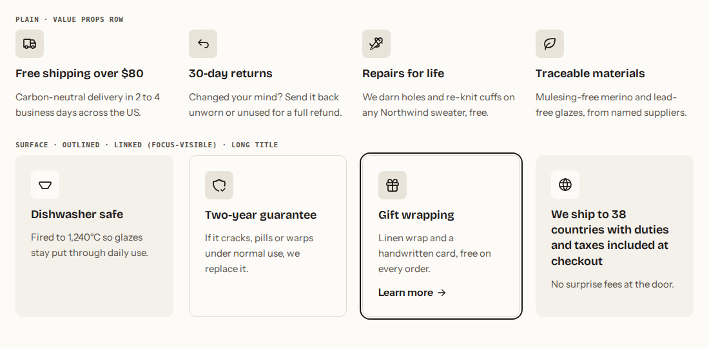

**Anatomy**

1. Icon tile: rounded square with a decorative icon.
2. Title: heading (with the stretched link when linked).
3. Body: `muted`.
4. Link cue (linked only): "Learn more →", hidden from assistive technology.

**Properties**

| Name | Type | Default | Description |
|---|---|---|---|
| icon | string | — | Icon name (e.g. `truck`, `arrow-back-up`, `needle-thread`, `leaf`). Decorative. |
| title | string | — | Concrete fact ("Free shipping over $80"). |
| body | string | — | One or two sentences. |
| href | string \| null | `null` | Makes the card linked. |
| cue | string | "Learn more" | Link cue text (linked only). |
| variant | `plain` \| `surface` \| `outlined` | `plain` | Same variant for every card in a row. |
| headingLevel | 2–6 | `3` | Follows the block. |

**Events**: None.

**Sizes**

| Part | Value |
|---|---|
| Icon tile | 2.75rem square, `radius-md`; icon 1.5rem |
| Gap between parts | 0.75rem (`space-3`) |
| Title | heading family, 1.125rem, line-height 1.35, weight 600 |
| Body | 0.9375rem, `muted` |
| Surface / outlined padding | 1.5rem (`space-6`) |
| Link cue | standalone link style: weight 600, arrow 1.125rem, min-height 1.5rem |

**Variants**

| Variant | What changes |
|---|---|
| Plain | No padding, border or visible container; for value-prop rows |
| Surface | `surface` fill, 1.5rem padding; the icon tile switches to a `background` fill |
| Outlined | 1px `border`, 1.5rem padding |
| Linked | Title wraps a stretched link; "Learn more →" cue below the body |

**States**

| State | Background | Border | Text | Icon |
|---|---|---|---|---|
| Default | card: `background` (surface: `surface`) | none (outlined: 1px `border`) | title `text`, body `muted` | `text` on `surface-strong` tile (surface variant: `background` tile) |
| Hover (linked) | unchanged | unchanged | title underlined 1px; cue arrow moves 2px right | unchanged |
| Focus-visible (linked) | unchanged | standard focus ring around the whole card | unchanged | unchanged |
| Inside a primary / accent section | keeps its own fill and normal colours (see shared rules) | unchanged | unchanged | unchanged |

**Behaviour & motion**: none beyond the instant title underline and the `duration-fast` cue-arrow nudge.

**Keyboard**

| Key | Action |
|---|---|
| Tab / Shift+Tab | Linked: one tab stop (the title link). Unlinked: none. |
| Enter | Linked: follows the link. |

**Accessibility**

- Icons are `aria-hidden="true"`; the title carries the meaning. Cue is `aria-hidden`.
- Heading level follows the block; with no block heading, render the row as `<ul role="list">` of cards with h3 titles.
- 1.4.3: title `text` 16.9:1 / 15.5:1; body `muted` 7.4:1 on `background`, 6.8:1 on `surface`; icon `text` on `surface-strong` 13.8:1.
- A title twice as long wraps; the tile never shrinks.

**Acceptance criteria**

- [ ] Unlinked cards have no tab stop; linked cards have exactly one and show the standard focus ring around the card (2.1.1, 2.4.7, 2.4.11).
- [ ] Icons and cues are hidden from assistive technology; the link name is the title (1.1.1, 2.4.4).
- [ ] Text and icon pairs meet the ratios above (1.4.3, 1.4.11).
- [ ] The icon tile stays 2.75rem square when the title wraps to four lines.
- [ ] All cards in a row use the same variant; surface cards use a `background` icon tile.
- [ ] At 200% zoom and in a 320px column the card reflows without horizontal scroll (1.4.10).

**Do / Don't**

- Do keep body copy to one or two sentences with a concrete fact ("over $80", "30 days").
- Do use the same variant for every card in a row.
- Don't colour icon tiles per card; one neutral treatment works with any brand.
- Don't add filler stats ("10,000+ happy customers") as feature cards.

---

### Container and section

The two layout primitives every block is built from. **Section** sets the background and vertical spacing and is the block's landmark; **Container** sets the maximum content width and the side gutters. Every block root is a width container, so blocks respond to **their own width**, not the viewport, and work in narrow page-builder columns.

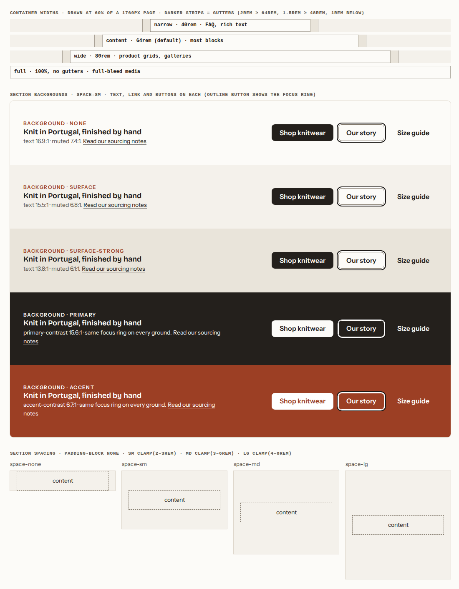

*Top: container widths drawn at 60% of a 1760px page (darker strips are gutters). Middle: each background at spacing sm; the outline button shows the focus ring. The ring is identical on every ground; on dark fills its white `focus-inner` infill is what shows. Bottom: spacing none, sm, md, lg.*

**Anatomy**

```
block root            width container: every block breakpoint measures this element's width
└─ section            background + padding-block; aria-labelledby → block heading
   └─ container       max-width + padding-inline (gutters), centred
      └─ block content
```

**Properties**

Section (every block exposes `background` and `spacing` as block settings and passes them here)

| Name | Type | Default | Description |
|---|---|---|---|
| background | `none` \| `surface` \| `surface-strong` \| `primary` \| `accent` | `none` | Section ground. |
| spacing | `none` \| `sm` \| `md` \| `lg` | `md` | Vertical padding. |
| labelledBy | string \| null | block heading id | Id of the visible block heading. |
| label | string \| null | `null` | Used when the block has no visible heading. With neither, render a plain `<div>` instead of `<section>`. |

Container

| Name | Type | Default | Description |
|---|---|---|---|
| width | `narrow` \| `content` \| `wide` \| `full` | `content` | Maximum content width. |

**Events**: None.

**Sizes**

Container widths (the gutter is added outside the maximum, so content never exceeds the token width):

| Width | Max content width | Use |
|---|---|---|
| narrow | 40rem (`container-narrow`) | FAQ, rich text, newsletter, quote |
| content | 64rem (`container-content`) | Most blocks, product detail, cart |
| wide | 80rem (`container-wide`) | Product grids, galleries, collection pages, header, footer |
| full | 100%, no gutters | Full-bleed media, image-background hero, gallery carousel |

Gutters (side padding of the container, chosen by **block width**):

| Block width | Gutter |
|---|---|
| below 48rem | 1rem (`gutter-mobile`) |
| 48rem to below 64rem | 1.5rem (`gutter-tablet`) |
| from 64rem | 2rem (`gutter-desktop`) |

Breakpoints used by every block, always measured on the block width: mobile below 48rem, tablet from 48rem, desktop from 64rem, wide from 80rem.

Section spacing (top and bottom padding; fluid, using the token values as written):

| Spacing | Padding-block |
|---|---|
| none | 0 |
| sm | `section-sm`: clamp(2rem, 1.5rem + 2vw, 3rem) |
| md (default) | `section-md`: clamp(3rem, 2rem + 4vw, 6rem) |
| lg | `section-lg`: clamp(4rem, 2.5rem + 6vw, 8rem) |

Other shared layout values:

| Part | Value |
|---|---|
| Block header (heading group + optional action) | one row, wrapping, bottom-aligned, space-between; gap 1rem between rows, 2rem between columns; heading group max-width 40rem; 2rem (`space-8`) below the header. Centred variant: stacked and centred. |
| Stack rhythm | 1.25rem (`space-5`) between stacked elements; small stack 0.5rem |
| Headings below 48rem block width | display 2.5rem, h1 2.125rem, h2 1.625rem, h3 1.25rem (from 3.5 / 2.75 / 2 / 1.5rem) |
| Buttons md below 48rem block width | 2.75rem tall (from 2.5rem) |

**Variants (backgrounds)**

| Background | Section fill | Text | Notes |
|---|---|---|---|
| none | `background` | `text` / `muted` | Default ground |
| surface | `surface` | `text` / `muted` | Quiet band; alternate with none between neighbouring blocks |
| surface-strong | `surface-strong` | `text` / `muted` | Footer, emphasis band |
| primary | `primary` | `primary-contrast` everywhere | See colour switching below |
| accent | `accent` | `accent-contrast` everywhere | See colour switching below |

**Colour switching on primary and accent sections**

| Child | On primary | On accent |
|---|---|---|
| Body text | `primary-contrast` | `accent-contrast` |
| Headings (display to h4), `muted` text, eyebrows | `primary-contrast` | `accent-contrast` |
| Links, ghost buttons, link buttons | inherit the contrast colour (underlines follow it) | inherit the contrast colour |
| Primary button | inverted: fill `primary-contrast`, label `primary` (15.6:1) | inverted: fill `accent-contrast`, label `accent` (6.7:1) |
| Secondary button | unchanged: fill `accent`, label `accent-contrast` | becomes an outline: transparent fill, 1px border and label in the contrast colour, so it does not vanish into the ground |
| Outline button | transparent fill, 1px border and label in the contrast colour; hover adds a 12% tint of the contrast colour | same |
| Price, Rating (outside cards) | inherit `primary-contrast`; sale colour dropped; empty stars at 55% opacity | inherit `accent-contrast`; same rules |
| Cards | keep their own `background` fill and normal colours | same |
| Focus ring | unchanged (its `focus-inner` infill carries the contrast, 16.2:1 against `primary`) | unchanged (infill 6.7:1 against `accent`) |

**States**: sections are not interactive; this is what children get on each ground.

| Ground | Background | Focus ring contrast | Text | Icon |
|---|---|---|---|---|
| none | `background` | `focus` 16.9:1 | `text` 16.9:1, `muted` 7.4:1 | `text` |
| surface | `surface` | `focus` 15.5:1 | `text` 15.5:1, `muted` 6.8:1 | `text` |
| surface-strong | `surface-strong` | `focus` 13.8:1 | `text` 13.8:1, `muted` 6.1:1 | `text` |
| primary | `primary` | `focus-inner` infill 16.2:1 | `primary-contrast` 15.6:1 | `primary-contrast` |
| accent | `accent` | `focus-inner` infill 6.7:1 | `accent-contrast` 6.7:1 | `accent-contrast` |

**Behaviour & motion**

- None. Sections never animate in on scroll.
- Sections are never nested inside another section. Containers may nest only to put full-bleed media inside a narrower block.
- Text over images inside any section sits on the `overlay` scrim or a solid panel, never on the raw photo.

**Keyboard**

| Key | Action |
|---|---|
| — | Not interactive. Children keep their own keyboard behaviour. |

**Accessibility**

- Each block root is a `<section aria-labelledby="…">` pointing at the block heading; with no visible heading use `aria-label`, or a plain `<div>` when the block is not a meaningful region.
- 1.4.3: only put text on the grounds above; every pair passes (neutral grounds 13.8:1 or better for `text`, `primary-contrast` 15.6:1, `accent-contrast` 6.7:1). A customer who changes `primary` must keep `primary-contrast` at 4.5:1 or more against it.
- 2.4.7 / 2.4.11 / 2.4.13: the focus ring is identical everywhere; one of its two layers (`focus` 2px ring or `focus-inner` 2px infill, 17.5:1 against each other) always contrasts with the ground, so sections declare no focus overrides.
- 1.4.10: gutters and width-based breakpoints keep content inside a 320px column with no horizontal scroll.

**Acceptance criteria**

- [ ] Container content never exceeds 40 / 64 / 80rem for narrow / content / wide; full has no maximum and no gutters.
- [ ] Gutters are 1rem, 1.5rem and 2rem when the **block** is below 48rem, 48–64rem, and from 64rem wide, including when the block sits in a narrow column on a wide viewport.
- [ ] All block breakpoints (heading sizes, button heights, grid changes) respond to the block width, not the viewport.
- [ ] Spacing none / sm / md / lg apply exactly the padding values above; md is the default.
- [ ] On primary and accent grounds, every heading, muted text, eyebrow, link, ghost and link button uses the contrast colour; the primary button is inverted; the outline button (and the secondary button on accent) is an outline in the contrast colour; text pairs meet the ratios above (1.4.3).
- [ ] Outline and inverted button boundaries on primary/accent meet 3:1 against the ground (1.4.11).
- [ ] The focus ring is visible on every ground without per-section overrides (2.4.7, 2.4.11, 2.4.13) and uses Highlight in forced-colours mode.
- [ ] Cards inside primary/accent sections keep `background` fill and normal colours.
- [ ] Each block is a `<section>` named by its heading, or has `aria-label`, or is a `<div>` (1.3.1, 4.1.2).
- [ ] At 320px width and at 200% zoom no block scrolls horizontally (1.4.10); text spacing overrides do not clip content (1.4.12).
- [ ] Sections never animate on scroll.

**Do / Don't**

- Do alternate none and surface between neighbouring blocks instead of adding divider lines.
- Do use primary or accent for at most one band per page (newsletter, promo).
- Don't put images with overlaid text on primary/accent without the `overlay` scrim.
- Don't nest a section inside another section; nest containers only for full-bleed media.

---

### Image

The media frame for every CMS image and video: fixed aspect presets, focal-point and zoom framing, optional caption, a live placeholder when no image is set and an editor-only prompt. The frame always crops; it never stretches.

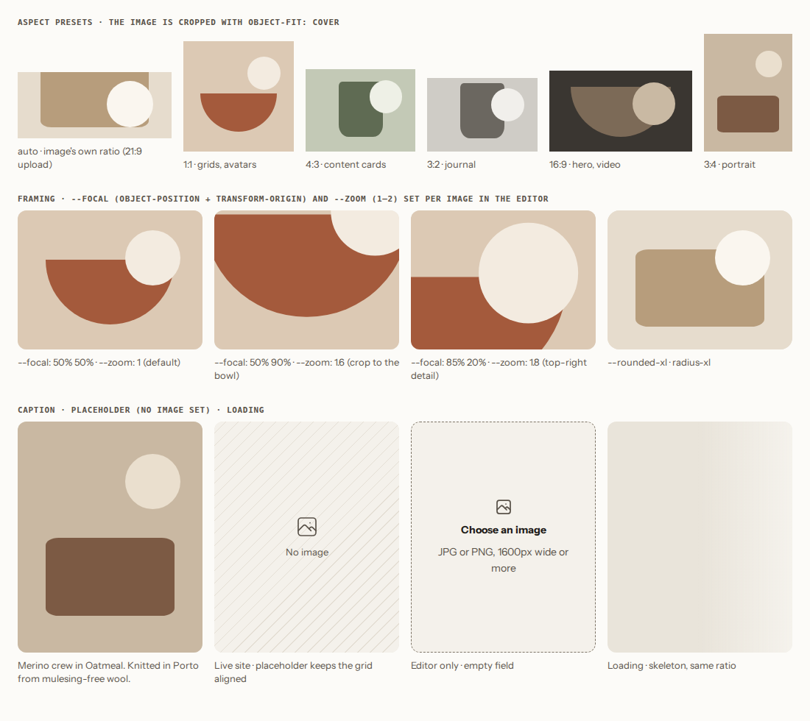

*Row 1: aspect presets (auto shows a 21:9 upload at its own ratio). Row 2: framing with focal point and zoom. Row 3: caption, live "No image" placeholder, editor-only "Choose an image" prompt, loading skeleton.*

**Anatomy**

1. Figure (`<figure>` when captioned).
2. Frame: fixed aspect ratio, clips its content, `surface-strong` fill behind the image.
3. Content: ``, `<video>`, the live placeholder (photo icon + "No image"), or, in the editor only, the empty prompt.
4. Caption (optional): `<figcaption>`, `muted`.

**Properties**

| Name | Type | Default | Description |
|---|---|---|---|
| media | media \| null | `null` | Image or video. |
| alt | string | — | Required in the editor unless `decorative` is on. Describes what matters for shopping. |
| decorative | boolean | `false` | Outputs `alt=""`. |
| ratio | `auto` \| `1x1` \| `4x3` \| `3x2` \| `16x9` \| `3x4` \| `4x5` | `4x3` (product cards `4x5`) | Frame ratio. `auto` uses the image's own ratio, or 4:3 when empty. |
| focal | `{ x: 0–100, y: 0–100 }` (percent) | `{ x: 50, y: 50 }` | Crop anchor: sets the image's object position and the zoom origin. Per-image field in the editor. |
| zoom | number (1–2) | `1` | Static crop scale around the focal point. |
| rounded | `none` \| `lg` \| `xl` | `none` | Corner radius: `radius-lg` or `radius-xl`. |
| caption | string \| null | `null` | Renders a `<figcaption>`. |
| sizes | string | per block | Responsive `sizes` for the `srcset`. |
| priority | boolean | `false` | First hero image: loads eagerly with high fetch priority. Otherwise lazy. |
| loading | boolean | `false` | Renders a skeleton at the same ratio. |

**Events**: None.

**Sizes**

| Preset | Ratio | Typical use |
|---|---|---|
| auto | the image's own (4:3 when empty) | Rich text, editorial |
| 1:1 | 1 | Grids, category tiles |
| 4:3 | 4 / 3 | Content cards, image + text |
| 3:2 | 3 / 2 | Journal, content card default |
| 16:9 | 16 / 9 | Hero, video |
| 3:4 | 3 / 4 | Portrait, lookbook |
| 4:5 | 4 / 5 | Product cards (default) |

| Part | Value |
|---|---|
| Radius | none by default; `lg` = `radius-lg` (0.75rem); `xl` = `radius-xl` (1rem) |
| Caption | 0.8125rem, line-height 1.4, `muted`, 0.5rem (`space-2`) above |
| Placeholder | icon 2rem (stroke 1.25) above "No image" at 0.8125rem, gap 0.5rem, centred |
| Placeholder hatching | 1px diagonal lines (135°) every 0.75rem in `border` at 70% strength over `surface` |
| Editor prompt | see Empty and error states (editor hint): 1.5px dashed `border-strong`, `surface` fill, fills the frame, inherits its radius |

**Variants**

| Variant | What changes |
|---|---|
| Framing | Focal point and zoom (1–2) chosen per image so a crop survives every ratio, e.g. focal 50% 90% + zoom 1.6 crops to the bowl; 85% 20% + 1.8 shows a top-right detail |
| Caption | Caption under the frame |
| Placeholder (live) | Photo icon + "No image" on hatched `surface`; keeps the grid aligned |
| Empty prompt (editor only) | "Choose an image" + "JPG or PNG, 1600px wide or more"; never rendered on the live site |
| Loading | Skeleton with the same ratio |
| Video | Same frame; no autoplay with sound; captions and a pause control |

**States**

| State | Background | Border | Text | Icon |
|---|---|---|---|---|
| Image loading | `surface-strong` fill behind the image | none | — | — |
| Loaded | the image | none | caption `muted` | — |
| No image (live) | `surface` + hatching in `border` | none | "No image" `muted` | `muted` |
| Empty (editor) | `surface` | 1.5px dashed `border-strong` | `muted`; action label `text` | `muted` |
| Skeleton | `surface-strong` + shimmer | none | — | — |

**Behaviour & motion**

- The image covers the frame and is cropped, positioned at the focal point and scaled by the zoom around the focal point.
- No motion on the frame itself. Parents may scale the image on hover (Product card: 1.03, `duration-base`); zoom is a static crop, never animated.
- Output a responsive `` with `srcset`, `sizes`, `loading="lazy"`, `decoding="async"`; the first hero image uses eager loading and `fetchpriority="high"`.
- Reserve space with `width` / `height` attributes or the ratio so nothing shifts while loading.

**Keyboard**

| Key | Action |
|---|---|
| — | The frame is not interactive. A video exposes its native controls (play/pause, captions) to the keyboard. |

**Accessibility**

- 1.1.1: `alt` is required in the editor, with an explicit decorative toggle. Describe the product ("Oatmeal merino crew sweater, folded"), never "image of". Don't leave `alt` empty when the image is the only product identifier.
- The live placeholder is decorative when a title sits next to it; otherwise it gets `role="img"` and `aria-label="No image available"`.
- 1.4.3: caption and placeholder text `muted` 7.4:1 on `background`, 6.8:1 on `surface`. Text over an image always sits on the `overlay` scrim (at 0.7, `primary-contrast` text reaches at least 6.2:1 over pure white) or a solid panel.
- 2.2.2: video never autoplays with sound; if it moves for more than five seconds it has a pause control; captions are provided.
- The editor prompt is not part of the live page and needs no roles.

**Acceptance criteria**

- [ ] Every preset renders its exact ratio; `auto` with no media falls back to 4:3.
- [ ] Focal point and zoom crop the image as set; images are never stretched or letterboxed.
- [ ] Images declare `alt` (or `alt=""` via the decorative toggle) (1.1.1).
- [ ] No layout shift while images load; lazy loading except the first hero image.
- [ ] With no media, the live site shows the hatched placeholder at the same ratio; the editor shows "Choose an image"; the editor prompt never appears on the live site.
- [ ] Caption and placeholder text meet the ratios above (1.4.3); any overlaid text uses the `overlay` scrim.
- [ ] Videos have no sound autoplay, have captions, and can be paused by keyboard (2.1.1, 2.2.2).
- [ ] At 200% zoom and in a 320px column frames scale with their column (1.4.10).
- [ ] Hover scaling done by parents is instant with reduced motion.

**Do / Don't**

- Do pick one ratio per grid so rows align.
- Do set a focal point on portrait product shots so square crops keep the product.
- Don't stretch images; the frame always crops.
- Don't leave `alt` empty on product images that are the only product identifier.

---

### Skeleton

Neutral placeholder shapes that hold the layout while content loads after first paint (filters, infinite scroll, quick view), so the page does not jump when products arrive. Not for static text that ships with the page, and never together with a spinner for the same region. If loading fails or takes too long, replace it with Empty and error states.

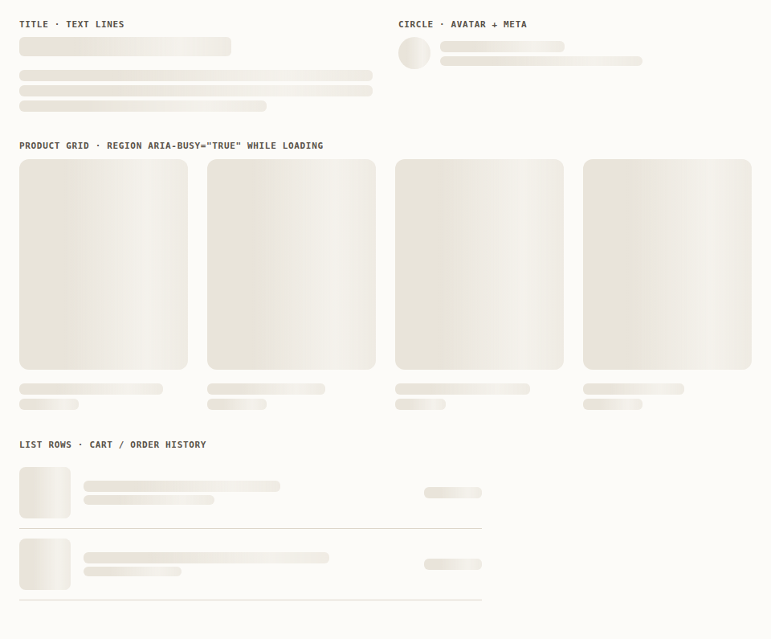

**Anatomy**

1. Busy region: the element being filled, with `aria-busy="true"` and a visually hidden "Loading products…" text.
2. Shapes (hidden from assistive technology): text lines, title bar, circle, media block, button bar.
3. Shimmer: a soft highlight sweeping across each shape.

**Properties**

| Name | Type | Default | Description |
|---|---|---|---|
| variant | `text` \| `title` \| `circle` \| `media` \| `btn` | `text` | Shape. |
| lines | integer | `1` | Number of text lines (`text` only). |
| width | length or percent | 100% (`title` 60%) | Vary text widths between 35% and 85%. |
| ratio | ratio preset | `4x5` | For `media`; match the real content ratio. |
| size | length | `2.5rem` | For `circle` (width = height). |

Composites: **Product card skeleton** (media + two text lines), **List row skeleton** (thumb + two lines + trailing price). Region-level: `busyLabel` string (default "Loading products…").

**Events**: None.

**Sizes**

| Shape | Value |
|---|---|
| Default radius | `radius-sm` |
| text | height 0.875rem, 0.3rem margin above and below (one 1.5 line-height row) |
| title | height 1.5rem, width 60% |
| circle | width = height (2.5rem for an avatar), fully round |
| media | aspect ratio 4:5, `radius-lg` (matches product cards) |
| btn | height 2.75rem, `radius-md` |
| Product grid | media + two text lines (e.g. 85% and 35%), 0.75rem between media and lines, same columns and 1.5rem gap as the real grid |
| List row | columns 4rem square thumb (`radius-md`) · two lines (second 0.75rem tall) · 4.5rem price line; column gap 1rem; row padding 0.75rem block; 1px `border` divider |

**Variants**

- Text / title / circle / media / btn primitives.
- Product card: media + title and price lines, in the same grid as the real product grid.
- List row: for cart and order history.

**States**

| Part | Token roles |
|---|---|
| Shape | `surface-strong` |
| Shimmer | a band of `background` at 60% strength, fading in and out, moving across the shape |
| On `surface` sections | shapes stay `surface-strong` (visible step) |

**Behaviour & motion**

- Shimmer sweeps left to right over 1.4s, `ease-out`, infinitely.
- Reduced motion: shimmer removed; shapes are static.
- When content arrives: set `aria-busy="false"`, remove the hidden loading text, replace shapes with content of the same dimensions.
- If loading takes more than about 10s, replace with the error state and a "Try again" button.
- Show only as many cards as will actually load (usually one row).

**Keyboard**

| Key | Action |
|---|---|
| — | No interaction. Focus never moves into skeletons. |

**Accessibility**

- Shapes are `aria-hidden="true"`. The region gets `aria-busy="true"` and a visually hidden "Loading products…" (or "Loading orders…").
- Real dimensions are matched so nothing shifts and a focused element is not pushed out of view (2.4.11).
- Shapes are decorative and carry no information, so 1.4.11 does not apply; the hidden text carries the state.

**Acceptance criteria**

- [ ] Every shape matches the size table and the dimensions of the content it replaces; no layout shift when content arrives.
- [ ] The loading region exposes `aria-busy="true"` and hidden loading text; both are cleared when content arrives (4.1.2, 4.1.3).
- [ ] Shapes are hidden from assistive technology and never receive focus (2.1.1).
- [ ] Shimmer is absent with reduced motion (2.3.3 good practice; motion never required).
- [ ] After about 10s without content, the region switches to the error state with a "Try again" button.
- [ ] Skeletons are never shown alongside a spinner for the same region, and never for static text.
- [ ] Skeleton grids reflow like the real grid at 200% zoom and at 320px (1.4.10).

**Do / Don't**

- Do use it for content loading after first paint.
- Do show as many placeholders as will actually load.
- Don't skeleton static text that ships in the page.
- Don't use a spinner and skeletons for the same region.

---

### Empty and error states

The panels shown inside blocks when there is nothing to show (empty cart, no saved items), when search or filters return nothing, or when content failed to load; plus the editor-only hint for unfilled block fields. While data is still loading use Skeleton instead.

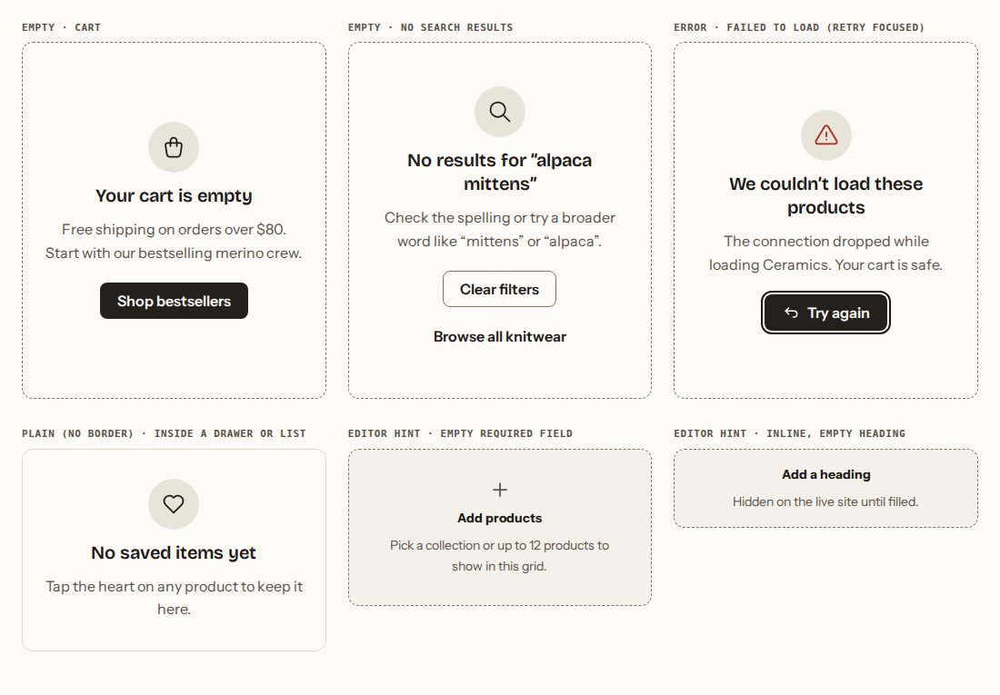

*Row 1: empty, no results, error (retry focused). Row 2: plain variant (no border, inside a drawer or list), editor hint, inline editor hint.*

**Anatomy**

```
┌ ─ ─ ─ ─ ─ ─ ─ ─ ─ ─ ─ ─ ┐
        ( icon )          1
   Your cart is empty     2
 Free shipping over $80…  3
   [ Shop bestsellers ]   4
└ ─ ─ ─ ─ ─ ─ ─ ─ ─ ─ ─ ─ ┘
```

1. Icon circle, decorative.
2. Title: heading (h2 at page level, h3 inside a block).
3. Text: `muted`, at most 36 characters wide.
4. Actions: one primary action, optional secondary (Button group, centred).

Editor hint: 1. icon (optional), 2. action label (strong), 3. guidance text.

**Properties**

Empty state

| Name | Type | Default | Description |
|---|---|---|---|
| variant | `empty` \| `noResults` \| `error` | `empty` | `noResults` sets `role="status"`; `error` sets `role="alert"` and the `danger` icon. |
| icon | string | per use | E.g. `shopping-bag`, `search`, `alert-triangle`, `heart`. |
| title | string | — | Plain statement ("Your cart is empty"); for no results, echo the query. |
| text | string \| null | `null` | One or two sentences with the next step. |
| actions | content | — | One primary Button, optional secondary (outline or ghost). |
| plain | boolean | `false` | No border; for drawers, lists and cards. |
| headingLevel | 2–6 | `3` | h2 for a page-level state. |
| retrying | boolean | `false` | Error only: the "Try again" button shows its busy state. |

Editor hint

| Name | Type | Default | Description |
|---|---|---|---|
| icon | string \| null | `null` | E.g. `plus`, `photo`. |
| label | string | — | Action, e.g. "Add products", "Choose an image", "Add a heading". |
| help | string \| null | `null` | Guidance, e.g. "Pick a collection or up to 12 products to show in this grid." |
| inline | boolean | `false` | Compact padding for inline fields. |

**Events**

- `retry` (error variant): fires when "Try again" is activated.

**Sizes**

| Part | Value |
|---|---|
| Panel padding | 3rem block (`space-12`), 1.5rem inline (`space-6`) |
| Panel border and radius | 1px dashed, `radius-lg` |
| Gap between parts | 0.75rem (`space-3`); actions get an extra 0.5rem above |
| Icon circle | 3.5rem, icon 1.75rem, stroke 1.5 |
| Title | heading family, 1.25rem, line-height 1.3, weight 600 |
| Text | 1rem, `muted`, max-width 36ch |
| Actions | Button md (2.5rem; 2.75rem below 48rem block width), gap 0.75rem, centred, wrapping |
| Editor hint | padding 2rem (`space-8`; inline 1rem), gap 0.5rem, 0.875rem text, 1.5px dashed border, `radius-lg`, icon 1.5rem |

All content is centred horizontally and vertically.

**Variants**

| Variant | Use |
|---|---|
| Empty | Nothing to show yet: empty cart, no saved items |
| No results | Search and filters; echo the query; offer "Clear filters" |
| Error | Failed fetch; icon turns `danger`; "Try again" button |
| Plain | No border, inside drawers, lists or cards |
| Editor hint | Editor view of an empty field; never rendered on the live site (there, an empty optional part simply does not render) |

**States**

| State | Background | Border | Text | Icon |
|---|---|---|---|---|
| Empty / no results | `background` | 1px dashed `border-strong` | title `text`, body `muted` | `text` on `surface-strong` circle |
| Error | `background` | 1px dashed `border-strong` | title `text`, body `muted` | `danger` on `surface-strong` circle |
| Plain | inherits | none | as above | as above |
| Retry in progress | — | — | "Try again" button is `aria-busy="true"`, label hidden, spinner centred | — |
| Editor hint | `surface` | 1.5px dashed `border-strong` | `muted`; label `text` | `muted` |

**Behaviour & motion**

- No motion. When a state replaces loaded content, swap without animation.
- Move focus only when the user triggered the change. After "Try again", focus goes to the first loaded item on success, or stays on the button if it fails again.
- No results is announced politely after filtering; errors are announced assertively.

**Keyboard**

| Key | Action |
|---|---|
| Tab / Shift+Tab | Moves through the action buttons and links. The panel itself is not focusable. |
| Enter / Space | Activates the focused button (Enter for links). |

**Accessibility**

- No results: the panel is `role="status"` so the change is announced politely (4.1.3). Error: `role="alert"`; the message says what failed and that nothing was lost ("Your cart is safe").
- "Try again" is a real `<button>`.
- 1.4.1: error is signalled by the icon shape and the words, not only the `danger` colour.
- 1.4.3: title `text` 16.9:1, body `muted` 7.4:1 on `background`; editor hint `muted` 6.8:1 on `surface`. 1.4.11: error icon `danger` 5.3:1 and the `text` icon 13.8:1 on the `surface-strong` circle; the dashed `border-strong` border is 4.5:1 on `background`.
- 2.5.8: actions are standard buttons (2.5rem, 2.75rem below 48rem block width).
- Editor hints are not part of the live page, so they need no roles.

**Default copy (Northwind Goods)**

- Empty cart: "Your cart is empty" / "Free shipping on orders over $80. Start with our bestselling merino crew." / [Shop bestsellers].
- No results: "No results for “alpaca mittens”" / "Check the spelling or try a broader word like “mittens” or “alpaca”." / [Clear filters] [Browse all knitwear].
- Error: "We couldn’t load these products" / "The connection dropped while loading Ceramics. Your cart is safe." / [Try again] with a back-arrow icon.
- Plain: "No saved items yet" / "Tap the heart on any product to keep it here."
- Editor hints: "Add products" / "Pick a collection or up to 12 products to show in this grid."; "Add a heading" / "Hidden on the live site until filled."; "Choose an image" / "JPG or PNG, 1600px wide or more".

**Acceptance criteria**

- [ ] Every empty state has exactly one primary next step.
- [ ] No-results panels are announced once, politely, after filtering; error panels are announced assertively (4.1.3).
- [ ] The error state shows the warning icon and words; it is understandable in greyscale (1.4.1).
- [ ] "Try again" is a keyboard-operable button with the standard focus ring; while retrying it is `aria-busy="true"`; focus moves to the first loaded item on success and stays on the button on failure (2.1.1, 2.4.3, 2.4.7).
- [ ] Focus is not moved when the state appears without user action (3.2.2).
- [ ] Text, icon and border pairs meet the ratios above (1.4.3, 1.4.11).
- [ ] Action buttons meet 2.5rem, 2.75rem below 48rem block width (2.5.8).
- [ ] Editor hints never render on the live site.
- [ ] At 200% zoom and in a 320px column the panel reflows, text wraps within 36ch, and actions wrap (1.4.10, 1.4.12).
- [ ] Empty states are never shown while data is still loading.

**Do / Don't**

- Do give every empty state one clear next step.
- Do echo the search term so people can spot a typo.
- Don't use illustrations or jokes; one icon and plain words.
- Don't show an empty state while data is still loading; use Skeleton.
- Don't ship editor hints to the storefront.

---

## Overlays, navigation and feedback

Shared rules for the four modal surfaces in this group (Dialog, Drawer, Lightbox, Search modal). Each section repeats what is specific to it.

- **Element.** Every modal surface is a native `<dialog>` opened with the browser's modal method (`showModal()`), never `show()` and never a `<div role="dialog">`. That makes the rest of the page **inert** (not clickable, not focusable, hidden from assistive technology), contains `Tab` / `Shift+Tab` inside the dialog, makes `Esc` fire the dialog's `cancel` event and close it, and puts the dialog in the top layer. Do not write a focus-trap script or set `inert` by hand.
- **Backdrop.** The dialog's `::backdrop` is the `overlay` scrim (`text` ink at 70%). The Lightbox covers it with its own near-opaque ground.
- **Opening.** Store a reference to the element that had focus (the opener), call `showModal()`, then move focus to the element marked `autofocus` inside the dialog, or else to the first meaningful control named in the component's section.
- **Closing.** A close can come from `Esc`, the close button, an action button, a backdrop click (where allowed) or code. All of them go through the dialog's `close()`, so there is one `close` event. On `close`, focus returns to the opener. If the opener no longer exists (for example, the cart line that was removed), focus moves to the next logical element named in the component's section (WCAG 2.4.3).
- **Backdrop click.** A click whose target is the `<dialog>` element itself (the backdrop area outside the panel) closes it, unless the section says otherwise.
- **Scroll lock.** While any modal surface is open, the root element (`<html>`) gets `overflow: hidden`, so the page behind does not scroll. Content that overflows scrolls inside the dialog.
- **One at a time.** Never stack modal surfaces. A confirm step inside a drawer replaces the drawer content or closes the drawer first.
- **Motion.** Entering motion uses `duration-slow` (250ms) with `ease-out`. With `prefers-reduced-motion: reduce`, movement and scaling are replaced by a plain opacity fade over `duration-base` (200ms), linear. Exit is instant by default. If an implementation animates the exit, it uses `ease-in` and focus still returns as soon as the dialog closes.
- **Toasts while a modal is open.** The toast region lives outside the dialog, so it would be inert and covered by the top layer. While a modal surface is open, render toasts inside the open dialog (a second region at the end of the dialog with the same live-region roles), so they stay visible and are still announced.

---

### Dialog

A small modal window for one decision or a short form: confirm removing an item from the cart, "Notify me when it's back", newsletter sign-up. Use a Drawer for long content (cart, filters, menu), and a banner or Toast for announcements. Never open a dialog on page load.

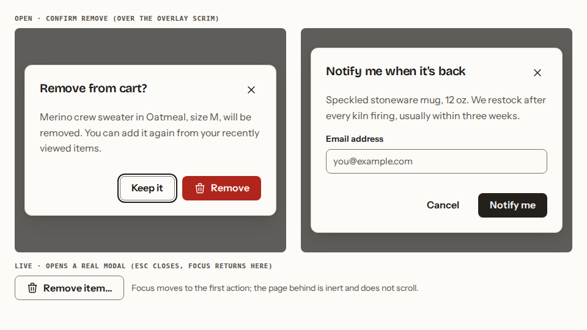

*Left: a confirm dialog with the focus ring on the safe action. Right: a dialog with a form field. Below: the trigger that opens a real modal.*

**Anatomy**

```
 overlay scrim (::backdrop)
 ┌──────────────────────────────────────────┐
 │ 1 head   [2 title (h2) ·········· (3 ×)] │
 │ 4 body   description text (muted)        │  ← aria-describedby target
 │ 5 foot   ········ [secondary] [primary]  │  ← actions, right-aligned, wrap
 └──────────────────────────────────────────┘
```

1. **Head**: a row with the title on the left and the close button on the right, top-aligned.
2. **Title**: a real `<h2>`, the dialog's accessible name.
3. **Close button**: ghost icon button (small), × icon, `aria-label="Close"`.
4. **Body**: the description (one or two sentences) or the form fields. Text in `muted`.
5. **Foot**: the action buttons, right-aligned, wrapping on narrow widths. The destructive or primary action is last.

**Properties**

| Name | Type | Default | Description |
|---|---|---|---|
| `open` | boolean (two-way) | `false` | Shows the dialog with `showModal()` when true, closes it when false. |
| `title` | string | (required) | Text of the `<h2>` title; the dialog is `aria-labelledby` it. |
| `description` | string | none | Body text; the dialog is `aria-describedby` it. Omit when the body is a form. |
| `size` | `"sm"` \| `"md"` | `"md"` | Panel width: `sm` 24rem, `md` 32rem (always capped at viewport width minus 2rem). |
| `dismissable` | boolean | `true` | Whether a backdrop click closes the dialog. Set `false` for forms with unsaved input and for destructive confirms where a stray click must not count as an answer. `Esc` and the close button always close. |
| content | content | none | The body (text or fields). |
| footer | content | none | The action buttons. |

**Events**

- `openChange`: fires with the new `open` value whenever the dialog opens or closes (by any route).
- `cancel`: fires when `Esc` is pressed (the native `cancel` event), before `close`.
- `close`: fires after the dialog has closed, with how it closed (`"escape"`, `"backdrop"`, `"button"` or an action value).

**Sizes**

| Part | Value |
|---|---|
| Width | `min(32rem, 100vw − 2rem)` (`sm`: `min(24rem, 100vw − 2rem)`) |
| Max height | `100vh − 4rem`; content beyond that scrolls inside the dialog |
| Head padding | 1.5rem 1.5rem 0; gap between title and close 1rem |
| Body padding | 1rem 1.5rem |
| Foot padding / gap | 1rem 1.5rem 1.5rem / 0.75rem |
| Title | heading font, 1.25rem / 1.3, weight 600, letter-spacing −0.01em |
| Close button | 2rem square (small ghost icon button) |
| Action buttons | medium buttons: 2.5rem tall, 2.75rem below 48rem |
| Border / radius | 1px hairline / `radius-lg` (0.75rem) |
| Shadow | `shadow-md` |

**Mobile.** The Dialog has **no full-screen variant**. On narrow screens it keeps a 1rem margin on each side (`100vw − 2rem` wide), stays centred, and its content scrolls when taller than the viewport minus 4rem. If the content needs a full screen on a phone, it belongs in a Drawer.

**Variants**

| Variant | Content | Actions (in foot order) | Initial focus |
|---|---|---|---|
| Confirm | Title as a question ("Remove from cart?"), one sentence on the consequence | outline "Keep it", then danger "Remove" with trash icon | "Keep it" (the least destructive action). Never the destructive button. |
| Form | Title, one line of context, Field components | ghost "Cancel", then primary submit ("Notify me") | The first field |
| Info | Title and short text | a single primary "Got it" | "Got it" |

**States**

| State / part | Background | Border | Text | Icon |
|---|---|---|---|---|
| Panel | `background` | `border` hairline, `shadow-md` | title `text`, body `muted` | none |
| Backdrop | `overlay` | none | none | none |
| Close button, rest | transparent | none | none | `text` |
| Close button, hover | `text` at 6% over the panel | none | none | `text` |
| Close button, active | `text` at 11% | none | none | `text`, moves down 1px |
| Destructive action | `danger` | none | `background` | `background` |
| Any control, focus-visible | standard focus ring | | | |

**Behaviour & motion**

- Opens with `showModal()` (see the shared rules at the top of this group). Initial focus as in the Variants table; the element carrying `autofocus` wins.
- Closes on `Esc`, on the close button, on any action button that ends the task, and on a backdrop click when `dismissable` is true.
- On close, focus returns to the opener. After a confirmed removal, the opener (that line's remove button) is gone: move focus to the next line item's remove button, or to the empty-cart heading if the cart is now empty.
- Scroll lock on `<html>` while open; the page behind is inert.
- Enter: opacity 0 → 1, 0.5rem rise and scale 0.98 → 1, `duration-slow` (250ms) `ease-out`. Exit: instant (or `ease-in` if animated).
- Reduced motion: no rise or scale; a plain fade over `duration-base` (200ms), linear.
- Form variant: submitting runs validation in place (errors next to fields, see Field); the dialog stays open until the submit succeeds.

**Keyboard**

| Key | Action |
|---|---|
| `Tab` / `Shift+Tab` | Moves through the controls inside the dialog only, wrapping at the ends |
| `Esc` | Closes the dialog (native `cancel`); focus returns to the opener |
| `Enter` / `Space` | Activates the focused button |
| `Enter` in a form field | Submits the form (primary action) |

**Accessibility**

- `<dialog aria-labelledby="{title id}" aria-describedby="{body id}">` opened with `showModal()`. The browser exposes it as a modal dialog; the rest of the page is inert. Drop `aria-describedby` when the body is a form.
- Title is a real `<h2>`. Close button is a `<button type="button" aria-label="Close">`.
- Button labels are verbs ("Remove", "Keep it", "Notify me"), never "OK".
- Contrast: title `text` on `background` 16.9:1; body `muted` on `background` 7.4:1; `background` text on the `danger` fill 6.5:1; close icon `text` 16.9:1 (15.0:1 on the hover tint); focus ring `focus` 16.9:1 on `background`, and the `focus-inner` infill 16.2:1 against the `primary` button.
- Targets: close 2rem, actions 2.5rem (2.75rem below 48rem), all ≥ 1.5rem.

**Acceptance criteria**

- [ ] The dialog is a native `<dialog>` opened with `showModal()`; there is no `role="dialog"` on any other element and no custom focus-trap code.
- [ ] While open, the content behind is inert: it can't be clicked, focused, or reached by a screen reader's virtual cursor (2.1.2, 4.1.2).
- [ ] While open, the page behind does not scroll with wheel, touch or keyboard.
- [ ] On open, focus lands on the `autofocus` element: "Keep it" in the confirm variant, the first field in the form variant; never the destructive button (2.4.3).
- [ ] `Tab` and `Shift+Tab` cycle only through the dialog's controls; `Esc` always closes (2.1.1, 2.1.2).
- [ ] On close by any route, focus returns to the opener; if the opener was removed, focus goes to the next line item's remove button or to the empty-cart heading (2.4.3).
- [ ] A backdrop click closes the dialog only when `dismissable` is true.
- [ ] The accessible name is the title text and the description is the body text (4.1.2).
- [ ] Every control shows the standard focus ring on keyboard focus (2.4.7, 2.4.13).
- [ ] Contrast: title 16.9:1, body 7.4:1, destructive button label 6.5:1 (1.4.3); the focus ring is ≥ 3:1 against every adjacent colour (1.4.11).
- [ ] Close button ≥ 2rem, actions ≥ 2.5rem, 2.75rem below 48rem (2.5.8).
- [ ] With reduced motion the dialog fades in over 200ms with no movement.
- [ ] At 320px viewport width and at 200% zoom the dialog fits with a 1rem margin each side, actions wrap, and all content is reachable by scrolling inside the dialog (1.4.4, 1.4.10).
- [ ] The destructive action is shown by its label and trash icon as well as the `danger` fill (1.4.1).

**Do / Don't**

- **Do** keep a dialog to one decision; write button labels as verbs.
- **Do** put the destructive action last and never give it initial focus.
- **Don't** open a dialog on page load or to announce a sale; use a banner.
- **Don't** stack dialogs. **Don't** put long content in a dialog; use a Drawer.

---

### Drawer

A modal side sheet: from the right for the cart, filters and quick view; from the left for the mobile menu. Use a Dialog for a single short decision, and a Toast (not the drawer) to confirm "Added to cart" unless the shopper asked to see the cart.

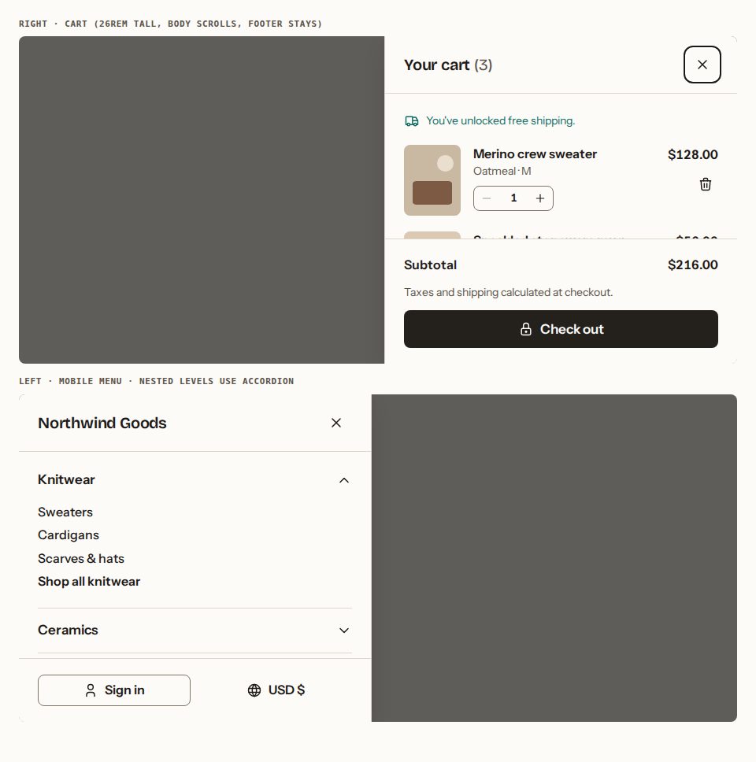

*Both drawers are shown in a 26rem-tall frame so the scrolling body and the fixed footer are visible. The cart's close button shows the focus ring.*

**Anatomy**

```
 overlay scrim │ ┌──────────────────────────────┐
               │ │ 1 head  [2 title ····  (3 ×)]│  min 4rem, bottom hairline
               │ ├──────────────────────────────┤
               │ │ 4 body  (scrolls)            │  fills the remaining height
               │ │   line items / nav           │
               │ ├──────────────────────────────┤
               │ │ 5 foot  subtotal · note ·    │  always visible, top hairline
               │ │         [ Check out ]        │
               │ └──────────────────────────────┘
```

1. **Head**: title and close button, vertically centred, with a hairline below.
2. **Title**: `<h2>`, e.g. "Your cart" plus the count "(3)" in `muted`, weight 400. For the menu, the store name.
3. **Close button**: ghost icon button (medium), × icon, labelled "Close cart" / "Close menu" / "Close filters".
4. **Body**: the only scrolling part: line items, filter groups, or the `<nav aria-label="Main">` with Accordion levels.
5. **Foot**: never scrolls. Cart: subtotal row, the note "Taxes and shipping calculated at checkout.", and the "Check out" button. Menu: "Sign in" and the currency selector in two columns.

**Properties**

| Name | Type | Default | Description |
|---|---|---|---|
| `open` | boolean (two-way) | `false` | Opens with `showModal()` / closes. |
| `side` | `"right"` \| `"left"` | `"right"` | Edge the sheet slides in from. Left is for the mobile menu. |
| `title` | string | none | Visible `<h2>`; the drawer is `aria-labelledby` it. Use either `title` or `label`. |
| `label` | string | none | Accessible name when the heading isn't a good name (menu: `aria-label="Menu"`). |
| `count` | number | none | Optional count shown after the title in `muted` ("Your cart (3)"). |
| `width` | rem | `28rem` | Maximum width; always capped at 100% of the viewport. Blocks narrow it: mobile menu 22rem, cart 26rem, filters 24rem. |
| content | content | none | The scrolling body. |
| footer | content | none | The fixed footer. |

**Events**

- `openChange`: fires with the new `open` value.
- `close`: fires after the drawer has closed.
- `afterLeave`: fires after any exit animation has finished (for custom focus handling).

**Sizes**

| Part | Value |
|---|---|
| Width | `min(28rem, 100%)` by default; full viewport width when the viewport is narrower |
| Height | the full viewport height, pinned to its edge (top, bottom and that side at 0) |
| Head | min-height 4rem, padding 1rem 1.5rem, gap 1rem, 1px `border` below |
| Title | heading font, 1.25rem / 1.3, weight 600, letter-spacing −0.01em |
| Close button | 2.5rem square ghost icon button, 2.75rem below 48rem |
| Body padding | 1.5rem |
| Foot padding / gap | 1.25rem 1.5rem / 0.75rem, 1px `border` above, `background` fill |
| Edge | 1px `border` on the inner edge (left edge for a right drawer, right edge for a left drawer), `shadow-md` |
| Radius | none |
| Check out button | primary, large (3rem), full width, lock icon |

**Mobile.** On any viewport narrower than the drawer's width, the drawer is **full width and full height**: it covers the whole screen, so the scrim isn't visible. Nothing else changes: head, scrolling body and fixed footer stay as described.

**Variants**

| Variant | Use | Initial focus |
|---|---|---|
| Right (default) | Cart, filters, quick view | Cart: the close button. Filters and quick view: the close button unless a control is marked `autofocus`. |
| Left | Mobile menu; nested levels are Accordion items inside the body | The first link in the menu |

**States**

| State / part | Background | Border | Text | Icon |
|---|---|---|---|---|
| Panel | `background` | inner-edge `border` hairline, `shadow-md` | `text` | `text` |
| Backdrop | `overlay` | none | none | none |
| Head / foot dividers | none | `border` | none | none |
| Free-shipping line | none | none | `success` | truck icon, `success` (always with the words) |
| Check out button | `primary` | none | `primary-contrast` | `primary-contrast` |
| Close button hover / active | `text` at 6% / 11% | none | none | `text` |
| Any control, focus-visible | standard focus ring | | | |

**Behaviour & motion**

- Opens with `showModal()` (shared rules at the top of this group). Page behind inert, scroll locked on `<html>`; only the body scrolls.
- Closes on `Esc`, the close button, and a backdrop click.
- On close, focus returns to the cart or menu button that opened it.
- Removing the last line item: focus moves to the empty-state heading or to the "Continue shopping" link inside the drawer.
- Quantity changes and removals are announced through a Toast status message, never by moving focus. While the drawer is open, that toast renders inside the drawer (shared rules).
- Enter: slides in from its edge (`translateX(100%)` → 0 for right, `−100%` → 0 for left), `duration-slow` (250ms) `ease-out`. Exit: instant, or `ease-in` if animated.
- Reduced motion: no slide; a plain fade over `duration-base` (200ms), linear.
- The footer sits outside the scrolling body, so it can never cover a focused line item (2.4.11).

**Keyboard**

| Key | Action |
|---|---|
| `Tab` / `Shift+Tab` | Moves through the drawer's controls only (head, body, foot), wrapping |
| `Esc` | Closes; focus returns to the opener |
| `Enter` / `Space` | Activates the focused control; toggles an Accordion row in the menu |

**Accessibility**

- Cart: `<dialog aria-labelledby="{title id}">`. Menu: `<dialog aria-label="Menu">` containing `<nav aria-label="Main">`.
- Close button names the drawer: "Close cart", "Close menu", "Close filters".
- Each line item's controls are named per item ("Remove Merino crew sweater", "Quantity, Merino crew sweater").
- Contrast: `text` on `background` 16.9:1; `muted` 7.4:1; `success` line 6.2:1; `primary-contrast` on `primary` 15.6:1; focus ring 16.9:1 on `background` (`focus-inner` 16.2:1 against `primary`).
- Targets: close 2.5rem (2.75rem below 48rem), Check out 3rem, menu rows 2.75rem.

**Acceptance criteria**

- [ ] The drawer is a native `<dialog>` opened with `showModal()`; the page behind is inert and does not scroll.
- [ ] On open, focus goes to the close button (cart) or the first menu link (menu), or to an element marked `autofocus` (2.4.3).
- [ ] `Tab` stays inside the drawer; `Esc` closes it; focus returns to the cart or menu button (2.1.1, 2.1.2, 2.4.3).
- [ ] A backdrop click closes the drawer.
- [ ] The footer and "Check out" are visible at every viewport height; only the body scrolls, and no focused item is hidden behind the footer (2.4.11).
- [ ] Removing the last item moves focus to the empty-state heading or "Continue shopping"; focus is never lost to `<body>`.
- [ ] Cart updates are announced as status messages without moving focus (4.1.3).
- [ ] Below the drawer width the drawer covers the full screen; at 320px and 200% zoom nothing is cut off and there is no horizontal scroll (1.4.10).
- [ ] Every control shows the standard focus ring (2.4.7).
- [ ] Contrast pairs as listed: 16.9:1, 7.4:1, 6.2:1, 15.6:1 (1.4.3); focus ring ≥ 3:1 (1.4.11).
- [ ] The free-shipping message has an icon and words, not colour alone (1.4.1).
- [ ] With reduced motion the drawer fades in over 200ms with no slide.
- [ ] Targets ≥ 1.5rem; close button 2.75rem and Check out 3rem on narrow screens (2.5.8).

**Do / Don't**

- **Do** keep the checkout button in the footer, visible at all heights.
- **Do** open the cart drawer after "Add to cart" only if the shopper asked for it; otherwise show a Toast.
- **Don't** nest a drawer in a drawer; use Accordion levels in the menu.
- **Don't** put the only copy of important totals in the scrolling body.

---

### Lightbox

A full-screen modal image viewer for product galleries: counter, close, previous / next and caption around a one-image-per-view Carousel. Use it for zooming into product photos; don't use it for a single small image that's already readable, and never put buy actions in it.

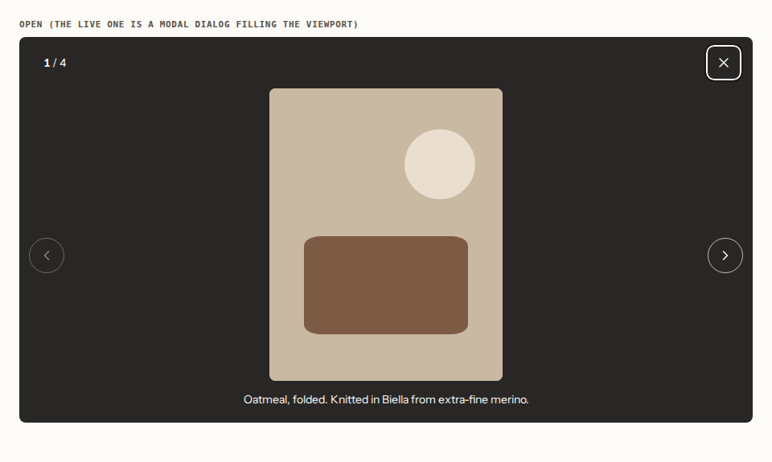

*Shown in a 30rem-tall frame; the live viewer fills the viewport. The previous arrow is disabled (first image).*

**Anatomy**

```
 ┌──────────────────────────────────────────────┐
 │ 1 bar: 2 counter "1 / 4"             (3 ×)   │
 │                                              │
 │ (4 ‹)       ┌──────────────┐        (4 ›)    │  5 stage: arrows + track
 │             │   6 image    │                 │  slide = <figure>
 │             └──────────────┘                 │
 │     7 caption: Oatmeal, folded. Knitted…     │  <figcaption>
 └──────────────────────────────────────────────┘
```

1. **Bar**: top row, counter on the left, close on the right.
2. **Counter**: "1 / 4", current number bold; hidden from assistive technology.
3. **Close button**: ghost icon button (medium), × icon, "Close image viewer".
4. **Arrows**: previous / next, circular outlined Carousel arrows, vertically centred on the stage.
5. **Stage / track**: a horizontally scrolling, snapping Carousel track with one slide per view; focusable.
6. **Slide**: a `<figure>` holding the image (full resolution, loaded when the viewer opens).
7. **Caption**: the slide's `<figcaption>`, centred below the image.

**Properties**

| Name | Type | Default | Description |
|---|---|---|---|
| `open` | boolean (two-way) | `false` | Opens with `showModal()` / closes. |
| `index` | number (two-way) | `0` | The current image; set it to the thumbnail that was activated before opening. |
| `images` | list of `{ src, alt, caption?, width, height }` | (required) | The images, in gallery order. `alt` is required and describes the image. |
| `label` | string | (required) | Accessible name of the viewer, e.g. "Merino crew sweater, images". |
| `thumbnails` | boolean | `false` | Shows the optional thumbnail strip under the caption. |

**Events**

- `openChange`: fires with the new `open` value.
- `indexChange`: fires with the new image index when the shopper moves between images.

**Sizes**

| Part | Value |
|---|---|
| Viewer | the full viewport (inset 0, 100% × 100%), rows: bar / stage / caption area |
| Bar | padding 0.75rem 1rem, 0.875rem text |
| Stage side padding | 4rem each side (room for the arrows). The Gallery block uses 1rem below 48rem viewport width (arrows overlap the image edge) and 4.5rem from 48rem. |
| Arrows | 2.75rem circles, 1px outline, 0.75rem from the stage edges, centred vertically |
| Close | 2.5rem ghost icon button, 2.75rem below 48rem |
| Image | fits the stage height and width, keeps its aspect ratio (contain), `radius-md` corners |
| Caption | 0.875rem, centred, padding 0.75rem 1rem 1rem (Gallery block: max-width 48rem) |
| Track | one slide = 100% of the stage, no gap, scroll-snap |

**Mobile.** The Lightbox is **always full screen**, at every width. Below 48rem the close button grows to 2.75rem, and in the Gallery block the stage padding drops to 1rem so the image uses the width; the arrows then sit over the image's side edges. Swiping scrolls the track natively, and pinch-zoom stays enabled.

**Variants**

| Variant | Controls |
|---|---|
| Gallery (default) | Counter, arrows, captions |
| Single image | No arrows and no counter |
| With thumbnails | A thumbnail strip under the caption; thumbnails are Carousel dots styled as small images, each "Go to slide n" with `aria-current="true"` on the current one |

**States**

| State / part | Background | Border | Text | Icon |
|---|---|---|---|---|
| Viewer ground | `text` at 94% (near-opaque ink) | none | `background` | `background` |
| Backdrop | `overlay` (covered by the ground) | none | none | none |
| Counter | none | none | `background`, current number weight 600 | none |
| Arrow, rest | transparent | `background` at 70% | none | `background` |
| Arrow, hover | `background` at 14% | same | none | `background` |
| Arrow, disabled (first / last) | transparent | same | none | same, at 45% opacity; `not-allowed` cursor |
| Close, rest / hover | transparent / `background` at 14% | none | none | `background` |
| Focus-visible | standard focus ring; its white `focus-inner` infill carries the contrast on the dark ground (no override) | | | |

**Behaviour & motion**

- Opened from a real button (the thumbnail or a "Zoom image" button) with `showModal()`. Scroll lock on `<html>`; page behind inert.
- Opens at `index`; full-resolution images load only when the viewer opens.
- Initial focus: the close button.
- Closes on `Esc` and on the close button. There is no backdrop click: the viewer fills the viewport and its ground is part of the viewer.
- On close, focus returns to the thumbnail or zoom button that opened it.
- `←` / `→` move to the previous / next image from anywhere inside the viewer (not only from the track). Arrows, dots and counter follow the Carousel rules: the previous arrow is disabled on the first image and the next arrow on the last; if the focused arrow becomes disabled, focus moves to the other arrow.
- Enter: fade in over `duration-slow` (250ms) `ease-out`. Moving between images scrolls smoothly.
- Reduced motion: the viewer fades in over `duration-base` (200ms) with no movement, and image changes are instant (no smooth scroll).

**Keyboard**

| Key | Action |
|---|---|
| `←` / `→` | Previous / next image, from anywhere in the viewer |
| `Tab` / `Shift+Tab` | Close → previous → track → next (→ thumbnails), contained in the viewer |
| `Esc` | Closes; focus returns to the opener |
| `Enter` / `Space` | Activates the focused button |

**Accessibility**

- `<dialog aria-label="Merino crew sweater, images">` opened with `showModal()`.
- Track: focusable (`tabindex="0"`), `aria-label="Images"`.
- Each slide: `<figure role="group" aria-roledescription="slide" aria-label="2 of 4">`; each image has real alt text; the caption is the `<figcaption>`.
- Counter: `aria-hidden="true"` (the slide labels carry the position).
- Arrows: `<button>` "Previous image" / "Next image", `disabled` at the ends. Close: "Close image viewer".
- Contrast (computed on the ground): `background` text and icons 14.4:1; arrow outline 7.8:1; `background` icon on the arrow hover fill 9.3:1; `focus-inner` infill 14.9:1 against the ground.
- Targets: arrows 2.75rem; close 2.5rem, 2.75rem below 48rem.

**Acceptance criteria**

- [ ] The viewer is a native `<dialog>` opened with `showModal()`; it fills the viewport at every width, the page behind is inert and does not scroll.
- [ ] Focus lands on the close button on open and returns to the opener on close (2.4.3).
- [ ] `Esc` closes; `Tab` never leaves the viewer (2.1.1, 2.1.2).
- [ ] `←` / `→` change the image from any focused element in the viewer; the arrows are disabled on the first and last image, and focus is never left on a disabled arrow.
- [ ] Each slide is announced as "slide, 2 of 4" with the image's alt text and caption; the counter is not read (1.1.1, 1.3.1, 4.1.2).
- [ ] Every control shows the standard focus ring, visible on the dark ground (2.4.7, 2.4.13).
- [ ] Text and icons ≥ 14.4:1 on the ground; arrow outlines 7.8:1 (1.4.3, 1.4.11).
- [ ] Reduced motion: fade-in only, image changes are instant.
- [ ] At 320px and 200% zoom the image, caption and controls stay usable without horizontal page scrolling; pinch-zoom is not blocked (1.4.4, 1.4.10).
- [ ] Targets ≥ 2.5rem; 2.75rem below 48rem (2.5.8).

**Do / Don't**

- **Do** load full-resolution images only when the viewer opens.
- **Do** allow pinch-zoom on touch; don't block touch gestures.
- **Don't** open the lightbox on hover or put buy actions in it.
- **Don't** use it for a single small image that's already readable.

---

### Search modal

The same live search as the Search bar, inside a modal dialog: opened from the header's search button, from a field-like trigger, or with `/` or `⌘K` / `Ctrl+K`, and full screen on phones. It shares the Search bar's views (idle, results, none, loading), rows, grouping, data contract, live region and keyboard model; read the **Search bar** section first. This section lists only what the modal frame adds or changes. Use one per page, and don't combine it with a Search bar in the same header.


*Top: the triggers. Middle: open on desktop, typing “mer” with the first result active and the key-hint footer. Bottom: open at 360px, full screen, in the idle view.*

**Anatomy**

```
            ┌─ dialog ──────────────────────────────────────┐  40rem wide, 8vh from the top
            │ 1 ⌕  mer|                     (3 ×)  (4 ×)    │  2 field 3.5rem, hairline below
            │───────────────────────────────────────────────│
            │ 5 PRODUCTS                                    │  panel: fills the height, scrolls
            │   [img] Merino crew sweater ▓▓▓▓▓▓▓▓ $96.00   │
            │   …                                           │
            │───────────────────────────────────────────────│
            │ 6 ↑↓ to move  ↵ to open  esc to clear or close│  foot (desktop only)
            └───────────────────────────────────────────────┘
   page behind: overlay scrim (::backdrop)
```

1. **Search icon**: decorative, inside the field on the left.
2. **Field**: the Search bar's combobox input, borderless, full width, hairline below.
3. **Clear button**: shows only when the query is non-empty.
4. **Close button**: × icon button "Close search" (desktop and tablet); a "Cancel" text button on phones.
5. **Panel**: the Search bar's listbox, shown inline (not as a popup), filling the remaining height and scrolling. It always shows a view: idle while the query is empty, so the dialog is never blank.
6. **Foot**: keyboard hints; hidden on phones.

Plus the **trigger** outside the dialog (header icon button, or the field-like trigger).

**Properties**

| Name | Type | Default | Description |
|---|---|---|---|
| `open` | boolean (two-way) | `false` | Opens with `showModal()` / closes. |
| `value` | string (two-way) | `""` | The query. Reset to empty whenever the dialog closes. |
| `results` | object | none | As the Search bar: `{ products[], collections[], articles[], pages[], total }`. |
| `loading` | boolean | `false` | Shows the Search bar's loading view. |
| `recent` | list of string | `[]` | Recent searches for the idle view (stored per browser, max 5). |
| `popular` | list of string | `[]` | Popular search chips for the idle view (max 6). |
| `action` | url | `"/search"` | Search page the form submits to (`Enter` with no active option). |
| `shortcut` | boolean | `true` | Enables the `/` and `⌘K` / `Ctrl+K` shortcuts. Only one search modal on a page may enable it. |

**Events**

- `openChange`: fires with the new `open` value.
- `change`: fires with the new query while typing (as the Search bar).
- `select`: fires with the chosen option when an option is followed.
- `submit`: fires with the query when the form submits to the Search page.

**Sizes**

| Part | Desktop and tablet (viewport ≥ 48rem) | Mobile (viewport < 48rem) |
|---|---|---|
| Dialog | `min(40rem, 100vw − 2rem)` wide; max-height `min(40rem, 100vh − 6rem)`; top margin 8vh, centred horizontally; `radius-lg`, 1px `border`, `shadow-md`; content clipped to the radius | **Full screen**: 100% × 100%, no margin, radius or border |
| Field | 3.5rem tall, no border or radius of its own, transparent fill, 1.0625rem text; left padding 3rem, right padding 5.25rem; 1px `border` below | Same height; 1rem text; right padding 7.5rem (room for "Cancel") |
| Search icon | 1.25rem, 1.125rem from the left edge | Same |
| Clear | 2rem ghost icon button, "Clear search", 2.75rem from the right edge | 2rem, 5rem from the right edge (left of Cancel) |
| Close | 2rem ghost icon button (×), "Close search", 0.5rem from the right edge | "Cancel" small ghost text button (2rem tall), 0.5rem from the right edge |
| Panel | Inline, fills the remaining height and scrolls; padding 0.5rem; no border, shadow or open animation | Same |
| Foot | padding 0.625rem 1rem, gap 0.5rem 1.25rem, 0.75rem `muted` text on `surface`, 1px `border` above; key hints are small key caps (monospace 0.6875rem, min-width 1.25rem, `background` fill, `border-strong` outline, `radius-sm`) | Hidden |
| Field-like trigger | min-height 2.5rem (control height), full width of its container, padding 0 0.5rem 0 0.75rem, `radius-full`, 1px `border-strong`, `background` fill, 0.9375rem `muted` text, search icon 1.125rem, a "⌘K" key cap at the right (0.75rem, `muted`) | Same |
| Header icon trigger | ghost icon button, 2.5rem (2.75rem below 48rem) | Same |

**Mobile full-screen variant.** Below 48rem viewport width the dialog fills the screen with no scrim visible, the close becomes a "Cancel" text button, the foot is hidden (there is no hardware keyboard to hint at), the field text is 1rem (so the browser doesn't zoom on focus), and the field stays pinned at the top while only the panel scrolls, leaving room for the on-screen keyboard.

**Triggers**

| Trigger | Use |
|---|---|
| Header search icon button: ghost icon button, `aria-label="Search"`, `aria-haspopup="dialog"` | Default in every header variant |
| Field-like trigger: a pill `<button type="button" aria-haspopup="dialog">` reading "Search the shop" with a "⌘K" hint (the hint is `aria-hidden`) | Centred header, sidebars, the 404 page |
| `/` from anywhere | Opens the modal, unless focus is in an `<input>`, `<textarea>`, `<select>`, a `contenteditable` element or a combobox (then `/` types normally) |
| `⌘K` (macOS) / `Ctrl+K` (others) from anywhere | Always opens the modal, even while typing in a field; the browser's default for the shortcut is prevented |

Shortcuts do nothing while the search modal is already open or while another modal surface is open (dialogs are never stacked).

**States**

Everything in the Search bar's States table applies (option rest / active, chips, loading skeleton, no-results view). Additions:

| State / part | Treatment |
|---|---|
| Dialog | `background` fill, `border` hairline, `shadow-md`; backdrop `overlay` |
| Opening | fade in with a 0.5rem rise and scale 0.98 → 1, `duration-slow` (250ms) `ease-out`; the scrim appears with it. Reduced motion: plain fade over `duration-base` (200ms), linear. |
| Field focused | **inset focus ring** (2px `focus-inner` infill inside the edge, then the 2px `focus` ring), top corners following `radius-lg` so the dialog's rounded top doesn't clip it |
| Clear / Close hover | `text` at 6% over `background` |
| Clear / Close focus-visible | standard focus ring |
| Trigger rest | `background` fill, `border-strong` outline, `muted` text and icon |
| Trigger hover | outline and text change to `text` |
| Trigger focus-visible | standard focus ring around the pill |
| Foot | `muted` on `surface`, hints in key caps |

**Behaviour & motion**

- **Open.** A trigger click or a shortcut calls `showModal()`. The page behind is inert; scroll is locked on `<html>`; the backdrop is the `overlay` scrim.
- **Initial focus.** The input (`autofocus`). The query starts empty and the idle view (recent searches, popular chips) shows.
- **`Esc`, in order** (focus stays in the input throughout):
  1. If an option is active, `Esc` clears the active option only (the keydown is consumed, so the dialog does not close).
  2. Else, if the query is non-empty and focus is in the input, the dialog's `cancel` event is **cancelled** (`preventDefault()`), the query is cleared and the idle view shows.
  3. Else (empty query, or focus on another control in the dialog), `cancel` proceeds and the dialog closes.
- **Other ways to close.** The Close / Cancel button, and a click on the backdrop (desktop and tablet).
- **On close.** The query is reset to empty (idle view next time), and focus returns to the trigger that opened it; when it was opened by a shortcut, focus returns to whatever element had focus before (2.4.3).
- **Enter.** On an active product, collection or article option: follows the link and closes the dialog. On a recent search or popular chip: fills the query and runs the search (no navigation; focus stays in the input). With no active option: submits the form to `action` with the query.
- **Everything else** is exactly as the Search bar: combobox and listbox semantics, `↑` / `↓` across groups and chips, grouping, debounce, polite result-count announcements, recent and popular behaviour, "See all n results" row.
- Pressing on an option doesn't blur the input; hovering an option makes it active.
- Reduced motion: the dialog fades in over 200ms with no rise or scale.

**Keyboard**

| Key | Action |
|---|---|
| `/` | Opens the modal (not while typing in a field) |
| `⌘K` / `Ctrl+K` | Opens the modal from anywhere |
| `↓` / `↑` | Moves the active option through all options, across groups and chips (as Search bar) |
| `Enter` | Follows the active option (and closes), fills the query from a recent or popular chip, or submits to the Search page |
| `Esc` | Clears the active option; then clears the query; then closes the dialog |
| `Tab` / `Shift+Tab` | Moves between the input, Clear and Close only (options are never in the tab order); contained in the dialog |

**Accessibility**

- `<dialog aria-label="Search">` opened with `showModal()`, containing the Search bar markup: a `role="search"` wrapper, the input `type="search" role="combobox" aria-controls="{panel id}" aria-autocomplete="list" aria-expanded="true" aria-activedescendant="{active option id}"` labelled "Search the shop", the panel `role="listbox" aria-label="Search suggestions"`, groups `role="group"` labelled by their headings, options `role="option"`.
- In the modal the panel is always shown, so `aria-expanded` stays `true` while the dialog is open.
- The visually hidden polite live region announces "4 results for mer" / "No results for teapot" as in the Search bar.
- The foot's key hints and the trigger's "⌘K" key cap are `aria-hidden`; screen readers get the combobox semantics instead.
- Triggers have `aria-haspopup="dialog"`; the icon trigger is named "Search".
- Contrast: input text `text` 16.9:1 on `background`; placeholder and sub text `muted` 7.4:1; active row `text` 13.8:1 and `muted` 6.1:1 on `surface-strong`; foot `muted` 6.8:1 on `surface`; trigger outline `border-strong` 4.5:1 on `background`; focus ring 16.9:1.
- Targets: options 2.5rem, chips 2rem, Clear / Close / Cancel 2rem, triggers 2.5rem (icon trigger 2.75rem below 48rem).

**Acceptance criteria**

- [ ] The modal is a native `<dialog>` opened with `showModal()`; the page behind is inert and does not scroll; the backdrop is the `overlay` scrim.
- [ ] On open, focus is in the input, the query is empty and the idle view shows.
- [ ] `/` opens the modal only when focus is not in a text field, select, contenteditable or combobox; `⌘K` / `Ctrl+K` opens it from anywhere and the browser default is suppressed.
- [ ] With an active option, `Esc` clears only the active option; with text in the field, `Esc` clears the query and the dialog stays open (its `cancel` event is cancelled); with an empty field, `Esc` closes it (2.1.2).
- [ ] On close by any route, the query is reset and focus returns to the trigger, or to the previously focused element after a shortcut (2.4.3).
- [ ] `↑` / `↓` / `Enter` behave exactly as in the Search bar; `aria-activedescendant` always points at the highlighted option (2.1.1, 4.1.2).
- [ ] Result counts are announced politely without moving focus (4.1.3).
- [ ] Below 48rem viewport width the dialog is full screen, shows "Cancel", hides the foot, uses 1rem field text, and keeps the field pinned while the panel scrolls.
- [ ] The field shows the inset focus ring, fully visible inside the rounded top; triggers, Clear and Close show the standard ring (2.4.7, 2.4.13).
- [ ] Contrast pairs as listed (1.4.3); trigger outline 4.5:1 and focus ring ≥ 3:1 (1.4.11).
- [ ] The active option is shown by the `surface-strong` fill and the arrow icon, and matches by bold underlined text, not colour alone (1.4.1).
- [ ] With reduced motion the dialog fades in with no rise or scale.
- [ ] At 320px and 200% zoom the full-screen variant reflows without horizontal scroll and every option stays reachable (1.4.10).
- [ ] All targets ≥ 1.5rem (2.5.8).

**Do / Don't**

- **Do** use one search modal per page; the Header's search button opens it.
- **Do** keep recent and popular searches in the idle view so the dialog is useful before anyone types.
- **Don't** open the modal on page load or on hover.
- **Don't** put a Search bar and a Search modal trigger in the same header.

---

### Accordion

A stack of disclosure rows built on native `<details>` / `<summary>`, for secondary detail the shopper can skip: product details, FAQs, footer link groups on mobile, nested menu levels in the mobile menu Drawer. Use Tabs when the sections are peers of equal weight and short labels, and keep price, stock and the add-to-cart button outside accordions.

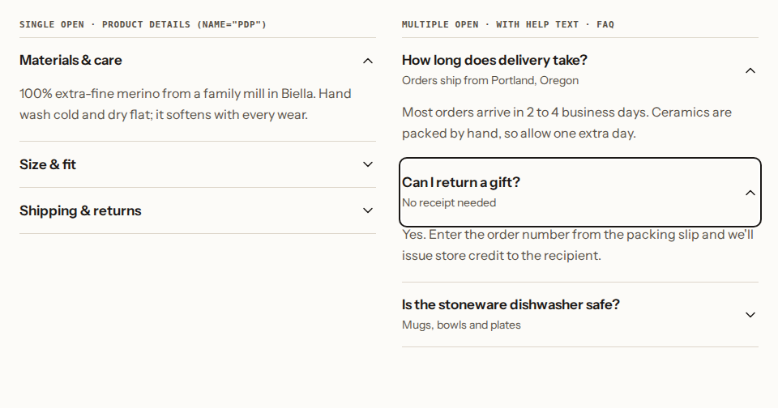

**Anatomy**

```
 ─────────────────────────────────────────  top border of the list
 [1 label ···························· (2 v)]  3 summary (trigger)
 [  4 help text (optional, muted)          ]
    5 panel: body copy (muted), max 65ch
 ─────────────────────────────────────────  bottom border of each item
```

1. **Label**: the row's title.
2. **Chevron**: chevron-down icon on the right; rotates 180° when open.
3. **Summary (trigger)**: the native `<summary>`, full row width.
4. **Help text** (optional): a second line under the label.
5. **Panel**: the content, shown when the `<details>` is open.

**Properties**

Accordion (group):

| Name | Type | Default | Description |
|---|---|---|---|
| `multiple` | boolean | `true` | `true`: any number of items open. `false`: single open; every `<details>` gets the same `name` attribute (native exclusive accordion). |
| `name` | string | generated | The shared `name` used when `multiple` is false. |

Accordion item:

| Name | Type | Default | Description |
|---|---|---|---|
| `title` | string | (required) | The label. |
| `help` | string | none | Optional help line; part of the accessible name, keep it short. |
| `open` | boolean (two-way) | `false` | Mirrors the `<details>` `open` attribute. |
| `headingLevel` | `2`–`4` \| none | none | Wraps the label in a heading inside the summary only when the page outline needs it. |
| `href` | url | none | Link row: renders a plain `<a>` styled as a trigger (menu entries without children), no panel. |
| content | content | none | The panel content. |

**Events**

- `toggle`: fires with the item's new open state (the native `toggle` event).

**Sizes**

| Part | Value |
|---|---|
| Trigger | min-height 3.5rem, padding 1rem 0, gap 1rem, `radius-sm` (for the focus ring) |
| Label | 1.0625rem / 1.4, weight 600 |
| Help text | 0.875rem / 1.5, weight 400, gap 0.125rem below the label |
| Chevron | 1.25rem |
| Panel | padding-bottom 1.25rem, max-width 65ch |
| Dividers | 1px `border` above the list and below every item |

**Variants**

| Variant | How |
|---|---|
| Multiple open (default) | Independent `<details>` elements |
| Single open | Same `name` on every `<details>` in the group |
| With help text | Label and help line stacked inside the summary |
| Link row | A plain link styled as a trigger, for menu entries without children |

**States**

| State / part | Background | Border | Text | Icon |
|---|---|---|---|---|
| Default | none | dividers `border` | label `text` | chevron `text` |
| Hover | none | same | label underlined (1px, 0.2em offset) | same |
| Open | none | same | same; panel copy `muted` | chevron rotated 180° |
| Focus-visible | standard focus ring around the summary | | | |

**Behaviour & motion**

- Toggling is native: clicking the summary or pressing `Enter` / `Space` on it opens or closes its `<details>`. In single-open groups the browser closes the previously open sibling.
- Content in closed panels is still found by the browser's find-in-page, which opens the matching item.
- Chevron rotation: `duration-base` (200ms) `ease-out`. Panel: fades in over `duration-base` `ease-out` when opened.
- Reduced motion: no rotation animation (the chevron snaps), the panel appears instantly.
- Don't nest accordions more than one level.

**Keyboard**

| Key | Action |
|---|---|
| `Tab` / `Shift+Tab` | Moves between summaries, and into the controls of open panels |
| `Enter` / `Space` | Toggles the focused item |

**Accessibility**

- Native `<summary>` is exposed as a button with its expanded state; no ARIA is needed. Hide the default disclosure marker and use the chevron (decorative, `aria-hidden`).
- Put a heading inside the summary only if the page outline needs it; otherwise plain text.
- The help text is part of the accessible name.
- Link rows are ordinary links.
- Contrast: label `text` 16.9:1 on `background` (15.5:1 on `surface`); help and panel `muted` 7.4:1 (6.8:1 on `surface`); dividers are decorative. Focus ring 16.9:1.
- Target: the whole row, min-height 3.5rem.

**Acceptance criteria**

- [ ] Each item is a native `<details>` with a `<summary>`; single-open groups use a shared `name`.
- [ ] `Enter` and `Space` toggle the focused summary; `Tab` reaches every summary and the controls of open panels (2.1.1).
- [ ] Screen readers announce each summary as a button with its expanded / collapsed state (4.1.2).
- [ ] Open state is shown by the chevron rotation and the visible panel, hover by an underline, never by colour alone (1.4.1).
- [ ] The standard focus ring is fully visible around the summary (2.4.7).
- [ ] Contrast: label 16.9:1, help and panel 7.4:1 (1.4.3); chevron icon 16.9:1 (1.4.11).
- [ ] Find-in-page finds text in closed panels and opens the item.
- [ ] With reduced motion the chevron and panel change instantly.
- [ ] At 320px and 200% zoom long labels wrap, the chevron stays visible, and nothing is cut off (1.4.10, 1.4.12).
- [ ] Rows are at least 3.5rem tall (2.5.8).

**Do / Don't**

- **Do** use it for secondary detail the shopper can skip.
- **Do** keep price, stock and the add-to-cart button outside accordions.
- **Don't** hide the size guide or return policy only in a closed row on checkout.
- **Don't** nest accordions more than one level deep.

---

### Tabs

Switches between sibling panels of related content in place (product information, a featured-collection switcher), following the ARIA tabs pattern with automatic activation. Don't use tabs for page navigation (use links) or for required form steps; switch to an Accordion on narrow screens if labels get long.


**Anatomy**

```
 1 tablist ─────────────────────────────────────────  (hairline under the list, underline variant)
 [ 2 Description ] [ Materials & care ] [ Shipping ]
   ═══════════ 3 indicator (underline) or filled pill
 4 tabpanel
```

1. **Tab list**: a horizontal row of tabs; scrolls horizontally when the tabs overflow (never wraps), scrollbar hidden.
2. **Tab**: a `<button>`.
3. **Selection indicator**: an underline bar (underline variant) or a filled pill (pills variant).
4. **Panel**: the content of the selected tab; focusable.

**Properties**

| Name | Type | Default | Description |
|---|---|---|---|
| `value` | string (two-way) | first tab | The selected tab's value. |
| `variant` | `"underline"` \| `"pills"` | `"underline"` | Visual style. |
| `label` | string | (required) | Accessible name of the tab list ("Product information"). |
| `activation` | `"auto"` \| `"manual"` | `"auto"` | `auto`: arrow keys select immediately. `manual`: arrow keys move focus, `Enter` / `Space` selects; use only when a panel loads slowly. |
| `items` | list of `{ value, title, content }` | (required) | The tabs and their panels; 1–5 items, labels one to three words. |

**Events**

- `change`: fires with the new selected value.

**Sizes**

| Part | Value |
|---|---|
| Tab | min-height 2.75rem, padding 0 1rem, top corners `radius-sm` (pills: `radius-full`) |
| Tab label | 0.9375rem, weight 500; weight 600 when selected |
| Gap between tabs | 0.25rem (pills: 0.5rem) |
| Underline indicator | 0.1875rem tall, inset 0.5rem from each side of the tab, sitting on the list's hairline, rounded top |
| List hairline | 1px `border` under the list (underline variant only) |
| Pills list | padding 0.25rem with a −0.25rem margin, so the outside focus ring isn't clipped by the scrolling list |
| Pill outline | 1px |
| Panel | padding-top 1.5rem |

**Variants**

| Variant | Use |
|---|---|
| Underline (default) | Product detail sections, account pages |
| Pills | Collection switcher above a product grid, short filters |

**States**

| State | Underline: background / text / indicator | Pills: background / border / text |
|---|---|---|
| Default | none / `muted` / none | none / `border-strong` / `muted` |
| Hover | `text` at 6% / `text` / none | `text` at 6% / `border-strong` / `text` |
| Selected | none / `text`, weight 600 / `primary` bar | `primary` / `primary` / `primary-contrast`, weight 600 |
| Focus-visible | **inset focus ring**: 2px `focus-inner` infill inside the tab edge, 2px `focus` ring inside that, so the scrolling list never clips it | standard focus ring outside the pill |
| Panel focus-visible | standard focus ring with a 0.25rem `focus-inner` gap (the ring sits 4px outside the panel), `radius-sm` | same |

Selection is shown by weight plus the indicator bar or the filled pill, never by colour alone.

**Behaviour & motion**

- Clicking a tab selects it and shows its panel; the other panels are `hidden`.
- **Roving tabindex**: only the selected tab has `tabindex="0"`; the others have `tabindex="-1"`. Set this on initialisation, from the tab marked selected (or the first).
- Arrow keys wrap at the ends. With automatic activation, moving focus selects the tab.
- Colour changes `duration-fast` (150ms) `ease-out`; the indicator does not slide. Reduced motion: instant.

**Keyboard**

| Key | Action |
|---|---|
| `Tab` | Into the tab list (lands on the selected tab), then to the panel |
| `→` / `←` | Next / previous tab, wrapping; selects it immediately (automatic activation) |
| `Home` / `End` | First / last tab, selected |
| `Enter` / `Space` | Selects the focused tab (needed with manual activation) |

**Accessibility**

- The list: `role="tablist"` with `aria-label`. Each tab: `<button type="button" role="tab" aria-selected="true|false" aria-controls="{panel id}">`. Each panel: `role="tabpanel" aria-labelledby="{tab id}" tabindex="0"`, `hidden` when inactive.
- `aria-selected` and `tabindex` change together on every selection.
- Contrast: unselected `muted` 7.4:1 on `background`; selected `text` 16.9:1; `primary` indicator 15.6:1 against `background` (computed); pill selected `primary-contrast` on `primary` 15.6:1; unselected pill outline `border-strong` 4.5:1; hover text on the 6% tint 15.0:1. Focus ring 16.9:1; `focus-inner` 16.2:1 against `primary`.
- Targets: tabs 2.75rem tall.

**Acceptance criteria**

- [ ] Roles and attributes as listed; exactly one tab has `aria-selected="true"` and `tabindex="0"` (4.1.2).
- [ ] `Tab` enters on the selected tab and then moves to the panel; `←` / `→` wrap and select; `Home` / `End` work (2.1.1).
- [ ] Inactive panels are `hidden` and not reachable.
- [ ] Selection is visible by weight and indicator / fill, not colour alone (1.4.1).
- [ ] Underline tabs show the inset focus ring, never clipped by the scrolling list; pills show the standard ring, not clipped; the panel shows the standard ring (2.4.7, 2.4.13).
- [ ] Contrast pairs as listed (1.4.3); indicator and pill outline ≥ 3:1 (1.4.11).
- [ ] At 320px and 200% zoom the tab list scrolls horizontally inside itself without scrolling the page, and the focused tab scrolls into view (1.4.10).
- [ ] With reduced motion state changes are instant.
- [ ] Tabs are at least 2.75rem tall (2.5.8).

**Do / Don't**

- **Do** keep labels to one to three words.
- **Do** show the content most shoppers need in the first tab.
- **Don't** use more than five tabs; switch to Accordion on narrow screens if labels get long.
- **Don't** put required form steps in tabs.

---

### Tooltip

A short text label that names an icon-only button on hover and keyboard focus. It is never the only place for information a shopper needs: prices, stock, errors, return rules and links are always visible text. Touch devices get no hover, so the icon must be recognisable or the button needs a visible label.

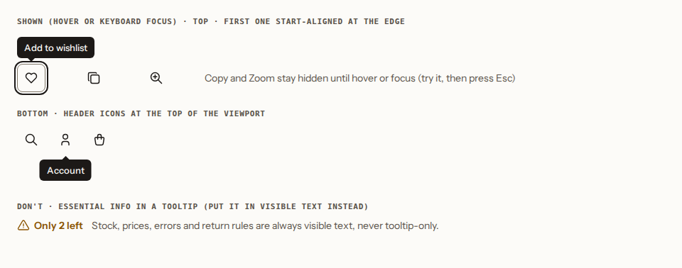

**Anatomy**

```
      ┌──────────────────┐
      │ Add to wishlist  │   1 tooltip (role="tooltip"), inverted colours
      └────────▼─────────┘   2 arrow
            [ ♡ ]            3 trigger (icon button), inside 4 wrapper
```

1. **Tooltip**: one line of text, inverted colours.
2. **Arrow**: a small triangle pointing at the trigger.
3. **Trigger**: a focusable icon button.
4. **Wrapper**: an inline box around trigger and tooltip that positions the tooltip and carries the hover bridge.

**Properties**

| Name | Type | Default | Description |
|---|---|---|---|
| `text` | string | (required) | The label, a few words. |
| `placement` | `"top"` \| `"bottom"` | `"top"` | Above or below the trigger. Use bottom for header icons at the top of the viewport. |
| `align` | `"center"` \| `"start"` \| `"end"` | `"center"` | Centred on the trigger, or aligned to its left / right edge for triggers near a screen edge. |
| `role` | `"label"` \| `"description"` | `"label"` | `label`: the tooltip is the trigger's name (`aria-labelledby`), for icon-only buttons. `description`: extra hint for a button that already has a visible label (`aria-describedby`). |
| content | content | (required) | The trigger (an icon button). |

The component generates the tooltip id and wires the trigger to it.

**Events**: None.

**Sizes**

| Part | Value |
|---|---|
| Padding | 0.375rem 0.625rem |
| Text | 0.8125rem / 1.4, weight 500, one line (no wrap) |
| Gap to trigger | 0.5rem, bridged for the pointer by an invisible 0.5rem strip |
| Radius | `radius-sm` |
| Arrow | 0.3125rem, centred (start / end: 1.25rem from the aligned edge) |

**Variants**

| Variant | Placement |
|---|---|
| Top, centred (default) | Above the trigger, centred |
| Bottom | Below the trigger (header icons) |
| Start / end | Aligned to the trigger's left / right edge; combinable with bottom |

**States**

| State | Background | Text | Visibility |
|---|---|---|---|
| Hidden | none | none | opacity 0, no pointer events |
| Shown (trigger hovered or focus within the wrapper) | `text` | `background` | opacity 1, hoverable |
| Dismissed (`Esc`) | none | none | hidden until the pointer leaves or focus leaves the wrapper, then resets |
| Trigger focus-visible | standard focus ring on the trigger | | |

**Behaviour & motion**

- Shows on pointer hover over the wrapper and when focus is within it. No delay on focus; none needed on hover.
- Hoverable: the pointer can move from the trigger onto the tooltip across the 0.5rem bridge without it disappearing.
- `Esc` hides every tooltip whose wrapper is hovered or holds focus, without moving focus. Leaving with the pointer or moving focus away clears the dismissed state.
- Persistent: it stays until hover or focus ends, or `Esc`.
- Opacity fade `duration-fast` (150ms) `ease-out`. Reduced motion: instant.
- Stays on screen: use start / end alignment near edges, bottom placement at the top of the viewport.

**Keyboard**

| Key | Action |
|---|---|
| `Tab` | Focusing the trigger shows the tooltip |
| `Esc` | Hides it; focus stays on the trigger |

**Accessibility**

- Tooltip element: `role="tooltip"` with an id.
- Icon-only trigger: `aria-labelledby="{tooltip id}"` and no separate `aria-label`, so the name isn't read twice. Trigger with a visible label: `aria-describedby="{tooltip id}"`.
- Never attach a tooltip to a non-focusable element or a disabled button.
- WCAG 1.4.13: dismissible (`Esc`), hoverable (bridge), persistent.
- Contrast: `background` text on the `text` fill 16.9:1.
- Target: the trigger (icon buttons 2.5rem, 2.75rem below 48rem).

**Acceptance criteria**

- [ ] The tooltip appears on hover and on keyboard focus of its trigger, with no delay on focus.
- [ ] `Esc` hides it without moving focus; it can be re-shown by leaving and re-entering (1.4.13).
- [ ] The pointer can move onto the tooltip without it closing (1.4.13).
- [ ] It stays visible until hover or focus ends or `Esc` is pressed (1.4.13).
- [ ] Icon-only triggers take their accessible name from the tooltip via `aria-labelledby`, and the name is announced once (4.1.2, 2.5.3).
- [ ] No tooltip holds essential information or interactive content.
- [ ] Text contrast 16.9:1 (1.4.3); the trigger shows the standard focus ring (2.4.7).
- [ ] With reduced motion it appears instantly.
- [ ] At 320px and 200% zoom the tooltip stays within the viewport using the start / end / bottom variants (1.4.10).
- [ ] Triggers are at least 1.5rem (2.5.8).

**Do / Don't**

- **Do** use it for icon buttons in dense UI (header, image zoom, copy code).
- **Do** keep it to a few words.
- **Don't** put prices, stock levels, errors, return rules or links in a tooltip.
- **Don't** attach tooltips to non-focusable elements or disabled buttons.

---

### Toast

A brief, non-blocking status message ("Added to cart") in a live region at the bottom corner, with an optional action and a close button. Use it to confirm background actions (added to cart, code copied, saved). Don't use it for form validation (show errors next to the field) or for anything the shopper must act on to continue (use a Dialog).

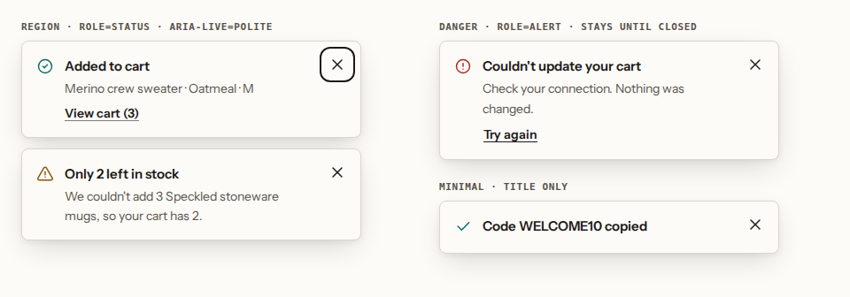

*Shown in the page flow; live toasts stack in the fixed region at the bottom right.*

**Anatomy**

```
 1 region (fixed, bottom right)
 ┌──────────────────────────────────────────┐
 │ (2 icon)  3 Title                  (6 ×) │  2 toast
 │           4 Supporting text (muted)      │
 │           5 Action link                  │
 └──────────────────────────────────────────┘
```

1. **Region**: a fixed stack at the bottom right, present once per page, empty on load.
2. **Toast** with its **icon** (variant icon, first in the row).
3. **Title**: carries the meaning.
4. **Text** (optional): one supporting line.
5. **Actions** (optional): one link or link-style button.
6. **Close button**: small ghost icon button, "Dismiss notification".

**Properties**

Region: placed once in the app layout. Toasts are created through a service call such as `toast.success(title, options)`, `toast.warning(...)`, `toast.danger(...)`.

| Name | Type | Default | Description |
|---|---|---|---|
| `variant` | `"success"` \| `"warning"` \| `"danger"` | `"success"` | Icon, colour and timing (see Variants). |
| `title` | string | (required) | The message. The meaning is always in this text. |
| `text` | string | none | Supporting line. |
| `action` | `{ label, href }` or `{ label, onActivate }` | none | One action: a link ("View cart (3)") or a button ("Try again"). |
| `duration` | ms | by variant | Auto-dismiss time; `0` = stays until closed. Danger is always `0`. |
| `id` | string | none | Dedupe key: a new toast with the same id replaces the old one. |

**Events**

- `dismiss`: fires with the toast id when a toast closes (close button, `Esc`, or timeout), with the reason.
- `action`: fires with the toast id when its action is activated.

**Sizes**

| Part | Value |
|---|---|
| Region | `min(24rem, 100vw − 2rem)` wide, 1rem from the right and bottom edges, gap 0.75rem between toasts, above everything (`z-toast`) |
| Toast | padding 1rem, gap 0.75rem, `radius-md`, 1px `border`, `shadow-md`, base text 0.9375rem |
| Icon | 1.25rem, nudged 0.125rem down to align with the title |
| Title | 0.9375rem, weight 600 |
| Text | 0.875rem, `muted`; 0.125rem below the title |
| Actions | 0.25rem above; 0.875rem link, weight 600 |
| Close | 2rem square ghost icon button, pulled 0.375rem up and right into the padding |

**Variants**

| Variant | Icon + colour | Role | Timing |
|---|---|---|---|
| Success | circle-check (or check), `success` | inside the polite status region | auto-dismiss after 6s, paused while hovered or focused |
| Warning | alert-triangle, `warning` | inside the polite status region | stays 10s, paused while hovered or focused, or until closed |
| Danger | alert-circle, `danger` | the toast itself is `role="alert"` (assertive) | stays until closed |

Colour and icon only reinforce the title.

**States**

| State / part | Background | Border | Text | Icon |
|---|---|---|---|---|
| Surface | `background` | `border` hairline, `shadow-md` | title `text`, text `muted` | variant colour |
| Action | none | none | `text`, underlined | none |
| Close, rest / hover | transparent / `text` at 6% | none | none | `text` |
| Focus-visible | standard focus ring on the action and close | | | |

**Behaviour & motion**

- Render the region **empty on page load** with `role="status" aria-live="polite" aria-label="Notifications"`, then insert success and warning toasts into it, so screen readers announce them without moving focus. Danger toasts carry `role="alert"`; insert them into the same fixed stack but outside the polite status element (a sibling inside the fixed region), so the two live regions aren't nested.
- Never move focus to a toast.
- Timers pause while the pointer is over the toast or focus is inside it, and resume on leave (2.2.1).
- At most three at once; the newest is at the bottom; the oldest leaves when a fourth arrives.
- Nothing essential lives only in a toast: the cart count and the cart itself also update.
- While a modal dialog or drawer is open, toasts render inside the open dialog (see the shared rules at the top of this group).
- On mobile the region sits above the sticky buy bar and never covers a focused field (2.4.11).
- Enter: fade in with a 0.5rem rise, `duration-base` (200ms) `ease-out`. Exit: fade out, `duration-fast` (150ms) `ease-in`. Reduced motion: toasts appear and disappear without movement.

**Keyboard**

| Key | Action |
|---|---|
| `Tab` | Reaches the action and close button in normal document order (the region sits at the end of `<body>`) |
| `Enter` / `Space` | Activates the action or close |
| `Esc` | Closes the toast that holds focus |

**Accessibility**

- Region: `role="status" aria-live="polite"`, present and empty from page load. Danger toast: `role="alert"`.
- Close button: `<button type="button" aria-label="Dismiss notification">`.
- Icons are decorative (`aria-hidden`).
- Contrast: title `text` 16.9:1 and text `muted` 7.4:1 on `background`; icons `success` 6.2:1, `warning` 6.1:1, `danger` 6.5:1; action `text` 16.9:1; focus ring 16.9:1.
- Targets: close 2rem; action link min 1.5rem.

**Acceptance criteria**

- [ ] The status region exists and is empty at page load; inserted success and warning toasts are announced politely, danger toasts assertively, and focus never moves (4.1.3).
- [ ] Success auto-dismisses after 6s and warning after 10s; both pause while hovered or focused; danger never auto-dismisses (2.2.1).
- [ ] `Tab` reaches the action and close button; `Enter` / `Space` activate them; `Esc` closes the focused toast (2.1.1).
- [ ] Every variant states its meaning in the title; the icon and colour are extras (1.4.1).
- [ ] Contrast pairs as listed (1.4.3); icons ≥ 3:1 (1.4.11); the standard focus ring shows on the action and close (2.4.7).
- [ ] No more than three toasts show at once; the region never covers a focused element or the sticky buy bar (2.4.11).
- [ ] Toasts raised while a modal is open are visible and announced.
- [ ] With reduced motion toasts appear and disappear without movement.
- [ ] At 320px and 200% zoom the region is `100vw − 2rem` wide and toast text wraps without loss (1.4.10, 1.4.12).
- [ ] Close button ≥ 2rem (2.5.8).

**Do / Don't**

- **Do** confirm background actions: added to cart, code copied, saved.
- **Do** show at most three at once, newest at the bottom.
- **Don't** use toasts for form validation; show errors next to the field.
- **Don't** auto-dismiss danger messages.

---

### Breadcrumb

Shows where a product, collection or article sits in the catalogue and links back up the trail. Long trails collapse their middle levels into an ellipsis button when the breadcrumb is narrow. Don't show it on the home page or in checkout, and don't rely on it as the only way back; the header navigation stays.


**Anatomy**

```
 nav[aria-label="Breadcrumb"] > ol
 Home  ›  …  ›  Bowls  ›  Hand-thrown serving bowl, large
 1 link  3 ellipsis  1 link   4 current page (not a link)
      2 separator
```

1. **Link**: each ancestor level.
2. **Separator**: a small chevron drawn in CSS between items (not text, so it isn't read).
3. **Ellipsis button** (collapsible trails only): stands in for the hidden middle levels.
4. **Current page**: the last item, plain text with `aria-current="page"`.

**Properties**

| Name | Type | Default | Description |
|---|---|---|---|
| `items` | list of `{ label, href? }` | (required) | The trail; the last item is the current page and has no `href`. |
| `collapseAfter` | number | `1` | Items kept at the start when collapsed (Home). |
| `keepLast` | number | `2` | Items kept at the end when collapsed (the parent and the current page). |

The component marks the middle items as collapsible and handles the expand.

**Events**: None.

**Sizes**

| Part | Value |
|---|---|
| Text | 0.875rem |
| Gap | 0.25rem between rows, 0.5rem between items (and between separator and text) |
| Separator | 0.375rem square, 1.5px `muted` strokes on two sides, rotated 45° (a chevron), 0.125rem extra space after |
| Link | min-height 1.5rem (`target-min`), corner radius 2px (for the focus ring) |
| Ellipsis button | min 1.5rem × 1.5rem, padding 0 0.25rem, `radius-sm`, weight 600, letter-spacing 0.08em |
| Collapse threshold | the breadcrumb's own width below 48rem |

**Variants**

| Variant | Behaviour |
|---|---|
| Default | All items visible; the trail wraps |
| Collapsible | When the breadcrumb is narrower than 48rem, the middle items hide and the ellipsis button shows. Keeps the first (Home) and the last two levels. |
| Expanded | After the ellipsis is activated: every item shows and the ellipsis hides, for the rest of the page view |

**States**

| State / part | Background | Text | Decoration |
|---|---|---|---|
| Link | none | `muted` | underline hidden (transparent) |
| Link hover | none | `text` | underline visible, 0.2em offset |
| Current page | none | `text`, weight 500 | none |
| Separator | none | `muted` stroke | none |
| Ellipsis rest / hover | none / `text` at 6% | `muted` / `text` | none |
| Focus-visible | standard focus ring | | |

**Behaviour & motion**

- The collapse is driven by the breadcrumb's own width, not the viewport.
- Activating the ellipsis marks the breadcrumb expanded, reveals the hidden levels, hides the ellipsis, and moves focus to the first revealed link.
- Product titles are never truncated; the trail wraps.
- Emit `BreadcrumbList` structured data from the same items.
- Motion: colour changes only, `duration-fast` (150ms). Reduced motion: instant.

**Keyboard**

| Key | Action |
|---|---|
| `Tab` | Through the links, and the ellipsis button when collapsed |
| `Enter` | Follows a link |
| `Enter` / `Space` on the ellipsis | Expands the trail and moves focus to the first revealed link |

**Accessibility**

- `<nav aria-label="Breadcrumb">` landmark with an `<ol>`; one `<li>` per level. Separators are CSS, not read.
- Current page: `<span aria-current="page">`, not a link.
- Ellipsis: `<button type="button" aria-label="Show 3 more levels">` (the count is the number of hidden levels).
- Contrast: links and separators `muted` 7.4:1 on `background` (6.8:1 on `surface`); current and hovered `text` 16.9:1; focus ring 16.9:1.
- Targets: links and the ellipsis 1.5rem minimum.

**Acceptance criteria**

- [ ] Markup is a `<nav aria-label="Breadcrumb">` with an ordered list; the current page is `aria-current="page"` and not a link (1.3.1, 4.1.2).
- [ ] Separators are not announced.
- [ ] Below 48rem breadcrumb width a long trail shows Home, the ellipsis, and the last two levels; from 48rem everything shows.
- [ ] Activating the ellipsis with `Enter` or `Space` reveals all levels and moves focus to the first revealed link (2.1.1, 2.4.3).
- [ ] The ellipsis has an accessible name giving the number of hidden levels (4.1.2).
- [ ] Hover adds an underline, not only a colour change (1.4.1).
- [ ] Contrast 7.4:1 for links, 16.9:1 for the current page (1.4.3); the standard focus ring shows on every link and the ellipsis (2.4.7).
- [ ] At 320px and 200% zoom the trail wraps without horizontal scroll and titles are not truncated (1.4.10).
- [ ] Links and the ellipsis are at least 1.5rem tall (2.5.8).

**Do / Don't**

- **Do** show it on product, collection and article pages.
- **Do** keep product titles whole; let the trail wrap.
- **Don't** show it on the home page or in checkout.
- **Don't** use it as the only way back; the header navigation stays.

---

### Pagination

Moves between pages of a collection or search results: numbered links with previous / next, a compact "Page 2 of 12" form for narrow widths, and a "Load more" alternative. Don't show it when there's only one page, and never use infinite scroll without a button (the footer becomes unreachable).


**Anatomy**

```
 nav[aria-label="Pagination"] > ul
 ‹ Previous   1   …   5  [6]  7   …   12   Next ›
 1 prev       2 page 3 gap  4 current      1 next

 compact:    (5 ‹)   6 Page 2 of 12   (5 ›)

 load more:  7 Showing 24 of 96 products
             8 ▬▬▬▬───────────  (decorative meter)
             9 [ Load more ]
```

1. **Previous / next**: links with chevron and text; a non-focusable span when disabled.
2. **Page link**: one per shown page number.
3. **Gap**: "…", decorative.
4. **Current page**: filled.
5. **Compact arrows**: outline icon buttons (links).
6. **Status**: "Page 2 of 12".
7. **Load-more status**: "Showing 24 of 96 products", a polite live region.
8. **Meter**: decorative progress bar.
9. **Load more button**: outline button.

**Properties**

Pagination:

| Name | Type | Default | Description |
|---|---|---|---|
| `page` | number | (required) | Current page, 1-based. |
| `totalPages` | number | (required) | Total pages. Nothing renders when it's 1. |
| `siblings` | number | `1` | Pages shown on each side of the current one. First and last always show; the rest collapse to "…". |
| `hrefForPage` | function (page → url) | `?page={n}` | Builds each link's URL. |
| `compact` | boolean | `false` | Forces the compact form. By default the numbered form shows from 48rem of the pagination's own width and the compact form below. |

Load more:

| Name | Type | Default | Description |
|---|---|---|---|
| `shown` | number | (required) | Items currently shown. |
| `total` | number | (required) | Total items. The button hides when `shown` equals `total`. |
| `noun` | string | `"products"` | Word used in the status. |
| `pending` | boolean | `false` | Loading state of the button (busy, spinner). |

**Events**

- Pagination: none (real links).
- Load more: `load` fires when the button is activated.

**Sizes**

| Part | Value |
|---|---|
| Page link | min 2.5rem × 2.5rem, padding 0 0.5rem, `radius-md`, weight 500, tabular numbers |
| Previous / next | 2.5rem tall, padding 0 0.75rem, gap 0.25rem, 1rem chevron |
| Gap between items | 0.25rem |
| Gap ("…") | min-width 2rem, centred |
| Compact arrows | 2.75rem square outline icon buttons |
| Compact status | 0.9375rem, padding 0 0.75rem, tabular numbers, no wrap |
| Load-more status | 0.875rem, tabular numbers |
| Load-more meter | `min(14rem, 100%)` × 0.25rem, `radius-full` |
| Load-more stack | centred, gap 0.75rem |

**Variants**

| Variant | Use |
|---|---|
| Numbered | Collection and search pages from 48rem width. First, last and current ±1 always show; the rest collapse to "…". Centred, wraps. |
| Compact | Below 48rem: previous / next icon buttons at the ends and "Page 2 of 12" between them, on one line. |
| Load more | Collections where browsing matters more than position. Keeps the URL in sync (`?page=2`) so Back works. |

**States**

| State / part | Background | Border | Text |
|---|---|---|---|
| Page link | none | none | `text` |
| Hover | `text` at 6% | none | `text` |
| Current | `primary` | none | `primary-contrast`, weight 600 |
| Disabled previous / next | none | none | `muted` at 60% opacity, not a link, no pointer events |
| Gap | none | none | `muted` |
| Compact arrows | `background` (hover `surface`) | `border-strong` (hover `text`) | icon `text` |
| Compact status | none | none | `muted`, numbers `text` weight 600 |
| Meter | track `surface-strong` | none | fill `text` |
| Focus-visible | standard focus ring | | |

**Behaviour & motion**

- Numbered and compact are driven by the same data.
- When a new page loads, scroll to the top of the grid, not the page.
- Load more: the status updates to "Showing 48 of 96 products" (polite), the meter fills proportionally, new items fade in over `duration-base` (200ms), and focus moves to the first new product so keyboard users continue from there (2.4.3). The button stays reachable after the grid, and the URL updates to the next page.
- Colour changes `duration-fast` (150ms). Reduced motion: new items appear instantly.

**Keyboard**

| Key | Action |
|---|---|
| `Tab` | Previous, page links, next (disabled ends and gaps are skipped) |
| `Enter` | Follows a link / activates Load more (`Space` too on the button) |

**Accessibility**

- `<nav aria-label="Pagination">` around a `<ul>`.
- Real links (`<a href="?page=7">`) so pages are crawlable and open in new tabs; previous / next carry `rel="prev"` / `rel="next"`.
- Each number: `aria-label="Page 7"`; the current one `aria-label="Page 6, current page"` plus `aria-current="page"`.
- Gaps are `aria-hidden`. Disabled ends are `<span aria-disabled="true">`, not focusable.
- Compact arrows: "Previous page" / "Next page".
- Load more: the status `<p aria-live="polite">`; the button is `aria-describedby` the status; the meter is `aria-hidden`.
- Contrast: page links `text` 16.9:1; current `primary-contrast` on `primary` 15.6:1; hover `text` on the 6% tint 15.0:1; status `muted` 7.4:1; compact arrow outline `border-strong` 4.5:1; focus ring 16.9:1, and `focus-inner` 16.2:1 against `primary`.
- Targets: page links 2.5rem, compact arrows 2.75rem.

**Acceptance criteria**

- [ ] Links are real `<a href>` elements with page URLs; the current page has `aria-current="page"` and the name "Page n, current page" (4.1.2).
- [ ] Disabled ends are not focusable and not links; gaps are hidden from assistive technology.
- [ ] The current page is shown by the fill and weight, and announced, not only by colour (1.4.1).
- [ ] Below 48rem width the compact form shows on one line; from 48rem the numbered form shows (1.4.10).
- [ ] Load more announces the new count politely and moves focus to the first new item (4.1.3, 2.4.3); the URL updates so Back returns to the same position.
- [ ] Every link and button shows the standard focus ring, including on the `primary` current page (2.4.7).
- [ ] Contrast pairs as listed (1.4.3); compact arrow outlines 4.5:1 (1.4.11).
- [ ] With reduced motion new items appear without a fade.
- [ ] At 320px and 200% zoom nothing overflows horizontally (1.4.10).
- [ ] Page links ≥ 2.5rem, compact arrows 2.75rem (2.5.8).
- [ ] Nothing renders when there's only one page.

**Do / Don't**

- **Do** scroll to the top of the grid (not the page) when a new page loads.
- **Do** keep the numbered and compact forms driven by the same data.
- **Don't** use infinite scroll without a button: the footer becomes unreachable.
- **Don't** show pagination when there's only one page.

---

### Carousel

Arrows, dots and a counter that drive a native scroll-snap carousel: product rows and single-slide image galleries. Every slide is reachable by plain scrolling, touch and trackpad; the controls are an extra. Autoplay is off by default; if a merchant turns it on, a visible Pause button is mandatory (WCAG 2.2.2). Product rows never autoplay. The Lightbox reuses this component for its image track.


**Anatomy**

```
 1 section (carousel)
 2 Heading ························· (3 ‹) (3 ›)   arrows in the header (product rows)
 ┌──────┐┌──────┐┌──────┐┌──────┐┌──
 │ 5    ││slide ││slide ││slide ││      4 track: scroll-snap, focusable
 └──────┘└──────┘└──────┘└──────┘└──
 [6 Pause]      7 ▬ ○ ○ ○      (3 ‹) 8 1 / 4 (3 ›)   single-slide galleries
```

1. **Carousel**: a `<section>` wrapper with a label.
2. **Heading**: the block heading (product rows), which also labels the section.
3. **Arrows**: previous / next circular buttons.
4. **Track**: the horizontally scrolling, snapping list of slides; focusable.
5. **Slide**: a product card (rows) or a figure (galleries).
6. **Pause / Play button**: only with autoplay.
7. **Dots**: one button per slide; the current one is a pill.
8. **Counter**: "1 / 4", current number bold.

**Properties**

| Name | Type | Default | Description |
|---|---|---|---|
| `label` | string | (required) | Accessible name of the carousel (or it's labelled by the visible heading). |
| `perView` | number or `{ base, md, lg }` | `1.25` (80% slide) | Slides per view. Product rows: `{ base: 1.25, md: 3, lg: 4 }` so mobile shows a peek of the next card. |
| `controls` | `"header"` \| `"below"` | `"header"` | Arrows in the block header (rows) or in a control bar below the track (galleries). |
| `dots` | boolean | `false` | Shows dots. Use only for single-slide galleries. |
| `counter` | boolean | `false` | Shows the "n / total" counter between the arrows. |
| `autoplay` | ms | `0` (off) | Advances every n ms (6000 recommended). Any non-zero value requires the Pause button, which is always rendered with it. |
| content | content | (required) | The slides. |

**Events**

- `change`: fires with the new current index when the visible slide changes.

**Sizes**

| Part | Value |
|---|---|
| Arrow | 2.75rem circle, 1px `border-strong`, 1.25rem chevron |
| Controls gap | 0.5rem |
| Dot | 1.5rem square target; visible dot 0.5rem circle with a 1.5px ring; current: 1.25rem × 0.5rem pill; no gap between dot targets |
| Counter | 0.875rem, tabular numbers, min-width 3.5rem, centred |
| Pause / Play | small outline button (2rem tall) |
| Track gap | 1rem |
| Slide width | default 80% of the track; product rows `(100% − 3 × 1rem) / 4` from 64rem block width, 3 per view from 48rem, ~80% below 48rem (peek); single-slide galleries 100% |
| Track focus ring | the standard ring with a 4px `focus-inner` gap (sits 4px outside the track) |

**Variants**

| Variant | Controls |
|---|---|
| Product row | Arrows in the block header; no dots and no counter (many items visible at once); never autoplays. The track is a `<ul>` of product cards. |
| Single-slide gallery | Pause (only with autoplay) on the left, dots in the middle, arrows with the counter between them on the right, below the track |
| Autoplay (opt-in) | Single-slide gallery plus autoplay and the mandatory Pause / Play button |

**States**

| State / part | Background | Border | Text / icon |
|---|---|---|---|
| Arrow, rest | `background` | `border-strong` | `text` |
| Arrow, hover | `surface` | `text` | `text` |
| Arrow, disabled (at an end) | same, 45% opacity, `not-allowed` cursor | | |
| Dot | transparent | `border-strong` ring | none |
| Dot, current | `text` filled pill (shape change, not colour alone) | `text` | none |
| Counter | none | none | `muted`; current number `text` weight 600 |
| Pause / Play | outline button states | | label "Pause" while playing, "Play" while paused |
| Focus-visible | standard focus ring on arrows, dots, Pause and the track | | |

**Behaviour & motion**

- **Current index** is the slide whose start is closest to the track's scroll position; everything re-syncs after scrolling settles (about 60ms after the last scroll event).
- **Arrows** scroll to the previous / next slide. Previous is disabled when the track is at its start; next is disabled when the track's end is visible. If the focused arrow becomes disabled, focus moves to the other arrow, so it's never stranded.
- **Dots** scroll to their slide; the current dot has `aria-current="true"`.
- **Counter** reads "current / total".
- **Scrolling** is native: touch, trackpad and shift-wheel all work; no swipe library. The scrollbar is hidden; horizontal overscroll doesn't chain to the page.
- **Motion**: smooth scrolling between slides; dot width and colour `duration-fast` (150ms) `ease-out`; arrow colour `duration-fast`.
- **Reduced motion**: jumps instantly (no smooth scroll), and **autoplay never starts**: the button shows "Play".
- **Autoplay** (only when `autoplay` > 0, and only with the Pause / Play button present):
  - Advances one slide every `autoplay` ms; after the last slide it returns to the first.
  - Pauses while the pointer is over the carousel, while focus is inside it, and while the browser tab is hidden; resumes when those end (unless paused by the button).
  - The Pause / Play button toggles it. Its name changes between "Pause slideshow" and "Play slideshow", and its visible text between "Pause" and "Play".
  - The track has `aria-live="off"`, so automatic changes aren't announced.

**Keyboard**

| Key | Action |
|---|---|
| `Tab` | Product row: the header arrows, then the track, then the links inside the cards. Gallery: the track (and any links in slides), then Pause / Play, the dots, previous, next. |
| `←` / `→` (track focused) | Previous / next slide |
| `Enter` / `Space` | Activates an arrow, a dot or Pause / Play |

Inside the Lightbox, `←` / `→` work from anywhere in the viewer, not only on the track.

**Accessibility**

- Wrapper: `<section aria-roledescription="carousel">` with `aria-label` or `aria-labelledby` the heading.
- Track: `tabindex="0"` with a label ("Bestsellers, scrollable list" for rows, "Slides" for galleries).
- Gallery slides: `role="group" aria-roledescription="slide" aria-label="2 of 4"`. Product row slides are list items holding Product cards.
- Arrows: `<button>` named "Previous products" / "Next products" (rows) or "Previous slide" / "Next slide" (galleries); `disabled` at the ends.
- Dots: `<button aria-label="Go to slide 3">`; current `aria-current="true"`.
- Counter: `aria-hidden="true"` (dots and slide labels already say it).
- WCAG 2.2.2: anything that moves on its own for more than 5s has a visible Pause.
- Contrast: arrow outline and dot ring `border-strong` 4.5:1 on `background` (3.6:1 on `surface-strong`); arrow icon `text` 16.9:1; current dot `text` 16.9:1; counter `muted` 7.4:1; focus ring 16.9:1.
- Targets: arrows 2.75rem, dots 1.5rem, Pause 2rem.

**Acceptance criteria**

- [ ] Every slide can be reached by scrolling the track with touch, trackpad or keyboard, without using the arrows (2.1.1).
- [ ] With the track focused, `←` / `→` move one slide; arrows, dots and Pause work with `Enter` and `Space` (2.1.1).
- [ ] Arrows are disabled at the ends and focus is never left on a disabled arrow (2.4.3).
- [ ] The current dot is a filled pill with `aria-current="true"`, a shape change as well as colour (1.4.1, 4.1.2).
- [ ] Slides are announced as "slide, 2 of 4"; the counter is not announced (1.3.1).
- [ ] Autoplay is off by default; when on, a visible Pause / Play button is present, and autoplay pauses on hover, focus and hidden tabs (2.2.2).
- [ ] With reduced motion slides change instantly and autoplay never starts.
- [ ] The standard focus ring shows on arrows, dots, Pause and the track (the track's ring clears the slide edges) (2.4.7).
- [ ] Contrast pairs as listed (1.4.3); arrow and dot outlines ≥ 3:1 (1.4.11).
- [ ] At 320px and 200% zoom the track scrolls inside itself, the page doesn't scroll horizontally, and a peek of the next slide shows (1.4.10).
- [ ] Arrows 2.75rem, dots 1.5rem, Pause 2rem (2.5.8).

**Do / Don't**

- **Do** show a peek of the next slide on mobile so the row reads as scrollable.
- **Do** keep every slide's content reachable without the arrows (it's a scroll container).
- **Don't** autoplay product rows.
- **Don't** show arrows only on hover; they're always visible.

---

## Definition of done

A core component is done when:

- [ ] It matches its reference image(s) at the sizes and states shown, using only token roles for colour.
- [ ] Every property, variant, size and state in its section is implemented, and nothing else.
- [ ] Every item in its acceptance checklist passes, including the Spec 1 testing protocol (automated check, keyboard-only pass, screen-reader pass, contrast, 200% zoom and 320px reflow, reduced motion, forced colours).
- [ ] Modal surfaces use the native `<dialog>` opened as a modal; nothing else traps focus.
- [ ] It shows the standard (or specified inset) focus ring, with its grow-in motion.
- [ ] It survives long content, missing optional content and a narrow container.
- [ ] It has a story or example page covering each state, for review and for visual regression tests.
