# Eldra Starter · Spec 2: Blocks and sample pages

This spec covers the **content blocks** that editors place on pages in Studio, and four **sample pages** assembled from them. Blocks are built **only** from the core components in **Spec 1** (`01-core-components.md`) plus plain layout. Every block section names the components it uses, and everything in Spec 1 applies here: tokens, the focus ring, the WCAG 2.2 AA requirements, the rule that every modal is a native `<dialog>`, and the custom selects.

It is framework-neutral. The reference images in `images/blocks/` and `images/pages/` show each block at 1280px (desktop, the default story) and 360px (mobile), plus its variants and states. The small monospace label above each image in the source set is given as the image's alt text. The flat coloured shapes stand in for CMS photography.

## Contents

1. [How blocks work](#how-blocks-work)
2. [Navigation and structure](#navigation-and-structure): Header, Announcement bar, Breadcrumbs, Footer
3. [Marketing](#marketing): Hero, Call to action, Feature grid, Split content, Stats, Logo cloud, Testimonials, FAQ, Pricing table, Newsletter, Contact and map, Video embed, Timeline, Team, Tabs block, Quote
4. [Content](#content): Article, Article list, Gallery, Image, Rich text
5. [Commerce](#commerce): Collection grid, Product detail, Product carousel, Collection header, Cart drawer and cart page, Search results page, Order status, Trust strip
6. [Sample pages](#sample-pages): Home, Product, Collection, Article
7. [Definition of done](#definition-of-done)

---

## How blocks work

### CMS model

- A block is a component fed by **fields** that an editor fills in Studio. Editors also edit text **inline** on the rendered page (headings, paragraphs, rich text) and frame images (focal point and zoom). Every visible text in a block must therefore come from a field, and must be inline-editable.
- Field types: `string` (one line), `text` (multi-line, no formatting), `rich-text`, `media` (single or multiple, with alt text and framing), `select` (fixed options), `bool`, `list` (repeatable items with sub-fields, written `items[].title`), and `link` (label plus href). Variants are a `select` field called `variant`.
- Field ids are `camelCase`; block ids are `kebab-case`. No field may require per-site code (no "custom HTML").
- Commerce data (products, prices, stock, cart, orders, search results) comes from the store, not from fields. The block's fields configure how it's shown.

### Containers, backgrounds and spacing

- Every block picks one **container**: `narrow` 40rem, `content` 64rem, `wide` 80rem or `full`. Side gutters are 1rem, 1.5rem and 2rem at mobile, tablet and desktop widths.
- **Section background**: none (`background`), `surface`, `surface-strong`, `primary` or `accent`, where the block allows it. On `primary` and `accent`, text and controls switch to the contrast colours (Spec 1, Container and section). The focus ring doesn't change.
- **Section spacing**: `section-sm`, `section-md` (default) or `section-lg`, applied as top and bottom padding. When two adjacent blocks have the same background, the second drops its top padding, so the gap isn't doubled.

### Responsive behaviour

Blocks respond to **their own width**, not the viewport, so a block placed in a narrow column uses its mobile layout. Breakpoints: below 48rem (mobile), 48–64rem (tablet), from 64rem (desktop), from 80rem (wide). Every block is designed and checked at 360, 768 and 1280px.

### States every block must handle

| State | Requirement |
| --- | --- |
| Ideal | The default story shown in the 1280 image. |
| Minimal | Only required fields filled; the layout still looks intentional. |
| Long content | Headings twice as long, 40-word headings, long product names: nothing overlaps or clips, and text wraps (never truncates) unless the section says so. |
| Many items | Up to the list maximum (often 12); grids wrap and carousels scroll. |
| No image | Media slots collapse or show the no-image layout; the block never depends on a particular image aspect ratio. |
| Empty (freshly inserted) | In the **editor**, dashed placeholders ("Add a heading", "Choose an image") show where content goes. On the **live site**, empty optional parts don't render at all, and a block with no required content renders nothing. |

### Block-picker thumbnail

Studio's block picker shows a 1280px-wide capture of each block's default story. The default content in each section is what that capture shows, so keep it realistic and complete.

### Page-level accessibility

- Landmarks: the Header is the `banner` (`<header>`), the main content area is `main`, the Footer is the `contentinfo` (`<footer>`), and primary navigation is a `nav` with a label. Breadcrumbs are a `nav` labelled "Breadcrumb". A skip link ("Skip to content") is the first focusable element on every page.
- Exactly one `h1` per page (the Hero on the home page, the product title, collection title or article title elsewhere). Block headings are `h2`, and items inside blocks are `h3`. Never skip levels to get a visual size; the type styles are separate from heading levels.
- A sticky header adds scroll padding equal to its height, so focused elements and anchor targets are never hidden under it (2.4.11).
- Each block must pass the Spec 1 testing protocol in every state listed in its section.

---

## Navigation and structure

Shared rules for every block in this part:

- **Block width, not viewport.** Every breakpoint below is measured on the block's own width: mobile below 48rem, tablet from 48rem, desktop from 64rem, wide from 80rem.
- **Containers.** `narrow` 40rem, `content` 64rem, `wide` 80rem of content, plus side gutters of 1rem (below 48rem), 1.5rem (48–64rem) and 2rem (from 64rem). `full` has no max width and no gutters.
- **Section spacing** is vertical padding: `section-sm` clamp(2rem, 1.5rem + 2vw, 3rem), `section-md` clamp(3rem, 2rem + 4vw, 6rem) (the default for every block), `section-lg` clamp(4rem, 2.5rem + 6vw, 8rem).
- **Headings** below 48rem of block width: display 3.5 → 2.5rem, h2 2 → 1.625rem, h3 1.5 → 1.25rem.
- **Focus.** Every interactive part uses the standard focus ring unless a section says "inset focus ring". The ring never changes colour per background. The `focus-inner` infill carries the contrast on dark grounds (16.2:1 against `primary`, 6.7:1 against `accent`), and the `focus` ring carries it on light grounds (16.9:1 on `background`, 15.5:1 on `surface`, 13.8:1 on `surface-strong`).
- **Reduced motion.** With `prefers-reduced-motion: reduce`, every transition and animation takes effectively 0ms, smooth scrolling becomes an instant jump, and slide-in drawers fade in over `duration-base` instead.
- **Editor-only placeholders.** An "editor hint" is a dashed box (1.5px `border-strong` dashed, `radius-lg`, `surface` fill, 2rem padding, 0.875rem `muted` text with an optional bold `text` first line). Hints appear only in the page editor, never on the live site.

---

### Header · `header`

The store's top bar: brand, primary links with optional mega-menus, search, wishlist, cart and one call to action. There is no account control: the platform has no customer login yet, and an icon that leads nowhere is worse than none. Below 64rem of block width it collapses into a menu drawer.

**Container** `wide` · **Section background** default `background` (transparent over a Hero `image-background` when `transparentOverHero` is on) · **Section spacing** none (the bar sets its own height)

**Uses** Button (ghost icon for menu, search, wishlist, cart and close; primary sm for the call to action; primary full width in the drawer), Link, Drawer (left, on the native `<dialog>`), SearchModal (or SearchBar in `inline` search style), Image (feature cards), and the cart and wishlist count badges.

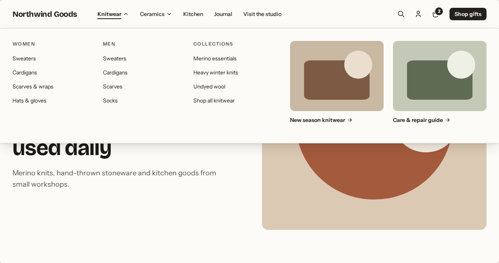
*Desktop: the Knitwear trigger is expanded (weight 600, 2px underline, chevron up). The panel spans the full width below the bar with three groups and two feature cards.*

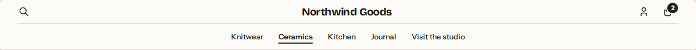

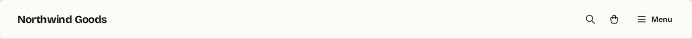
*Variants: `centered` puts search on the left, the brand in the centre and the links on a second row under a hairline. `minimal` shows only brand, search, cart and a "Menu" button at every width.*

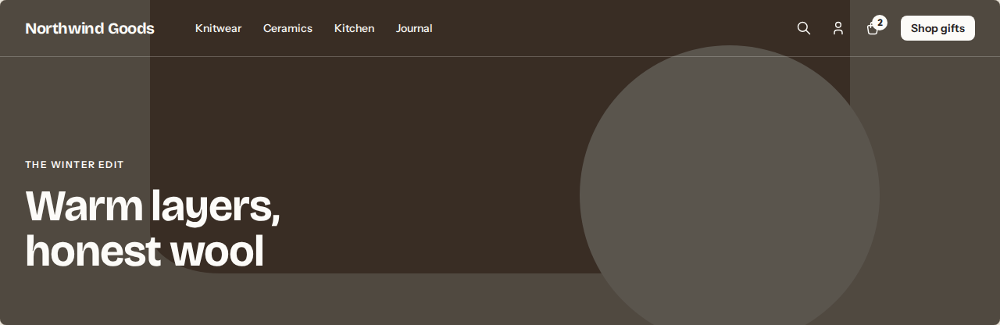
*Transparent mode: `primary-contrast` text and icons on the Hero's `overlay` scrim. The count badge and call to action invert, and the hairline is `primary-contrast` at 24%.*

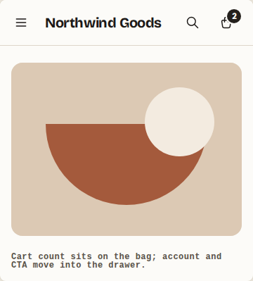

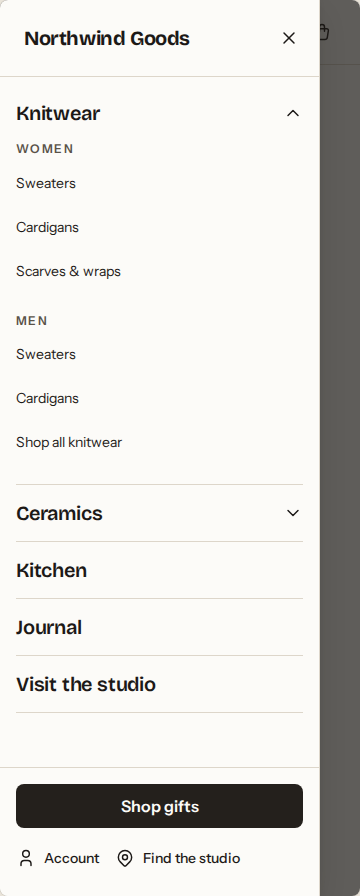
*Mobile: menu button, brand, search and cart, with the count sitting on the bag. The drawer comes in from the left over the `overlay` scrim. Links with groups expand in place, and the call to action and utility links sit in the drawer foot.*

**Fields**

| Field id | Type | Required | Default | Notes |
|---|---|---|---|---|
| `variant` | select | yes | `default` | `default` · `centered` · `minimal`. |
| `brandText` | string | yes | store name | Rendered as the wordmark when no logo is set. Keep it under 20 characters. It never wraps. |
| `brandLogo` | media | no | none | SVG or PNG. Replaces the wordmark. Shown 2rem tall, max 10rem wide, `object-fit: contain`. Alt text defaults to the store name. |
| `links` | list | no | empty | Primary links. 3 to 6 recommended; the editor warns above 6. |
| `links[].label` | string | yes | — | Two words max. Stays on one line. |
| `links[].link` | link | no | — | Destination when the item has no mega-menu. |
| `links[].groups` | list | no | empty | Filling it turns the item into a mega-menu disclosure button. Up to 4 groups. |
| `links[].groups[].title` | string | yes | — | Short group label, shown uppercase by styling (never typed in caps). |
| `links[].groups[].links` | list | yes | — | Each has `label` (string) and `link` (link). Up to 8 per group. |
| `links[].features` | list | no | empty | Up to 2 image cards on the right of the mega-menu. |
| `links[].features[].image` | media | yes | — | 4:3 crop. Focal point respected. |
| `links[].features[].label` | string | yes | — | For example "New season knitwear". |
| `links[].features[].link` | link | yes | — | |
| `showSearch` | bool | no | on | Shows the search control. It opens SearchModal (also on `/` and `⌘K` / `Ctrl+K`). |
| `searchStyle` | select | no | `icon` | `icon`: a ghost icon button that opens SearchModal. `field`: a pill-shaped search trigger that looks like a field ("Search the shop", with a `⌘K` hint) and opens the same modal. It shows from 64rem only; below that the icon button shows. `inline`: `centered` variant only, a SearchBar in the bar with live results in a panel below it (from 64rem; below that the icon button shows). |
| `cta` | link | no | none | One primary button (label and link). Hidden in the bar below 64rem, where it becomes the full-width drawer button. |
| `sticky` | bool | no | on | The header stays at the top while scrolling. |
| `transparentOverHero` | bool | no | off | Only takes effect when the next block is a Hero with variant `image-background`. Otherwise it is ignored. |

The cart count is not a field: it comes from the cart.

**Variants**

| variant | What changes |
|---|---|
| `default` | Brand left, links inline after it, then search, wishlist, cart and call to action on the right. |
| `centered` | From 64rem: search on the left, brand centred, wishlist and cart (and the call to action when set) on the right. The links sit on a second row, centred, under a `border` hairline. Below 64rem it is identical to `default`. |
| `minimal` | Brand left; search, cart and a "Menu" button on the right at every width. Links and the call to action live only in the drawer; the wishlist heart is not shown. Good for landing pages and small catalogues. |

**Layout**

- **Below 48rem**: the bar is 4rem tall with 1rem gutters. Grid columns `auto minmax(0, 1fr) auto auto`: menu button, brand (left aligned), search, actions (wishlist, cart). The column gap is 0.25rem. The menu button is pulled 0.5rem into the gutter. Icon buttons are 2.75rem square with 1.25rem icons. The call to action is hidden. The drawer comes in from the left, `min(22rem, 100%)` wide, over the `overlay` scrim.
- **48–64rem**: same as mobile with 1.5rem gutters; icon buttons are 2.5rem. In `minimal`, the menu button shows a "Menu" text label next to its icon (auto width, 0.75rem side padding).
- **From 64rem**: the bar is 4.5rem tall with 2rem gutters inside the wide container (80rem). Grid `auto minmax(0, 1fr) auto auto`: brand, links, search, actions. The menu button is hidden. The links start 2rem after the brand and are 0.25rem apart. Each link is 2.5rem tall with 0.75rem side padding, 0.875rem text at weight 500. Actions are 0.25rem apart. The call to action (Button primary sm: 2rem tall, 0.875rem text) sits 0.75rem after the cart.
- **Brand**: heading font, 1.25rem, weight 700, letter-spacing −0.02em, line-height 1, min height 2.75rem, 0.25rem side padding, `radius-sm` corners (for the focus ring).
- **Cart count**: a pill at least 1.25rem wide and 1.25rem tall with 0.3125rem side padding. 0.75rem bold tabular figures, `primary` fill, `primary-contrast` text, a 2px `background` ring. It sits 0.125rem from the top of the cart button, flush right. Above 99 it reads `99+`. With 0 items there is no badge.
- **Mega-menu panel** (from 64rem): positioned directly below the bar, full block width, over the page. `background` fill, `border` hairlines top and bottom, `shadow-md`. Inside the wide container: a grid of `minmax(0, 1fr) auto` with a 3rem gap and 2rem top / 3rem bottom padding.
  - Groups use an auto-fill grid (columns min 10rem) with 2rem gaps.
  - Group title: 0.75rem, weight 600, letter-spacing 0.12em, uppercase, `muted`, 0.75rem below.
  - Second-level links are at least 2.25rem tall, 0.875rem, `text`.
  - Feature cards: two columns of 15rem with a 1.5rem gap. Each card is a 4:3 image (`radius-lg`) with, 0.75rem below it, a 0.875rem weight-600 link with a 1rem arrow-right icon.
  - Without `features`, the groups spread across the full width.
- **Drawer**:
  - Head: min height 4rem, 1rem left and 0.5rem right padding, `border` hairline below. It holds the brand (1.25rem) and a ghost icon close button.
  - Body: 0.5rem top, 1rem sides, 1.5rem bottom padding; it scrolls.
  - List: each top-level item has a `border` hairline below it. Top-level rows are full width and at least 3.5rem tall, in the heading font at 1.25rem, weight 600, with a trailing chevron on items that have groups.
  - Expanded item: a grid of its groups (1.25rem gap, 1.25rem bottom padding). Group titles are 0.25rem above their links, and links are 2.75rem tall. Feature cards are not shown in the drawer.
  - Foot: 1rem padding, 0.5rem gap, `border` hairline above. It holds the call to action as Button primary, full width (2.75rem tall below 48rem), then a utility row: links of at least 2.75rem, 0.875rem weight 500, icon plus label, 0.25rem × 1rem gaps. The Northwind story shows a "Find the studio" link there; that is store content, not a field.

**States**

| State | What it looks like |
|---|---|
| Ideal | 5 links, one or two with mega-menus, call to action set, cart count 1–9. |
| Minimal content | Brand and cart only. The bar still reads as complete, and nothing reflows. |
| Long content | 8 or more links overflow at 64–80rem (the editor warns above 6). The brand never wraps: keep it under 20 characters or upload a logo. Long link labels stay on one line. |
| Many items | Cart count shows `99+` above 99. A mega-menu with 4 groups × 8 links still fits one panel at 1280px. |
| No image | A mega-menu without `features` spreads its groups across the full width. No logo means the wordmark. |
| Empty (freshly inserted) | Brand from store settings, cart and search on, no links. The editor shows an "Add a link" hint where the links go. Live, the bar renders brand, search and cart. |
| Link hover | Underline (2px, offset 0.45em) fades from transparent to `currentColor` over `duration-fast`. |
| Current page | `aria-current="page"`, weight 600 and a permanent underline (not colour alone). |
| Mega-menu open | Trigger `aria-expanded="true"`, weight 600, permanent underline, chevron rotated 180° (over `duration-base`). The panel fades in over `duration-base` `ease-out` and has `shadow-md`. |
| Icon button hover / pressed | `text` tint at 6% / 11% behind the icon. Pressed buttons move down 1px. |
| Scrolled (sticky) | As soon as the page has scrolled, the header gains `shadow-sm` and its bottom hairline becomes transparent. |
| Transparent | Only over a Hero `image-background`. The bar background is transparent. Text and icons are `primary-contrast`, sitting directly on the Hero's `overlay` scrim. The hairline is `primary-contrast` at 24%. Icon button hover uses a `primary-contrast` tint at 14%. The count badge inverts (`primary-contrast` fill, `primary` text, no ring), and so does the call to action (`primary-contrast` fill, `primary` text). The bar turns solid (normal colours) as soon as the page scrolls or any menu in it is expanded. |
| Drawer open | The drawer slides in from the left over `duration-slow` `ease-out` (a fade with reduced motion). The `overlay` scrim covers the page, and the page does not scroll. |

**Field → layout mapping**

- `brandText` / `brandLogo` → the brand link in the bar and the brand in the drawer head.
- `links` → the bar's link list (from 64rem) and the drawer's top-level list.
- `links[].groups` → the mega-menu panel's groups (bar) and the expandable group list (drawer).
- `links[].features` → the feature cards on the right of the panel (bar only).
- `showSearch` / `searchStyle` → the search control.
- the wishlist store → the heart icon button linking to `/wishlist`, always in the bar (except `minimal`) whether or not anything is saved; its count badge appears from one item, read after mount so prerendered output carries no shopper state.
- The cart count → the cart button and its count badge.
- `cta` → the button after the cart (from 64rem) and the full-width drawer foot button.
- `variant` → the bar layout.
- `sticky` → the sticky behaviour and scrolled shadow.
- `transparentOverHero` → transparent mode.

**Keyboard & accessibility**

- **Landmarks**: a skip link ("Skip to content") comes first in the page. It is visually hidden until focused, then shown 1rem from the top left. Next is `<header>` (banner), which contains `<nav aria-label="Primary">`. Only one "Primary" navigation is exposed at a time: the bar's list from 64rem, the drawer's list below that (and at every width in `minimal`).
- **Tab order**: skip link → brand → links (when a mega-menu is open, its panel's links come right after its trigger: put the panel directly after the trigger in reading order) → search → wishlist → cart → call to action. Below 64rem: menu button → brand → search → wishlist → cart.
- **Mega-menus** are non-modal disclosures, never dialogs: the disclosure navigation menu pattern with its arrow-key extension. Each trigger is a `<button type="button" aria-expanded="false|true" aria-controls="{panel id}">` with the label as its name and a decorative chevron (`aria-hidden`). Each group's list is labelled by its group title (`aria-labelledby`). There is no `role="menu"` and no `aria-activedescendant`: these are navigation links, so focus moves to the links themselves and every one of them stays in the tab sequence.
  - `Enter` / `Space` on the trigger toggles its panel.
  - `Down` / `Up` on the trigger open the panel if it is closed and move focus into it, to its first or last link.
  - `Right` / `Left` move focus to the next or previous item in the bar's list — triggers and plain links alike — and stop at the ends rather than wrapping. Focus lands on the item itself, whether it travelled from an item or from inside an open panel: if a panel was open, the item it lands on opens its own panel and focus stays on the trigger, from where `Down` enters it. An ordinary link simply takes focus, and the open panel closes behind it.
  - `Home` / `End` on an item in the bar go to the bar's first and last item, landing the same way `Right` / `Left` do. Inside an open panel they belong to the panel (below).
  - Inside an open panel, `Down` / `Up` move through the panel's own reading order (the groups in order, then the feature links and the "View all" row), stopping at the ends; `Home` / `End` go to its first and last link. `Tab` and `Shift+Tab` move through those same links in the same order.
  - `Esc` with focus on the trigger or anywhere in the panel closes it and returns focus to the trigger.
  - A panel closes as soon as focus leaves its trigger and panel — `Tab` past the panel's last link, `Shift+Tab` before the trigger, or a click elsewhere on the page. Focus itself is not moved; only the panel closes.
  - Opening one panel closes any other.
  - Only the keys above are taken; every other key behaves as it does anywhere else on the page. The keys above do not scroll the page while focus is on an item in the bar or inside an open panel.
  - Hover is never required. On pointer devices, hovering may open a panel after 150ms. In that case the panel stays open while the pointer moves onto it, and `Esc` dismisses it (1.4.13). Click and keyboard always work. A hover-opened panel that focus has moved into belongs to the keyboard from then on: the pointer leaving no longer closes it, focus leaving does.
- **Menu drawer**: the menu button is a `<button aria-haspopup="dialog">`, labelled "Open menu" (in `minimal` the visible "Menu" text plus visually hidden "Open menu"). It opens a Drawer: the native `<dialog aria-label="Menu">` opened as a modal. The page behind is inert and does not scroll, focus stays inside, the backdrop is the `overlay` scrim, and `Esc` or the close button ("Close menu") closes it. A click on the backdrop also closes it.
  - Initial focus goes to the first link in the drawer's list (mark it autofocus).
  - On close, focus returns to the menu button.
  - Items with groups are disclosure buttons (`aria-expanded`, `aria-controls`); `Enter` / `Space` expands or collapses them in place.
- **Search**: the search control is a `<button aria-label="Search" aria-haspopup="dialog">` (the `field` style shows the text "Search the shop" as its name). It opens SearchModal, the native `<dialog>` opened as a modal, with focus in the search input. On close, focus returns to the control. `/` (when focus is not in a text field) and `⌘K` / `Ctrl+K` (anywhere) open the same modal. The `inline` style uses SearchBar instead: a combobox with a non-modal results listbox (see SearchBar for its keys).
- **Icon buttons** have `aria-label`s: "Search", and the wishlist heart "Wishlist" when empty or with its count ("Wishlist, 3 items", "Wishlist, 1 item"). The cart label includes the count ("Cart, 2 items", "Cart, 1 item", "Cart, empty") and updates when the count changes. The visual count badge is `aria-hidden`.
- **Targets**: icon buttons 2.5rem (2.75rem below 48rem of block width); links 2.5rem tall; second-level links 2.25rem (2.75rem in the drawer); drawer top-level rows 3.5rem; call to action 2rem in the bar and 2.75rem in the drawer on narrow screens.
- **Sticky header and focus**: when `sticky` is on, the page sets its scroll padding at the top to the header's height (5rem), so focused or anchored content never ends up hidden under the bar (2.4.11).
- **Transparent mode** keeps the standard focus ring: the `focus-inner` infill stays visible on the scrim and photo, so no override is needed.

**Default content (Northwind Goods)**

- Brand "Northwind Goods".
- Links:
  - Knitwear (mega-menu). Groups: **Women**: Sweaters, Cardigans, Scarves & wraps, Hats & gloves. **Men**: Sweaters, Cardigans, Scarves, Socks. **Collections**: Merino essentials, Heavy winter knits, Undyed wool, Shop all knitwear. Features: "New season knitwear" (folded walnut merino cardigan), "Care & repair guide" (darning kit with sage wool).
  - Ceramics (mega-menu). Group **Tableware**: Plates, Bowls, Mugs & cups.
  - Kitchen, Journal, Visit the studio.
- Call to action "Shop gifts". Cart count 2, wishlist empty. Drawer utility links: Find the studio.

**Acceptance criteria**

- [ ] Header text `text` on `background` is 16.9:1; group titles `muted` on `background` are 7.4:1; the count badge `primary-contrast` on `primary` is 15.6:1; the call to action `primary-contrast` on `primary` is 15.6:1 (1.4.3).
- [ ] In transparent mode, all bar text and icons are `primary-contrast` on the Hero's `overlay` scrim, at 6.2:1 or better on any photo. Transparent mode never applies unless the next block is Hero `image-background` (1.4.3, 1.4.11).
- [ ] Icons that carry meaning (search, wishlist, cart, menu, close, chevrons) are at least 3:1 against their ground (1.4.11). Hairlines are decorative `border` and never the only boundary of a control.
- [ ] Every interactive part (skip link, brand, links, mega-menu triggers, second-level links, feature links, icon buttons, call to action, drawer rows, drawer close, utility links) shows the standard focus ring, and the ring is not hidden under the sticky bar (2.4.7, 2.4.11, 2.4.13).
- [ ] `Enter` / `Space` toggles a mega-menu, and `Down` / `Up` on a trigger open it and move focus to the panel's first or last link. Inside a panel, `Down` / `Up` and `Home` / `End` walk its links in reading order without wrapping, and `Tab` still moves through the same links in the same order. `Right` / `Left` and `Home` / `End` travel the bar's own items, carrying an open panel with them. `Esc` from the trigger or inside the panel closes it and returns focus to the trigger, and the panel also closes as soon as focus leaves the trigger-and-panel pair. Opening one closes the other. Nothing opens only on hover (2.1.1, 1.4.13, 2.4.3).
- [ ] The menu drawer is a native `<dialog>` opened as a modal. Focus moves to the first menu link, `Tab` stays inside, `Esc` closes it, focus returns to the menu button, and the page behind does not scroll. There is no other keyboard trap anywhere in the header (2.1.2, 2.4.3).
- [ ] `/` and `⌘K` / `Ctrl+K` open SearchModal, and so does the search control. `/` does nothing while typing in a field.
- [ ] Every target is at least 1.5rem. Icon buttons are 2.75rem and the drawer call to action is 2.75rem tall below 48rem of block width (2.5.8).
- [ ] Current page and open states are shown by weight, underline and chevron rotation, never by colour alone (1.4.1). `aria-current="page"` and `aria-expanded` are set correctly (4.1.2).
- [ ] The cart button's accessible name includes the item count, and the visual badge is hidden from assistive technology (1.3.1, 4.1.2).
- [ ] With reduced motion, the drawer fades instead of sliding, and the chevron rotation, panel fade and focus ring are instant.
- [ ] At 320px wide and at 200% zoom, the bar shows menu, brand, search and cart without horizontal scrolling, and every link is reachable through the drawer (1.4.10). Text spacing overrides don't clip labels (1.4.12).
- [ ] At 64–80rem of block width, the editor warns when more than 6 links are set.

**Do / Don't**

- Do keep links to 6 or fewer and labels to one or two words.
- Do use a logo with enough contrast on `background` (and on the scrim if transparent mode is on).
- Don't put a second call to action in the bar; use the Announcement bar or a Call to action block.
- Don't turn on transparent mode above a light hero; the editor ignores it unless the next block is Hero `image-background`.
- Don't nest mega-menus; one level of groups only.

---

### Announcement bar · `announcement-bar`

A slim strip above the header for one short store-wide message, with an optional link and an optional dismiss button.

**Container** `wide` · **Section background** per variant: `primary` (default), `accent` or `surface-strong` · **Section spacing** none (0.5rem vertical padding, min height 2.5rem)

**Uses** Link (inline, with arrow) and Button (ghost icon, 2rem, for dismiss).

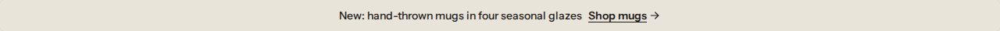
*Desktop: the message is optically centred between two 2rem columns. The right column holds the dismiss button when there is one.*

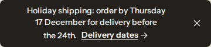

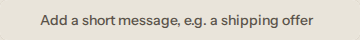
*Mobile: the message wraps (balanced) and the link never breaks internally. The empty state is an editor-only placeholder on `surface-strong`.*

**Fields**

| Field id | Type | Required | Default | Notes |
|---|---|---|---|---|
| `variant` | select | yes | `primary` | `primary` · `accent` · `subtle`. |
| `message` | string | yes | — | One sentence, ideally under 60 characters. Plain text. |
| `link` | link | no | none | Label and URL. Rendered inline after the message with an arrow. |
| `dismissable` | bool | no | on | Shows the dismiss button. The dismissal is remembered for the visitor, keyed to a hash of the message, so a new message shows again. |

**Variants**

| variant | Ground / text | Use |
|---|---|---|
| `primary` | `primary` / `primary-contrast` (15.6:1) | Default. |
| `accent` | `accent` / `accent-contrast` (6.7:1) | Sales and deadlines. Use sparingly. |
| `subtle` | `surface-strong` / `text` (13.8:1) | Quiet information. |

**Layout**

- **Below 48rem**: grid `minmax(0, 1fr) auto` with a 0.5rem gap. The message is centred and wraps (balanced) at 0.875rem / 1.45, weight 500. The dismiss button (2rem square) is in the right column, pulled 0.5rem into the gutter. Min height 2.5rem, 0.5rem vertical padding, 1rem gutters.
- **48–64rem**: grid `2rem minmax(0, 1fr) 2rem`, so the message is optically centred on the page. The dismiss button is in the third column; the first column is empty.
- **From 64rem**: same as tablet inside the wide container. Messages stay on one line up to about 140 characters.
- **Link**: inline after the message, 0.5rem to its left, weight 600, underlined (1px, offset 0.2em), with a 1rem arrow-right icon 0.125rem after the label. It never wraps internally and is at least 1.5rem tall. On hover the underline thickens to 2px.
- **Dismiss**: 2rem square, `radius-md`, an 1.125rem x icon in `currentColor`. On hover it gets a `currentColor` tint at 14%.

**States**

| State | What it looks like |
|---|---|
| Ideal | Short message, link, dismiss button. |
| Minimal content | Message only. |
| Long content | Wraps to 2–3 lines at 360px, balanced; the link stays whole. |
| No link | Message alone. |
| Not dismissable | No dismiss button; the message stays centred. |
| Dismissed | The whole block is hidden (removed from layout and from assistive technology), and the header moves up. Stays hidden for this visitor until the message changes. |
| Empty (freshly inserted) | Editor placeholder "Add a short message, e.g. a shipping offer" in `muted` on `surface-strong`. Nothing renders live until a message is set. |

**Field → layout mapping**

`message` → the centred message paragraph · `link` → the inline link inside that paragraph · `dismissable` → the dismiss button and the remembered dismissal · `variant` → ground and text colours.

**Keyboard & accessibility**

- The root is `role="region" aria-label="Announcement"`, placed before the header's banner landmark. It is not a live region (the content is static).
- The link and the dismiss button are the only tab stops, in that order.
- Dismiss is a `<button type="button" aria-label="Dismiss announcement">`, 2rem square (above the 1.5rem floor). `Enter` / `Space` activate it. After dismissing, focus moves to the first focusable element in the header (the skip link or brand), so focus is never lost.
- The link is underlined, so it is identifiable without colour.
- One message per bar. There is no rotation of several messages (rotation would need pause controls, 2.2.2).

**Default content (Northwind Goods)**

"Free shipping on orders over $80" · link "Details" → /pages/shipping · dismissable.

Other stories shown:
- accent: "Holiday shipping: order by Thursday 17 December for delivery before the 24th. Our Portland studio is closed 24 December to 2 January."
- subtle: "New: hand-thrown mugs in four seasonal glazes", link "Shop mugs".

**Acceptance criteria**

- [ ] Text contrast: `primary-contrast` on `primary` is 15.6:1, `accent-contrast` on `accent` is 6.7:1, and `text` on `surface-strong` is 13.8:1. The link and the x icon use the same colour as the text (1.4.3, 1.4.11).
- [ ] The link and the dismiss button show the standard focus ring on every variant, with no per-variant override (2.4.7, 2.4.13).
- [ ] `Tab` reaches the link, then the dismiss button, and `Enter` / `Space` dismisses. Afterwards the block is hidden and focus lands on the first focusable element in the header (2.1.1, 2.4.3).
- [ ] The dismissal persists across page loads for the same message, and a changed message shows again.
- [ ] The dismiss button is 2rem square and the link is at least 1.5rem tall (2.5.8).
- [ ] The link is identifiable by its underline, not by colour alone (1.4.1).
- [ ] The dismiss button is named "Dismiss announcement". The region is named "Announcement" (4.1.2).
- [ ] At 320px and 200% zoom, the message wraps without clipping or horizontal scrolling, and the link stays whole (1.4.10, 1.4.12).
- [ ] Nothing moves or rotates, so there is nothing to pause (2.2.2). The hover tint has no motion with reduced motion.

**Do / Don't**

- Do keep it to one sentence and say the offer first.
- Do use `accent` sparingly, for time-bound news.
- Don't stack two announcement bars.
- Don't make this the only route to important information; visitors can dismiss it.

---

### Breadcrumbs · `breadcrumbs`

A trail from Home to the current page, built automatically from the page tree, wrapping the Breadcrumb component in a block.

**Container** `wide` (default) or `content` (via the `container` field) · **Section background** none (inherits the page ground) · **Section spacing** none; 0.75rem vertical padding

**Uses** Breadcrumb (with its collapse button).

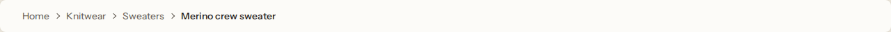

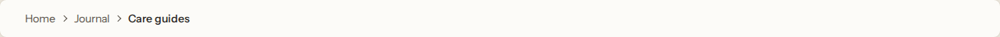

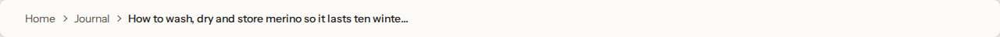
*Desktop: the full trail on one line. The current page is `text` at weight 500 and is not a link. Without an override, a long title truncates with an ellipsis at 40ch.*

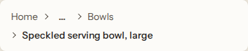

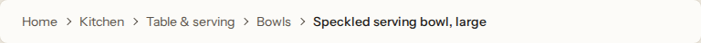

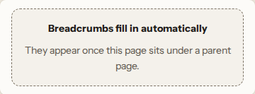
*Narrow: levels between Home and the parent collapse into a "…" button, and the trail may wrap to a second line. After the button is activated, every level shows.*

**Fields**

| Field id | Type | Required | Default | Notes |
|---|---|---|---|---|
| `showHome` | bool | no | on | First crumb links to `/`. |
| `homeLabel` | string | no | "Home" | |
| `trail` | list | no | — | The levels between Home and this page, root first, each `{label, href}`. A block cannot read the route, so these are filled per page. |
| `fromProduct` | bool | no | off | On a product page, appends the store's own category trail (root category down to the product's) after the levels above, each level linking to the catalogue filtered by it. Turn off ProductDetail's `showCategory` so the trail never shows twice. |
| `currentTitle` | string | no | page title | Overrides the last crumb's text. Use it for long product or article titles. |
| `showCurrent` | bool | no | on | Off ends the trail at the parent. |
| `container` | select | no | `wide` | `wide` · `content`. Match the block below: use `content` above ProductDetail and Article so the trail lines up with the gallery or title edge. |

The trail is not editable from the page tree: a block cannot read the route, so `trail` is filled per page and `fromProduct` is the one level the block can resolve itself — the routed product's own categories, which is what a seeded product *template* has instead of authored levels. There is no `variant`.

**Variants**: none.

**Layout**

- **Parts**: an ordered list in a flex row that wraps, with gaps of 0.25rem (row) and 0.5rem (column), at 0.875rem.
  - Separators: a 0.375rem chevron drawn with 1.5px `muted` strokes, before every item after the first. They are decorative.
  - Links: `muted`, at least 1.5rem tall, 2px corner radius (for the focus ring). On hover they turn `text` with an underline (offset 0.2em).
  - Current page: `text`, weight 500.
- **Collapse rule**: the Breadcrumb responds to its own width. When it is narrower than 48rem, every level between the first crumb (Home) and the last two levels (parent and current) is hidden, and a "…" button shows in their place. The button is at least 1.5rem square, 0.25rem side padding, `radius-sm`, `muted`, weight 600, letter-spacing 0.08em. On hover it is `text` on a 6% `text` tint. Activating it expands the trail in place for the rest of the page view.
- **Below 48rem**: collapsed trail. It may wrap to a second line. 1rem gutters, 0.75rem vertical padding.
- **48–64rem**: the same collapse rule applies whenever the trail itself is under 48rem wide inside the tablet gutters.
- **From 64rem**: the full trail on one line in the chosen container. The current title truncates with an ellipsis at 40ch (single line). The full text stays in the page and in the `title` attribute.

**States**

| State | What it looks like |
|---|---|
| Ideal | Home › Knitwear › Sweaters › Merino crew sweater. |
| Minimal content | Home › Page. |
| Long content | The current title truncates at 40ch; the full text stays in the accessible text and in `title`. Or set `currentTitle`. |
| Many items | 5 or more levels collapse on narrow widths. |
| Collapsed / expanded | "…" shows only while collapsed. After it is activated, every level shows and focus is on the first revealed link. |
| No image | Not applicable. |
| Empty (freshly inserted on a top-level page) | Nothing renders live. The editor shows a hint: "Breadcrumbs fill in automatically. They appear once this page sits under a parent page." |

**Field → layout mapping**

`showHome` / `homeLabel` → first list item · page tree → the middle items (collapsible) and the "…" item · `currentTitle` → the text of the last item (the current page) · `showCurrent` → whether the last item renders · `container` → container width.

**Keyboard & accessibility**

- `<nav aria-label="Breadcrumb">` containing an `<ol>`. The separators are drawn by styling and are not announced.
- The current page is a ``, not a link.
- The "…" control is a `<button type="button" aria-label="Show N more levels">` (N is the number of hidden levels). `Enter` / `Space` expands the trail in place and moves focus to the first revealed link.
- Tab order follows the trail. Links are activated with `Enter`.
- The same data is also output as `BreadcrumbList` structured data.

**Default content (Northwind Goods)**

- Product page: Home › Knitwear › Sweaters › Merino crew sweater.
- Journal post with override: Home › Journal › Care guides.
- Long title without override: "How to wash, dry and store merino so it lasts ten winters or more" (truncated at 40ch).
- Deep trail: Home › Kitchen › Table & serving › Bowls › Speckled serving bowl, large.

**Acceptance criteria**

- [ ] Links `muted` on `background` are 7.4:1 (6.8:1 on `surface`), and the current page `text` is 16.9:1 (1.4.3). The separator chevrons are decorative.
- [ ] Links and the "…" button show the standard focus ring (2.4.7).
- [ ] With the trail collapsed, `Tab` reaches Home, "…", then the parent. `Enter` / `Space` on "…" reveals all levels and moves focus to the first revealed link (2.1.1, 2.4.3).
- [ ] Links and the "…" button are at least 1.5rem in each dimension (2.5.8).
- [ ] The current page is marked by `aria-current="page"` and by being plain text at weight 500, not by colour alone (1.4.1, 1.3.1).
- [ ] The "…" button's name states how many levels it reveals (4.1.2).
- [ ] A truncated title stays fully available to assistive technology and in `title`.
- [ ] At 320px and 200% zoom, the trail wraps or collapses without horizontal scrolling (1.4.10). Text spacing overrides don't overlap items (1.4.12).
- [ ] Nothing animates, so reduced motion needs no change.
- [ ] Nothing renders live on a top-level page.

**Do / Don't**

- Do place it directly under the header on product, collection and article pages.
- Do use `currentTitle` to shorten very long names.
- Don't add breadcrumbs to the home page or to single-level landing pages.
- Don't use it as the page's main navigation.

---

### Footer · `footer`

The closing band of every page: brand and description, link groups, a newsletter sign-up, social links, a legal line, and country/language and currency selectors.

**Container** `wide` · **Section background** default `surface-strong` (option: `primary`) · **Section spacing**: `default` 3rem top / 1.5rem bottom below 48rem, 4rem / 2rem from 48rem; `minimal` 2rem top and bottom

Why `surface-strong` by default:
- It separates the footer from the page without shouting.
- It keeps every text role at a strong pairing: `text` 13.8:1, `muted` 6.1:1, and `border-strong` 3.6:1 for the input and selector boundaries.
- It stays neutral whatever brand colour a customer drops into `primary`. A bright `primary` over a large, link-dense area would compete with the product imagery, and every muted link would turn into full-strength `primary-contrast`.

`primary` stays available for brands with a deep ink or navy primary.

**Uses** Link, Button (ghost icon 2.75rem for social links; primary md for Subscribe), Input (email) with Field (visually hidden label, error message), Select (searchable, for country and language), Select (plain, for currency). Both selectors open upwards.

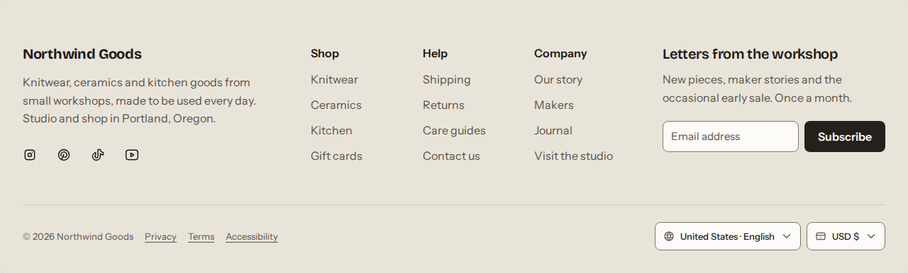

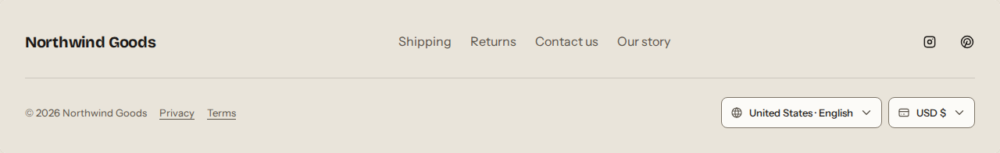

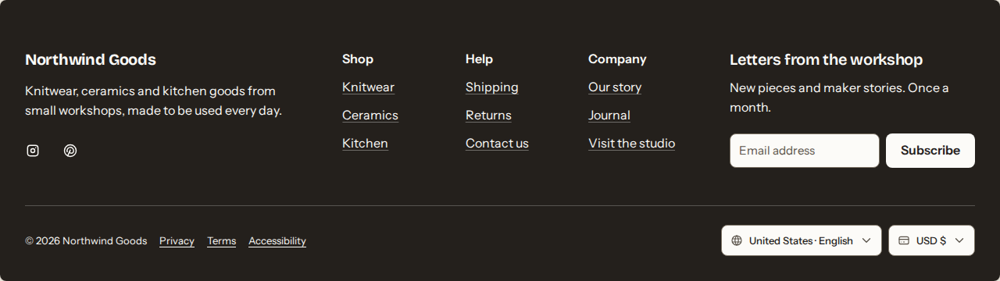
*Desktop: three zones (brand, link groups, newsletter), then a legal row below a hairline with the selectors on the right. On `primary`, every text role becomes `primary-contrast` and the links are always underlined at 35%.*

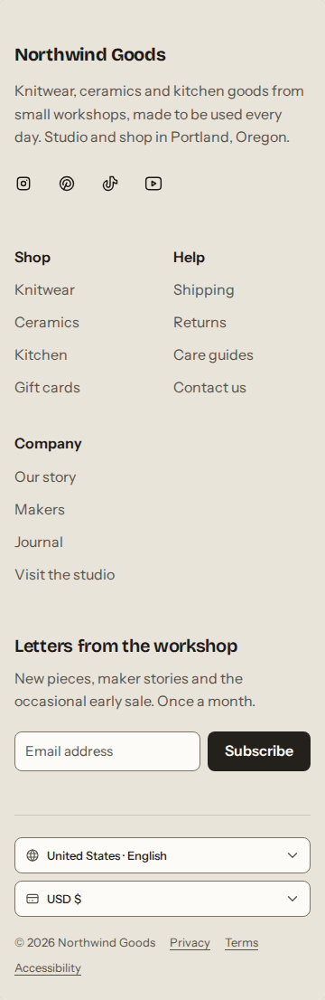

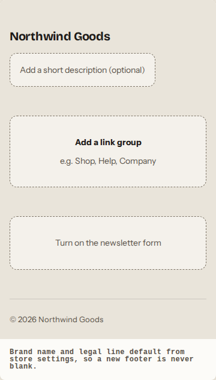
*Mobile: brand, groups in two columns, newsletter, then selectors stacked full width above the legal line. A new footer is never blank: the brand name and legal line come from store settings.*

**Fields**

| Field id | Type | Required | Default | Notes |
|---|---|---|---|---|
| `variant` | select | yes | `default` | `default` · `minimal`. |
| `background` | select | no | `surface-strong` | `surface-strong` · `primary`. |
| `brandText` | string | yes | store name | The wordmark. |
| `brandLogo` | media | no | none | Replaces the wordmark, max 2.5rem tall. |
| `description` | text | no | empty | 1–3 sentences. `default` only. |
| `groups` | list | no | empty | Up to 4 link groups. `default` only. |
| `groups[].title` | string | yes | — | For example "Shop". One word. |
| `groups[].links` | list | yes | — | Each has `label` (string) and `link` (link), up to 8. |
| `links` | list | no | empty | A flat list of up to 5 links. `minimal` only. |
| `showNewsletter` | bool | no | on | `default` only. Uses the store's email list. Turn it off on pages that already carry a Newsletter block; the link groups then take the newsletter's column. |
| `newsletterTitle` | string | no | "Letters from the workshop" | |
| `newsletterText` | text | no | empty | One sentence on what is sent and how often. |
| `social` | list | no | empty | `network` (select: instagram, facebook, pinterest, tiktok, youtube) and `link` (link). |
| `legalText` | string | no | "© {year} {store name}" | |
| `legalLinks` | list | no | empty | `label` and `link` (Privacy, Terms, Accessibility). |
| `showLocale` | bool | no | on when the store has more than one market or language | Country and language selector. |
| `showCurrency` | bool | no | on when the store sells in more than one currency | Currency selector. |

**Variants**

| variant | What changes |
|---|---|
| `default` | Three zones: brand (wordmark, description, social), link groups, newsletter. Legal row below a hairline. |
| `minimal` | One row: brand, flat links, social. Then the legal row with the selectors. No description, groups or newsletter. |

**Layout**

- **Below 48rem** (`default`):
  - One column with 3rem between brand, groups and newsletter.
  - The brand zone is a grid with a 1rem gap, max 22rem wide.
  - Groups sit in 2 columns with 2rem row and 1.5rem column gaps, so a third group wraps below.
  - Newsletter: title, text, then the form 0.5rem below: the input and Subscribe button side by side with a 0.5rem gap. The input takes the remaining width; the button never wraps and is at least 2.75rem tall.
  - Legal row: 3rem below the zones, with 1.5rem top padding and a hairline above. The selectors stack full width (each 2.5rem tall), then the legal text and legal links wrap below them.
- **48–64rem**: padding 4rem top / 2rem bottom. Brand and newsletter sit side by side (two equal columns, 3rem row / 2rem column gap). The groups span the full width on the row below in 3 columns. With the newsletter off, the brand spans the full width.
- **From 64rem**: grid `minmax(0, 4fr) minmax(0, 5fr) minmax(0, 3.5fr)` with 3rem gaps: brand (max 22rem), groups (3 equal columns, 1.5rem gap), newsletter. With the newsletter off: `4fr 8.5fr`. The legal row sits 3rem below with a hairline, legal on the left and the selectors on the right (in a row, 0.5rem apart, auto width).
- **`minimal`**: 2rem padding top and bottom. The bar row wraps with space between and gaps of 1rem × 2rem: wordmark, flat links (1.5rem apart), social (pulled 0.75rem into the right gutter). The legal row sits 1.5rem below.
- **Details**:
  - Wordmark and newsletter title: heading font, 1.25rem / 1.2, weight 700 (the title 600), letter-spacing −0.015em.
  - Description and newsletter text: 1rem / 1.6, `muted`.
  - Social icon buttons: 2.75rem, 0.25rem apart, the row pulled 0.75rem into the left gutter so the icons align optically.
  - Group titles: 1rem weight 600, 0.5rem above their links.
  - Links: at least 2.25rem tall, 1rem, `muted`, turning `text` with an underline (offset 0.2em) on hover.
  - Legal row: 0.8125rem / 1.4, `muted`, gaps of 1rem × 1.5rem. Legal links are at least 1.5rem tall, always underlined (offset 0.2em), and turn `text` on hover.
  - Hairline: `text` at 14% (on `primary`: `primary-contrast` at 24%).
- **Selectors**:
  - Trigger: 2.5rem tall (`control-height`), 0.8125rem weight 500 text, a 1rem `muted` leading icon (world for country, credit card for currency) and a chevron on the right, `border-strong` boundary, `background` fill.
  - Popover: opens above the trigger (0.25rem gap, grows from the bottom), `background` fill, `border` hairline, `shadow-md`, max height 20rem, max width `min(22rem, 90vw)`.

**States**

| State | What it looks like |
|---|---|
| Ideal | 3 groups × 4 links, newsletter on, 4 social links, two selectors. |
| Minimal content | Brand and legal line only (both default from store settings, so the footer is never blank). |
| Long content | Descriptions wrap within 22rem; long link labels wrap inside their column. |
| Many items | 4 groups: 3 columns, with the fourth group wrapping to a second row in the groups zone. 8 links per group is the cap. |
| No image | Not applicable (the logo is optional). |
| Empty (freshly inserted) | Editor hints "Add a short description (optional)", "Add a link group" (e.g. Shop, Help, Company) and "Turn on the newsletter form". The live site renders brand and legal line. |
| Link hover | `muted` → `text`, underline appears. |
| Newsletter error | Invalid or empty email: an error message with an icon under the input row (Field error), the input `aria-invalid="true"` with a `danger` boundary. On `primary`, the error text sits on a small `background` chip so it stays readable. |
| Newsletter submitting | The Subscribe button shows its loading state (spinner, `aria-busy="true"`). |
| Newsletter submitted | The form is replaced by a status line: a `success` check icon and "You're on the list." |
| Selector open | Chevron rotated 180°, trigger boundary `text`, popover above. |
| On `primary` | Every text role becomes `primary-contrast`. Links are always underlined at 35% (full on hover). Subscribe inverts (`primary-contrast` fill, `primary` text). Ghost icon hover is a `primary-contrast` tint at 14%. The input keeps its `background` fill. |

**Field → layout mapping**

- `brandText` / `brandLogo` → the wordmark link.
- `description` → the brand paragraph.
- `social` → the social icon row.
- `groups` → the footer navigation (`default`); `links` → the flat link row (`minimal`).
- Newsletter fields → the newsletter zone.
- `legalText` / `legalLinks` → the legal list.
- `showLocale` / `showCurrency` → the selectors.
- `background` → the band colour.

**Keyboard & accessibility**

- **Landmarks**: `<footer>` (contentinfo), labelled by a visually hidden `<h2>` "Site footer". In `minimal`, `aria-label="Site footer"` on the footer. Groups (or the flat links in `minimal`) are inside `<nav aria-label="Footer">`, with `<h3>` group titles. The newsletter title is an `<h3>`.
- **Newsletter**: a `<form>` labelled by its title (`aria-labelledby`).
  - The email field is `<input type="email" autocomplete="email">` with a real, visually hidden `<label>` "Email address". The placeholder is not the label.
  - Submit is a real `<button type="submit">` "Subscribe"; `Enter` in the field submits.
  - Errors are linked with `aria-describedby`, and focus stays in the field (3.3.1).
  - The success line is announced through `role="status"` (4.1.3).
- **Selectors** are the Select component, not dialogs: a combobox trigger with a listbox popup, with visually hidden labels "Country and language" and "Currency". The leading icon is decorative. A hidden native `<select>` stays in sync as the no-script fallback.
  - The country list is searchable (it has well over 10 entries). Opening moves focus to the search input ("Search countries"). Matching ignores case and diacritics, so "francais" finds "Canada · Français".
  - The currency list is a plain list with typeahead.
  - Keys: `Enter`, `Space` or `ArrowDown` open. `ArrowUp` / `ArrowDown` move the active option only. `Enter` or a click commits, closes and returns focus to the trigger, and only then are prices reloaded (3.2.2). `Esc` clears the search text first, then closes without changing the value. `Tab` closes without changing the value.
  - The popover always opens above the trigger, since the selectors sit at the bottom of the page.
- **Social links** are icon links (2.75rem) with names such as "Northwind Goods on Instagram".
- **Targets**: links 2.25rem tall, legal links 1.5rem, selectors 2.5rem, Subscribe 2.75rem.
- Links underline on hover. On `primary` they are always underlined, so they are identifiable without colour.

**Default content (Northwind Goods)**

- Description: "Knitwear, ceramics and kitchen goods from small workshops, made to be used every day. Studio and shop in Portland, Oregon."
- Social: Instagram, Pinterest, TikTok, YouTube.
- Groups: **Shop** (Knitwear, Ceramics, Kitchen, Gift cards) · **Help** (Shipping, Returns, Care guides, Contact us) · **Company** (Our story, Makers, Journal, Visit the studio).
- Newsletter: "Letters from the workshop" / "New pieces, maker stories and the occasional early sale. Once a month." Input placeholder "Email address", button "Subscribe", success "You're on the list."
- Legal: "© 2026 Northwind Goods" · Privacy · Terms · Accessibility.
- Selectors: "United States · English" (options include Canada · English, Canada · Français), "USD $" (CAD $, EUR €).
- `minimal` links: Shipping, Returns, Contact us, Our story.

**Acceptance criteria**

- [ ] On `surface-strong`: `text` is 13.8:1, `muted` links, description and legal row are 6.1:1, and the input and selector boundaries (`border-strong`) are 3.6:1. On `primary`, all text is `primary-contrast` at 15.6:1 (1.4.3, 1.4.11).
- [ ] The Subscribe button is `primary-contrast` on `primary` (15.6:1), or inverted on a `primary` band (1.4.3).
- [ ] The success icon `success` is 5.0:1 on `surface-strong` and is paired with the text "You're on the list." Error text `danger` is 5.3:1 on `surface-strong` and is paired with an icon (1.4.1, 1.4.11).
- [ ] Every link, icon link, input, button and selector trigger shows the standard focus ring, including on `primary` (2.4.7, 2.4.13).
- [ ] The whole footer works with `Tab`, `Enter`, `Space`, arrow keys and `Esc` as listed. The selector popovers never trap focus, and `Tab` leaves them (2.1.1, 2.1.2).
- [ ] Moving through selector options with arrow keys changes nothing. Prices reload only after `Enter` or a click on an option (3.2.2).
- [ ] Popovers open above their triggers and are not clipped at the bottom of the page.
- [ ] Targets: links 2.25rem, legal links 1.5rem, selectors 2.5rem, social and Subscribe 2.75rem (2.5.8).
- [ ] On `primary`, links are underlined at all times. On `surface-strong`, links are in a navigation list and underline on hover (1.4.1).
- [ ] The email input has a programmatic label, `type="email"` and `autocomplete="email"`. Errors are announced and linked to the field (1.3.1, 3.3.1, 3.3.2). Success is announced as status (4.1.3).
- [ ] Selectors expose combobox and listbox roles, `aria-expanded` and the selected option (4.1.2).
- [ ] With reduced motion, the popover and chevron change instantly.
- [ ] At 320px and 200% zoom, zones stack, the selectors go full width, the Subscribe button stays on one line, and nothing scrolls horizontally (1.4.10, 1.4.12).

**Do / Don't**

- Do keep group titles to one word and groups to 3–4.
- Do say how often the newsletter goes out.
- Don't repeat the whole header navigation here; link to help and company pages.
- Don't use the `primary` background with a light or very saturated brand colour.

---

## Marketing

### Hero · `hero`

The first thing on a landing page: a large heading with a short pitch, one or two buttons and a strong product image.

**Container** `wide` (`content` for `centered`; the image is full-bleed and the copy is in the wide container for `image-background`) · **Section background** none by default (`image-background`: the image under the `overlay` scrim, falling back to a `text` ground) · **Section spacing** from the `spacing` field: `md` (`section-md`, default), `sm` (`section-sm`), `lg` (`section-lg`). `image-background` sets its own padding.

**Uses** Button primary lg and Button outline lg, Image (with focal point and zoom), and CarouselControls (arrows and dots) for `split-carousel`.

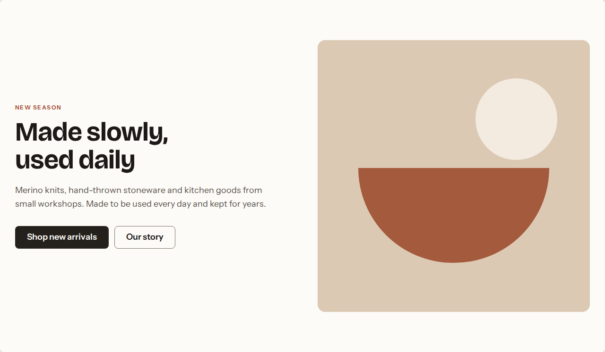
*Desktop `image-right`: two equal columns, copy vertically centred on the left, square image with `radius-xl` on the right.*

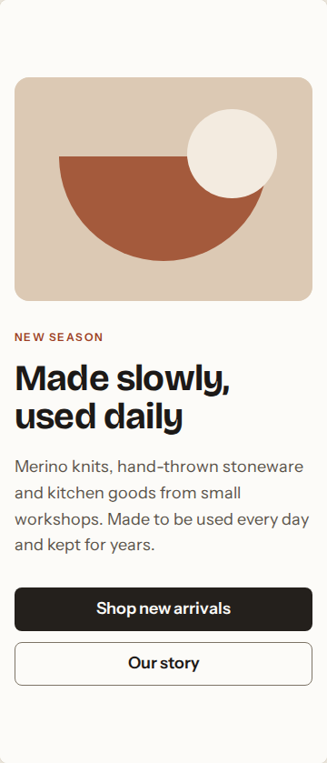

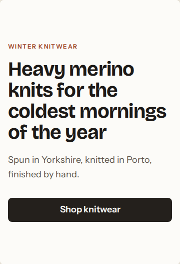

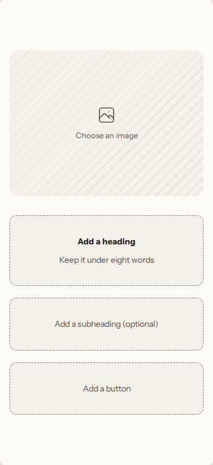
*Mobile: image first (4:3), then copy, with full-width stacked buttons 3rem tall. Without an image it is a single text column. When freshly inserted, the editor shows hints and a "Choose an image" placeholder.*

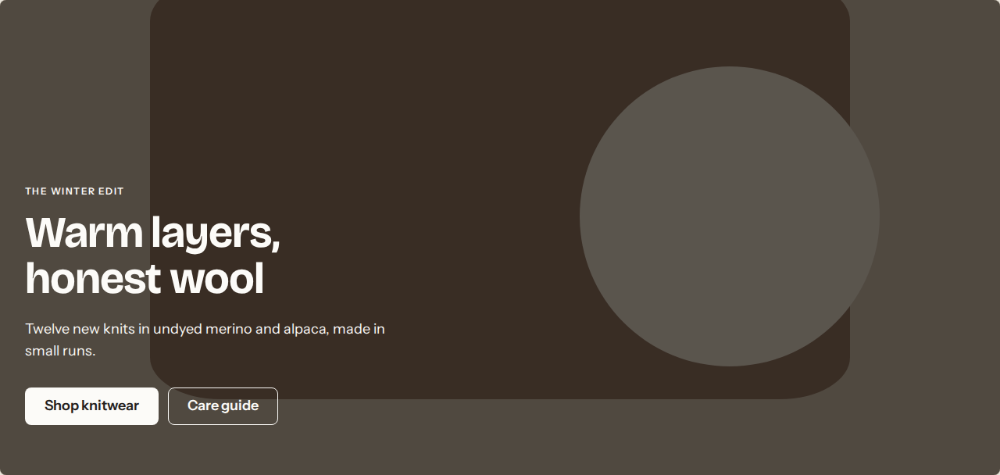

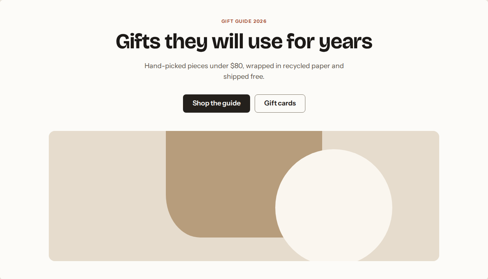

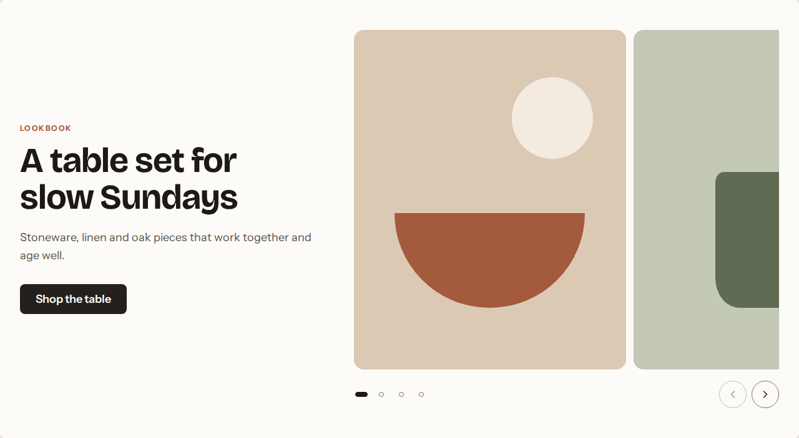
*Variants: `image-background` puts copy bottom-left in `primary-contrast` on the scrim, with inverted buttons. `centered` (shown with `sm` spacing) puts centred copy above a 3:1 image. `split-carousel` has copy in `5fr` and 4:5 slides in `7fr`, with dots left and arrows right below the track.*

**Fields**

| Field id | Type | Required | Default | Notes |
|---|---|---|---|---|
| `variant` | select | yes | `image-right` | `image-right` · `image-left` · `image-background` · `centered` · `split-carousel`. |
| `eyebrow` | string | no | empty | 1–3 words above the heading. Shown uppercase by styling. |
| `heading` | string | yes | — | Under 8 words. Rendered as `h1` when the hero is the first block on the page, otherwise `h2`. |
| `subheading` | text | no | empty | 1–2 sentences. |
| `primaryCta` | link | no | none | Label and link. Primary button. |
| `secondaryCta` | link | no | none | Label and link. Outline button. |
| `image` | media | no | none | Focal point and zoom respected. Not used by `split-carousel`. Alt text required unless marked decorative. |
| `slides` | list | no | empty | `split-carousel` only, 2–8 items. |
| `slides[].image` | media | yes | — | 4:5 crop. |
| `slides[].alt` | string | yes | media alt text | |
| `slides[].link` | link | no | none | Makes the slide a link (for example to the product). |
| `spacing` | select | no | `md` | `md` · `sm` · `lg` → section padding. |

**Variants**

| variant | What changes |
|---|---|
| `image-right` | Two equal columns from 64rem: copy left, square image right (`radius-xl`). Stacked below 64rem with the image first. |
| `image-left` | Same, mirrored. |
| `image-background` | A full-bleed image fills the block, a full `overlay` scrim covers it, and the copy sits bottom-left in `primary-contrast`. Min height 34rem (38rem from 64rem). Buttons invert: primary becomes a `primary-contrast` fill with `primary` text (hover: `primary-contrast` mixed 12% toward `primary`); outline becomes transparent with `currentColor` border and text (hover: `currentColor` tint at 14%). A Header with `transparentOverHero` sits on this scrim. |
| `centered` | Copy centred (max 44rem) above a wide image: 4:3 below 48rem, 21:9 from 48rem, 3:1 from 64rem. |
| `split-carousel` | Copy in a `5fr` column, swipeable slides in `7fr`. Slides are 64% of the track so the next one peeks. Dots on the left and arrow buttons on the right, below the track. |

**Layout**

- **Copy column**:
  - A grid with 1.25rem gaps, left aligned, max 36rem.
  - Eyebrow: 0.75rem, weight 600, letter-spacing 0.12em, uppercase, `accent`, pulled 0.25rem closer to the heading.
  - Heading: display style, 3.5rem / 1.05, weight 700, −0.02em (2.5rem below 48rem), balanced wrapping.
  - Subheading: 1.125rem / 1.6, `muted`, max 34rem, pretty wrapping.
  - Buttons: 0.75rem below the subheading, 0.75rem apart. Both are lg: 3rem tall, 1.5rem side padding, 1.125rem label.
- **Below 48rem** (`image-right` / `image-left`): the image comes first (4:3, `radius-xl`), with a 2rem gap before the copy. Buttons are full width and stacked. Section padding `section-md` by default.
- **48–64rem**: still stacked with the image first; the image is 3:2. Heading 3.5rem. Buttons inline.
- **From 64rem**: grid `1fr 1fr`, 4rem gap, vertically centred. The image is 1:1. `image-left` puts the image first; `image-right` puts it second.
- **No image**: a single column with copy up to 44rem wide.
- **`centered`**: the copy is centred (text and buttons) at max 44rem in the content container, then the image below it. The gap is 2rem (3rem from 64rem). The image ratio is 4:3 → 21:9 (from 48rem) → 3:1 (from 64rem), with `radius-xl`.
- **`image-background`**:
  - The image covers the whole block (no radius), with the `overlay` scrim over all of it.
  - The copy container is a flex row aligned to the bottom, min height 34rem, with `section-md` top and 3rem bottom padding.
  - From 64rem: min height 38rem, 7rem top and 4rem bottom padding.
  - Without an image the ground is `text`, still with the scrim.
- **`split-carousel`**:
  - Below 64rem: copy first, then the carousel. Slides are 82% of the track width below 48rem and 46% from 48rem.
  - From 64rem: grid `minmax(0, 5fr) minmax(0, 7fr)`, 3rem gap; slides are 64%.
  - Track: horizontal scroll with snap (each slide snaps to its start), 0.75rem between slides, no visible scrollbar.
  - Slides are 4:5 with `radius-xl`.
  - Controls: 1rem below the track, spread apart. Dots on the left: 1.5rem round targets, each a 0.5rem ring with a 1.5px `border-strong` stroke; the current dot becomes a 1.25rem × 0.5rem `text`-filled pill. Arrows on the right, 0.5rem apart: 2.75rem circles, 1px `border-strong` border, `background` fill, `text` chevrons. On hover the border is `text` and the fill `surface`. Disabled arrows are at 45% opacity.

**States**

| State | What it looks like |
|---|---|
| Ideal | Eyebrow, 4–6 word heading, 1–2 sentence subheading, two buttons, image. |
| Minimal content | Heading and one button. |
| Long content | A 12-word heading wraps (balanced) and the grid stays centred. The image column keeps its ratio. |
| No image | Single column, copy max 44rem. `image-background` falls back to a `text` ground with the scrim. |
| Many items (carousel) | 8 slides max; the dots stay on one row. |
| Carousel at the ends | Previous is disabled on the first slide and Next on the last. If the focused arrow becomes disabled, focus moves to the other arrow. |
| Button hover / pressed | Primary: `primary` mixed 14% toward `background`. Outline: `text` border on `surface`. Pressed buttons move down 1px. |
| Empty (freshly inserted) | Editor hints "Add a heading" (Keep it under eight words), "Add a subheading (optional)" and "Add a button", plus an image placeholder "Choose an image" (`surface-strong`, 2rem photo icon, 0.8125rem `muted` label). |

**Field → layout mapping**

- `eyebrow` → the overline above the heading.
- `heading` → the display heading.
- `subheading` → the paragraph under it.
- `primaryCta` / `secondaryCta` → the button group (primary lg, outline lg).
- `image` → the media column, or the full-bleed background for `image-background`.
- `slides` → the carousel track, one figure per slide.
- `variant` → the layout.
- `spacing` → section padding.

**Keyboard & accessibility**

- `<section aria-labelledby>` pointing at the heading. One `h1` per page: the hero's heading is `h1` only when it is the first block.
- Images need alt text unless purely decorative (the editor toggle sets `alt=""`).
- `image-background`: text always sits on the `overlay` scrim (0.7), so `primary-contrast` holds 6.2:1 or better on any photo. The standard focus ring needs no override: its `focus-inner` infill contrasts with the scrim.
- Buttons are links (`<a>`) when they navigate. There is no autoplay, video or motion.
- **Carousel** (`split-carousel`):
  - The wrapper is `role="region" aria-roledescription="carousel"` with a label (for example "Slow Sundays lookbook").
  - Each slide is a `<figure role="group" aria-roledescription="slide" aria-label="n of N">`. When `slides[].link` is set, the image sits inside a link whose name is the alt text.
  - The track is focusable (`tabindex="0"`, labelled "Slides, use arrow keys to move"). With the track focused, `ArrowLeft` / `ArrowRight` move one slide.
  - Previous / Next are real `<button>`s labelled "Previous slide" / "Next slide". They are disabled at the ends.
  - Dots are `<button>`s labelled "Go to slide n", with `aria-current="true"` on the current one.
  - Swiping is native horizontal scrolling. There is no autoplay.

**Default content (Northwind Goods)**

- Default story (`image-right`): eyebrow "New season", heading "Made slowly, used daily", subheading "Merino knits, hand-thrown stoneware and kitchen goods from small workshops. Made to be used every day and kept for years.", buttons "Shop new arrivals" / "Our story". Image: speckled stoneware serving bowl on a linen cloth.
- No image: "Winter knitwear" / "Heavy merino knits for the coldest mornings of the year" / "Spun in Yorkshire, knitted in Porto, finished by hand." / "Shop knitwear".
- `image-background`: "The winter edit" / "Warm layers, honest wool" / "Twelve new knits in undyed merino and alpaca, made in small runs." / "Shop knitwear", "Care guide".
- `centered`: "Gift guide 2026" / "Gifts they will use for years" / "Hand-picked pieces under $80, wrapped in recycled paper and shipped free." / "Shop the guide", "Gift cards".
- `split-carousel`: "Lookbook" / "A table set for slow Sundays" / "Stoneware, linen and oak pieces that work together and age well." / "Shop the table". Slides: terracotta serving bowl, sage glazed mug, folded linen napkins, grey stoneware plates.

**Acceptance criteria**

- [ ] Heading `text` on `background` is 16.9:1, the subheading `muted` is 7.4:1 and the eyebrow `accent` is 6.4:1. Button labels `primary-contrast` on `primary` are 15.6:1. The outline button's `border-strong` boundary is 4.5:1 on `background` (1.4.3, 1.4.11).
- [ ] On `image-background`, all text and button boundaries are `primary-contrast` on the `overlay` scrim at 6.2:1 or better, and there is never text on an image without the scrim (1.4.3, 1.4.11).
- [ ] Carousel arrow boundaries (`border-strong`) are 4.5:1 on `background`. Inactive dot rings are 4.5:1, and the current dot is marked by shape (a wider pill), not colour alone (1.4.1, 1.4.11).
- [ ] Buttons, slide links, the track, arrows and dots all show the standard focus ring. The track's ring has a 4px infill and a 4px offset (2.4.7).
- [ ] With the track focused, `ArrowLeft` / `ArrowRight` move one slide. `Tab` reaches the track, dots and arrows. Focus never lands on a disabled arrow (2.1.1, 2.4.3).
- [ ] Buttons are 3rem tall and full width below 48rem. Arrows are 2.75rem and dots 1.5rem (2.5.8).
- [ ] Exactly one `h1` on the page. The section is labelled by its heading. Slides announce "n of N", and dots expose `aria-current` (1.3.1, 4.1.2).
- [ ] Nothing moves on its own: no autoplay. With reduced motion, arrow and dot navigation jump instantly instead of scrolling smoothly (2.2.2).
- [ ] At 320px and 200% zoom, the layout stacks, the heading wraps without clipping, and nothing scrolls horizontally except the carousel track itself (1.4.10, 1.4.12).

**Do / Don't**

- Do lead with the product, not a mood shot with no product in it.
- Do keep one primary action; the second button is a quieter route.
- Don't place text over an image without the scrim, or on a light photo in a custom variant.
- Don't use `split-carousel` for fewer than 2 slides, or as a slideshow of banners with text baked into the images.

---

### Call to action · `call-to-action`

A focused band that asks the visitor to do one thing (book, subscribe, shop a collection), in four weights from loud to quiet.

**Container** `content` (`wide` for `split` and `banner`) · **Section background** `primary` for variant `primary`, `surface` for `subtle`, none for `split` and `banner` (their panels carry the colour) · **Section spacing** `section-md`; `banner` uses `section-sm`

**Uses** Button primary lg and Button outline lg (the `banner` button is md below 48rem and lg from 48rem), Image (`split`).

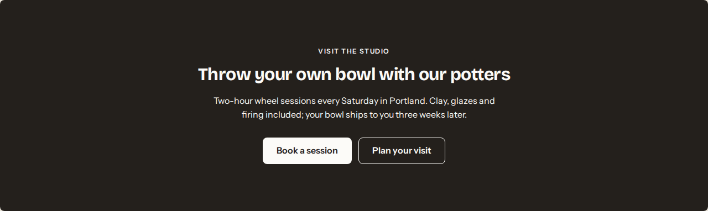

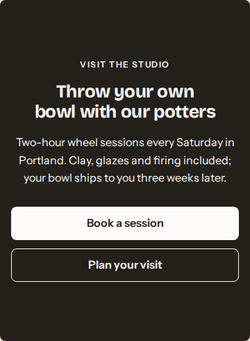

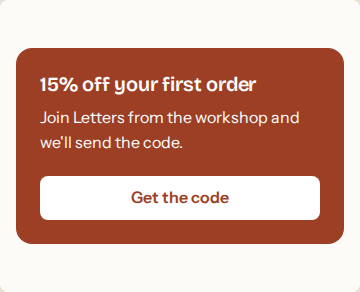

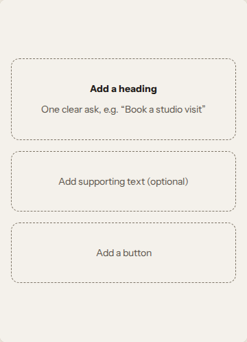
*The default `primary` band: centred copy with inverted buttons. On mobile the buttons stack full width. The `banner` stacks its button below the copy on narrow widths.*

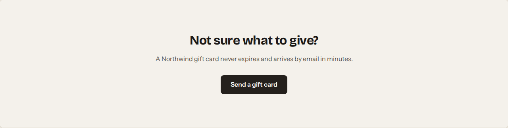

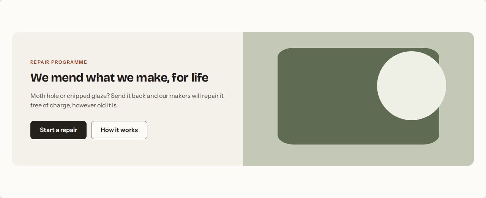

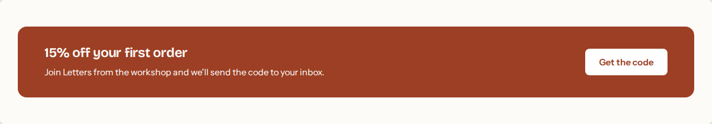
*`subtle` on `surface`; `split` as a rounded `surface` panel with copy left and the image edge to edge on the right; `banner` as a compact `accent` row with one inverted button.*

**Fields**

| Field id | Type | Required | Default | Notes |
|---|---|---|---|---|
| `variant` | select | yes | `primary` | `primary` · `subtle` · `split` · `banner`. |
| `eyebrow` | string | no | empty | Not shown in `banner`. |
| `heading` | string | yes | — | One line if possible, under 8 words. |
| `text` | text | no | empty | 1–2 sentences. |
| `primaryCta` | link | yes | — | Label and link. |
| `secondaryCta` | link | no | none | Not shown in `banner`. |
| `image` | media | no | none | `split` only; fills its half of the panel. |

**Variants**

| variant | What changes |
|---|---|
| `primary` | Full-width `primary` band, centred copy (max 40rem). All text is `primary-contrast`. Buttons invert: primary uses a `primary-contrast` fill with `primary` text; outline is transparent with a `currentColor` border and text (hover: `currentColor` tint at 12%). |
| `subtle` | Same layout on `surface`, with normal button colours. |
| `split` | A rounded (`radius-xl`) `surface` panel that clips its content: copy on the left, image on the right, edge to edge. Stacks copy then image below 48rem. |
| `banner` | A compact `accent` panel (`radius-xl`) inside the container: heading (h3 size) and text on the left, one button on the right. All text is `accent-contrast`. The primary button inverts to an `accent-contrast` fill with `accent` text. Wraps to stacked on narrow widths. |

**Layout**

- **Copy**:
  - A grid with 1rem gaps, centred text, max 40rem, centred in its container.
  - Eyebrow: 0.75rem, uppercase, `accent` (`primary-contrast` on the `primary` band).
  - Heading: h2, 2rem (1.625rem below 48rem). In `banner`, h3 size: 1.5rem (1.25rem below 48rem).
  - Text: 1rem / 1.6, `muted` (inherits the contrast colour on `primary` and `accent`), max 34rem.
  - Button group: 0.75rem below, centred, 0.75rem gaps. Buttons are lg: 3rem tall with 1rem labels.
- **Below 48rem**: buttons stack full width (3rem tall).
  - `split`: copy with 2rem top/bottom and 1.5rem side padding, left aligned, above an image that is 4:3 with a 14rem minimum height.
  - `banner`: 1.5rem panel padding, content left aligned with 0.5rem gaps. The button (md, 2.75rem) is full width below the copy.
- **48–64rem**: buttons inline and centred.
  - `split` becomes two equal columns. The copy is vertically centred with 3rem padding, and the image fills its column at a minimum height of 22rem.
  - `banner` padding becomes 2rem top/bottom and 3rem sides.
- **From 64rem**: `primary` and `subtle` are centred in the content container with `section-md` padding. The `split` panel is in the wide container. `banner` is one row: copy (max 40rem) and button spread apart, with a 2rem gap and a 1.25rem row gap when it wraps.

**States**

| State | What it looks like |
|---|---|
| Ideal | Eyebrow, heading, one sentence, two buttons. |
| Minimal content | Heading and one button. |
| Long content | The heading wraps (balanced). The `banner` button moves below the copy when they no longer fit. |
| No image (`split`) | Falls back to the `subtle` layout (centred copy) inside the panel. |
| Button hover / pressed | As Button. On the filled grounds the outline hover is a `currentColor` tint. |
| Empty (freshly inserted) | Editor hints "Add a heading" (One clear ask, e.g. "Book a studio visit"), "Add supporting text (optional)" and "Add a button". |

**Field → layout mapping**

`eyebrow` → the overline · `heading` → the h2 (styled h3 in `banner`) · `text` → the paragraph · `primaryCta` / `secondaryCta` → the button group · `image` → the media half of the `split` panel · `variant` → band or panel tone and layout.

**Keyboard & accessibility**

- `<section aria-labelledby>` pointing at the heading, which is an `h2` (in `banner` too, only styled smaller).
- Buttons are links (`<a>`) when they navigate. Use a real `<button>` only when they open a dialog; that dialog is a native `<dialog>` opened as a modal, and focus returns to the button on close.
- The standard focus ring needs no override on `primary` and `accent` grounds: the white infill carries the contrast there.
- Tab order: primary button, then secondary. `Enter` activates.
- The `split` image needs alt text unless it is decorative.

**Default content (Northwind Goods)**

- `primary`: eyebrow "Visit the studio", heading "Throw your own bowl with our potters", text "Two-hour wheel sessions every Saturday in Portland. Clay, glazes and firing included; your bowl ships to you three weeks later.", buttons "Book a session" / "Plan your visit".
- `subtle`: "Not sure what to give?" / "A Northwind gift card never expires and arrives by email in minutes." / "Send a gift card".
- `split`: "Repair programme" / "We mend what we make, for life" / "Moth hole or chipped glaze? Send it back and our makers will repair it free of charge, however old it is." / "Start a repair", "How it works". Image: darned elbow of a sage wool sweater.
- `banner`: "15% off your first order" / "Join Letters from the workshop and we'll send the code to your inbox." / "Get the code".

**Acceptance criteria**

- [ ] `primary`: text `primary-contrast` on `primary` is 15.6:1, and the inverted button (`primary` on `primary-contrast`) is 15.6:1. `subtle` / `split`: `text` on `surface` is 15.5:1 and `muted` is 6.8:1. `banner`: `accent-contrast` on `accent` is 6.7:1, and the inverted button is 6.7:1 (1.4.3).
- [ ] The outline button boundary is `currentColor` on filled grounds (15.6:1 on `primary`) and `border-strong` (4.1:1) on `surface` (1.4.11).
- [ ] Buttons show the standard focus ring on every ground with no override (2.4.7).
- [ ] Buttons are reachable with `Tab` and activate with `Enter`. A button that opens a dialog uses a native modal `<dialog>` and gets focus back on close (2.1.1, 2.4.3).
- [ ] Buttons are 3rem tall (the `banner` button is 2.75rem below 48rem) and full width below 48rem (2.5.8).
- [ ] Button labels name the action; never "Click here" (2.4.4).
- [ ] The section is labelled by its `h2` (1.3.1).
- [ ] Nothing animates beyond the button hover, which is instant with reduced motion.
- [ ] At 320px and 200% zoom, buttons stack, the `banner` button moves below its copy, and nothing is clipped or scrolls horizontally (1.4.10, 1.4.12).

**Do / Don't**

- Do use one call to action block per page, near the end.
- Do use `banner` for offers and `split` when a photo explains the ask.
- Don't stack a `primary` call to action directly above a `primary` footer.
- Don't write "Click here"; name the action.

---

### Feature grid · `feature-grid`

A grid of short benefits or facts, each with an icon or image, a title and a sentence. Two to four work best.

**Container** `wide` · **Section background** none by default (cards use `surface`) · **Section spacing** `section-md`

**Uses** FeatureCard (cards variant), Image (3:2), Link (standalone, with arrow).

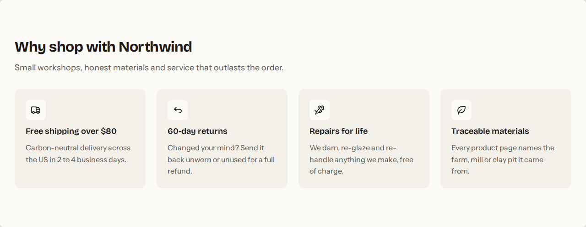

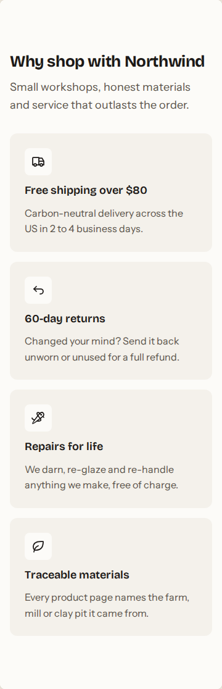

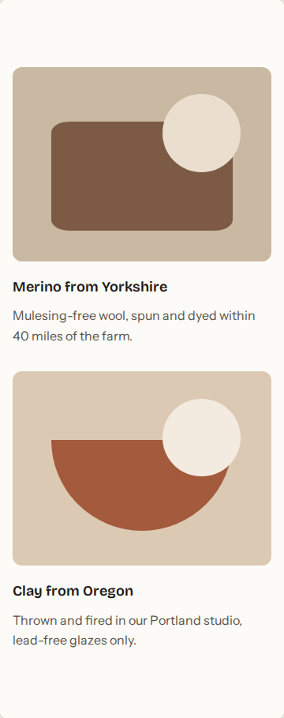

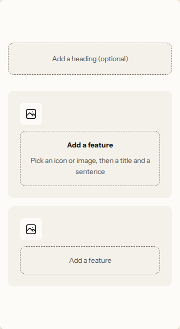
*`cards`: `surface` cards with an icon tile on `background`. On mobile the items stack in one column. `plain` with images has no card and no hairline.*

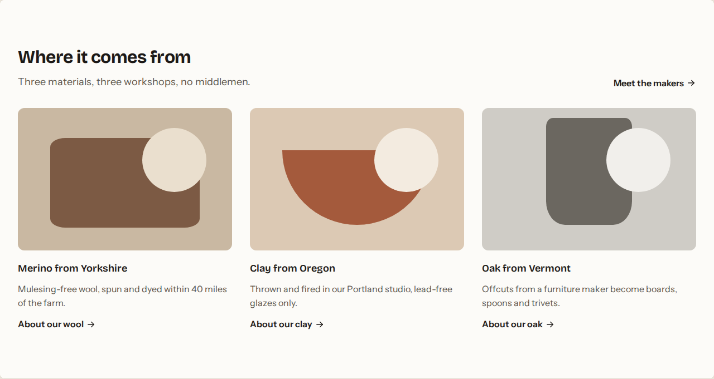

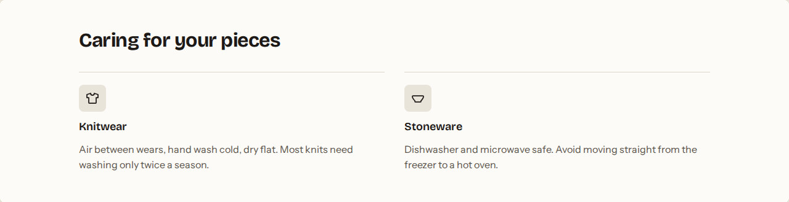
*`plain` with images and item links (a head link on the right); `plain` with icons, a `border` hairline above each item (shown with `section-sm` spacing).*

**Fields**

| Field id | Type | Required | Default | Notes |
|---|---|---|---|---|
| `variant` | select | yes | `cards` | `cards` · `plain`. |
| `heading` | string | no | empty | Block heading (`h2`). |
| `intro` | text | no | empty | One sentence under the heading. |
| `headLink` | link | no | none | Standalone link to the right of the heading. |
| `columns` | select | yes | `4` | `2` · `3` · `4`. |
| `mediaType` | select | yes | `icon` | `icon` · `image`. |
| `items` | list | yes | — | 1–12 items. |
| `items[].icon` | select | no | none | From the icon set (truck, arrow-back-up, leaf, needle-thread, …). Used when `mediaType` is `icon`. |
| `items[].image` | media | no | none | 3:2 crop. Used when `mediaType` is `image`. |
| `items[].title` | string | yes | — | 2–5 words. |
| `items[].text` | text | no | empty | One or two sentences. |
| `items[].link` | link | no | none | Standalone link at the bottom of the item. |

**Variants**

| variant | What changes |
|---|---|
| `cards` | Each item is a `surface` card (`radius-lg`, 1.5rem padding). The icon tile is `background`. |
| `plain` | No card. Icon items have a `border` hairline on top with 1.25rem above the icon; image items drop the hairline and padding. The icon tile is `surface-strong`. Wider gaps. |

**Layout**

- **Head**: the heading and intro on the left (max 40rem), the head link on the right, aligned to the bottom, wrapping with gaps of 1rem × 2rem. 2rem above the grid.
  - Heading: h2, 2rem (1.625rem below 48rem).
  - Intro: 1.125rem / 1.6, `muted`, 0.75rem below the heading.
- **Item**: a column with 0.75rem gaps that fills the row height.
  - Icon tile: 2.75rem square, `radius-md`, with a 1.5rem `text` icon.
  - Image: 3:2, `radius-lg`, 0.5rem extra space below it.
  - Title: h3, heading font 1.125rem / 1.35, weight 600.
  - Text: 1rem / 1.6, `muted`, not clamped.
  - Link: standalone (1rem, weight 600, arrow), pushed to the bottom of the item so links line up across a row.
- **Below 48rem**: one column, 1rem gap (`plain`: 2rem). From 36rem of block width, 2 columns.
- **48–64rem**: 2 columns.
- **From 64rem**: `columns` equal columns (3 or 4; 2 stays 2). Gap 1.5rem (`plain`: 3rem rows × 2rem columns). Cards in a row share the tallest height.

**States**

| State | What it looks like |
|---|---|
| Ideal | 4 icon items with one-sentence text. |
| Minimal content | 1 item. It keeps the width of one column and doesn't stretch. |
| Long content | A 3-line title wraps. Text is not clamped. |
| Many items | 12 items flow into rows of `columns`. |
| No image | An image item without an image shows the image placeholder in the editor. Live, it renders without media. |
| Link hover | The standalone link underlines and its arrow moves 2px right (`duration-fast`). |
| Empty (freshly inserted) | Editor hints for the heading ("Add a heading (optional)") and two "Add a feature" items ("Pick an icon or image, then a title and a sentence"). |

**Field → layout mapping**

`heading` / `intro` / `headLink` → block head · `columns` → column count from 64rem · `mediaType` → icon tile or image · `items[]` → one list item each: `icon` → icon tile, `image` → 3:2 image, `title` → h3, `text` → paragraph, `link` → standalone link.

**Keyboard & accessibility**

- `<section aria-labelledby>` pointing at the heading. Without a heading, `aria-label` comes from the block's name in the editor.
- Items are a `<ul>` of `<li>`, and titles are `h3`.
- Icons are decorative (`aria-hidden`). Images need alt text unless decorative.
- Only the item links and the head link are focusable. There is no whole-card link, so links never nest. `Tab` moves through them in order, and `Enter` activates.

**Default content (Northwind Goods)**

- Heading "Why shop with Northwind", intro "Small workshops, honest materials and service that outlasts the order."
- Items:
  - Free shipping over $80 (truck): "Carbon-neutral delivery across the US in 2 to 4 business days."
  - 60-day returns (arrow-back-up): "Changed your mind? Send it back unworn or unused for a full refund."
  - Repairs for life (needle-thread): "We darn, re-glaze and re-handle anything we make, free of charge."
  - Traceable materials (leaf): "Every product page names the farm, mill or clay pit it came from."
- `plain` images story: "Where it comes from" / "Three materials, three workshops, no middlemen." / head link "Meet the makers". Items:
  - Merino from Yorkshire: "Mulesing-free wool, spun and dyed within 40 miles of the farm." → "About our wool"
  - Clay from Oregon: "Thrown and fired in our Portland studio, lead-free glazes only." → "About our clay"
  - Oak from Vermont: "Offcuts from a furniture maker become boards, spoons and trivets." → "About our oak"

**Acceptance criteria**

- [ ] Titles `text` are 15.5:1 on `surface` cards and 16.9:1 on `background`. Item text `muted` is 6.8:1 on `surface` and 7.4:1 on `background`. Icons `text` on their tile are 3:1 or better (1.4.3, 1.4.11).
- [ ] Item links and the head link show the standard focus ring (2.4.7).
- [ ] All links are reachable with `Tab` in reading order. No card is a nested link (2.1.1, 2.4.3).
- [ ] Standalone links are at least 1.5rem tall (2.5.8).
- [ ] Links are identified by weight and arrow, plus an underline on hover, not by colour alone (1.4.1).
- [ ] Items are a list with `h3` titles under the block's `h2`. Decorative icons are hidden from assistive technology (1.3.1).
- [ ] With reduced motion, the arrow nudge is instant.
- [ ] At 320px and 200% zoom, items stack into one column with no clipping or horizontal scroll (1.4.10, 1.4.12).

**Do / Don't**

- Do keep every item the same shape: all icons or all images, and similar text lengths.
- Do write concrete promises (numbers, places, policies).
- Don't invent statistics to fill a column.
- Don't use it for product lists; use a product grid.

---

### Split content · `split-content`

Tells a story in rows of image and text that alternate sides, for "our process" or "about the materials" sections.

**Container** `wide` · **Section background** none by default · **Section spacing** `section-md`

**Uses** Image (4:3), Link (standalone, with arrow), RichText (row text).

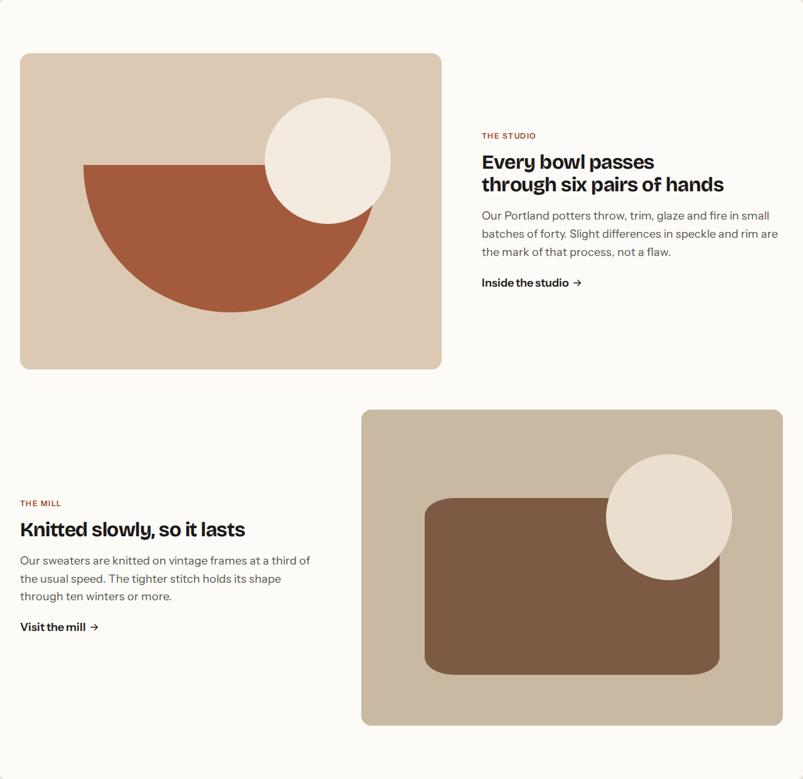
*Desktop: row 1 has the image left (`7fr`) and text right (`5fr`); row 2 flips.*

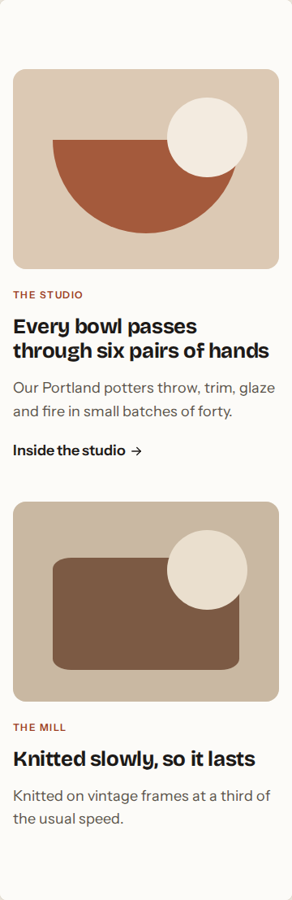

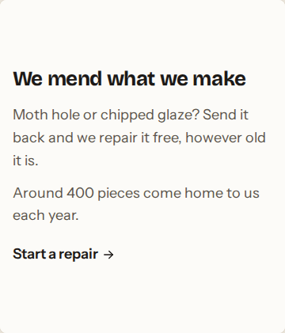

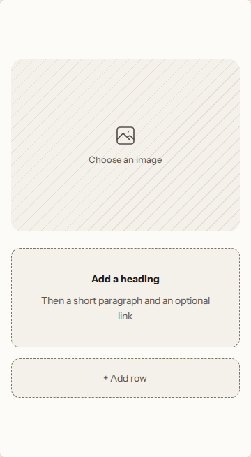

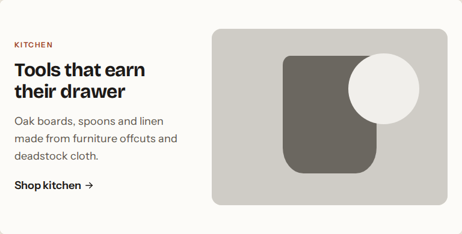
*Mobile: image then text in every row. Tablet with `startWith` `image-right` (shown with `section-sm` spacing).*

**Fields**

| Field id | Type | Required | Default | Notes |
|---|---|---|---|---|
| `startWith` | select | yes | `image-left` | `image-left` · `image-right`. The first row's image side; rows then alternate. |
| `rows` | list | yes | — | 1–6 rows (the editor warns above 6). |
| `rows[].image` | media | no | none | 4:3 crop; focal point respected. |
| `rows[].eyebrow` | string | no | empty | 1–3 words. |
| `rows[].heading` | string | yes | — | Row heading (`h2`). |
| `rows[].text` | rich-text | no | empty | Paragraphs, bold, italic, links. No headings or lists. |
| `rows[].link` | link | no | none | Standalone link with arrow. |

There is no `variant`: the alternation is the design. The select is named `startWith` because it only flips the first row.

**Variants**: none; see `startWith`.

**Layout**

- **Row**: a grid with a 1.5rem gap, items vertically centred.
  - Image: 4:3, `radius-xl`.
  - Text column: a grid with 1rem gaps, left aligned, max 30rem.
  - Eyebrow: 0.75rem uppercase `accent`.
  - Heading: h2, 2rem (1.625rem below 48rem).
  - Text: 1.125rem / 1.6, `muted`, paragraphs 0.75rem apart.
  - Link: standalone, 1.125rem, weight 600, with arrow, 0.25rem extra space above.
- **Below 48rem**: every row is image then text, 1.5rem apart. Rows are 3rem apart.
- **48–64rem**: rows become two columns with a 3rem gap and the text vertically centred. With `image-left`, odd rows are `7fr 5fr` (image left) and even rows are `5fr 7fr` (image right). `image-right` is the reverse. Rows are 4rem apart.
- **From 64rem**: the same, with a 4rem column gap in the wide container. Text column max 30rem.
- **Row without image**: spans one column, text max 40rem.

**States**

| State | What it looks like |
|---|---|
| Ideal | 2–3 rows, each with image, eyebrow, heading, one paragraph and link. |
| Minimal content | One row with heading and text. |
| Long content | A long paragraph makes the row taller. The image stays 4:3 and is centred against the text. |
| Many items | 6 rows max (the editor warns); consider splitting the page. |
| No image | That row is single column, text max 40rem. |
| Empty (freshly inserted) | One row with a "Choose an image" placeholder, an "Add a heading" hint ("Then a short paragraph and an optional link") and a "+ Add row" hint. |

**Field → layout mapping**

`rows[]` → an ordered list, one row each · `image` → the media column · `eyebrow` → the overline · `heading` → the h2 · `text` → the paragraphs · `link` → the standalone link · `startWith` → which side the first row's image takes.

**Keyboard & accessibility**

- `<section>` labelled by the block's name in the editor (`aria-label`, for example "Our story"). The rows are an ordered list (`role="list"` kept explicitly) because they read as a sequence.
- Source order is always image, then text, in every row. The alternation is visual only (grid order), so the reading and focus order are the same on every screen (1.3.2).
- Each row heading is an `h2`. Images need alt text unless decorative.
- Only the links are focusable (row links and links in the text). `Tab` and `Enter`.

**Default content (Northwind Goods)**

- Row 1: "The studio" / "Every bowl passes through six pairs of hands" / "Our Portland potters throw, trim, glaze and fire in small batches of forty. Slight differences in speckle and rim are the mark of that process, not a flaw." / "Inside the studio".
- Row 2: "The mill" / "Knitted slowly, so it lasts" / "Our sweaters are knitted on vintage frames at a third of the usual speed. The tighter stitch holds its shape through ten winters or more." / "Visit the mill".
- Text-only row: "We mend what we make" / "Moth hole or chipped glaze? Send it back and we repair it free, however old it is. Around 400 pieces come home to us each year." / "Start a repair".
- `image-right` story: "Kitchen" / "Tools that earn their drawer" / "Oak boards, spoons and linen made from furniture offcuts and deadstock cloth." / "Shop kitchen".

**Acceptance criteria**

- [ ] Heading `text` on `background` is 16.9:1, body `muted` is 7.4:1, eyebrow `accent` is 6.4:1 and links `text` are 16.9:1 (1.4.3).
- [ ] Links show the standard focus ring (2.4.7).
- [ ] Focus order follows the source order (image, then text, row by row) whatever the visual side (1.3.2, 2.4.3).
- [ ] Standalone links are at least 1.5rem tall (2.5.8). Links inside text are underlined, not colour-only (1.4.1).
- [ ] Rows are an ordered list with `h2` headings. Images have alt text or are marked decorative (1.1.1, 1.3.1).
- [ ] With reduced motion, the link arrow nudge is instant.
- [ ] At 320px and 200% zoom, rows stack image then text with no horizontal scroll or clipped text (1.4.10, 1.4.12).

**Do / Don't**

- Do keep paragraphs short (under 60 words) so rows stay balanced.
- Do use images with a clear subject; they are shown large.
- Don't switch between rows with and without images more than once per block.
- Don't use it for product features with prices; use a product block.

---

### Stats · `stats`

Two to four real, checkable figures with short labels that back up the brand story, such as makers, years trading and average rating.

**Container** `content` · **Section background** none by default (options `surface`, `surface-strong`, `primary`, `accent`; `surface` works well for `split`) · **Section spacing** `section-md`

**Uses** plain layout only (headings and lists); nothing is interactive.

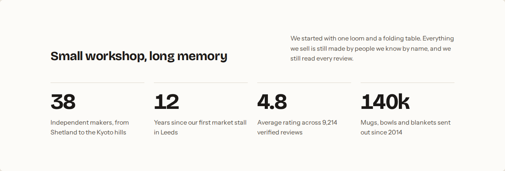

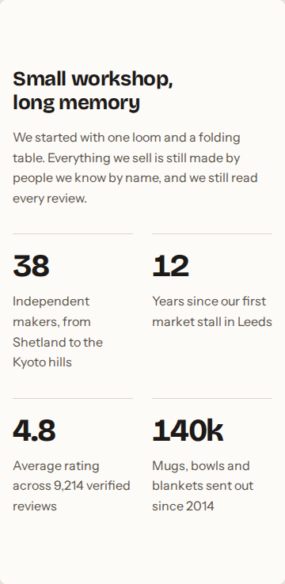

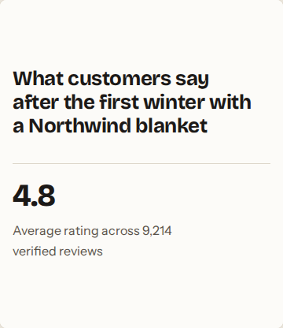

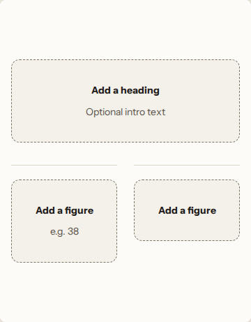
*`row`: heading left and intro right, then the figures in one row. Mobile shows a 2 × 2 grid; a single figure spans the full width.*

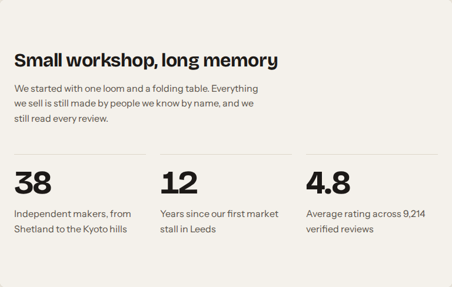

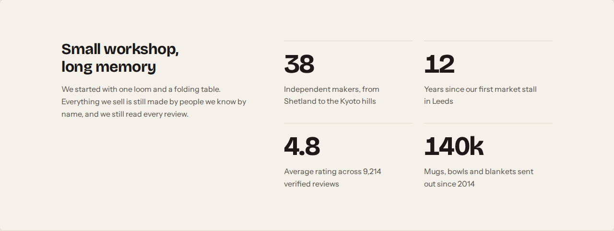
*`split` on `surface`: below 64rem it looks like `row`. From 64rem, the head is in a `5fr` column and the figures in a 2 × 2 grid in `7fr`.*

**Fields**

| Field id | Type | Required | Default | Notes |
|---|---|---|---|---|
| `variant` | select | yes | `row` | `row` · `split`. |
| `heading` | string | yes | — | Rendered as `h2`. Up to about 60 characters. |
| `intro` | text | no | empty | One or two sentences. Hidden when empty. |
| `items` | list | yes | — | 2 to 4 recommended; 1 to 8 supported. |
| `items[].value` | string | yes | — | The figure as it should read: `38`, `4.8`, `140k`, `96%`. Up to 6 characters. Units belong in the value, not the label. |
| `items[].label` | string | yes | — | What the figure counts and where it comes from. Up to about 60 characters. |
| `sectionBackground` | select | no | `none` | `none` · `surface` · `surface-strong` · `primary` · `accent`. |

**Variants**

| variant | What changes |
|---|---|
| `row` | Heading on the left and intro on the right on one line (the intro, up to 26rem, wraps under the heading when there isn't room), then the figures in one row. |
| `split` | From 64rem: heading above intro in a `5fr` column, figures in a 2 × 2 grid in a `7fr` column, with a 4rem gap and the two aligned to the top. Below 64rem it looks like `row`. Don't use more than 4 figures. |

**Layout**

- **Item**: a grid with 0.75rem gaps, a 1px `border` top rule and 1.25rem top padding.
  - Figure: heading font, weight 700, line-height 1, letter-spacing −0.03em, tabular figures, `text`. It may wrap anywhere rather than overflow.
  - Label: 1rem, `muted`, max 22ch so it breaks into two even lines.
- **Below 48rem**: 2-column grid with gaps of 2rem (rows) × 1.5rem (columns). Figure 2.5rem. A single item spans the full width. Heading to figures: 2rem. Heading h2 1.625rem.
- **48–64rem**: `repeat(auto-fit, minmax(10rem, 1fr))`, so 3 or 4 figures sit in one row. Figure 3.5rem. Heading to figures: 3rem.
- **From 64rem**: same as tablet (heading h2 2rem). `split` switches to its two-column layout.
- **On `primary` / `accent`**: the item rules become `currentColor`. Figures, labels, heading and intro become `primary-contrast` / `accent-contrast`.

**States**

| State | What it looks like |
|---|---|
| Ideal | 4 figures with an intro. |
| Minimal content | 1 figure, no intro; the figure spans the full width. |
| Long content | Headings balance-wrap. Figures longer than 6 characters wrap anywhere rather than overflow, so keep them short. |
| Many items | 5 to 8 wrap into further rows of the auto-fit grid. |
| No image | Not applicable. |
| Empty (freshly inserted) | Editor hints for the heading ("Add a heading", optional intro text) and two figures ("Add a figure", e.g. 38). Live, items with no value are not rendered. |

**Field → layout mapping**

`heading` → the h2 in the block head · `intro` → the lead paragraph · `items` → a list, one item each · `value` → the large figure · `label` → the paragraph under it · `sectionBackground` → the section ground.

**Keyboard & accessibility**

- The `<section>` has `aria-labelledby` pointing at the `h2`. The figures are a plain `<ul>`, and each value comes before its label in reading order, so a screen reader hears "38, Independent makers…".
- Nothing is interactive: no tab stops.
- Figures are static. Don't animate counting up: it bypasses reduced motion and reads wrongly mid-animation.

**Default content (Northwind Goods)**

- Heading "Small workshop, long memory".
- Intro "We started with one loom and a folding table. Everything we sell is still made by people we know by name, and we still read every review."
- Items:
  - **38** Independent makers, from Shetland to the Kyoto hills
  - **12** Years since our first market stall in Leeds
  - **4.8** Average rating across 9,214 verified reviews
  - **140k** Mugs, bowls and blankets sent out since 2014
- Long-heading story: "What customers say after the first winter with a Northwind blanket".

**Acceptance criteria**

- [ ] Figures and heading `text` are 16.9:1 on `background`, 15.5:1 on `surface` and 13.8:1 on `surface-strong`. Labels and intro `muted` are 7.4:1 / 6.8:1 / 6.1:1. On `primary`, everything is `primary-contrast` at 15.6:1; on `accent`, everything (figures included) is `accent-contrast` at 6.7:1 (1.4.3).
- [ ] Item rules are decorative and never carry meaning.
- [ ] The block has no focusable parts, and page focus passes straight through it (2.1.1).
- [ ] The heading is `h2`, the figures are a list, and each value is followed by its label in the reading order (1.3.1, 1.3.2).
- [ ] No count-up or other animation, so reduced motion needs nothing (2.2.2).
- [ ] At 320px and 200% zoom, figures wrap instead of overflowing, with no horizontal scroll (1.4.10). Text spacing overrides don't clip labels (1.4.12).

**Do / Don't**

- Do use figures a customer could check, and say in the label where each one comes from.
- Do keep values to 6 characters or fewer.
- Don't use vague or inflated figures ("100% happiness", "1M+ smiles"), icons above figures, or coloured cards.
- Don't put more than 4 figures in `split`; use `row` instead.

---

### Logo cloud · `logo-cloud`

A quiet, monochrome strip of stockist or press logos ("As stocked by", "As featured in") that adds credibility without competing with products.

**Container** `content` (`grid`), `wide` (`row`) · **Section background** none by default (options `surface`, `surface-strong`) · **Section spacing** `section-md`

**Uses** LogoItem (image or wordmark fallback, optionally a link).

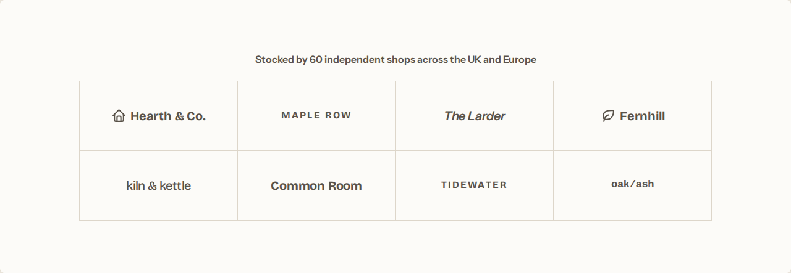

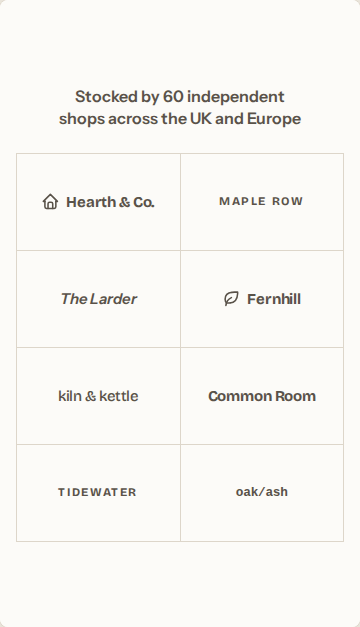

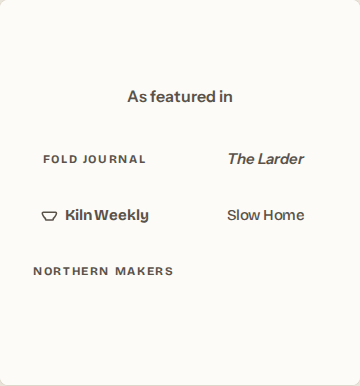

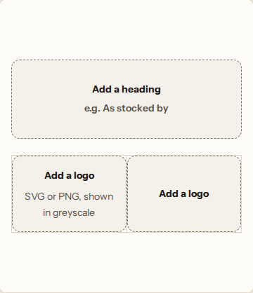
*`grid`: a centred label above hairline-ruled cells, 4 columns on desktop and 2 on mobile. `row` on mobile uses 2 columns without rules.*

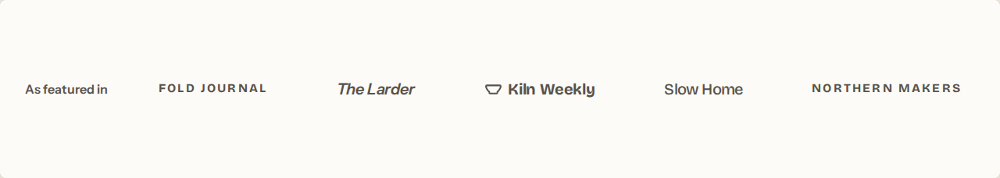

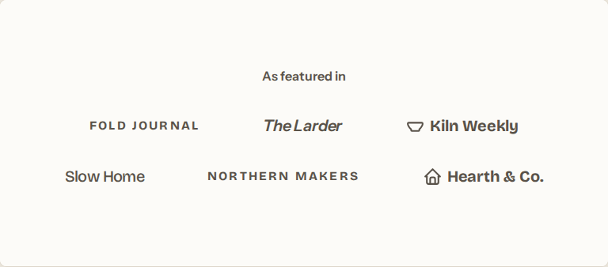
*`row` on desktop: the label on the left, logos spread in one line. At tablet width they wrap, centred. The wordmark styles shown only imitate different logos; production uses real logo files.*

**Fields**

| Field id | Type | Required | Default | Notes |
|---|---|---|---|---|
| `variant` | select | yes | `grid` | `grid` · `row`. |
| `heading` | string | yes | — | A short label rendered as `h2` in 1rem semibold `muted`, for example "As featured in". |
| `logos` | list | yes | — | 4 to 12. `grid` looks best with multiples of 4; `row` with 4 to 6. |
| `logos[].image` | media | yes | — | SVG or transparent PNG. Shown greyscale at 75% opacity, max 2.5rem tall × 9rem wide. |
| `logos[].name` | string | yes | — | Used as the image alt text, and as the wordmark fallback when there is no image. |
| `logos[].link` | link | no | none | Stockist page or article. When set, the logo is a link. |
| `sectionBackground` | select | no | `none` | `none` · `surface` · `surface-strong`. |

**Variants**

| variant | What changes |
|---|---|
| `grid` | A centred label above hairline-ruled cells (a 1px `border` outline per cell, cells 1px apart so the rules read as single lines). Cells are 6rem tall below 48rem and 7rem from 48rem. |
| `row` | No rules. From 64rem the label sits on the left (max 11rem) and the logos spread in a single line. Below that they wrap, centred. |

**Layout**

- **Label**: 1rem / 1.4, weight 600, `muted`, centred, balanced, 1.5rem above the logos.
- **Logo item**: content centred.
  - Image: max 2.5rem tall and 9rem wide, contained, greyscale (with a slight contrast boost) at 75% opacity.
  - Wordmark fallback: heading font, weight 700, `muted`, one line, 0.9375rem below 48rem and 1.25rem from 48rem.
  - Hover (linked logos only): the image goes to full opacity and the wordmark to `text`, over `duration-fast`.
- **Below 48rem**: 2 columns in both variants. `grid` cells are 6rem tall with 0.25rem side padding. `row` items are 3.5rem tall with a 1rem column gap.
- **48–64rem**: `grid` has 4 columns with 7rem cells. `row` wraps centred with gaps of 0.5rem × 3rem.
- **From 64rem**: `grid` is 4 × n in the 64rem container. `row` is one line: label (max 11rem, left aligned, no bottom space), then logos spread apart with at least 1.5rem between them, 3rem after the label.

**States**

| State | What it looks like |
|---|---|
| Ideal | 8 logos (`grid`), 5 (`row`). |
| Minimal content | 2 logos, one `grid` row. |
| Long content | Logo images are size-capped. Long wordmark fallbacks stay on one line, so keep names to about 16 characters. |
| Many items | 12 in `grid` makes three rows. In `row`, more than 6 wraps even on desktop. |
| No image | The `name` renders as a wordmark (heading font, 700, `muted`). |
| Hover (linked) | Full opacity / `text` wordmark. Never the only cue: linked logos are also tab stops with a focus ring. |
| Empty (freshly inserted) | Editor hints for the heading ("Add a heading", e.g. As stocked by) and two logo cells ("Add a logo", SVG or PNG, shown in greyscale). |

**Field → layout mapping**

`heading` → the `h2` label · `logos` → a list, one item each · `image` → the image in the logo item (or the wordmark when there is no image) · `name` → alt text or wordmark · `link` → turns the logo item into a link.

**Keyboard & accessibility**

- `<section aria-labelledby>` pointing at the `h2` label. The logos are a `<ul>`.
- The image `alt` is the name only; don't write "logo".
- Linked logos are tab stops in visual order and at least 3.5rem tall (`row`) or the full cell (`grid`). The standard focus ring follows `radius-sm` corners. `Enter` follows the link.
- The greyscale filter is decorative.

**Default content (Northwind Goods)**

- `grid`: "Stocked by 60 independent shops across the UK and Europe". Logos: Hearth & Co., Maple Row, The Larder, Fernhill, kiln & kettle, Common Room, Tidewater, oak/ash (fictional).
- `row`: "As featured in". Logos: Fold Journal, The Larder, Kiln Weekly, Slow Home, Northern Makers.

**Acceptance criteria**

- [ ] The label and wordmark fallbacks `muted` are 7.4:1 on `background`, 6.8:1 on `surface` and 6.1:1 on `surface-strong`, and turn `text` on hover (1.4.3). Logo images are logotypes (exempt from 1.4.3), but each has its name as alt text.
- [ ] Cell rules are decorative `border` and carry no meaning.
- [ ] Linked logos show the standard focus ring with `radius-sm` corners (2.4.7).
- [ ] Linked logos are reachable with `Tab` in visual order and open with `Enter` (2.1.1, 2.4.3).
- [ ] Linked logo targets are at least 3.5rem tall (2.5.8).
- [ ] Hover is never the only cue that a logo is a link (1.4.1).
- [ ] Every logo has a text alternative equal to its name. The list is a `<ul>` under an `h2` (1.1.1, 1.3.1, 4.1.2).
- [ ] With reduced motion, the hover opacity change is instant.
- [ ] At 320px and 200% zoom, logos sit in 2 columns with no horizontal scroll or overlap (1.4.10).

**Do / Don't**

- Do upload logos with transparent backgrounds and trimmed whitespace.
- Do link to the article or stockist page when you have one.
- Don't show logos in their brand colours; they would compete with your products.
- Don't mix stockists and press in one block. Use two blocks with honest labels.

---

### Testimonials · `testimonials`

Customer reviews shown as a grid of cards, a swipeable carousel or one large featured quote, each with an optional star rating and the product it refers to.

**Container** `wide` (`grid`, `carousel`), `content` (`single-large`) · **Section background** none by default (`single-large`: `surface`; options `surface`, `surface-strong`, `primary`) · **Section spacing** `section-md`

**Uses** Rating (md, and lg in `single-large`), Avatar (2.5rem, and 3.5rem in `single-large`), Link (standalone), CarouselControls (arrows and counter).

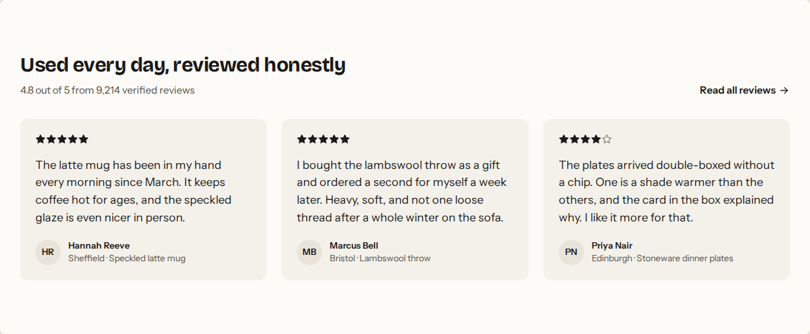

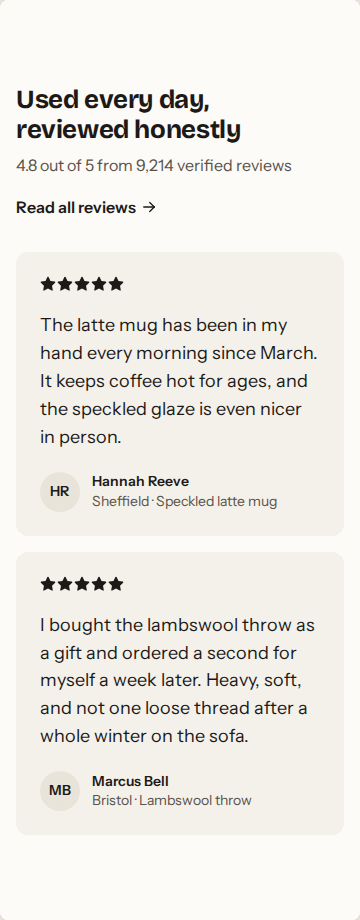

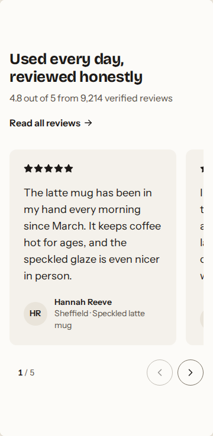

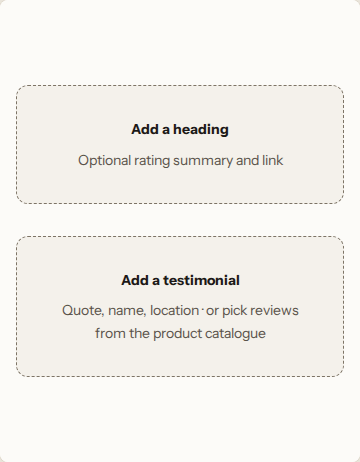
*`grid`: `surface` cards with stars, the quote, and an initials avatar with name and meta. The carousel on mobile shows 86% slides so the next card peeks, with a "1 / 5" counter and arrows below.*

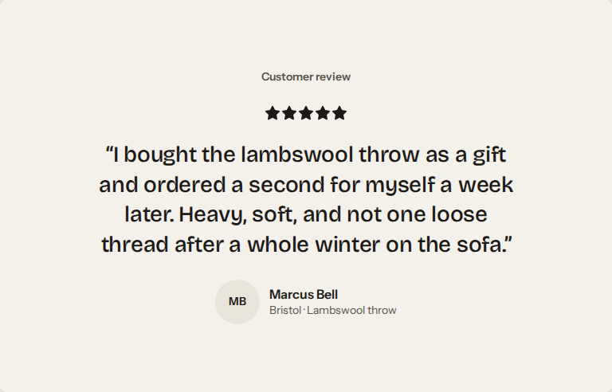

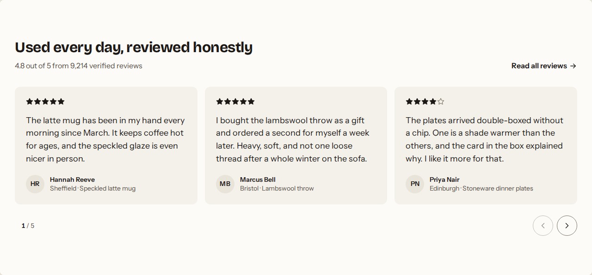
*`single-large` on `surface`: the small "Customer review" label, lg stars, a large quote in the heading font, and a 3.5rem avatar. The carousel on desktop shows three at a time.*

**Fields**

| Field id | Type | Required | Default | Notes |
|---|---|---|---|---|
| `variant` | select | yes | `grid` | `grid` · `carousel` · `single-large`. |
| `heading` | string | yes | — | `h2`. In `single-large` it renders as a small 0.875rem label ("Customer review"). |
| `summary` | string | no | empty | For example "4.8 out of 5 from 9,214 verified reviews". Shown under the heading. |
| `link` | link | no | none | "Read all reviews". A standalone link on the right of the head. |
| `items` | list | yes | — | `grid` shows 1 to 6 (3 is ideal); `carousel` 3 to 12; `single-large` uses the first. |
| `items[].quote` | text | yes | — | 1 to 3 sentences, about 240 characters maximum. Longer quotes make cards uneven. |
| `items[].name` | string | yes | — | The customer's name as they agreed to be shown, e.g. "Hannah Reeve" or "Hannah R.". |
| `items[].meta` | string | no | empty | Location and/or product, e.g. "Sheffield · Speckled latte mug". |
| `items[].avatar` | media | no | none | Square photo. When missing, 2-letter initials on `surface-strong`. |
| `items[].rating` | select | no | `none` | `none` · `1`–`5`. Hidden when `none`. |
| `items[].product` | link | no | none | Links the meta line to the product. |
| `sectionBackground` | select | no | `none` (`single-large`: `surface`) | `none` · `surface` · `surface-strong` · `primary`. |

**Variants**

| variant | What changes |
|---|---|
| `grid` | Cards in 1 → 2 → 3 columns. A single item is centred at max 36rem. |
| `carousel` | The same cards in a horizontal scroll-snap track. Slides are 86% wide on mobile (the next card peeks), half the track from 40rem of block width and a third from 60rem. A counter and prev/next arrows sit under the track. |
| `single-large` | One centred figure: a 5-star rating (lg), the quote at 1.75rem (1.375rem below 48rem) in the heading font at weight 500, and an avatar (3.5rem) with name and meta. |

**Layout**

- **Head**: the heading (h2, 2rem; 1.625rem below 48rem) with the summary 0.5rem below it (`muted`, 1rem) on the left; the link on the right, aligned to the bottom; wrapping with gaps of 1rem × 2rem. 2rem above the items.
- **Card**:
  - `surface` fill (`background` when the section is `surface` or `surface-strong`), `radius-lg`, 1.5rem padding, 1.25rem gaps, full row height.
  - Rating: 1rem stars, 1px apart. Filled stars `text`; empty stars outlined in `border-strong`.
  - Quote: 1.125rem / 1.55, `text`. It takes the free height, so the person row stays at the bottom. Paragraphs are 0.75rem apart.
  - Person row: flex, 0.75rem gap, 0.875rem / 1.4. Avatar 2.5rem, initials 0.875rem weight 600. Name weight 600 `text`, not italic. Meta `muted` below it. With `product`, the meta line is a link.
- **Below 48rem**: `grid` is 1 column with a 1rem gap. Carousel slides are 86% wide with a 1rem gap.
- **Carousel controls**: 1.5rem below the track, spread apart with a 1rem gap. On the left, the counter "1 / 5" (0.875rem `muted`, the current number bold `text`, tabular figures, min width 3.5rem). On the right, 2.75rem round arrow buttons.
- **48–64rem**: `grid` is 2 columns (from 40rem); the carousel shows 2 slides.
- **From 64rem**: `grid` is 3 columns (from 60rem) with a 1.5rem gap; the carousel shows 3.
- **`single-large`**:
  - A centred figure with 1.5rem gaps: the label (0.875rem weight 600 `muted`), lg rating (1.25rem stars), then the quote.
  - Quote: heading font, 1.375rem → 1.75rem from 48rem, line-height 1.35, weight 500, −0.01em, max 36ch, balanced, with typographic quotation marks.
  - Person row: avatar 3.5rem, name 1rem, meta 0.875rem, left aligned beside the avatar.
- **On `primary`**: heading, summary, link and stars take `primary-contrast` (empty stars at 55% opacity). Cards stay light, with normal colours inside.

**States**

| State | What it looks like |
|---|---|
| Ideal | 3 (`grid`) or 5 (`carousel`) reviews with ratings. |
| Minimal content | 1 review in `grid`, centred and narrow (max 36rem). |
| Long content | Cards stretch to equal height, and the person row stays at the bottom. |
| Many items | The grid wraps into more rows; use the carousel above 6 items. |
| No image | Initials avatar. |
| No rating | The rating row is omitted and the quote moves up. |
| Carousel at the ends | Previous is disabled on the first slide and Next at the end (45% opacity). If the focused arrow becomes disabled, focus moves to the other one. |
| Empty (freshly inserted) | Hints for the heading ("Add a heading", optional rating summary and link) and the first testimonial ("Add a testimonial": quote, name, location, or pick reviews from the product catalogue). |

**Field → layout mapping**

- `heading` → the h2 (in `single-large`, the small label h2).
- `summary` → the lead line under it.
- `link` → the standalone link in the head.
- `items[]` → one figure each: `quote` → blockquote, `name` → cite, `meta` → the meta line (a link when `product` is set), `avatar` → avatar, `rating` → rating row.
- `sectionBackground` → the section ground.

**Keyboard & accessibility**

- `<section aria-labelledby>` pointing at the heading.
- Each review is a `<figure>` with a `<blockquote>` and a `<figcaption>` (holding avatar, `<cite>` name and meta). The avatar initials are `aria-hidden`.
- Stars are `aria-hidden`, with visually hidden text "Rated 4 out of 5". Filled and outlined empty stars also differ in shape.
- **Carousel**:
  - The wrapper is `role="region" aria-roledescription="carousel"`, labelled by the heading.
  - Slides are `role="group" aria-roledescription="slide" aria-label="n of N"`.
  - The track is focusable (`tabindex="0"`, labelled "Reviews. Use the arrow keys to scroll."). `ArrowLeft` / `ArrowRight` move one slide.
  - Prev / Next are 2.75rem `<button>`s labelled "Previous reviews" / "Next reviews", disabled at the ends.
  - The counter is `aria-hidden`; the slide labels carry the position.
  - No autoplay.
- Links (head link, product links) are reachable with `Tab`, and `Enter` follows them.

**Default content (Northwind Goods)**

- Heading "Used every day, reviewed honestly", summary "4.8 out of 5 from 9,214 verified reviews", link "Read all reviews".
- Reviews:
  - Hannah Reeve, Sheffield · Speckled latte mug, 5 stars: "The latte mug has been in my hand every morning since March. It keeps coffee hot for ages, and the speckled glaze is even nicer in person."
  - Marcus Bell, Bristol · Lambswool throw, 5 stars: "I bought the lambswool throw as a gift and ordered a second for myself a week later. Heavy, soft, and not one loose thread after a whole winter on the sofa."
  - Priya Nair, Edinburgh · Stoneware dinner plates, 4 stars: "The plates arrived double-boxed without a chip. One is a shade warmer than the others, and the card in the box explained why. I like it more for that."
  - Sofia Lind, Stockholm · Fisherman rib cardigan: "Customer care swapped my cardigan for a size up in two days, no forms, no fuss. It is the one I reach for first."
  - Joel Mercer, Dublin · Walnut serving board: "You can tell the walnut board was finished by hand. It has already outlived two cheaper ones."
- `single-large`: label "Customer review", Marcus Bell's quote.

**Acceptance criteria**

- [ ] Quote and name `text` are 15.5:1 on `surface` cards (16.9:1 on `background` cards). Meta and summary `muted` are 6.8:1 on `surface` and 7.4:1 on `background`. Filled stars `text` are 3:1 or better; empty star outlines `border-strong` are 4.1:1 on `surface`. On `primary`, head text is `primary-contrast` at 15.6:1 (1.4.3, 1.4.11).
- [ ] Carousel arrow boundaries (`border-strong`) are 4.5:1 on `background` (1.4.11).
- [ ] The track, arrows and links show the standard focus ring. The track's ring has a 4px infill and offset (2.4.7).
- [ ] With the track focused, `ArrowLeft` / `ArrowRight` move one slide. Focus never lands on a disabled arrow (2.1.1, 2.4.3).
- [ ] Arrows are 2.75rem and links at least 1.5rem tall (2.5.8).
- [ ] The rating is given as text ("Rated 4 out of 5") and by star shape, not by colour alone (1.4.1, 1.1.1).
- [ ] Reviews are figures with blockquote and figcaption. Carousel slides announce "n of N" (1.3.1, 4.1.2).
- [ ] No autoplay. With reduced motion, arrow navigation jumps instead of scrolling smoothly (2.2.2).
- [ ] At 320px and 200% zoom, cards stack or scroll within the track only, quotes wrap, and nothing is clipped (1.4.10, 1.4.12).

**Do / Don't**

- Do use real reviews with permission. Include a 4-star review; it makes the others more believable.
- Do name the product so shoppers can go straight to it.
- Don't invent quotes, add big decorative quote marks to every card, or autoplay the carousel.
- Don't cut quotes with an ellipsis in the middle of a sentence. Edit them down with the customer's approval.

---

### FAQ · `faq`

Frequently asked questions as a native accordion, with an optional intro and a link to customer care for anything the list doesn't answer.

**Container** `narrow` (`one-column`), `content` (`two-column`) · **Section background** none by default (options `surface`, `surface-strong`) · **Section spacing** `section-md`

**Uses** Accordion (native `
` / `
`), RichText (answers), Link.

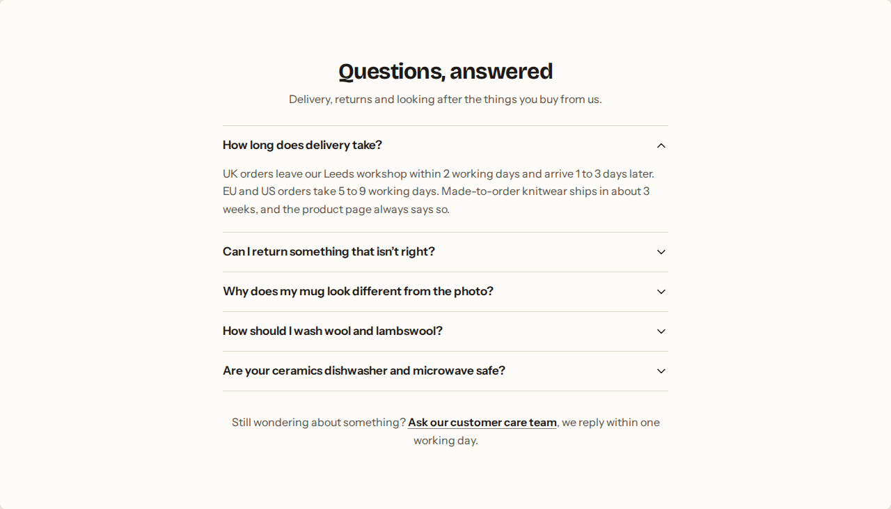

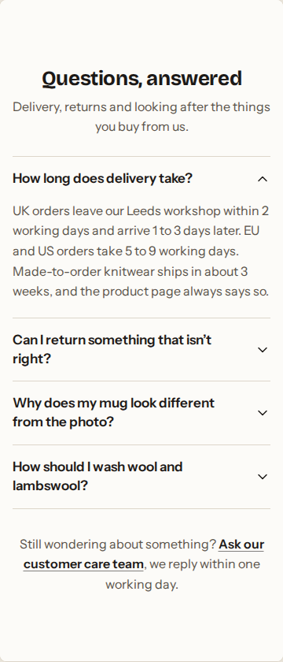

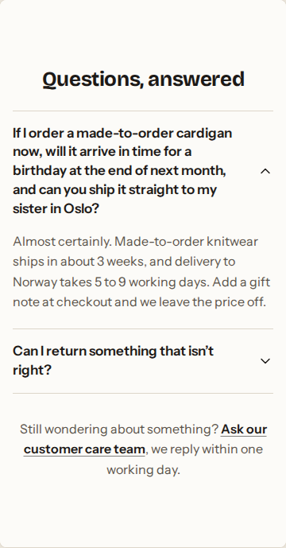

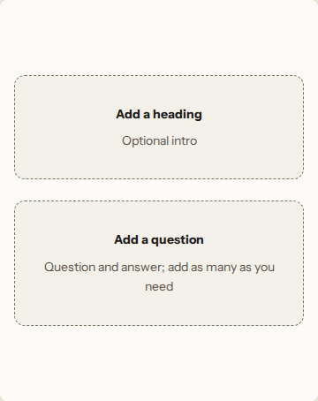
*`one-column`: a centred head, a 40rem accordion with the first item open (chevron up) and the contact line centred below. A long question wraps while the chevron stays top-right.*

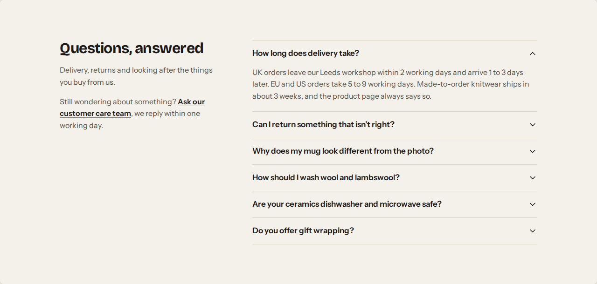

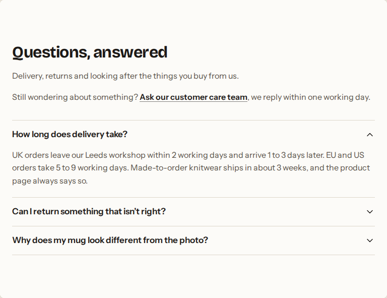
*`two-column`: a sticky head column (heading, intro, contact line) beside the accordion from 64rem; stacked below.*

**Fields**

| Field id | Type | Required | Default | Notes |
|---|---|---|---|---|
| `variant` | select | yes | `one-column` | `one-column` · `two-column`. |
| `heading` | string | yes | — | `h2`. |
| `intro` | text | no | empty | One sentence. |
| `items` | list | yes | — | 3 to 10 recommended. |
| `items[].question` | string | yes | — | Written the way a customer would ask it. Up to about 120 characters. |
| `items[].answer` | rich-text | yes | — | Paragraphs, lists and links only. |
| `items[].open` | bool | no | first item on | Open on load. Default: only the first item is open (or none). |
| `contactText` | string | no | "Still wondering about something?" | |
| `contactLink` | link | no | none | For example "Ask our customer care team" → contact page. The contact line is hidden when empty. |
| `sectionBackground` | select | no | `none` | `none` · `surface` · `surface-strong`. |

**Variants**

| variant | What changes |
|---|---|
| `one-column` | Centred head, accordion 40rem wide (narrow container), contact line centred below. |
| `two-column` | From 64rem: a `4fr` head column (heading, intro, contact line) beside a `7fr` accordion, 4rem gap, aligned to the top. The head column is sticky: it stays 2rem from the top of the viewport, plus the height of a sticky header when there is one, so it is never hidden under the bar. Below 64rem it stacks with the head left aligned. |

**Layout**

- **Head**: heading h2 2rem (1.625rem below 48rem); intro 1rem `muted`.
  - `one-column`: centred, 1.5rem above the list.
  - `two-column`: a grid with 1rem gaps, 2rem above the list when stacked. The contact line sits inside the head.
- **Accordion**: a `border` hairline on top of the list and below each item.
  - Question row (summary): full width, at least 3.5rem tall, 1rem vertical padding. The question is 1.0625rem / 1.4, weight 600, `text`, left aligned, with a 1rem gap to a 1.25rem chevron-down icon that never shrinks and stays top-right when the question wraps. `radius-sm` corners (for the focus ring). On hover the question underlines (1px, offset 0.2em).
  - Answer: 1rem, `muted`, max 65ch, 1.25rem bottom padding. Paragraphs and lists are 0.75rem apart, and links are `text`.
- **Contact line**: 1rem `muted`, 2rem below the list (`one-column`, centred). The link is `text`, weight 600, underlined.
- **Below 48rem**: as above; question rows at least 3.5rem.
- **48–64rem**: `one-column` unchanged (narrow). `two-column` stacked, head left aligned.
- **From 64rem**: as described in Variants. Answers cap at 65ch.

**States**

| State | What it looks like |
|---|---|
| Ideal | 5 questions, the first one open. |
| Minimal content | 1 question. |
| Long content | Long questions wrap (the chevron keeps its size). Long answers are fine; keep them to about 120 words. |
| Many items | More than 10 works, but consider splitting by topic into several FAQ blocks with headings. |
| Open / closed | Open: chevron rotated 180° (over `duration-base` `ease-out`), and the answer fades in over `duration-base`. Closed: chevron down, answer hidden. |
| No image | Not applicable. |
| Empty (freshly inserted) | Hints for the heading ("Add a heading", optional intro) and the first question ("Add a question": question and answer, add as many as you need). On the live site, an empty list hides the whole block. |

**Field → layout mapping**

`heading` → h2 · `intro` → lead paragraph · `items[]` → one `
` each: `question` → the `
` text plus the chevron, `answer` → the panel, `open` → the `open` attribute · `contactText` + `contactLink` → the contact paragraph with its link · `sectionBackground` → section ground.

**Keyboard & accessibility**

- `<section aria-labelledby>` pointing at the `h2`.
- Native `
` / `
`, so no script is needed. `Tab` moves between questions (and into links in open answers), and `Enter` / `Space` toggles. The browser exposes the summary as a button with its expanded state.
- The chevron rotation is a shape change, so the state isn't shown by colour alone. The hover underline is not the only cue.
- Content collapsed inside `
` stays findable with in-page search in supporting browsers.
- The summary text is the question. Don't nest headings inside `
`, because some screen readers then drop the button role.
- Optional: output `FAQPage` structured data from the same fields.

**Default content (Northwind Goods)**

Heading "Questions, answered" / intro "Delivery, returns and looking after the things you buy from us."

1. **How long does delivery take?** UK orders leave our Leeds workshop within 2 working days and arrive 1 to 3 days later. EU and US orders take 5 to 9 working days. Made-to-order knitwear ships in about 3 weeks, and the product page always says so. *(open)*
2. **Can I return something that isn't right?** Yes. You have 30 days to send back anything unused, in its original packaging. UK returns are free with the prepaid label in your parcel. Seconds and personalised pieces can't be returned unless they arrive damaged.
3. **Why does my mug look different from the photo?** Every piece is glazed by hand and fired in small batches, so colour and speckle vary from kiln to kiln. We photograph a typical piece, and the card in your box tells you which batch yours came from.
4. **How should I wash wool and lambswool?** Air it more, wash it less. When it does need a wash, hand wash cool with a wool detergent, press out the water in a towel and dry flat away from the radiator.
5. **Are your ceramics dishwasher and microwave safe?** Our stoneware is dishwasher, microwave and oven safe up to 200°C. Pieces with a gold rim or raw clay base are hand wash only, which is noted on the product page.
6. **Do you offer gift wrapping?** Every order ships in recycled tissue and a plain kraft box. Add a handwritten card at checkout for $4, and we leave prices off the packing slip.

Contact: "Still wondering about something? **Ask our customer care team**, we reply within one working day."

Long-question story: "If I order a made-to-order cardigan now, will it arrive in time for a birthday at the end of next month, and can you ship it straight to my sister in Oslo?", answered "Almost certainly. Made-to-order knitwear ships in about 3 weeks, and delivery to Norway takes 5 to 9 working days. Add a gift note at checkout and we leave the price off."

**Acceptance criteria**

- [ ] Questions `text` are 16.9:1 on `background`, 15.5:1 on `surface` and 13.8:1 on `surface-strong`. Answers, intro and contact line `muted` are 7.4:1 / 6.8:1 / 6.1:1. The chevron `text` is 3:1 or better (1.4.3, 1.4.11).
- [ ] Every summary and every link shows the standard focus ring (2.4.7).
- [ ] `Tab` reaches each question, `Enter` / `Space` toggles it, and links inside open answers are reachable. No keyboard trap (2.1.1, 2.1.2).
- [ ] Question rows are at least 3.5rem tall; links at least 1.5rem (2.5.8).
- [ ] Open or closed state is shown by chevron direction and exposed as the summary's expanded state, not by colour (1.4.1, 4.1.2).
- [ ] In `two-column`, the sticky head never sits under a sticky header, and focused items are never hidden behind either (2.4.11).
- [ ] With reduced motion, the chevron rotation and answer fade are instant.
- [ ] At 320px and 200% zoom, long questions wrap beside the chevron, `two-column` stacks, and nothing scrolls horizontally (1.4.10, 1.4.12).
- [ ] On the live site, an empty list hides the block.

**Do / Don't**

- Do answer directly in the first sentence, then give detail.
- Do keep one topic per block, and use `two-column` for long pages.
- Don't hide essential policy (returns, delivery costs) only inside an FAQ; link to the full policy.
- Don't open every item by default; that defeats the scan.

---

### Pricing table · `pricing-table`

Side-by-side subscription or service plans, each with a price, billing note, a call to action and a checklist of feature rows. One plan can be highlighted.

**Container** `content` · **Section background** none by default (options `surface`, `surface-strong`) · **Section spacing** `section-md`

**Uses** Button (primary md full width for the highlighted plan, outline md full width for the others), Badge (primary, pill, with a star icon).

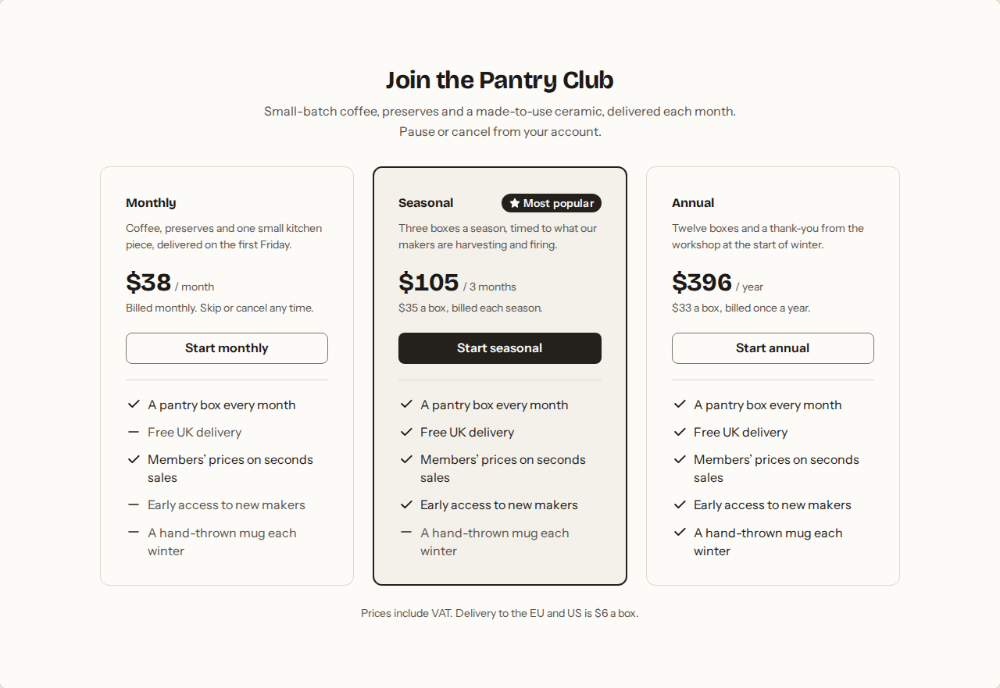
*Desktop: three plans aligned row by row (name, price, button, features). Seasonal has a 2px `primary` border, a `surface` fill, the "Most popular" badge and a filled button. Excluded rows show a minus icon and `muted` text.*

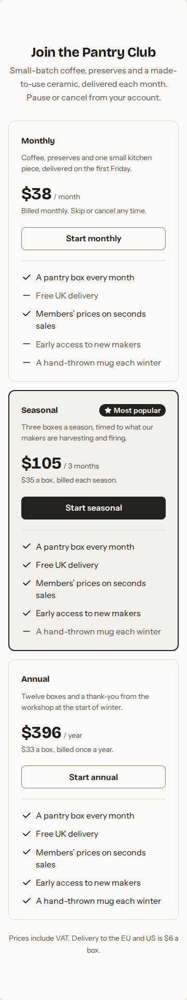

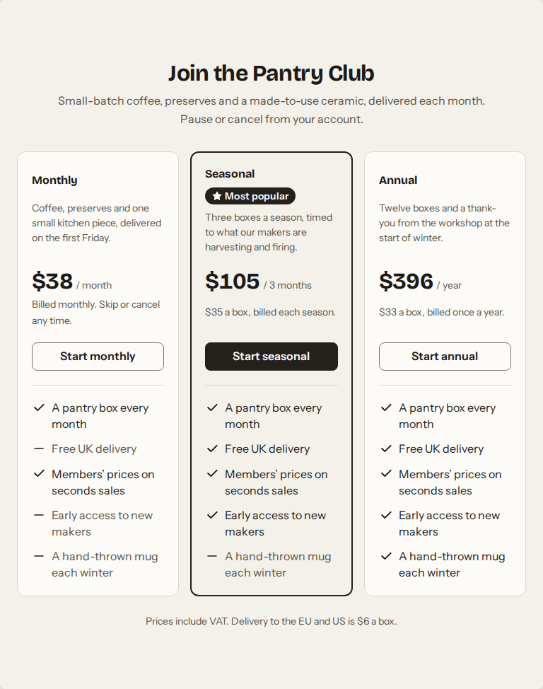

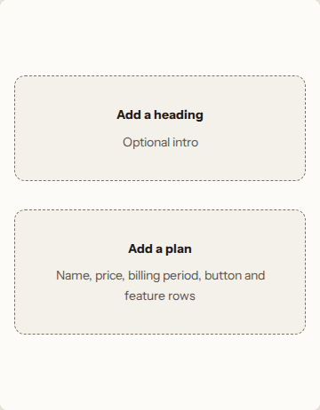
*Mobile stacks the plans and keeps the highlighted plan in its place. Tablet on `surface` fits three plans side by side.*

**Fields**

| Field id | Type | Required | Default | Notes |
|---|---|---|---|---|
| `heading` | string | yes | — | `h2`, centred. |
| `intro` | text | no | empty | One or two sentences. |
| `featureRows` | list | yes | — | The shared rows every plan is compared on, in order. 3 to 8. |
| `featureRows[].label` | string | yes | — | For example "Free UK delivery". |
| `plans` | list | yes | — | 1 to 4 (3 is ideal). |
| `plans[].name` | string | yes | — | `h3`, for example "Seasonal". |
| `plans[].description` | text | no | empty | One sentence, 0.875rem `muted`. |
| `plans[].price` | string | yes | — | Pre-formatted with currency: "$105". Can bind to a subscription product price. |
| `plans[].period` | string | yes | — | "/ month", "/ 3 months", "/ year". |
| `plans[].note` | string | no | empty | Billing detail, e.g. "$35 a box, billed each season." |
| `plans[].cta` | link | yes | — | Label and URL (selling plan or cart permalink). |
| `plans[].included` | list | yes | — | One bool per `featureRows` item (the editor shows a checkbox column). |
| `highlightedPlan` | select | no | `none` | `none` or a plan name. |
| `highlightLabel` | string | no | "Most popular" | |
| `footnote` | string | no | empty | Tax, shipping or cancellation terms. |
| `sectionBackground` | select | no | `none` | `none` · `surface` · `surface-strong`. |

There is no `variant` field: one layout.

**Variants**: none. The highlighted plan is a state (see below).

**Layout**

- **Head**: centred. Heading h2 2rem (1.625rem below 48rem), intro `muted`, 2rem above the plans.
- **Plan card**: a grid with 1.25rem gaps, aligned to the top, 1px `border` border, `radius-lg`, `background` fill. It contains:
  1. **Top** (0.5rem gaps): a name row (at least 1.75rem tall, wrapping, with the name and the badge spread apart) and the description (0.875rem / 1.5, `muted`). Name: heading font, 1rem / 1.4, weight 700.
  2. **Price** (0.25rem gaps): the amount (heading font, 2rem / 1.1, weight 700, −0.02em, tabular figures, `text`) followed on the same baseline, 0.25rem later, by the period (0.875rem `muted`); then the note (0.875rem `muted`).
  3. **Call to action**: a full-width Button md (2.75rem below 48rem).
  4. **Features**: a list with 0.75rem gaps, 1.25rem top padding and a `border` hairline on top. Each row has a check or minus icon (1.25rem, stroke 2.25) 0.5rem before the label, line-height 1.45. Excluded rows are `muted` (icon and text).
- **Highlighted plan**: 2px `primary` border (padding reduced by 1px to keep alignment), `surface` fill, a primary pill badge (0.875rem, weight 600, `primary` fill, `primary-contrast` text, star icon) with the `highlightLabel` next to the name, and a primary button. Other plans have a 1px `border` border, a `background` fill and an outline button. The highlight never relies on colour alone: it has a text badge, a thicker border and a filled button.
- **Footnote**: 1.5rem below the plans, 0.875rem `muted`, centred.
- **Below 48rem**: plans stack in one column with a 1rem gap and 1.5rem card padding. The highlighted plan keeps its place in the order (it is not moved first).
- **48–64rem**: `repeat(auto-fit, minmax(13rem, 1fr))` with a 1rem gap, so 3 plans sit side by side with 1.25rem card padding. Each card spans four shared rows (top, price, call to action, features) using a subgrid. Prices, buttons and first feature rows line up across plans even when descriptions differ in length.
- **From 64rem**: 1.5rem gap, 2rem card padding. 4 plans fit (about 13rem each).

**States**

| State | What it looks like |
|---|---|
| Ideal | 3 plans, the middle one highlighted. |
| Minimal content | 1 plan, which spans the full width. Give it a `sectionBackground` and keep the intro short. |
| Long content | Long names wrap, and the badge wraps below the name. Long feature labels wrap beside the icon. |
| Many items | 4 plans fit from 64rem; more than 4 is not recommended. |
| No highlight | All plans use the outline button and the 1px border. |
| No image | Not applicable. |
| Empty (freshly inserted) | Hints for the heading ("Add a heading", optional intro) and the first plan ("Add a plan": name, price, billing period, button and feature rows). |

**Field → layout mapping**

- `heading` / `intro` → centred head.
- `plans[]` → a list item each; `highlightedPlan` → which plan gets the highlight.
- `name` → h3; `highlightLabel` → the badge; `description` → the paragraph under the name.
- `price` + `period` → the amount line; `note` → the line under it.
- `cta` → the full-width button (primary if highlighted, outline otherwise).
- `featureRows` × `included` → the feature list, one row per feature row, included or not.
- `footnote` → the centred line below.

**Keyboard & accessibility**

- The plans are a `<ul>` of `<li>`, each labelled by its `h3` (`aria-labelledby`).
- Each feature list has `aria-label="What's included in {name}"`.
- Each row has a check or minus icon (`aria-hidden`) and visually hidden "Included:" or "Not included:" before the label. Excluded rows are also `muted`, so shape, text and colour all carry the state.
- The calls to action are real links, 2.75rem tall on mobile. Tab order goes plan by plan and reaches only the calls to action (feature rows are not focusable). `Enter` follows the link.

**Default content (Northwind Goods)**

- Heading "Join the Pantry Club".
- Intro "Small-batch coffee, preserves and a made-to-use ceramic, delivered each month. Pause or cancel from your account."
- Rows: A pantry box every month · Free UK delivery · Members' prices on seconds sales · Early access to new makers · A hand-thrown mug each winter.
- Plans:
  - **Monthly**: "Coffee, preserves and one small kitchen piece, delivered on the first Friday." $38 / month. "Billed monthly. Skip or cancel any time." Button "Start monthly". Included: rows 1 and 3.
  - **Seasonal** (*Most popular*): "Three boxes a season, timed to what our makers are harvesting and firing." $105 / 3 months. "$35 a box, billed each season." Button "Start seasonal". Included: rows 1–4.
  - **Annual**: "Twelve boxes and a thank-you from the workshop at the start of winter." $396 / year. "$33 a box, billed once a year." Button "Start annual". Included: all rows.
- Footnote: "Prices include VAT. Delivery to the EU and US is $6 a box."

**Acceptance criteria**

- [ ] Name, price and included rows `text` are 16.9:1 on `background` and 15.5:1 on the highlighted `surface`. Description, period, note, excluded rows and footnote `muted` are 7.4:1 / 6.8:1. The badge `primary-contrast` on `primary` is 15.6:1 (1.4.3).
- [ ] The outline button boundary `border-strong` is 4.5:1 on `background`. The highlighted border `primary` is at least 3:1 against `surface` and `background`. The check and minus icons are 3:1 or better (1.4.11).
- [ ] The highlighted plan is identified by the text badge, a thicker border and a filled button, never by colour alone. Included and excluded rows differ by icon shape and hidden text, as well as colour (1.4.1).
- [ ] Every call to action shows the standard focus ring (2.4.7).
- [ ] `Tab` visits the calls to action plan by plan in the visible order, and `Enter` follows them (2.1.1, 2.4.3).
- [ ] Buttons are 2.75rem tall below 48rem and full width in each card (2.5.8).
- [ ] Each plan is a list item named by its `h3`. Each feature list is named "What's included in {name}". Screen readers hear "Included:" or "Not included:" for every row (1.3.1, 4.1.2).
- [ ] No motion beyond button hover, which is instant with reduced motion.
- [ ] At 320px and 200% zoom, plans stack in one column, prices and badges wrap, and nothing scrolls horizontally (1.4.10, 1.4.12).
- [ ] From 48rem, prices, buttons and first feature rows line up across plans.

**Do / Don't**

- Do compare every plan on the same rows in the same order.
- Do state the billing cycle and how to cancel next to the price.
- Don't highlight more than one plan, and don't mark it with colour alone (or with a coloured left border).
- Don't show crossed-out "was" prices unless the plan really sold at that price.

---

## Marketing (continued)

### Newsletter · `newsletter`

An email sign-up with a clear promise, one field, a plain consent line and visible error and success states. Use it once per page. Don't show a sign-up popup on the same page.

**Container** `content` (64rem; the `centered` column is capped at 36rem) · **Section background** default `surface` (options: none, `surface`, `surface-strong`, `primary`, `accent`) · **Section spacing** default `md` (`section-md`)

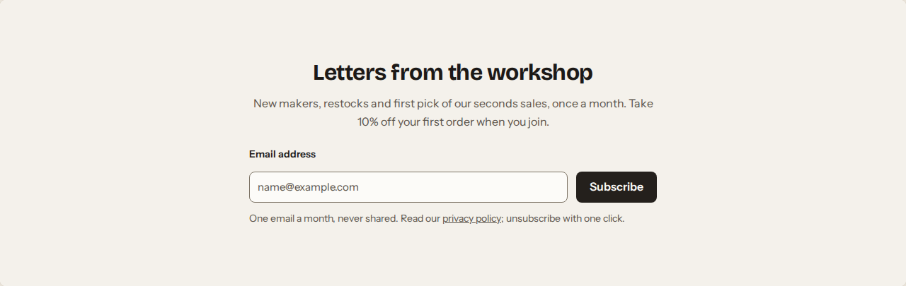
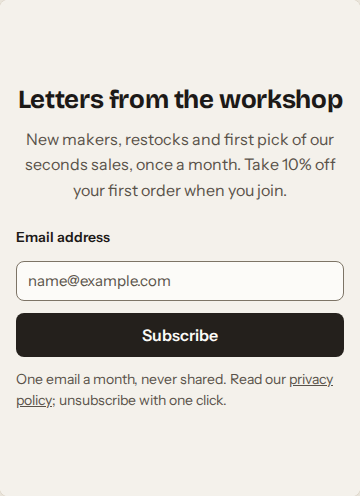
*Default story: `centered` on `surface`. At 360 the field and button stack. From 36rem block width they share one row.*

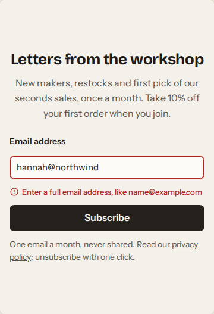
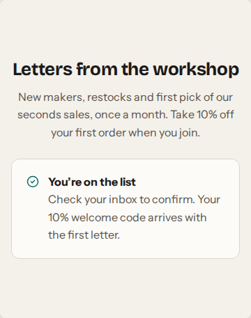
*Error: a 2px `danger` border, an icon and a message under the field. Success: the form is replaced by a `background` panel with a `success` circle-check icon.*

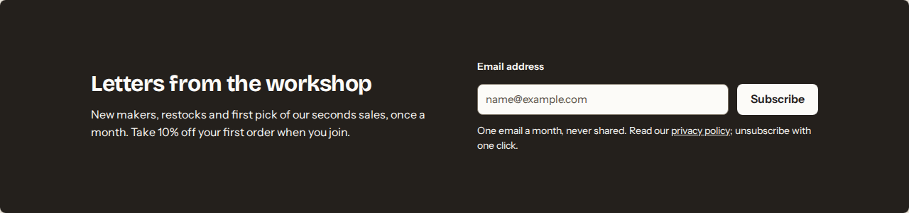
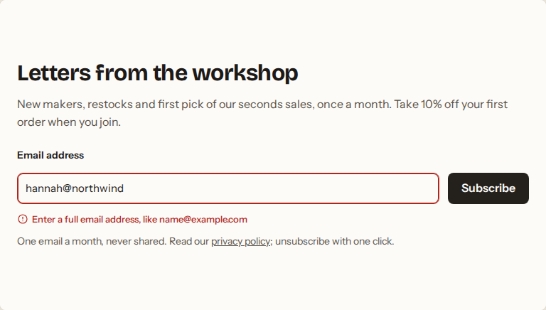
*`split` on `primary`: copy on the left, form on the right from 64rem. Below 64rem block width it stacks, as the 768 frame with an error shows.*

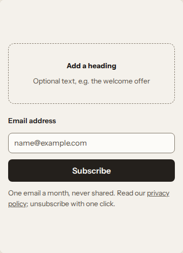
*Freshly inserted: a heading placeholder. The form always renders with its default label, placeholder, button and consent copy.*

**Composition**: Field (label + Input `type="email"` + error), Button primary (md, but at least 2.75rem tall at every width), optional Checkbox, plain layout.

**Fields**

| Field id | Type | Required | Default | Notes |
|---|---|---|---|---|
| `variant` | select | yes | `centered` | `centered` · `split` |
| `heading` | string | yes | — | Rendered as the `h2`. |
| `text` | text | no | — | What subscribers get and how often. Include the offer if there is one. |
| `fieldLabel` | string | no | "Email address" | Always visible above the input. |
| `placeholder` | string | no | "name@example.com" | An example, never an instruction or a replacement for the label. |
| `buttonLabel` | string | no | "Subscribe" | |
| `consent` | rich-text | yes | see Default content | One line with a privacy link. Inline links only. |
| `requireConsentCheckbox` | bool | no | `false` | When on, adds a Checkbox "I'd like to receive emails from Northwind Goods" that must be ticked before submitting. Never pre-ticked. |
| `successTitle` | string | no | "You're on the list" | |
| `successText` | string | no | — | For example the confirmation step and the welcome code. |
| `list` | select | yes | — | The marketing list or audience in the connected email app. Not shown. |
| `sectionBackground` | select | no | `surface` | none · `surface` · `surface-strong` · `primary` · `accent` |

**Variants**

| variant | What changes |
|---|---|
| `centered` | Everything is centred in a 36rem column. The form's text (label, error, consent) stays left-aligned so it lines up with the field. |
| `split` | From 64rem block width: copy left, form right (1fr / 1fr, 4rem gap, vertically centred). Below 64rem it stacks like `centered` but left-aligned and full container width. Looks strongest on `primary`. |

**Layout**

- **Below 48rem**: 1rem gutters. Copy (heading, then text, 0.75rem apart), then the form 1.5rem below. Form order: label, full-width input, error message (when shown), full-width button (2.75rem tall), consent line. Form parts are 0.75rem apart.
- **From 36rem block width** (either variant): the input and button share one row (`1fr auto`, 0.75rem gap). The input stretches to the button's 2.75rem height. The error message moves to its own row under both.
- **48–64rem**: 1.5rem gutters. `centered` stays a 36rem column. `split` is still stacked.
- **From 64rem**: 2rem gutters. `split` becomes two equal columns (4rem gap).
- Type (three sizes): heading `h2` 2rem (1.625rem below 48rem), body 1rem (input text 0.9375rem, 1rem below a 48rem *viewport* so phones don't zoom into the field), consent 0.875rem and error 0.8125rem.

**States**

| State | What it looks like |
|---|---|
| Ideal | Heading, one or two lines of text, the form and the consent line. |
| Minimal content | Heading, the form and consent. Nothing is reserved for missing text. |
| Long content | The heading balance-wraps. Long consent copy wraps under the form. |
| Error (empty or invalid email) | The input gets `aria-invalid="true"` and a 2px `danger` border (1px border plus a 1px inset). An error message with an alert-circle icon appears below: "Enter a full email address, like name@example.com". Focus returns to the input. |
| Error (sign-up service failed) | Same treatment with "We couldn't sign you up just now. Please try again in a minute." |
| Error (consent box not ticked) | Only when `requireConsentCheckbox` is on: the Checkbox shows its Field error (suggested copy "Tick the box to join the list") and focus moves to it. |
| Submitting | The button shows a spinner and `aria-busy="true"`. Its label stays in the accessibility tree. Repeat submits are ignored. |
| Success | The form is replaced by the status panel: a circle-check icon in `success`, `successTitle` in bold `text`, `successText` in `muted`, on a `background` panel with a 1px `border` outline, 1.25rem padding and `radius-lg`. It is announced via `role="status"` (see Keyboard & accessibility for focus). |
| On `primary` / `accent` | The label, text and consent switch to `primary-contrast` / `accent-contrast`. The error message sits on a small `background` chip (0.25rem × 0.5rem padding, `radius-sm`) so `danger` keeps its contrast. The button uses the inverted primary style (see Button). The status panel keeps `text` on `background`. |
| Empty (freshly inserted) | An editor placeholder box for the heading ("Add a heading" / "Optional text, e.g. the welcome offer"). The form always renders with its defaults. On the live site an empty `text` renders nothing. |

**Field → layout mapping**

- `heading` → `h2`. `text` → lead paragraph (`muted`).
- `fieldLabel` → the visible `<label>`. The input is `type="email"`, `autocomplete="email"`, `placeholder` from the field.
- `buttonLabel` → Button primary, `type="submit"`.
- `requireConsentCheckbox` → Checkbox between the field row and the consent line.
- `consent` → consent paragraph (0.875rem `muted`, links underlined in the same colour).
- `successTitle` + `successText` → status panel.

**Keyboard & accessibility**

- The section is labelled by its `h2` (`aria-labelledby`). The form has `novalidate`, so the theme shows its own accessible message instead of the browser bubble.
- The label is always visible and tied to the input by `for`/`id`. The error message is linked by `aria-describedby`. Errors use text, an icon and a thicker border, not colour alone (1.4.1, 3.3.1).
- Keys: `Tab` reaches the input, the checkbox (when present), the button and the consent links in that order. `Enter` in the input submits. `Space` toggles the checkbox.
- A `role="status"` region is in the DOM from page load (empty) and receives the success content, so success is announced (4.1.3). The submit button that held focus disappears with the form, so focus is placed on the status panel (`tabindex="-1"`) instead of falling back to the top of the page (2.4.3).
- Focus ring: standard focus ring on the input (shown on any focus, pointer included, because the caret alone is easy to miss), the button, the checkbox and the links. It is unchanged on `primary` and `accent`.

**Default content (Northwind Goods)**

- Heading: "Letters from the workshop"
- Text: "New makers, restocks and first pick of our seconds sales, once a month. Take 10% off your first order when you join."
- Label "Email address" · placeholder "name@example.com" · button "Subscribe"
- Consent: "One email a month, never shared. Read our [privacy policy]; unsubscribe with one click."
- Success: "You're on the list" / "Check your inbox to confirm. Your 10% welcome code arrives with the first letter."

**Acceptance criteria**

- [ ] Contrast on each background: heading `text` 16.9:1 on `background`, 15.5:1 on `surface`, 13.8:1 on `surface-strong`. Text and consent `muted` 7.4:1 / 6.8:1 / 6.1:1. On `primary`, every text uses `primary-contrast` (15.6:1). On `accent`, `accent-contrast` (6.7:1). No `muted` text ever sits on `primary` or `accent` (1.4.3).
- [ ] Input boundary `border-strong` is at least 3:1 against the input fill and the ground: 4.5:1 on `background`, 4.1:1 on `surface`, 3.6:1 on `surface-strong`. On `primary`/`accent` the `background` input fill carries the boundary (15.6:1 / 6.4:1) (1.4.11).
- [ ] The error text is `danger` on `background` (6.5:1), including on `primary`/`accent`, where it sits on the `background` chip. On `surface`, `danger` is 5.9:1 (computed).
- [ ] The success icon is `success` on the `background` panel (6.2:1), and the success state also says so in words.
- [ ] Label visible at all times. Placeholder is never the only label (3.3.2). The input has `type="email"` and `autocomplete="email"` (1.3.5).
- [ ] Submitting empty or invalid input sets `aria-invalid="true"`, shows the message with an icon, links it with `aria-describedby` and returns focus to the input (3.3.1).
- [ ] The success content is announced through a `role="status"` region that existed before submission, and focus lands on the status panel, not on the document body (4.1.3, 2.4.3).
- [ ] Keyboard only: reach and operate every part with `Tab`, `Shift+Tab`, `Enter` and `Space`. No keyboard trap (2.1.1, 2.1.2).
- [ ] The standard focus ring is visible on the input, button, checkbox and links on every section background (2.4.7, 2.4.11).
- [ ] The button is at least 2.75rem tall at every width. Inline consent links are exempt from 2.5.8. The checkbox target is at least 1.5rem.
- [ ] `aria-busy="true"` while submitting. The button keeps its accessible name. The spinner uses the pulse fallback under reduced motion.
- [ ] At 320px width and 200% zoom, nothing is clipped or scrolls sideways. The row falls back to stacked below 36rem block width (1.4.10). Text spacing overrides don't clip the error or consent (1.4.12).
- [ ] The consent checkbox, when enabled, is never pre-ticked.

**Do / Don't**

- Do say how often you'll email and what's in it.
- Do use double opt-in where the law requires it, and say so in `successText`.
- Don't hide the label behind the placeholder or pre-tick consent boxes.
- Don't show a popup and this block on the same page.

---

### Contact and map · `contact`

A contact section that puts the shop's address, opening hours, phone and email beside a short enquiry form, with a map that always offers an "Open in maps" link outside any embed.

**Container** `content` (64rem; `form-only` uses `narrow`, 40rem) · **Section background** default none (`background` ground) · **Section spacing** default `md` (`section-md`)

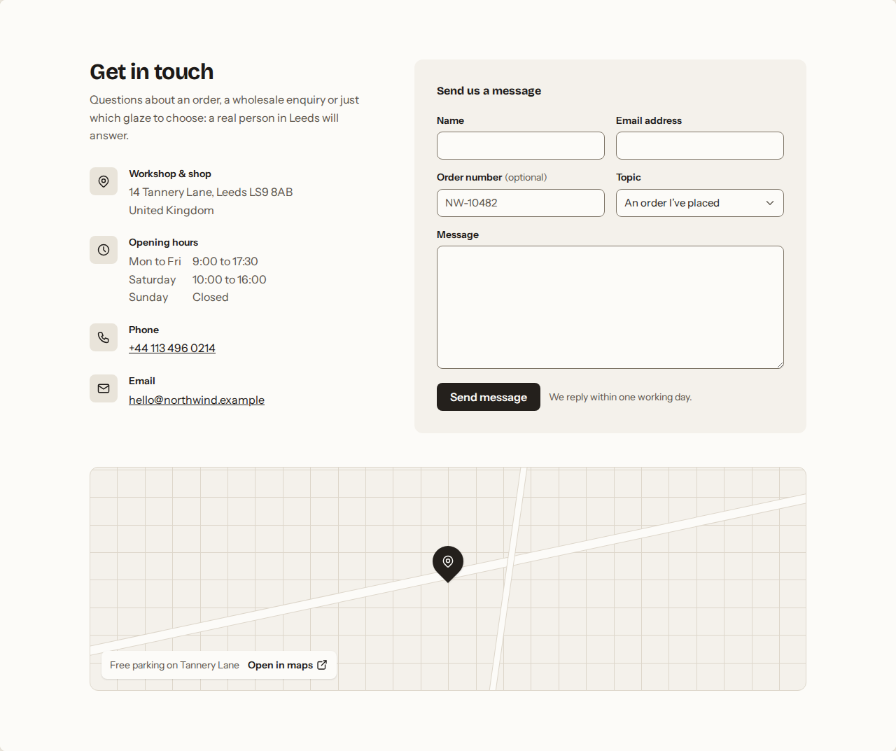
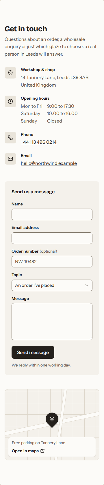
*Default `split`: details (5fr) and form card (7fr), with the map across both columns below. At 360 the order is details, form, map.*

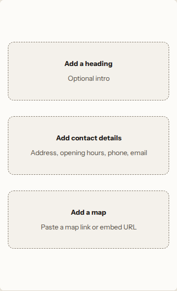
*Freshly inserted: placeholders for heading, contact details and map.*

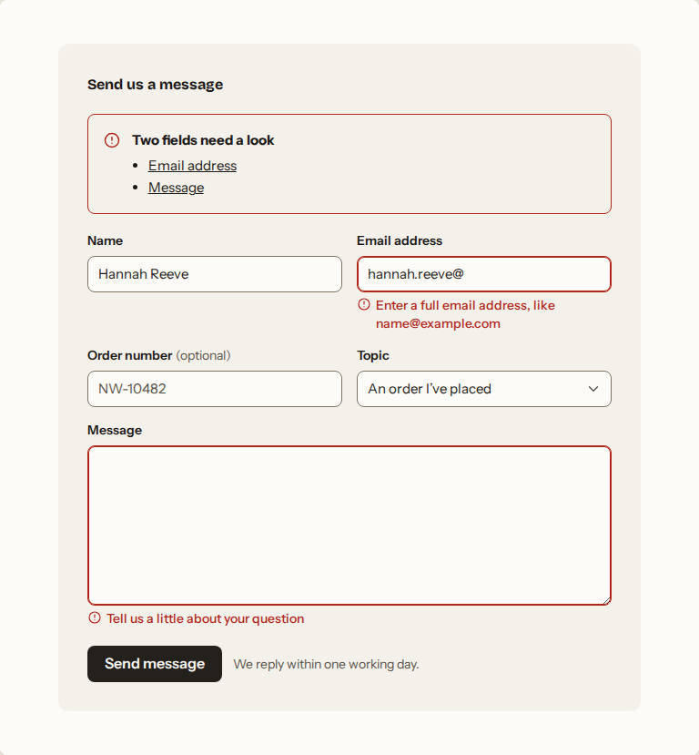
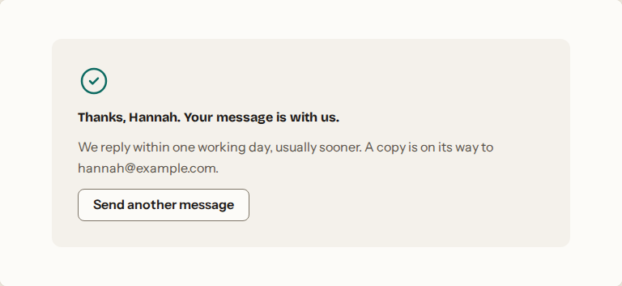
*`form-only` at 768: the error summary with links to each invalid field plus inline errors, then the success panel that replaces the form.*

**Composition**: FormLayout (two columns from 48rem), Field, Input (Name, Email address, Order number), Select (Topic), Textarea (Message), Button primary (submit), Button outline ("Send another message"), Link standalone ("Open in maps", external), plain layout.

**Fields**

| Field id | Type | Required | Default | Notes |
|---|---|---|---|---|
| `variant` | select | yes | `split` | `split` (details + form) · `details-only` · `form-only` |
| `heading` | string | yes | — | Rendered as the `h2`. |
| `hideHeading` | bool | no | `false` | `form-only` only: the `h2` stays in the outline but is visually hidden. |
| `intro` | text | no | — | Who answers and how fast. |
| `address` | text | no | — | Multi-line. |
| `hours` | list | no | — | `hours[].days` (string, e.g. "Mon to Fri") + `hours[].time` (string, e.g. "9:00 to 17:30"). |
| `phone` | string | no | — | Rendered as a `tel:` link. |
| `email` | string | no | — | Rendered as a `mailto:` link. |
| `mapLink` | link | no* | — | Google, Apple or OpenStreetMap URL for "Open in maps". *Required when `mapEmbed` or `mapImage` is set. |
| `mapEmbed` | string | no | — | An embed URL (not HTML). Loaded in an `<iframe>` with a `title` and `loading="lazy"`. |
| `mapImage` | media | no | — | A static map image used instead of the embed (lighter, no third-party cookies). Preferred. |
| `mapNote` | string | no | — | E.g. "Free parking on Tannery Lane". |
| `formTitle` | string | no | "Send us a message" | Title at the top of the form card. |
| `topics` | list | no | — | Options for the Topic Select. When empty, the Topic field is not rendered. |
| `showOrderNumber` | bool | no | `false` | Adds an optional "Order number" field. |
| `recipient` | string | yes | — | Where submissions go. Not shown. |
| `successText` | text | no | "We reply within one working day, usually sooner. A copy is on its way to {email}." | Shown in the success panel. |

**Variants**

| variant | What changes |
|---|---|
| `split` | From 64rem block width: details (5fr) and the form card (7fr) side by side, 3rem row gap × 4rem column gap. The map spans both columns below them at 16:5. Below 64rem the order is details, form, map (4:3, at least 14rem tall). |
| `details-only` | From 64rem: details on the left and the map on the right (1fr / 1fr, 4rem gap, vertically centred). Below 64rem: details, then map. |
| `form-only` | Only the heading (optionally visually hidden), intro and form card, in the narrow container. |

**Layout**

- **Below 48rem**: 1rem gutters. Parts are 3rem apart. Details: heading and intro, then the details list 2rem below. Each detail row is a 2.5rem icon tile (`surface-strong` fill, `radius-md`, `text` icon: map-pin, clock, phone, mail) + text (1rem gap). Rows are 1.5rem apart. Each row has a label (0.875rem, weight 600, `text`, 0.25rem above the value) and a value (1rem, `muted`; links in `text`). Opening hours are a two-column grid (days | time, 1rem column gap). Form card: `surface` fill, `radius-lg`, 1.5rem padding. Form title 1rem, heading font, bold, 1.25rem above the fields. Fields in one column. Inputs and Select use the `background` fill. Message textarea at least 8rem tall. The submit row puts Button primary (2.75rem tall) with the help line "We reply within one working day." (0.875rem `muted`) after it, wrapping below when there is no room. Map: 4:3, at least 14rem tall, `radius-lg`, 1px `border` outline. The map bar is a solid `background` panel (`radius-md`, `shadow-sm`, 0.5rem × 0.75rem padding, 0.875rem text) inset 0.75rem from the left, right and bottom edges, holding `mapNote` (`muted`) and "Open in maps" with an external-link icon. It wraps onto two lines when narrow.
- **48–64rem**: 1.5rem gutters. Form card padding 2rem. Fields in 2 columns (Name | Email address, Order number | Topic). Message is full width, at least 11rem tall. The map bar shrinks to fit its content, 1rem from the left and bottom edges.
- **From 64rem**: 2rem gutters. `split` and `details-only` as in Variants.
- Type (three sizes): heading 2rem (1.625rem below 48rem), body 1rem (inputs and Select 0.9375rem, 1rem below a 48rem viewport), labels, help, errors and meta 0.875rem.
- The reference images show a token-drawn stand-in map (a `surface` grid with `border` lines, `background` roads and a 2.75rem `primary` teardrop pin with a `primary-contrast` map-pin icon). A real map image or embed replaces it.

**States**

| State | What it looks like |
|---|---|
| Ideal | All details, the form with Topic and Order number, and a map image with a note and link. |
| Minimal content | Heading and form only (`form-only`), or heading and one detail row. |
| Long content | Long addresses wrap inside the value column. A long heading wraps. Hours rows wrap per cell. |
| Default form | Empty fields. Topic shows the first option. Order number shows the placeholder "NW-10482". |
| Error (client-side) | After submit, an error summary appears at the top of the card: a `danger` outlined panel (1px `danger` border, `surface` fill, `radius-md`, 1rem padding) with an alert-circle icon in `danger`, a bold title that counts the problems (e.g. "Two fields need a look") and a bulleted list of links to each invalid field. It has `role="alert"` and `tabindex="-1"`, and it receives focus. Each invalid field gets `aria-invalid="true"`, a 2px `danger` border and an error message with an icon (0.875rem), linked by `aria-describedby`. Entered values are kept. Messages: Email "Enter a full email address, like name@example.com". Message "Tell us a little about your question". |
| Sending | The submit button shows a spinner and `aria-busy="true"`. |
| Error (server) | The same summary panel with "We couldn't send your message. Please email hello@northwind.example instead." |
| Success | The card content is replaced by a `role="status"` panel with `tabindex="-1"` that receives focus: a 2.5rem circle-check in `success`, the bold title "Thanks, {first name}. Your message is with us.", `successText` in `muted` and a Button outline "Send another message", which restores an empty form and moves focus to its first field. |
| No map | The map area is not rendered. |
| Missing details | Each detail row is omitted on its own when its field is empty. The details column disappears when all are empty. |
| Empty (freshly inserted) | Editor placeholders: "Add a heading" / "Optional intro", "Add contact details" / "Address, opening hours, phone, email", "Add a map" / "Paste a map link or embed URL". On the live site empty parts render nothing. |

**Field → layout mapping**

- `heading` → `h2`. `intro` → lead paragraph (`muted`).
- `address` → row labelled "Workshop & shop" (map-pin). `hours` → row "Opening hours" (clock) with the days | time grid. `phone` → row "Phone" (phone), `tel:` link. `email` → row "Email" (mail), `mailto:` link. Row labels are theme strings.
- `mapImage` or `mapEmbed` → the map frame. `mapNote` + `mapLink` → the map bar.
- `formTitle` → form card title. `showOrderNumber` → Order number Input. `topics` → Topic Select options. `successText` → success panel.

**Keyboard & accessibility**

- The section is labelled by its `h2`. The details are a list (`<ul>`, one `<li>` per item, label then value). Phone and email are real links.
- A map image uses `role="img"` (or `alt` on an ``) naming the place, e.g. "Map of 14 Tannery Lane, Leeds, marking the Northwind Goods workshop". An embed `<iframe>` gets `title="Map: Northwind Goods workshop, 14 Tannery Lane, Leeds"` and `loading="lazy"`.
- "Open in maps" is always rendered outside the embed, is keyboard reachable and ends with visually hidden text "(opens in a new tab)". Nobody has to tab into or through a third-party iframe.
- Labels are always visible. "(optional)" is written out after optional labels in `muted`. Name has `autocomplete="name"` and Email address has `type="email"` and `autocomplete="email"`.
- Topic is the Select core component: a `role="combobox"` trigger labelled "Topic", a listbox popup (non-modal), `Enter`/`Space`/`Alt+↓` to open, `↑`/`↓` to move, `Enter` to choose, `Esc` to close, typeahead. A hidden native `<select>` posts the value.
- Tab order: details links (phone, email), form fields, submit, then the map link (and the embed, if any).
- After an error submit, focus moves to the summary (`tabindex="-1"`). Its links move focus to the named field. After success, focus moves to the success panel.
- Sizes: inputs and the Select trigger are 2.5rem (`control-height`). The submit button is 2.75rem below 48rem block width. All targets are at least 1.5rem.

**Default content (Northwind Goods)**

- Heading "Get in touch" · intro "Questions about an order, a wholesale enquiry or just which glaze to choose: a real person in Leeds will answer."
- Workshop & shop: "14 Tannery Lane, Leeds LS9 8AB" / "United Kingdom"
- Opening hours: Mon to Fri 9:00 to 17:30 · Saturday 10:00 to 16:00 · Sunday Closed
- Phone "+44 113 496 0214" · Email "hello@northwind.example"
- Map note "Free parking on Tannery Lane" · link "Open in maps"
- Form: "Send us a message" · Name · Email address · Order number (optional), placeholder "NW-10482" · Topic: An order I've placed · Returns and exchanges · Wholesale and stockists · Press · Something else · Message · button "Send message" · help "We reply within one working day."
- Success: "Thanks, Hannah. Your message is with us." / "We reply within one working day, usually sooner. A copy is on its way to hannah@example.com." / "Send another message"
- `form-only` example heading (visually hidden): "Contact us"

**Acceptance criteria**

- [ ] Text contrast: heading and labels `text` on `background` 16.9:1 and on the `surface` card 15.5:1. Values and help `muted` on `background` 7.4:1 and on `surface` 6.8:1. Icons `text` on the `surface-strong` tile 13.8:1 (1.4.3, 1.4.11).
- [ ] Control boundaries: inputs, Select and textarea use `border-strong` on the `background` fill inside the `surface` card: 4.5:1 against the fill and 4.1:1 against the card (1.4.11).
- [ ] Error text and icons are `danger` on `surface` (5.9:1, computed) and never colour alone: each has an icon, words and a 2px border (1.4.1, 3.3.1).
- [ ] The map bar text sits on a solid `background` panel, never directly on the map: note `muted` 7.4:1, link `text` 16.9:1.
- [ ] Every field has a visible, programmatically tied label. Optional fields say "(optional)" in words (3.3.2, 1.3.1).
- [ ] On an invalid submit, focus moves to the error summary. Each summary link moves focus to its field. Each invalid field has `aria-invalid="true"` and `aria-describedby` pointing at its message. Entered values are kept (3.3.1, 3.3.3).
- [ ] On success, the `role="status"` panel replaces the form and receives focus. "Send another message" restores the form and focuses its first field (4.1.3, 2.4.3).
- [ ] Topic Select works with the keyboard as specified (open, move, choose, `Esc` closes and returns focus to the trigger) and exposes `role="combobox"`, `aria-expanded` and the selected value (4.1.2).
- [ ] "Open in maps" is reachable without entering the iframe, is at least 1.5rem tall and announces that it opens a new tab (2.5.8, 3.2.5).
- [ ] The embed iframe has a `title`. A map image has a text alternative (1.1.1, 4.1.2).
- [ ] The standard focus ring shows on every link, field, the Select trigger and the buttons, on both `background` and `surface` (2.4.7, 2.4.11).
- [ ] The submit button is 2.75rem tall below 48rem block width. Inputs are at least 2.5rem (2.5.8).
- [ ] Keyboard only: the whole form can be completed and sent. No trap (2.1.1, 2.1.2).
- [ ] 320px and 200% zoom: one column, no horizontal scroll. The map bar wraps (1.4.10, 1.4.12).
- [ ] Reduced motion: the spinner uses the pulse fallback. No other motion.

**Do / Don't**

- Do say who replies and how quickly.
- Do prefer a static map image plus a link. It is faster and sets no cookies before consent.
- Don't ask for more than you need. Keep the form to 4 or 5 fields.
- Don't use placeholder text as labels, or CAPTCHA puzzles without an accessible alternative.

---

### Video embed · `video-embed`

A 16:9 video behind a poster and a real play button. The provider's player loads only when the visitor activates play, never on page load. It comes with a caption, a transcript link and a privacy note.

**Container** `content` (64rem) · **Section background** default none (options: none, `surface`, `surface-strong`, `primary`) · **Section spacing** default `md` (`section-md`)

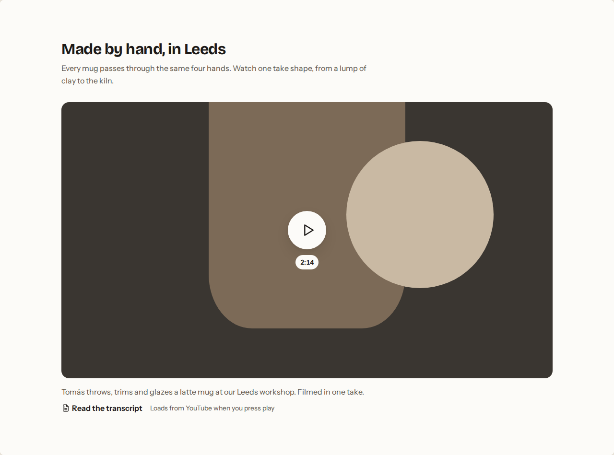
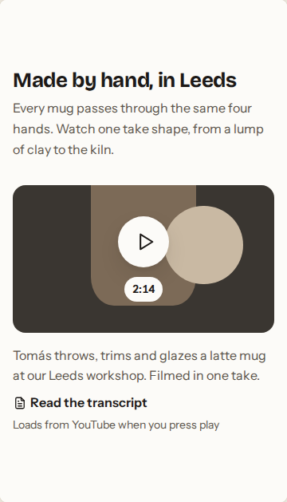
*Default `contained`: header, then a `radius-xl` frame with the play disc and duration chip, then the caption, transcript link and privacy note.*

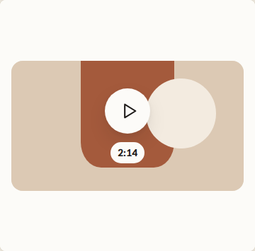
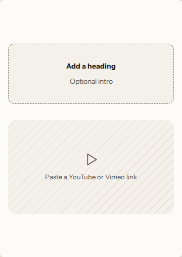
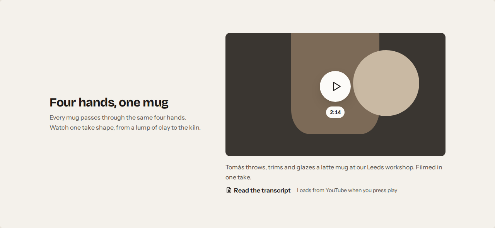
*No heading: a visually hidden `h2` still labels the section. Empty: a striped frame with "Paste a YouTube or Vimeo link". `split` on `surface`: header 5fr beside the video 7fr.*

**Composition**: Link standalone (transcript, file-text icon), EmptyState error variant (load failure), plain layout. The play control is a block-specific button (below).

**Fields**

| Field id | Type | Required | Default | Notes |
|---|---|---|---|---|
| `variant` | select | yes | `contained` | `contained` · `split` |
| `heading` | string | no | — | Rendered as the `h2`. When empty, a visually hidden `h2` with `videoTitle` labels the section. |
| `intro` | text | no | — | |
| `videoUrl` | string | yes | — | YouTube (loaded from the youtube-nocookie domain) or Vimeo URL, or a hosted MP4 from the media library. |
| `videoTitle` | string | yes | — | Used in the play button's name and as the player `title`. |
| `duration` | string | no | — | "2:14". Shown in the chip and spoken as "2 minutes 14 seconds". |
| `poster` | media | no | provider thumbnail | 16:9, honours the focal point. |
| `caption` | text | no | — | One sentence. |
| `transcript` | link | no | — | Page or PDF. Strongly recommended when the video has speech. |
| `privacyNote` | string | no | "Loads from YouTube when you press play" | Name the actual provider. |
| `sectionBackground` | select | no | none | none · `surface` · `surface-strong` · `primary` |

**Variants**

| variant | What changes |
|---|---|
| `contained` | Header above. The frame fills the 64rem container with `radius-xl`. |
| `split` | From 64rem block width: header (5fr) beside the figure (7fr), 3rem gap, vertically centred, no space under the header. The frame uses `radius-lg` at every width. Below 64rem it stacks. |

**Layout**

- **Below 48rem**: 1rem gutters. Header (heading + intro) with 2rem below. The 16:9 frame fills the container width. The play control covers the whole frame and centres a 4rem disc (solid `background`, `text` player-play icon 1.75rem nudged 0.2rem right for optical centring, `shadow-md`) with the duration chip 0.75rem below it (pill, `background` fill, `text`, 0.875rem weight 600, tabular figures, 0.25rem × 0.625rem padding). Under the frame, 1rem gap: the caption (1rem `muted`, max 60ch), then the links row: the transcript link and the privacy note (0.875rem `muted`), 0.25rem × 1rem gaps, wrapping.
- **48–64rem**: 1.5rem gutters. Disc 5rem, icon 2rem.
- **From 64rem**: 2rem gutters. The `contained` frame is about 60rem × 34rem. The caption and links sit in one wrapping row (space-between, 0.5rem × 1.5rem gaps). `split` as in Variants.
- Type (three sizes): heading 2rem (1.625rem below 48rem), caption and intro 1rem, meta 0.875rem.

**States**

| State | What it looks like |
|---|---|
| Poster (initial) | Poster image with the play button, disc and chip. These are solid panels, never text straight on the image, so they read on any poster and with any `primary`. Nothing from the provider is loaded. |
| Hover | The disc scales to 1.06 over `duration-fast` `ease-out`. No scale under reduced motion. |
| Focus | Inset focus ring drawn inside the frame's rounded edge, with a wider 4px `focus-inner` infill so it reads on any poster. |
| Playing | On activation (click, `Enter` or `Space`), the button is replaced by the player: an `<iframe title="{videoTitle}" allow="fullscreen; picture-in-picture">` for YouTube/Vimeo, or a native `<video controls>` named by `videoTitle` for an MP4. Because the visitor asked to play, the player request includes the provider's start-playing parameter at this point, so one press plays. Focus moves to the player. |
| No poster | The provider thumbnail, or a `surface-strong` fill. |
| No caption / no transcript | The figure only. The links row renders only what exists. |
| No heading | A visually hidden `h2` = `videoTitle`. |
| Load failure | The frame shows the EmptyState error variant with a link to watch on the provider's site. |
| Empty (freshly inserted) | Heading placeholder ("Add a heading" / "Optional intro") and a striped 16:9 placeholder with a play icon: "Paste a YouTube or Vimeo link". The live site renders nothing without `videoUrl`. |

**Field → layout mapping**

- `heading` / `intro` → block head. `poster` → frame image. `videoTitle` + `duration` → play button name and chip. `caption` → `<figcaption>` paragraph. `transcript` → Link standalone "Read the transcript" with a file-text icon. `privacyNote` → the 0.875rem note.

**Keyboard & accessibility**

- The section is labelled by the visible or visually hidden `h2`. The video is a `<figure>` with a `<figcaption>`.
- The play control is a real `<button type="button">` covering the poster, with `aria-label="Play video: {videoTitle}, {duration spoken}"`, e.g. "Play video: Throwing the latte mug, start to finish, 2 minutes 14 seconds". The disc and chip are `aria-hidden`.
- Keys: `Tab` to the play button, `Enter` or `Space` to load and play, then focus is in the player (its own controls apply). `Tab` continues to the transcript link.
- The player always has a `title`. Captions come from the provider. The transcript link covers people who can't play video.
- No autoplay on load, no loop, no background video (2.2.2).
- On `primary`: heading, intro, caption, privacy note and transcript link all use `primary-contrast`. The privacy note must switch too: `muted` on `primary` is only 2.1:1.

**Default content (Northwind Goods)**

- Heading "Made by hand, in Leeds" · intro "Every mug passes through the same four hands. Watch one take shape, from a lump of clay to the kiln."
- Video title "Throwing the latte mug, start to finish" · duration 2:14
- Caption "Tomás throws, trims and glazes a latte mug at our Leeds workshop. Filmed in one take."
- Transcript link "Read the transcript" · note "Loads from YouTube when you press play"
- `split` heading: "Four hands, one mug"

**Acceptance criteria**

- [ ] No provider request (iframe, script, thumbnail from the player) is made before the visitor activates play, unless the poster falls back to the provider thumbnail image. The video never starts on load and never loops (2.2.2).
- [ ] The play button has the accessible name "Play video: {title}, {duration spoken}". The chip is hidden from assistive technology (4.1.2).
- [ ] After activation the player has `title="{videoTitle}"` and receives focus (2.4.3, 4.1.2).
- [ ] The inset focus ring is fully visible inside the rounded frame on light and dark posters (2.4.7, 2.4.11).
- [ ] The disc icon `text` on the `background` disc is 16.9:1. The chip text `text` on `background` is 16.9:1. The disc stands out from any poster through its solid fill and `shadow-md` (1.4.3, 1.4.11).
- [ ] Caption and privacy note are `muted` on `background` 7.4:1, `surface` 6.8:1, `surface-strong` 6.1:1. On `primary` they use `primary-contrast` 15.6:1.
- [ ] The play target is the whole frame (far above 2.75rem). The transcript link is at least 1.5rem tall (2.5.8).
- [ ] Keyboard only: `Tab` reaches play, `Enter`/`Space` starts it. No trap before or after loading (2.1.1, 2.1.2).
- [ ] Reduced motion: no disc scale (2.3.3 good practice).
- [ ] A load failure shows the error state with a working provider link.
- [ ] 320px and 200% zoom: the frame scales with the width and the caption and links wrap (1.4.10).

**Do / Don't**

- Do add a transcript for anything with speech, and burned-in or provider captions.
- Do pick a poster frame that shows the product, not a talking head mid-blink.
- Don't autoplay, loop, or use video as a background behind text.
- Don't embed third-party players on load. They add weight and cookies before the visitor has chosen to watch.

---

### Timeline · `timeline`

Numbered process steps or dated milestones that read left to right on desktop and top to bottom on mobile. Use `steps` for "how it's made" and `history` for dates. For pictures per step, use a feature block instead.

**Container** `content` (64rem) · **Section background** default none (options: none, `surface`, `surface-strong`) · **Section spacing** default `md` (`section-md`)

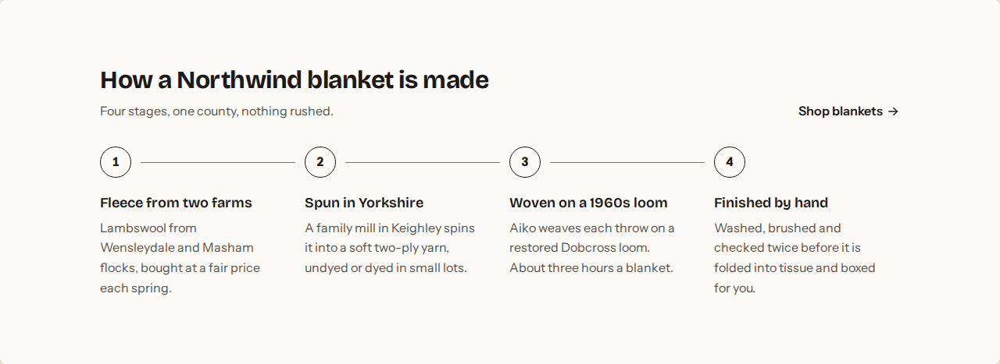
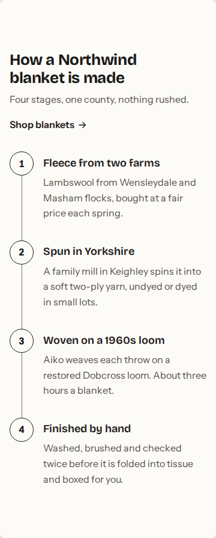
*`steps`: horizontal from 64rem with connectors between markers, vertical below with a line from marker to marker.*

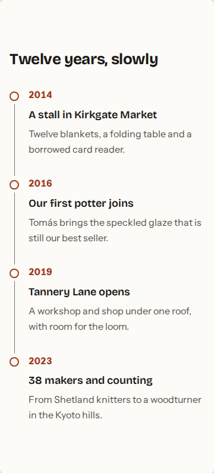
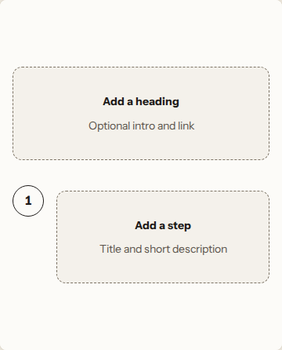
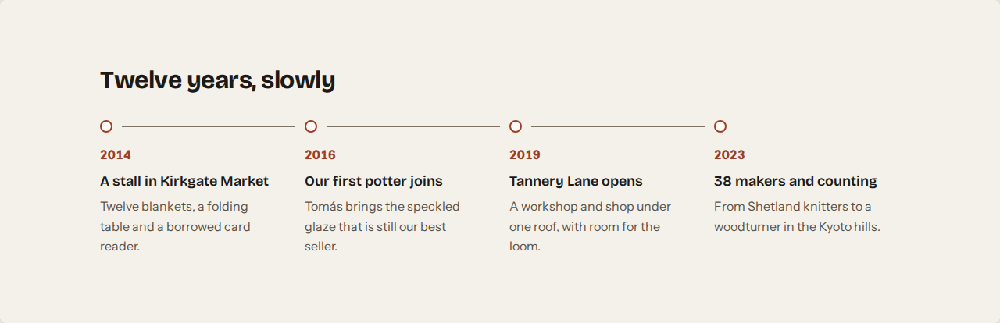
*`history`: small hollow `accent` dots and a year above each title. Empty: a heading placeholder and a "1" marker with "Add a step".*

**Composition**: Link standalone (header link, arrow-right), plain layout.

**Fields**

| Field id | Type | Required | Default | Notes |
|---|---|---|---|---|
| `variant` | select | yes | `steps` | `steps` (numbered) · `history` (dated) |
| `heading` | string | yes | — | Rendered as the `h2`. |
| `intro` | text | no | — | |
| `link` | link | no | — | Standalone link at the right of the header, e.g. "Shop blankets". |
| `items` | list | yes | — | 3 to 6 recommended. 1 to 12 supported. |
| `items[].year` | string | `history` only | — | "2014". Shown above the title in `accent`. |
| `items[].title` | string | yes | — | Rendered as an `h3`. Up to about 40 characters. |
| `items[].text` | text | no | — | One or two sentences. |
| `columns` | select | no | `auto` | `auto` (the number of items, max 4) · `3` · `4` · `5`. Horizontal layout only. |
| `sectionBackground` | select | no | none | none · `surface` · `surface-strong` |

**Variants**

| variant | What changes |
|---|---|
| `steps` | 2.5rem circular markers on a `background` fill with a 1.5px `text` ring and the step number (1rem, bold, tabular figures). |
| `history` | 1rem hollow dot markers (`background` fill, 2px `accent` ring) and a year line (1rem, bold, `accent`, tabular figures) above each title. |

**Layout**

- Header: block head (heading + intro on the left, link on the right, wrapping under the intro on narrow widths), 2rem above the list.
- **Below 64rem (vertical)**: each item is a 2-column grid (marker column 2.5rem for `steps`, 1rem for `history` | body, 1rem gap). Items are 2rem apart. A 1px `border-strong` connector runs down the centre of the marker column from under the marker to the next item (from 2.5rem for `steps`, from 1.75rem for `history`). The last item has none. The body has 0.5rem between year, title and text, with a 0.4rem top offset in `steps` so the title aligns with the marker. The `history` dot sits 0.4rem down to align with the year.
- **From 64rem (horizontal)**: the list is `columns` equal columns, 3rem row gap × 1.5rem column gap. Each item stacks the marker on top, then the body (1.25rem gap for `steps`, 1rem for `history`). A 1px `border-strong` connector runs right from 0.75rem after the marker, level with its centre, to 0.75rem into the column gap. The last item has no connector. When items wrap to a second row, the last item of a full row keeps its connector stub, which signals that the sequence continues. Body text has 1rem right padding.
- Gutters 1rem / 1.5rem / 2rem at below 48rem / 48–64rem / from 64rem.
- Type (three sizes): heading 2rem (1.625rem below 48rem), item title 1.125rem (heading font, weight 600), body, number and year 1rem.

**States**

| State | What it looks like |
|---|---|
| Ideal | 4 steps. |
| Minimal content | 1 item: marker, title, no connector. |
| Long content | Titles wrap. Long texts make items taller, and markers still align at the top of each item. |
| Many items | 5 to 12 wrap into rows (set `columns`). On mobile the list simply gets longer. |
| No image | No images in this block. |
| Empty (freshly inserted) | Heading placeholder ("Add a heading" / "Optional intro and link") and a "1" marker beside an "Add a step" / "Title and short description" placeholder. Live site renders nothing for an empty list. |

**Field → layout mapping**

- `items` → `<ol>` of `<li>` items. Marker → decorative `` (number or dot). `year` → paragraph above the title. `title` → `h3`. `text` → paragraph (`muted`).

**Keyboard & accessibility**

- The section is labelled by its `h2`. An ordered list conveys the sequence (1.3.1).
- In `steps`, visual numbers are `aria-hidden` and each title starts with visually hidden text "Step n: " so the number isn't read twice.
- Connectors are decorative (drawn with CSS, not in the accessibility tree).
- The only interactive part is the header link (`Tab`, `Enter`).

**Default content (Northwind Goods)**

`steps`: "How a Northwind blanket is made" / "Four stages, one county, nothing rushed." · link "Shop blankets"
1. Fleece from two farms: "Lambswool from Wensleydale and Masham flocks, bought at a fair price each spring."
2. Spun in Yorkshire: "A family mill in Keighley spins it into a soft two-ply yarn, undyed or dyed in small lots."
3. Woven on a 1960s loom: "Aiko weaves each throw on a restored Dobcross loom. About three hours a blanket."
4. Finished by hand: "Washed, brushed and checked twice before it is folded into tissue and boxed for you."

`history`: "Twelve years, slowly"
- 2014 · A stall in Kirkgate Market: "Twelve blankets, a folding table and a borrowed card reader."
- 2016 · Our first potter joins: "Tomás brings the speckled glaze that is still our best seller."
- 2019 · Tannery Lane opens: "A workshop and shop under one roof, with room for the loom."
- 2023 · 38 makers and counting: "From Shetland knitters to a woodturner in the Kyoto hills."

**Acceptance criteria**

- [ ] Title `text` and body `muted` meet contrast on each ground: 16.9:1 / 7.4:1 on `background`, 15.5:1 / 6.8:1 on `surface`, 13.8:1 / 6.1:1 on `surface-strong` (1.4.3).
- [ ] The year in `accent` is 6.4:1 on `background`, 5.9:1 on `surface` (computed) and 5.3:1 on `surface-strong`.
- [ ] Marker rings: `text` ring 16.9:1 and `accent` ring 6.4:1 against `background`. Connectors are decorative and not the only cue for order: the list is ordered and numbered (1.4.11, 1.4.1).
- [ ] Screen readers hear "Step 1: Fleece from two farms" once, not "1 Step 1" (1.3.1).
- [ ] The header link is keyboard reachable, shows the standard focus ring and is at least 1.5rem tall (2.4.7, 2.5.8).
- [ ] With 1 item there is no connector. With 12 items the rows wrap and no connector points into empty space except the row-continuation stub.
- [ ] 320px and 200% zoom: vertical layout, no horizontal scroll, titles wrap (1.4.10, 1.4.12).
- [ ] No motion in this block.

**Do / Don't**

- Do keep steps parallel: a short title and one sentence of detail.
- Do use `history` for dates and `steps` for "how it works".
- Don't use it for more than about 8 items. Long histories belong on an About page as prose.
- Don't colour-code steps or add progress percentages.

---

### Team · `team`

A grid of the people behind the shop, each with a photo, name, role, short bio and optional links.

**Container** `wide` (80rem) · **Section background** default none (options: none, `surface`, `surface-strong`) · **Section spacing** default `md` (`section-md`)

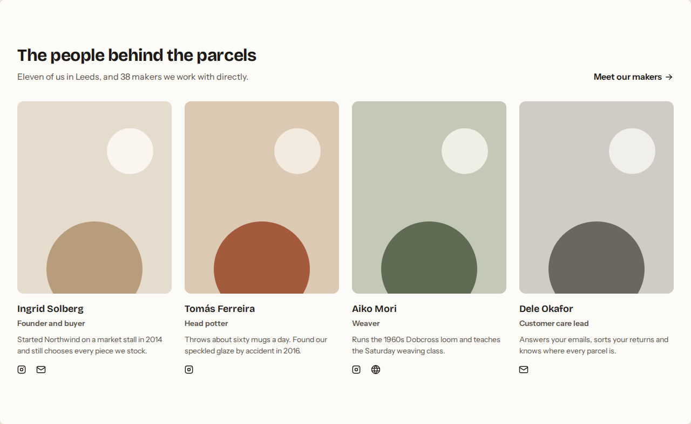
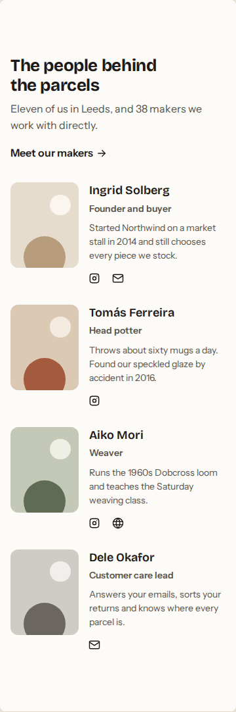
*Four across from 64rem. On phones, each person is a row with a 6.5rem photo beside the text, so eight people don't become a very long scroll.*

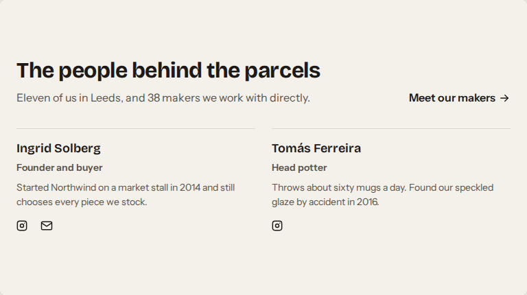
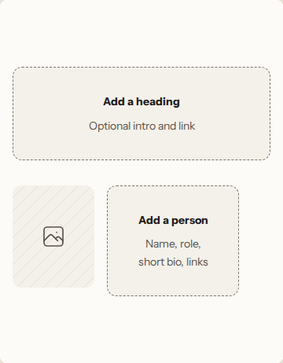
*Without photos each person gets a 1px `border` top rule. Empty: a photo placeholder and "Add a person".*

**Composition**: Image (4:5, `radius-lg`), Button ghost icon sm (2rem) for the links, Link standalone (header link), plain layout. No `variant` field.

**Fields**

| Field id | Type | Required | Default | Notes |
|---|---|---|---|---|
| `heading` | string | yes | — | Rendered as the `h2`. |
| `intro` | text | no | — | |
| `link` | link | no | — | Header link, e.g. "Meet our makers". |
| `people` | list | yes | — | 1 to 12. Multiples of 4 fill the desktop grid. |
| `people[].photo` | media | no | — | Portrait 4:5 with a focal point. |
| `people[].name` | string | yes | — | Rendered as an `h3`. |
| `people[].role` | string | yes | — | "Head potter". |
| `people[].bio` | text | no | — | About 120 characters maximum. |
| `people[].links` | list | no | — | Up to 3. `links[].type` select (`instagram`, `email`, `website`, `tiktok`, `pinterest`) + `links[].url` (link). |
| `sectionBackground` | select | no | none | none · `surface` · `surface-strong` |

**Layout**

- Header: block head (heading + intro, link on the right), 2rem above the grid.
- **Below 36rem block width**: one column of rows, 1.5rem apart. Each row is a 6.5rem photo (4:5, `radius-lg`) beside the body (1rem gap), top-aligned.
- **From 36rem block width** (this block's own extra breakpoint): 2 columns, 3rem row gap × 1.5rem column gap. The photo sits above the text (1rem gap).
- **From 64rem**: 4 columns in the 80rem container.
- Body: name, role, bio and links 0.25rem apart, bio with an extra 0.25rem above. Links are a row of 2rem ghost icon buttons (0.25rem apart, 0.25rem above), pulled 0.5rem left so the first icon lines up with the text.
- A single person's grid is capped at 18rem wide.
- Gutters 1rem / 1.5rem / 2rem at below 48rem / 48–64rem / from 64rem.
- Type (three sizes): heading 2rem (1.625rem below 48rem), name 1.125rem (heading font, weight 600), role (weight 600) and bio 0.875rem.

**States**

| State | What it looks like |
|---|---|
| Ideal | 4 people with photos. |
| Minimal content | 1 person, card capped at 18rem. |
| Long content | Names and roles wrap. Bios over about 120 characters make rows uneven, so keep them short. |
| Many items | 8 or 12 wrap in rows of 4. |
| No image | The photo is not rendered. The person becomes text-only with a 1px `border` top rule and 1rem top padding, so the grid still reads as a set. Don't mix people with and without photos. |
| Empty (freshly inserted) | Heading placeholder ("Add a heading" / "Optional intro and link"), a striped 4:5 photo placeholder and "Add a person" / "Name, role, short bio, links". Live site renders nothing for an empty list. |

**Field → layout mapping**

- `people` → `<ul>` of `<li>` people. `photo` → Image 4:5. `name` → `h3`. `role` → paragraph (`muted`, 600). `bio` → paragraph (`muted`). `links` → icon buttons (instagram → brand-instagram, email → mail, website → world, tiktok → brand-tiktok, pinterest → brand-pinterest).

**Keyboard & accessibility**

- The section is labelled by its `h2`. It is a list of people, and each name is an `h3`.
- Photo `alt` defaults to "Portrait of {name}" (the editor can override it).
- Icon links need names: "{name} on Instagram", "Email {name}", "{name}'s website", "{name} on TikTok", "{name} on Pinterest". The icons are `aria-hidden`.
- Keys: `Tab` moves through the header link and each person's links in reading order. `Enter` follows a link.

**Default content (Northwind Goods)**

- Heading "The people behind the parcels" · intro "Eleven of us in Leeds, and 38 makers we work with directly." · link "Meet our makers"
- Ingrid Solberg, Founder and buyer: "Started Northwind on a market stall in 2014 and still chooses every piece we stock." (Instagram, email)
- Tomás Ferreira, Head potter: "Throws about sixty mugs a day. Found our speckled glaze by accident in 2016." (Instagram)
- Aiko Mori, Weaver: "Runs the 1960s Dobcross loom and teaches the Saturday weaving class." (Instagram, website)
- Dele Okafor, Customer care lead: "Answers your emails, sorts your returns and knows where every parcel is." (email)

**Acceptance criteria**

- [ ] Name `text` and role/bio `muted`: 16.9:1 / 7.4:1 on `background`, 15.5:1 / 6.8:1 on `surface`, 13.8:1 / 6.1:1 on `surface-strong` (1.4.3).
- [ ] Icon link glyphs are `text` on the ground (at least 13.8:1). The hover tint is not the only state cue (1.4.11).
- [ ] Every icon link has an accessible name that includes the person's name (2.4.4, 4.1.2).
- [ ] Icon links are 2rem targets, above the 1.5rem minimum (2.5.8), and show the standard focus ring (2.4.7, 2.4.11).
- [ ] Photos have alt text, "Portrait of {name}" by default (1.1.1).
- [ ] With no photos, the top rule and padding keep the people visually grouped. With one person, the card is at most 18rem wide.
- [ ] 320px and 200% zoom: rows keep the photo beside the text without horizontal scroll (1.4.10).
- [ ] No text over photos. No motion in this block.

**Do / Don't**

- Do use consistent photos (same crop, light and background).
- Do write bios about the work ("Throws about sixty mugs a day"), not job-ad language.
- Don't publish personal emails without consent. Use role inboxes.
- Don't put overlays with text on the photos.

---

### Tabs block · `tabs`

Related content (care guides, materials, "how it works" by product type) grouped into tabs, where each tab holds a heading, rich text, an optional image and a link. Use it for 2 to 6 parallel topics. Sequential steps belong in Timeline and questions in FAQ.

**Container** `content` (64rem) · **Section background** default none (options: none, `surface`, `surface-strong`) · **Section spacing** default `md` (`section-md`)

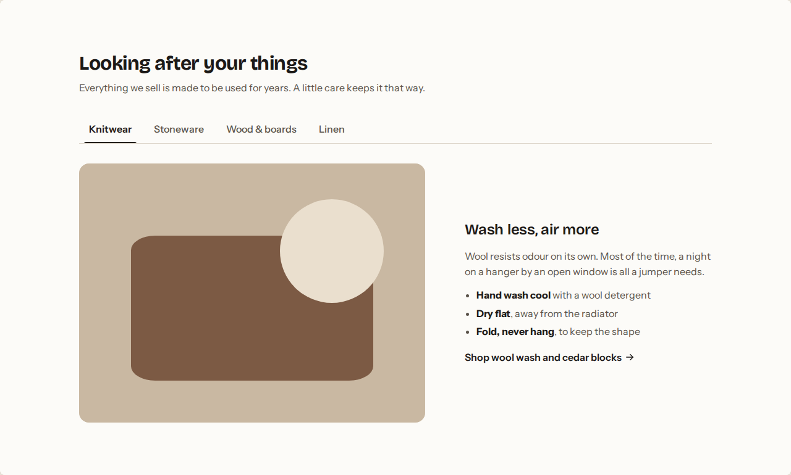
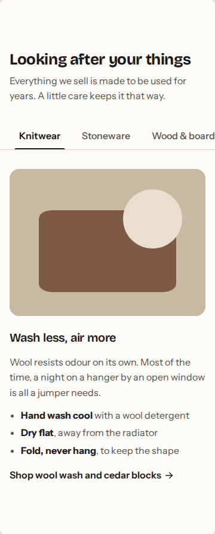
*Desktop: image 7fr | copy 5fr. Phone: the tab row bleeds to the screen edges and scrolls sideways, and the cut-off last tab shows there is more.*

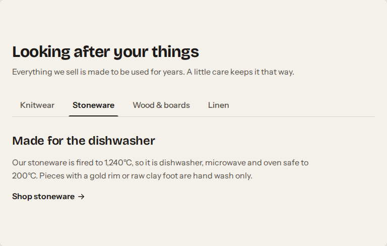
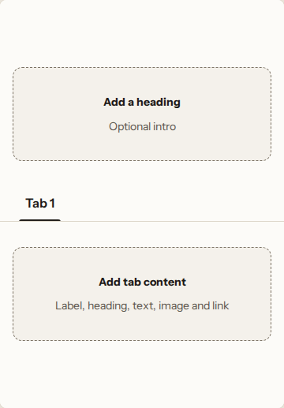
*Text-only panel (max 40rem) on `surface`. Empty: a heading placeholder and one "Tab 1" with "Add tab content".*

**Composition**: Tabs (underline style), Image (4:3, `radius-xl`), Link standalone (arrow-right), plain layout. No `variant` field.

**Fields**

| Field id | Type | Required | Default | Notes |
|---|---|---|---|---|
| `heading` | string | yes | — | Rendered as the `h2`. It also labels the tablist. |
| `intro` | text | no | — | |
| `tabs` | list | yes | — | 2 to 6. |
| `tabs[].label` | string | yes | — | Tab text, 1 to 3 words. |
| `tabs[].heading` | string | yes | — | Rendered as an `h3` inside the panel. |
| `tabs[].body` | rich-text | yes | — | Paragraphs, bulleted lists, bold, links. |
| `tabs[].image` | media | no | — | 4:3 with a focal point. When missing, the panel is text-only (max 40rem). |
| `tabs[].link` | link | no | — | Standalone link with an arrow. |
| `defaultTab` | select | no | first tab | Which tab is selected on load. |
| `sectionBackground` | select | no | none | none · `surface` · `surface-strong` |

**Mobile behaviour: tabs scroll sideways, not an accordion.** Below 48rem block width the tab row stays a tab row and scrolls horizontally, with no visible scrollbar. It bleeds to the container edges (negative gutter margin, the gutter as inline padding and scroll padding), so the last tab is visibly cut off. Reasons: one interaction model and one ARIA pattern (`tablist`/`tab`/`tabpanel`) at every width, with no markup switch at a breakpoint and no double-rendered content. A stable height: one panel at a time suits 3 to 5 parallel topics. And it is safe inside narrow page-builder columns on desktop. Accordion content belongs in the FAQ block.

**Layout**

- Header: block head (heading + intro), 2rem above the tab row.
- Tab row: tabs at least 2.75rem tall, 1rem side padding, 0.25rem apart, 1rem labels. A 1px `border` rule under the row. The selected tab has a 3px `primary` indicator bar on the rule, inset 0.5rem from the tab's sides with rounded top corners. Tab top corners use `radius-sm`.
- Panel: 2rem top padding. Copy stack: `h3`, body, link, 1rem apart. Body paragraphs 0.75rem apart. Bulleted lists indent 1.2rem, items 0.25rem apart.
- **Below 48rem**: 1rem gutters. The tab row bleeds and scrolls as described. The panel stacks the image (4:3, `radius-xl`) above the copy, 1.5rem gap.
- **48–64rem**: 1.5rem gutters. The tab row sits inside the container. Panels with an image become 2 columns (image | copy, 1fr / 1fr, 3rem gap, vertically centred).
- **From 64rem**: 2rem gutters. Panels with an image are 7fr | 5fr, 4rem gap. Text-only panels keep the copy at most 40rem wide.
- Type (three sizes): heading 2rem (1.625rem below 48rem), panel heading 1.5rem (1.25rem below 48rem), tab labels and body 1rem.

**States**

| State | What it looks like |
|---|---|
| Ideal | 4 tabs, each with an image. |
| Minimal content | 2 tabs, text only. |
| Long content | Long labels make the row scroll sooner. Long bodies make the panel taller, and the image stays vertically centred. |
| Many items | Up to 6 tabs. Beyond that, use separate blocks. |
| No image | The copy spans up to 40rem. |
| Tab: rest | Label `muted`, weight 500. |
| Tab: hover | Label `text` with a light ink tint behind it. |
| Tab: selected | Label `text`, weight 600, plus the 3px `primary` indicator. Never colour alone. |
| Tab: focus-visible | Inset focus ring (the tab sits in a scrolling row, where an outer ring would be clipped). |
| Panel: focus-visible | Standard focus ring with a 4px gap, rounded `radius-sm`. |
| Empty (freshly inserted) | Heading placeholder ("Add a heading" / "Optional intro"), a single selected tab "Tab 1" and a panel placeholder "Add tab content" / "Label, heading, text, image and link". Live site renders nothing without tabs. |

**Field → layout mapping**

- `tabs[].label` → `<button role="tab">`. Each panel → `
` holding `image` → Image 4:3, `heading` → `h3`, `body` → rich text (`muted`, bold in `text`, links in `text`), `link` → Link standalone.

**Keyboard & accessibility**

- The section is labelled by its `h2`, and the `tablist` is `aria-labelledby` that same `h2`. Each tab has `aria-controls` and `aria-selected`. Each panel is `aria-labelledby` its tab and hidden with `hidden` when not selected.
- Roving `tabindex`: only the selected tab is in the Tab order (`tabindex="0"`, the others `-1`).

| Key | Action |
|---|---|
| `←` / `→` | Move to the previous / next tab and select it (automatic activation). Wraps from last to first and back. |
| `Home` / `End` | First / last tab, selected. |
| `Tab` | From the selected tab into the panel (`tabindex="0"`), then to the panel's links. |
| `Shift+Tab` | Back to the selected tab. |
| `Enter` / `Space` | On a tab: select it (already selected on focus). On a link: follow it. |

- The selected tab scrolls into view in the phone row when reached with the keyboard.
- Content in hidden panels isn't found by in-page search, so keep critical information in the first tab.

**Default content (Northwind Goods)**

Heading "Looking after your things" · intro "Everything we sell is made to be used for years. A little care keeps it that way."
- **Knitwear**: "Wash less, air more". "Wool resists odour on its own. Most of the time, a night on a hanger by an open window is all a jumper needs." List: **Hand wash cool** with a wool detergent · **Dry flat**, away from the radiator · **Fold, never hang**, to keep the shape. Link "Shop wool wash and cedar blocks". Image alt "Folded oatmeal jumper beside a bottle of wool wash".
- **Stoneware**: "Made for the dishwasher". "Our stoneware is fired to 1,240°C, so it is dishwasher, microwave and oven safe to 200°C. Pieces with a gold rim or raw clay foot are hand wash only." Link "Shop stoneware". Image alt "Speckled terracotta mug on a wooden shelf".
- **Wood & boards**: "Oil it when it looks thirsty". "Wash with warm soapy water, dry upright and never soak. Every few weeks, rub in a little board oil and leave it overnight." Link "Shop board oil". Image alt "Walnut serving board on a linen cloth".
- **Linen**: "Softer with every wash". "Wash at 40°C with like colours, skip the fabric softener and line dry. Iron while slightly damp if you like it crisp." Link "Shop linen". Image alt "Stack of folded sage linen tea towels".

**Acceptance criteria**

- [ ] Tab labels: rest `muted` 7.4:1 on `background` (6.8:1 on `surface`, 6.1:1 on `surface-strong`). Selected `text` at least 13.8:1. The selected indicator `primary` is 15.6:1 against `background` (1.4.3, 1.4.11).
- [ ] The selected state is shown by weight and the indicator bar, not colour alone (1.4.1).
- [ ] Roles and states: `tablist` labelled by the `h2`, `tab` with `aria-selected` and `aria-controls`, `tabpanel` labelled by its tab. Hidden panels use `hidden` (4.1.2).
- [ ] Keys work exactly as the table says, including wrap-around and `Home`/`End`. Only one tab is in the Tab order (2.1.1).
- [ ] Tabs are at least 2.75rem tall (2.5.8). The inset focus ring on tabs is never clipped by the scrolling row. The panel shows the standard ring with a 4px gap (2.4.7, 2.4.11).
- [ ] Below 48rem the row scrolls sideways without a scrollbar, the last tab is visibly cut off, and a focused tab is scrolled fully into view (2.4.11).
- [ ] 320px and 200% zoom: only the tab row scrolls sideways (allowed for this component). The panel reflows without horizontal scroll (1.4.10).
- [ ] Reduced motion: the panel switch is instant.
- [ ] Tabs never auto-rotate (2.2.2).

**Do / Don't**

- Do use tabs for parallel, equally important topics a shopper picks between.
- Do keep labels short so at least two and a half tabs fit on a phone.
- Don't hide sequential steps in tabs (use Timeline) or put forms inside tabs.
- Don't nest tabs or auto-rotate them.

---

### Quote · `quote`

One large pull quote from the founder, a maker or the press, with attribution and an optional portrait. For several customer reviews, use Testimonials.

**Container** `narrow` (40rem) for `centered`, `content` (64rem) for `with-image` · **Section background** default none (options: none, `surface`, `surface-strong`, `primary`, `accent`) · **Section spacing** default `md` (`section-md`)

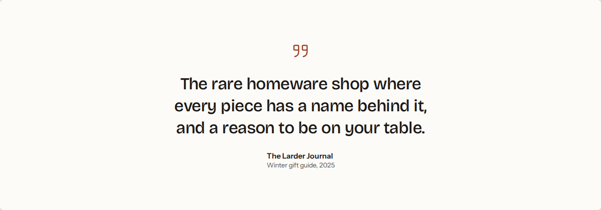
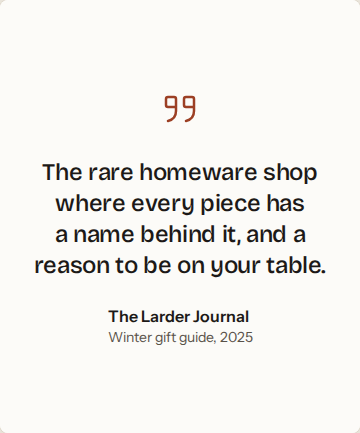
*`centered`: quote mark in `accent`, the quote in the heading font, then the source.*

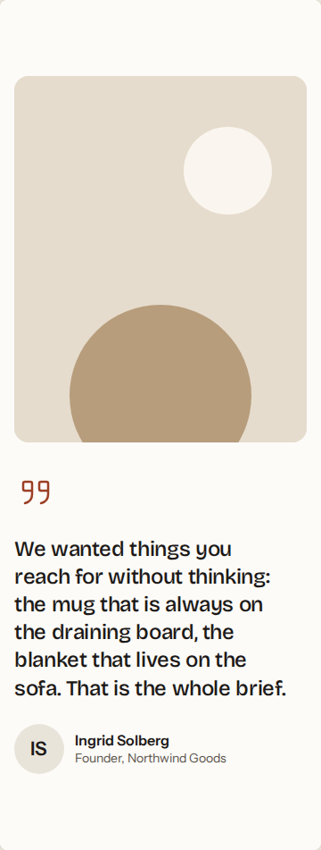
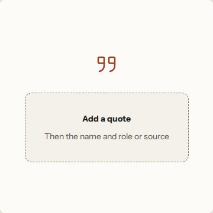
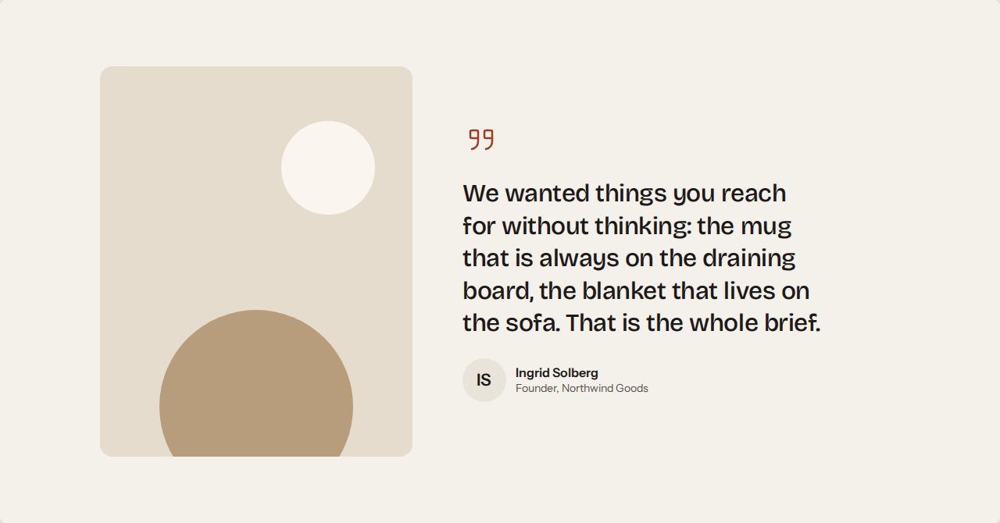
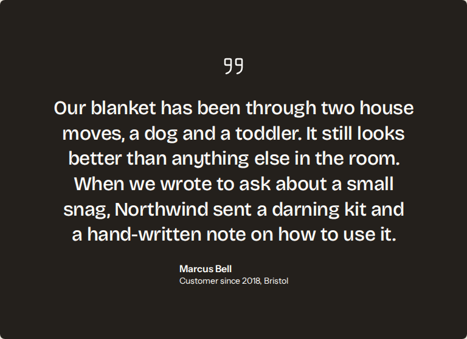
*`with-image`: the image stacks above on phones and sits in a 5fr column from 48rem. On `primary`, every part switches to `primary-contrast`.*

**Composition**: Avatar lg (3.5rem, initials fallback), Image (4:5, `radius-xl`), optional Link (source), plain layout.

**Fields**

| Field id | Type | Required | Default | Notes |
|---|---|---|---|---|
| `variant` | select | yes | `centered` | `centered` · `with-image` |
| `quote` | text | yes | — | 1 to 3 sentences, up to about 240 characters. No quotation marks: the icon supplies them. |
| `name` | string | yes | — | Person or publication. |
| `role` | string | no | — | "Founder, Northwind Goods" or "Winter gift guide, 2025". |
| `avatar` | media | no | — | Small round portrait next to the name (either variant). |
| `image` | media | `with-image` only | — | 4:5 portrait or product photo with a focal point. |
| `sourceLink` | link | no | — | Wraps the role line and links to the article. |
| `sectionBackground` | select | no | none | none · `surface` · `surface-strong` · `primary` · `accent` |

**Variants**

| variant | What changes |
|---|---|
| `centered` | Quote mark, quote and attribution centred in the 40rem column. The name/role block beside the avatar stays left-aligned. |
| `with-image` | From 48rem block width: image (4:5, `radius-xl`) in a 5fr column and the left-aligned quote in 7fr, 3rem gap (4rem from 64rem), vertically centred. Below 48rem the image stacks above, 2rem gap. |

**Layout**

- Figure stack: quote mark (3rem `quote` icon, thin 1.25 stroke, `accent`), quote, attribution, 1.5rem apart.
- Attribution: optional avatar (3.5rem) then name (1rem, weight 600) over role (0.875rem, `muted`), 0.75rem gap.
- **Below 48rem**: 1rem gutters. Quote 1.5rem, heading font, weight 500, line height 1.3, slight negative tracking, balance-wrapped.
- **48–64rem**: 1.5rem gutters. Quote 2rem.
- **From 64rem**: 2rem gutters. `centered` quote 2.25rem. `with-image` stays 2rem.
- Type (three sizes per width): quote (one of 1.5 / 2 / 2.25rem), name 1rem, role 0.875rem. Initials in the avatar are artwork.

**States**

| State | What it looks like |
|---|---|
| Ideal | A 1 to 2 sentence quote with name and role. |
| Minimal content | Quote + name only. |
| Long content | 4 to 5 lines is fine (see the `primary` example). Beyond about 300 characters, use Testimonials. |
| No image | `with-image` without an image falls back to a single left-aligned column. |
| No avatar | Name and role only. With an avatar field but no photo, the Avatar shows initials on `surface-strong`. |
| On `primary` | Quote mark, quote, name and role use `primary-contrast`. |
| On `accent` | Quote mark, quote, name and role use `accent-contrast`. The `accent` mark would vanish on an `accent` ground and `muted` would fail, so both must switch. |
| Empty (freshly inserted) | The quote mark plus a placeholder "Add a quote" / "Then the name and role or source". Live site renders nothing without a quote. |

**Field → layout mapping**

- A visually hidden `h2` "Quote from {name}" labels the section. `quote` → `<blockquote>
`. `name` → `<cite>`. `role` → line under the name (wrapped in `sourceLink` when set). `avatar` → Avatar lg. `image` → Image 4:5.

**Keyboard & accessibility**

- Structure: `<figure>` > `<blockquote>` + `<figcaption>` holding the `<cite>` and role. The quote mark is `aria-hidden`.
- The visually hidden `h2` keeps the outline intact without adding a visible heading.
- The image `alt` describes the photo, not the quote, e.g. "Ingrid Solberg at the loom in the Tannery Lane workshop". The avatar is decorative next to the name.
- Nothing is interactive unless `sourceLink` is set (`Tab`, `Enter`).

**Default content (Northwind Goods)**

- `centered`: "The rare homeware shop where every piece has a name behind it, and a reason to be on your table." · The Larder Journal · Winter gift guide, 2025
- `with-image`: "We wanted things you reach for without thinking: the mug that is always on the draining board, the blanket that lives on the sofa. That is the whole brief." · Ingrid Solberg · Founder, Northwind Goods
- Long `primary` example: "Our blanket has been through two house moves, a dog and a toddler. It still looks better than anything else in the room. When we wrote to ask about a small snag, Northwind sent a darning kit and a hand-written note on how to use it." · Marcus Bell · Customer since 2018, Bristol

**Acceptance criteria**

- [ ] Quote and name `text`, role `muted`: 16.9:1 / 7.4:1 on `background`, 15.5:1 / 6.8:1 on `surface`, 13.8:1 / 6.1:1 on `surface-strong`. On `primary` all use `primary-contrast` (15.6:1). On `accent` all use `accent-contrast` (6.7:1) (1.4.3).
- [ ] The quote mark is decorative (`aria-hidden`) and still visible: `accent` 6.4:1 on `background`, `primary-contrast` on `primary`, `accent-contrast` on `accent`.
- [ ] Assistive technology hears a "Quote from {name}" heading, then the blockquote, then the attribution (1.3.1).
- [ ] With `sourceLink`, the role link has the standard focus ring and is at least 1.5rem tall or inline (2.4.7, 2.5.8).
- [ ] No italics, no all caps, no coloured side border. The quote is never placed over the image.
- [ ] 320px and 200% zoom: the quote wraps, the image stacks, no horizontal scroll (1.4.10, 1.4.12).
- [ ] No motion in this block.

**Do / Don't**

- Do quote exactly and attribute fully. Link press quotes to the source.
- Do use it once per page as a pause between product sections.
- Don't set quotes in italics or all caps, or add a coloured left border.
- Don't place quote text over the image.

---

## Content

### Article · `article`

A journal post: a centred header (category, date, reading time, title, summary, byline), a cover image, a rich-text body in a narrow column and an author card at the end. It also defines the shared **rich-text typography** that Rich text and every other rich-text field reuse. For undated pages, use Rich text.

**Container** header and cover `content` (64rem), body and author card `narrow` (40rem) · **Section background** default none (`background`) · **Section spacing** default `md` (`section-md`) · **Root element** `<article>`

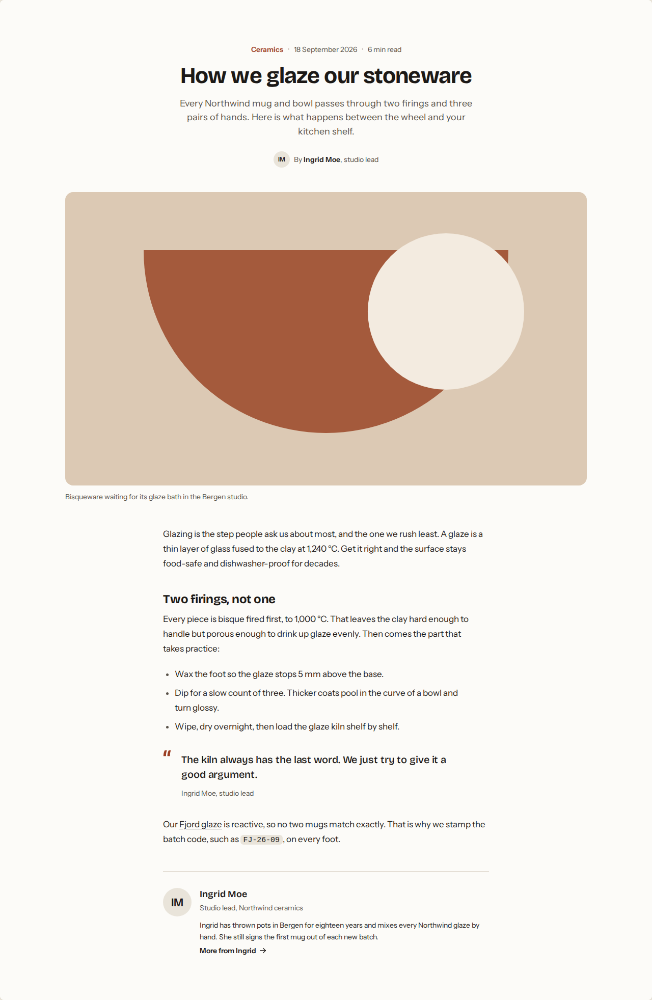
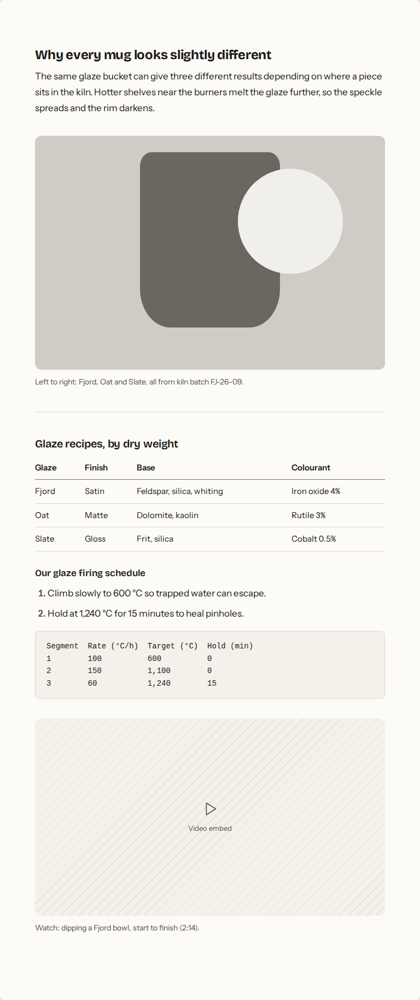
*Default story at 1280, and the full rich-text kit at 768: h3, paragraph, figure with caption, divider, table, h4, numbered list, code block and embed with caption.*

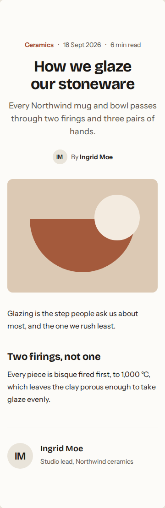
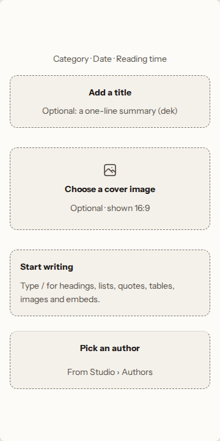
*At 360 the cover is 4:3 and the date is short ("18 Sept 2026"). Empty: placeholders for title, cover, body and author.*

**Composition**: Avatar (sm 2rem in the byline, lg 3.5rem in the author card, initials fallback), Image (cover and body figures), Link standalone ("More from {first name}"), rich-text typography (below), plain layout. No `variant` field: every journal post reads the same.

**Fields**

| Field id | Type | Required | Default | Notes |
|---|---|---|---|---|
| `title` | string | yes | — | Rendered as the page's only `h1`. Aim for under 70 characters. |
| `dek` | text | no | — | One- or two-sentence summary under the title. Also used as the list excerpt and meta description. |
| `category` | link | no | — | Journal category: label + URL of the filtered Article list. |
| `publishedAt` | string (date) | yes | — | Rendered in `<time datetime>`. Shown as "18 September 2026" from 48rem block width and "18 Sept 2026" below. |
| `readingTime` | string | no | from word count | Filled from the word count (about 220 words per minute), e.g. "6 min read". The editor can override it. |
| `coverImage` | media | no | — | 16:9 from 48rem, 4:3 below. Honours the focal point. Alt text is required when set (or marked decorative). |
| `coverCaption` | string | no | — | Shown under the cover. |
| `body` | rich-text | yes | — | Allowed nodes: h2–h4, paragraph, bold, italic, link, bulleted and numbered lists, blockquote (+ attribution), inline code, code block, table, image + caption, embed (YouTube or Vimeo) + caption, divider. |
| `author` | list (reference, max 1) | no | — | Reference to an Author entry. |
| `author.name` | string | yes | — | |
| `author.role` | string | no | — | E.g. "Studio lead, Northwind ceramics". |
| `author.avatar` | media | no | initials | Falls back to the author's initials on `surface-strong`. |
| `author.bio` | text | no | — | Up to 280 characters. |
| `author.link` | link | no | — | "More from {first name}". |
| `showByline` | bool | no | `true` | Adds the small byline to the header. |

**Variants**: none. Use Rich text for pages that are not dated posts.

**Layout**

- **Header** (all widths): centred, at most 46rem wide, items 1rem apart. Meta line: category · date · reading time, 0.875rem `muted`, centred and wrapping (0.25rem × 0.625rem gaps). The separator dots are `aria-hidden`. The category is `accent`, weight 600, at least 1.5rem tall, underlined on hover. Title `h1` 2.75rem (2.125rem below 48rem), line height 1.1, balance-wrapped. Dek 1.125rem, line height 1.55, `muted`, at most 38rem. Byline 0.5rem below: a 2rem avatar (`aria-hidden`) + "By {name}" (0.875rem `muted`; the name is a `text` link, weight 600, underlined on hover), optionally followed by a short role.
- **Cover**: 2rem below the header (3rem from 48rem). 4:3 with `radius-lg` below 48rem. 16:9 with `radius-xl` from 48rem. Caption 0.75rem below, 0.875rem `muted`, left-aligned.
- **Body**: 2rem below the cover (3rem from 48rem), in the 40rem narrow column.
- **Author card**: 3rem after the body, 2rem top padding, 1px `border` top rule. A 3.5rem avatar beside the text (1rem gap). Text at 0.875rem, line height 1.6, 0.25rem apart: name (1.125rem, heading font, weight 600, `text`), role (`muted`), bio (`text`, 0.5rem above), link (Link standalone with arrow-right).
- **Below 48rem**: 1rem gutters.
- **48–64rem**: 1.5rem gutters. Body text 1.0625rem.
- **From 64rem**: 2rem gutters. The header and cover follow the 64rem content container. The body and author card follow the 40rem narrow container, centred on the same axis as the header.
- Type outside the rich text (three sizes): `h1`, 1.125rem (dek, author name), 0.875rem (meta, byline, captions, bio). The rich text has its own documented scale (below).

#### Rich-text typography (shared)

This is the one typography definition for rich text. Rich text, FAQ answers, product descriptions and any other rich-text field use it unchanged. It responds to the block width at 48rem.

**Base and rhythm**

| Element | Spec |
|---|---|
| Base text | Body font, 1rem (1.0625rem from 48rem), line height 1.7, `text`. Long words and URLs break (`overflow-wrap: break-word`). Paragraphs use pretty wrapping. |
| Flow | Each top-level element after the first has 1.25em above it. The first element has none. |
| Space above headings | h2 2.5rem, h3 2rem, h4 1.75rem. |
| Heading to first element | 0.625rem. |

**Headings** (heading font, `text`, balance-wrapped, scroll margin 6rem so anchored headings clear a sticky header)

| Level | Size below 48rem | Size from 48rem | Line height | Weight | Tracking |
|---|---|---|---|---|---|
| h2 | 1.375rem | 1.5rem | 1.25 | 700 | −0.01em |
| h3 | 1.1875rem | 1.25rem | 1.3 | 600 | −0.005em |
| h4 | body size (1 / 1.0625rem) | same | 1.4 | 600 | 0 |

In Article the body starts at h2. In Rich text it starts at h3. No h1 in rich text.

**Inline**

| Element | Spec |
|---|---|
| Bold | Weight 600. |
| Italic | Italic of the body font. |
| Link | `text`, underlined: 1px thick, 0.2em offset, underline at 55% of the text colour. Hover: full-colour underline, 2px thick. 2px corner radius so the standard focus ring hugs it. |
| Inline code | Mono, 0.875em, 0.125em × 0.375em padding, `radius-sm`, `surface-strong` fill, `text`. |

**Lists**

| Element | Spec |
|---|---|
| Bulleted / numbered | Indent 1.375em. Items 0.5em apart. Nested lists 0.5em below their parent item. Paragraphs inside an item 0.5em apart. |
| Markers | `muted`. Numbered markers weight 600 with tabular figures. |

**Blockquote**

| Part | Spec |
|---|---|
| Box | 2.25rem above and below. Left padding 2rem (2.25rem from 48rem). No side bar. |
| Quote text | Heading font, 1.1875rem (1.25rem from 48rem), line height 1.45, weight 500, −0.005em. Children 0.75rem apart. |
| Opening mark | A hanging “ in `accent`, 2.5em, positioned at the left edge, slightly above the first line. Decorative (drawn by CSS). |
| Attribution | In `<footer>` or `<cite>`: body font, 0.875rem, upright, weight 400, `muted`, on its own line. |

**Code block**

| Part | Spec |
|---|---|
| `<pre>` | Mono 0.875rem, line height 1.6, 1rem × 1.25rem padding, `surface` fill, 1px `border`, `radius-md`. No wrapping (`white-space: pre`), tab size 2, scrolls horizontally. The renderer adds `tabindex="0"` so keyboard users can scroll it. |
| Code inside `<pre>` | Inherits the block's font. No inline-code fill. |

**Table**

| Part | Spec |
|---|---|
| Wrapper | The renderer wraps each table in a `
` that scrolls horizontally. The table never widens the page. |
| Table | Full width, collapsed borders, 0.9375rem, line height 1.5, tabular figures. |
| Cells | 0.625rem top and bottom, 1rem right, 0 left padding. Left-aligned, top-aligned. 1px `border` rule under each row. |
| Header cells | Weight 600, no wrapping, a `border-strong` rule under them. Use `<th scope>`. |
| Caption | `<caption>` below the table, left-aligned, 0.75rem above it, 0.875rem `muted`. |

**Figures and embeds**

| Part | Spec |
|---|---|
| Figure | 2.25rem above and below. The image fills the column width (auto height) with `radius-lg`. |
| Figure caption | 0.75rem above it, 0.875rem, line height 1.5, `muted`. |
| Embed | A 16:9 frame with `radius-lg`, `surface-strong` fill, clipped. The `<iframe>` fills it with no border and must have a `title`. Captioned like a figure. Never autoplays. |
| Divider (`
`) | 1px `border` top rule, 2.75rem above and below. |

**Centred variant** (used by Rich text with `alignment = center`): text centred. Lists use inside markers with no indent. The blockquote gets 2rem top padding instead of left, with the opening mark centred above it. Code blocks and tables stay left-aligned.

**Type-size exception (documented)**: the rich text uses body (1 / 1.0625rem), h2 1.375 / 1.5rem, h3 and blockquote 1.1875 / 1.25rem, and code, tables and captions at 0.875–0.9375rem. That is more than the three-size rule allows for a block. Long-form reading needs this hierarchy, so the exception is accepted for rich text only.

**States**

| State | What it looks like |
|---|---|
| Ideal | Every field set, as in the default story. |
| Minimal content | Title, date and body only. The meta line shows the date alone. The byline, cover and author card are not rendered, and the body follows the header after 2rem (3rem from 48rem). |
| Long content | A title twice as long balance-wraps. Tables and code blocks scroll sideways inside their focusable region. Long URLs break. |
| No image | The cover is skipped. A missing inline image in the body removes its whole figure. |
| No author avatar | Initials on `surface-strong` in both avatars. |
| Empty (freshly inserted) | Editor placeholders: the meta line shows "Category · Date · Reading time" in `muted`, then "Add a title" / "Optional: a one-line summary (dek)", "Choose a cover image" / "Optional · shown 16:9", "Start writing" / "Type / for headings, lists, quotes, tables, images and embeds." and "Pick an author" / "From Studio › Authors". On the live site, empty optional parts are not rendered. |

**Field → layout mapping**

- `category` · `publishedAt` · `readingTime` → meta line (category link in `accent`).
- `title` → `h1`. `dek` → paragraph under the title. `author.name` → byline.
- `coverImage` + `coverCaption` → `<figure>` with Image and `<figcaption>`.
- `body` → rich-text typography.
- `author.*` → `<footer>` author card (Avatar lg, name, role, bio, Link standalone).

**Keyboard & accessibility**

- Root: `<article aria-labelledby="{title id}">`. The title is the only `h1` on the page. Body headings start at h2, and the editor's toolbar offers only h2–h4.
- The date is in `<time datetime="2026-09-18">`. The separator dots are `aria-hidden`.
- The byline avatar is decorative (`aria-hidden`) because the name follows it. The author card avatar is decorative too.
- The cover needs alt text unless marked decorative.
- Scrollable tables and code blocks take keyboard focus (`tabindex="0"`), scroll with arrow keys and show the standard focus ring. Table regions are named, e.g. "Glaze recipes table".
- Embeds need a `title` (the editor requires it) and never autoplay.
- Keys: `Tab` moves through the category link, byline link, body links, table and code regions, embeds and the author link in reading order. `Enter` follows links. Arrow keys scroll a focused table or code block.
- Targets: the category link and standalone links are at least 1.5rem tall. Links inside body text are inline, which 2.5.8 exempts.

**Default content (Northwind Goods)**

- Meta: "Ceramics · 18 September 2026 · 6 min read"
- Title "How we glaze our stoneware"
- Dek "Every Northwind mug and bowl passes through two firings and three pairs of hands. Here is what happens between the wheel and your kitchen shelf."
- Byline "By Ingrid Moe, studio lead"
- Cover alt "Unglazed stoneware bowls stacked on a wooden studio shelf" · caption "Bisqueware waiting for its glaze bath in the Bergen studio."
- Body:
  - "Glazing is the step people ask us about most, and the one we rush least. A glaze is a thin layer of glass fused to the clay at 1,240 °C. Get it right and the surface stays food-safe and dishwasher-proof for decades."
  - h2 "Two firings, not one": "Every piece is bisque fired first, to 1,000 °C. That leaves the clay hard enough to handle but porous enough to drink up glaze evenly. Then comes the part that takes practice:" List: Wax the foot so the glaze stops 5 mm above the base. · Dip for a slow count of three. Thicker coats pool in the curve of a bowl and turn glossy. · Wipe, dry overnight, then load the glaze kiln shelf by shelf.
  - Quote: "The kiln always has the last word. We just try to give it a good argument." — Ingrid Moe, studio lead
  - "Our [Fjord glaze] is reactive, so no two mugs match exactly. That is why we stamp the batch code, such as `FJ-26-09`, on every foot."
  - h2 "Why every mug looks slightly different": "The same glaze bucket can give three different results depending on where a piece sits in the kiln. Hotter shelves near the burners melt the glaze further, so the speckle spreads and the rim darkens." Figure (alt "Three glazed mugs in blue-grey, oat and slate on a linen cloth"), caption "Left to right: Fjord, Oat and Slate, all from kiln batch FJ-26-09." Divider.
  - Heading "Glaze recipes, by dry weight", then a table (Glaze | Finish | Base | Colourant): Fjord | Satin | Feldspar, silica, whiting | Iron oxide 4% · Oat | Matte | Dolomite, kaolin | Rutile 3% · Slate | Gloss | Frit, silica | Cobalt 0.5%.
  - h4 "Our glaze firing schedule": 1. Climb slowly to 600 °C so trapped water can escape. 2. Hold at 1,240 °C for 15 minutes to heal pinholes. Code block: `Segment  Rate (°C/h)  Target (°C)  Hold (min)` / `1  100  600  0` / `2  150  1,100  0` / `3  60  1,240  15`.
  - Embed, caption "Watch: dipping a Fjord bowl, start to finish (2:14)."
- Author: Ingrid Moe, "Studio lead, Northwind ceramics". "Ingrid has thrown pots in Bergen for eighteen years and mixes every Northwind glaze by hand. She still signs the first mug out of each new batch." Link "More from Ingrid".

**Acceptance criteria**

- [ ] Contrast: title, body and author name `text` 16.9:1. Dek, meta, captions, role, quote attribution and list markers `muted` 7.4:1. Category and quote mark `accent` 6.4:1. Inline code `text` on `surface-strong` 13.8:1. Code block `text` on `surface` 15.5:1 (1.4.3).
- [ ] Links in body text are underlined, so they are not marked by colour alone (1.4.1).
- [ ] Exactly one `h1` on the page (the title). Body headings run h2–h4 without skipped levels (1.3.1, 2.4.6).
- [ ] `<time datetime>` carries the machine-readable date. The visible format switches at 48rem block width.
- [ ] Tables have `<th>` header cells and sit in a named, focusable region. Code blocks are focusable. Both scroll with the keyboard and never widen the page at 320px (1.4.10, 2.1.1).
- [ ] Every image has alt text or is marked decorative. Every embed has a `title` and does not autoplay (1.1.1, 4.1.2, 2.2.2).
- [ ] The standard focus ring is visible on the category link, byline link, body links, scroll regions, embeds and the author link (2.4.7, 2.4.11).
- [ ] The category and standalone links are at least 1.5rem tall (2.5.8).
- [ ] 200% zoom and 320px: the header, body, tables (inside their scroll region) and the author card reflow without page-level horizontal scroll. Text spacing overrides don't clip anything (1.4.10, 1.4.12).
- [ ] Line length in the body stays near 65 characters at 40rem.
- [ ] No motion. The only hover effects are underline changes.

**Do / Don't**

- Do keep the body in the narrow container so line length stays near 65 characters.
- Do write alt text that describes the photo ("Three glazed mugs in blue-grey, oat and slate"), not "image".
- Don't put an h1 in the body or skip heading levels.
- Don't add text over the cover image. The article cover is a photo, not a hero.
- Don't add coloured side bars to blockquotes or call-outs. Use the quote style as it is.

---

### Article list · `article-list`

A list of journal stories as a card grid, a featured-first layout or thumbnail rows, with optional category chips and pagination.

**Container** `content` (64rem) · **Section background** default none (also works on `surface`) · **Section spacing** default `md` (`section-md`)

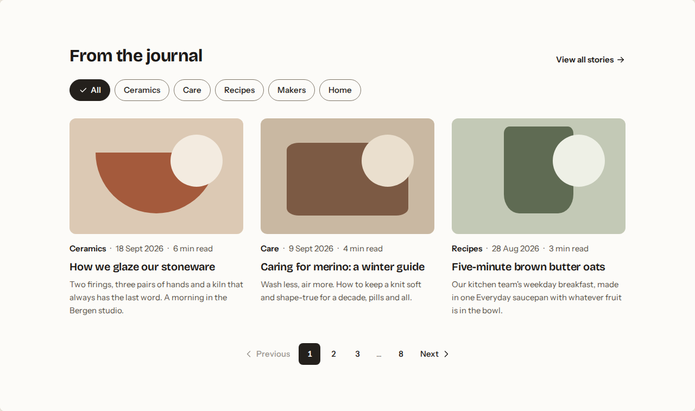
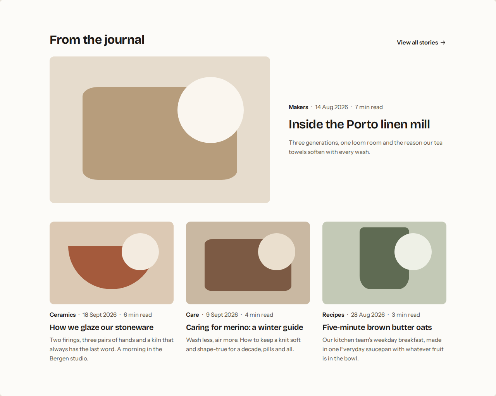
*`grid` with chips and pagination, and `featured-first`, where the first story is a 7:5 split with a 2rem title.*

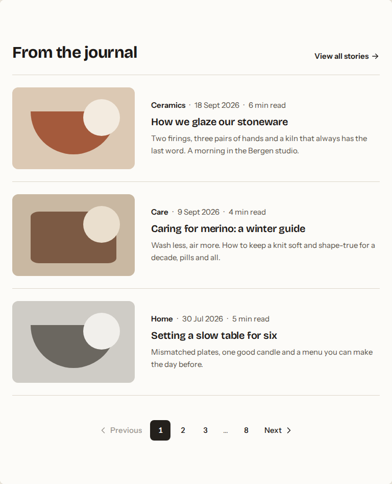
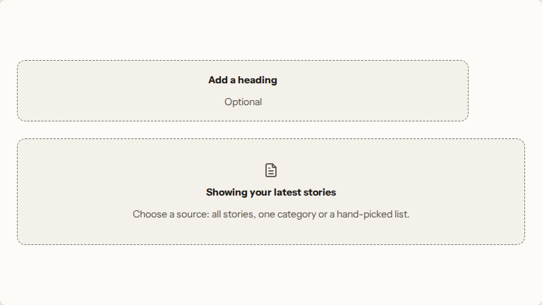
*`list` rows with a 15rem 3:2 thumbnail. Freshly inserted: a heading placeholder and a source hint. The latest stories show straight away on the live site.*

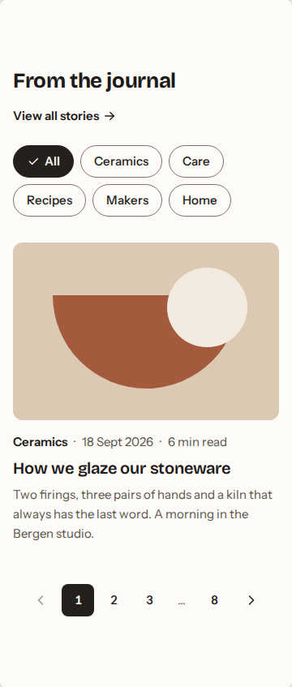
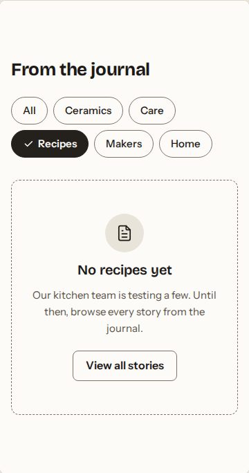
*Phone: chips wrap, one column, chevron-only Previous/Next. Empty category: the active chip stays marked and an EmptyState explains.*

**Composition**: ContentCard, Pagination, EmptyState (with Button outline), Link standalone ("View all stories", arrow-right), filter chips (links styled as pills, below), plain layout.

**Fields**

| Field id | Type | Required | Default | Notes |
|---|---|---|---|---|
| `variant` | select | yes | `grid` | `grid` · `featured-first` · `list` |
| `heading` | string | no | "From the journal" | Rendered as the `h2`. |
| `viewAllLink` | link | no | — | "View all stories". Placed in the block head. |
| `source` | select | yes | `latest` | `latest` · `category` · `manual` |
| `category` | link | no | — | Used when `source = category`. |
| `items` | list | no | — | Used when `source = manual`. References to Article entries, 1–12. |
| `perPage` | select | no | `6` | `3` · `6` · `9` · `12`. For `featured-first`, choose 4, 7 or 10 so the rows fill. |
| `showFilters` | bool | no | `false` | Category chips built from the categories that have stories. |
| `showPagination` | bool | no | `true` on the journal index, `false` elsewhere | |
| `showExcerpt` | bool | no | `true` | In `list`, excerpts are always hidden below 48rem block width. |
| `emptyTitle` | string | no | "No stories yet" | The category name is substituted in, e.g. "No recipes yet". |
| `emptyText` | text | no | "Browse every story from the journal." | |

Each card reads from its Article: `coverImage`, `category`, `publishedAt`, `readingTime`, `title` and `dek` (as the excerpt).

**Variants**

| variant | What changes |
|---|---|
| `grid` | ContentCard grid: 3:2 image (`radius-lg`), meta line, title, excerpt clamped to 3 lines. 1 / 2 / 3 columns. |
| `featured-first` | The first story spans the full row. From 48rem it becomes a split (image 7fr | text 5fr, 2rem gap, vertically centred; 3rem gap from 64rem). From 64rem its title is 2rem (line height 1.15) and its text parts are 1rem apart. The other stories follow in the grid. |
| `list` | Rows between `border` hairlines (a rule above the first row and under each row). Row padding 1.25rem top and bottom (1.5rem from 48rem). Below 48rem: a 6.5rem square thumbnail (`radius-md`) beside the text (1rem gap, top-aligned), no excerpt. From 48rem: a 15rem-wide 3:2 thumbnail (`radius-lg`), 2rem gap, vertically centred, excerpt shown and clamped to 3 lines, at most 40rem wide. |

**Layout**

- Block head: `h2` with the "View all stories" link on the right (0.9375rem), 1.5rem above the chips or list. Below 48rem the head stacks: `h2`, then the link.
- Filter chips: a wrapping row 0.5rem apart, 2rem above the list. Each chip is at least 2.5rem tall, 1rem side padding, pill shape, 1px `border-strong` on `background`, `text` at 0.9375rem, weight 500. Hover: border becomes `text`. Active: `primary` fill, `primary-contrast` text, weight 600 and a 1rem check icon.
- Card: image, then body 1rem below. Body parts 0.5rem apart: meta (0.9375rem `muted`, category in `text` weight 600, dot separators), title (heading font 1.25rem, line height 1.3, weight 600), excerpt (0.9375rem, line height 1.6, `muted`, 3-line clamp).
- **Below 48rem**: 1rem gutters. One column, cards 2rem apart. Pagination shows chevron-only Previous/Next, 2.75rem square, with visually hidden "Previous"/"Next" words.
- **48–64rem**: 1.5rem gutters. Two columns, 3rem row gap × 1.5rem column gap.
- **From 64rem**: 2rem gutters. Three columns, 3rem row gap × 2rem column gap. Pagination sits 3rem below the list, centred (0.9375rem, 2.5rem page items).
- Type (three sizes): `h2` 2rem (1.625rem below 48rem; the featured title from 64rem also uses 2rem), card title 1.25rem, and 0.9375rem for meta, excerpt, chips, links and pagination. The EmptyState title reuses 1.25rem.

**States**

| State | What it looks like |
|---|---|
| Ideal | 6 stories with chips and pagination. |
| Minimal content | One story. The grid keeps its column width and does not stretch a single card across the row. In `featured-first`, a single story is the split row alone. |
| Long content | Titles wrap without a clamp. Excerpts clamp at 3 lines. Many categories make the chips wrap onto more lines. |
| Many items | 12 per page at most. Beyond that, pagination takes over: an ellipsis gap after page 3, and the last page shown (e.g. 1 2 3 … 8). |
| No image | The card shows the Image placeholder (striped `surface` with a photo icon) at the same ratio, so rows stay aligned. |
| Empty category | Chips stay visible with the active chip marked. EmptyState: dashed `border-strong` outline, `radius-lg`, 3rem × 1.5rem padding, a 3.5rem `surface-strong` icon disc with file-text, the title "No recipes yet", the text and a Button outline "View all stories". Pagination is hidden. |
| Pagination at first / last page | Previous (or Next) is `aria-disabled="true"`, has no `href`, and is shown dimmed. |
| Empty (freshly inserted) | Heading placeholder ("Add a heading" / "Optional") and a source hint ("Showing your latest stories" / "Choose a source: all stories, one category or a hand-picked list."). The live site shows the latest stories straight away. |

**Field → layout mapping**

- `heading` → block head `h2`. `viewAllLink` → Link standalone with arrow-right.
- `showFilters` → `<nav aria-label="Filter stories by category">` > `<ul>` of chip links.
- Each story → `<li>` > `<article>` ContentCard (3:2 Image, meta line, `h3` title containing the card link, excerpt).
- `showPagination` → Pagination `<nav aria-label="Journal pages">`.
- `emptyTitle` / `emptyText` → EmptyState.

**Keyboard & accessibility**

- The section is labelled by its `h2`. Card titles are `h3`.
- Each card is one tab stop: the title link is stretched over the whole card, and the focus ring is drawn around the card.
- Card images are decorative (`alt=""`) because the title carries the meaning.
- Chips are links. The active chip has `aria-current="true"` and shows a filled background, a check icon and weight 600, never colour alone.
- Pagination: the current page has `aria-current="page"`. Page numbers have `aria-label="Page n"`. An unavailable Previous/Next is `aria-disabled="true"` with no `href`. Below 48rem the "Previous"/"Next" words are visually hidden but still read.
- Tab order: View all → chips → cards (DOM order, left to right, row by row) → pagination. `Enter` follows any of them.

**Default content (Northwind Goods)**

Heading "From the journal", link "View all stories". Chips: All · Ceramics · Care · Recipes · Makers · Home.
1. Ceramics · 18 Sept 2026 · 6 min read. "How we glaze our stoneware": "Two firings, three pairs of hands and a kiln that always has the last word. A morning in the Bergen studio."
2. Care · 9 Sept 2026 · 4 min read. "Caring for merino: a winter guide": "Wash less, air more. How to keep a knit soft and shape-true for a decade, pills and all."
3. Recipes · 28 Aug 2026 · 3 min read. "Five-minute brown butter oats": "Our kitchen team's weekday breakfast, made in one Everyday saucepan with whatever fruit is in the bowl."
4. Makers · 14 Aug 2026 · 7 min read. "Inside the Porto linen mill": "Three generations, one loom room and the reason our tea towels soften with every wash." (The featured story in `featured-first`.)
5. Home · 30 Jul 2026 · 5 min read. "Setting a slow table for six": "Mismatched plates, one good candle and a menu you can make the day before."

Empty state: "No recipes yet" / "Our kitchen team is testing a few. Until then, browse every story from the journal." / "View all stories".

**Acceptance criteria**

- [ ] Contrast: titles and meta category `text` 16.9:1 (15.5:1 on `surface`). Date, reading time and excerpt `muted` 7.4:1 (6.8:1 on `surface`). Active chip `primary-contrast` on `primary` 15.6:1. Current page `primary-contrast` on `primary` 15.6:1 (1.4.3).
- [ ] Chip boundaries are `border-strong` 4.5:1 on `background` (4.1:1 on `surface`) (1.4.11).
- [ ] The active chip and current page are marked by more than colour: a check icon and weight for the chip, `aria-current` and a filled shape for the page (1.4.1).
- [ ] One tab stop per card. The focus ring surrounds the whole card. The card's accessible name is its title (2.4.4, 2.4.7).
- [ ] Chips are at least 2.5rem tall. Page items 2.5rem. Previous/Next 2.75rem below 48rem (2.5.8).
- [ ] Chip links change the URL. Filtering never happens without a navigation (3.2.2).
- [ ] Pagination exposes `aria-current="page"`, "Page n" labels and `aria-disabled` on unavailable ends. Hidden Previous/Next words are still announced (4.1.2).
- [ ] Empty category shows the EmptyState with a working "View all stories" button. Pagination is hidden.
- [ ] Missing cover images show the placeholder at the same ratio, so rows align.
- [ ] 320px and 200% zoom: one column, chips wrap, no horizontal scroll (1.4.10, 1.4.12).
- [ ] Reduced motion: chip and card hover transitions are instant.

**Do / Don't**

- Do use `featured-first` on the journal home and `grid` for "more stories" rows under an article.
- Do keep all cover images in one art direction. The grid crops them to 3:2 around the focal point.
- Don't show pagination in a homepage teaser. Link to the journal with `viewAllLink` instead.
- Don't turn filter chips into buttons that change the list without changing the URL. Each chip links to a filterable page.

---

### Gallery · `gallery`

A set of photos as a grid, masonry columns or a carousel. Every image opens the Lightbox at that image, with its caption. For shoppable images, use a product block.

**Container** `content` (64rem) · **Section background** default none (also works on `surface`) · **Section spacing** default `md` (`section-md`)

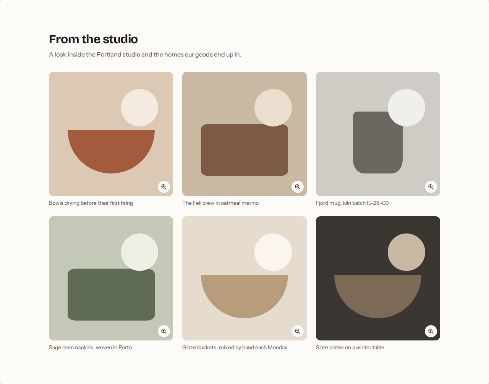
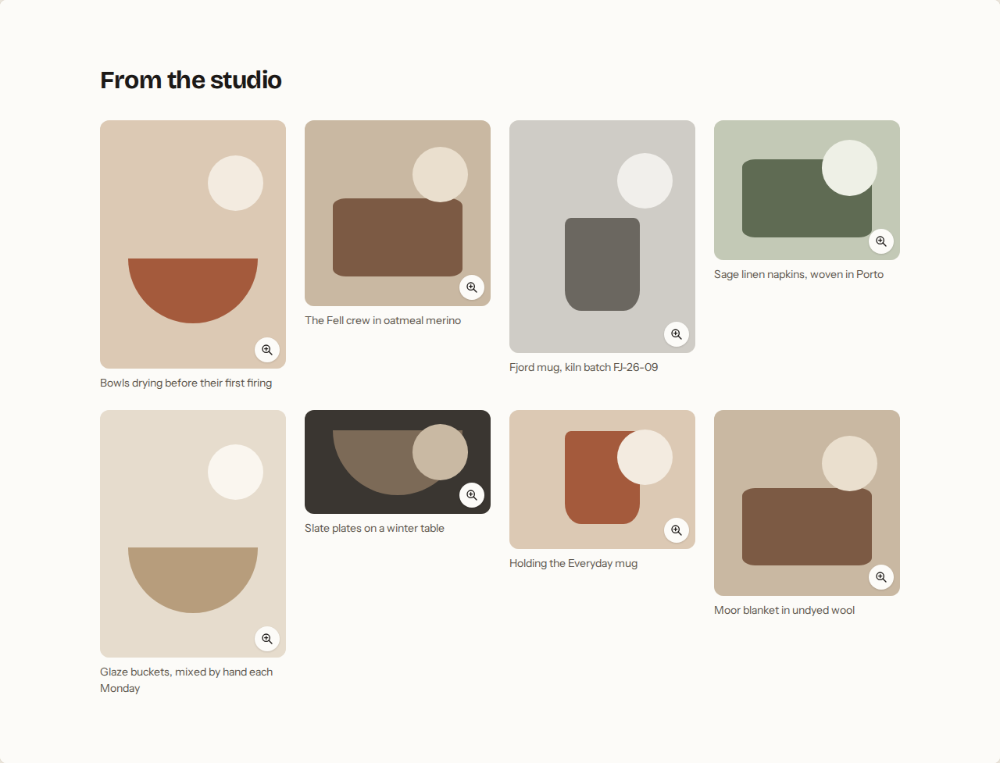
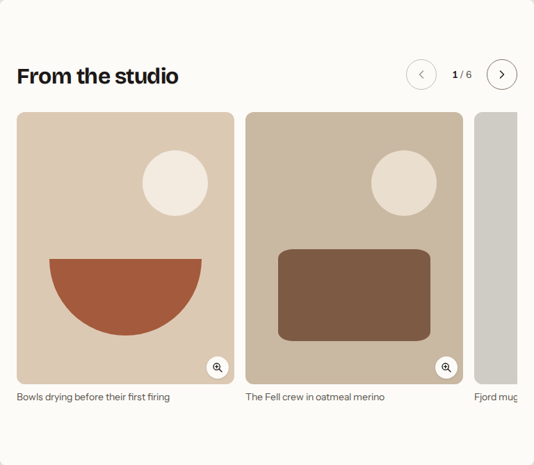
*The three variants: an even 1:1 grid, masonry at 4 columns with uncropped images, and a 4:5 carousel with its controls in the head from 48rem.*

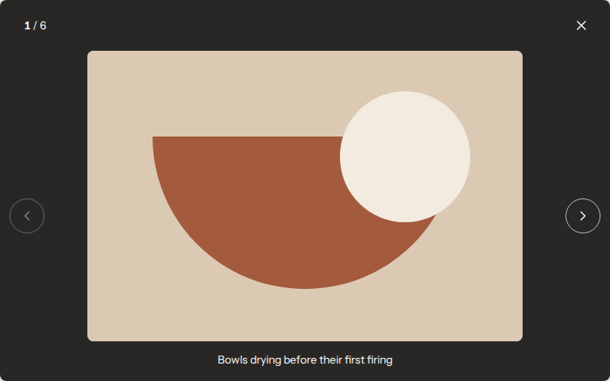
*The Lightbox: counter and close in the top bar, arrows either side, the image fitted to the stage and its caption below.*

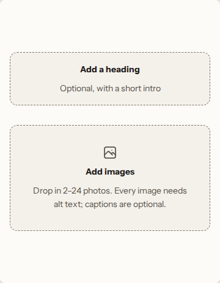
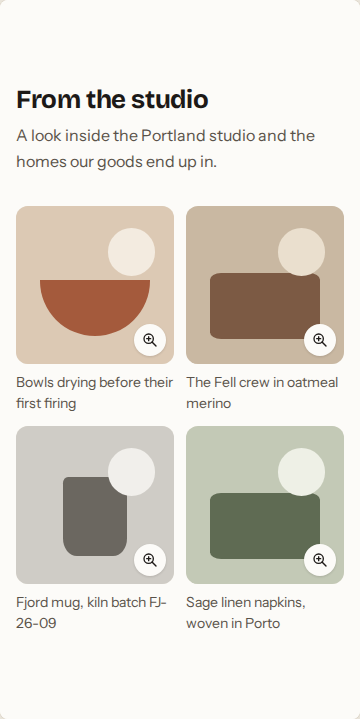
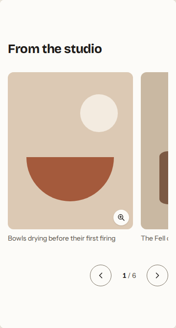
*Phone: 2-column grid, and the carousel with 78% slides and its controls under the track.*

**Composition**: Image, CarouselControls (carousel variant), Lightbox (native `<dialog>` opened as a modal), plain layout. Each tile is a block-specific button (below).

**Fields**

| Field id | Type | Required | Default | Notes |
|---|---|---|---|---|
| `variant` | select | yes | `grid` | `grid` · `masonry` · `carousel` |
| `heading` | string | no | — | Rendered as the `h2`. |
| `intro` | text | no | — | One sentence under the heading. |
| `columns` | select | no | `3` | `2` · `3` · `4`. Applies from 64rem block width to `grid` and `masonry`. Below that: 2 columns under 48rem, 3 from 48rem. |
| `aspect` | select | no | `1:1` for grid, `4:5` for carousel | `1:1` · `4:5` · `3:2`. `masonry` ignores it: each image keeps its own ratio. |
| `showCaptions` | bool | no | `true` | Captions always show in the Lightbox. |
| `items` | list | yes | — | 2–24 images. |
| `items[].image` | media | yes | — | Alt text required. The focal point is used when cropping. |
| `items[].caption` | string | no | — | Up to about 80 characters. |

**Variants**

| variant | What changes |
|---|---|
| `grid` | An even grid of `aspect`-cropped tiles with the caption below each. |
| `masonry` | Column layout (2 / 3 / `columns`). Each image uses its natural height, so any mix of portrait, landscape and square images works without cropping. Items read down each column, then the next. Items never split across columns. |
| `carousel` | A scroll-snap carousel. Slides are 78% wide below 48rem, about 2.25 visible from 48rem (1rem gap) and 3 visible from 64rem (1.5rem gap). From 48rem the controls (previous, counter, next) sit in the block head on the right. Below that they sit right-aligned, 1.25rem under the track. |

**Layout**

- Block head: `h2` then intro (`muted`), 2rem above the images.
- Tile: a full-width button with `radius-lg`, the Image at the chosen ratio with `radius-lg`, and a zoom badge: a 2rem `background` circle with a 1rem `text` zoom-in icon and `shadow-sm`, inset 0.5rem from the bottom-right corner. Caption 0.5rem below the tile, 0.875rem, line height 1.5, `muted`. Pointer cursor is the zoom-in cursor. On hover, the image scales to 1.03 over `duration-base` `ease-out`.
- **Below 48rem**: 1rem gutters. `h2` 1.625rem, then the intro. Grid and masonry: 2 columns, 0.75rem gap (masonry items 0.75rem apart vertically). Carousel: 78% slides with a peek of the next, controls under the track.
- **48–64rem**: 1.5rem gutters. 3 columns, 1rem gap. Carousel about 2.25 slides, controls in the head.
- **From 64rem**: 2rem gutters. `columns` (3 by default), 1.5rem gap. Carousel shows 3.
- **Lightbox** (fills the viewport, so it uses viewport rather than block width): top bar with the counter ("1 / 6", 0.875rem, `background` text, current number bold) on the left and the close button (ghost icon button, 2.5rem; 2.75rem below 48rem) on the right, 0.75rem × 1rem padding. Stage with 2.75rem circular arrows 0.75rem from the edges, 1rem side padding on phones and 4.5rem from 48rem. The image is fitted to the stage (contained, never cropped, `radius-md`; images of their own ratio are capped at the viewport height minus 10rem). The caption is centred below, at most 48rem wide, 0.875rem.
- Type (three sizes): `h2`, intro 1rem, captions and counter 0.875rem.

**States**

| State | What it looks like |
|---|---|
| Ideal | 6 captioned images. |
| Minimal content | 2 images. The grid keeps its columns and leaves the rest of the row empty. When every carousel slide fits, hide the controls. |
| Long content | Captions wrap and are never clamped. A long heading balance-wraps. |
| Many items | Up to 24. Masonry balances the column heights itself. |
| Missing image | The item is skipped on the live site. The editor shows the Image placeholder in its place. |
| Carousel at the ends | The previous arrow is disabled at the start and the next arrow at the end (dimmed, not-allowed cursor). If focus was on an arrow that just became disabled, it moves to the other arrow. |
| Lightbox open | Near-opaque ink ground (`text` at 94%), `background` text and icons, arrow outlines in `background` at 70%. Hover on arrows and close: a 14% `background` tint. Arrows are disabled at the first and last image. |
| Empty (freshly inserted) | Editor placeholders "Add a heading" / "Optional, with a short intro" and "Add images" / "Drop in 2–24 photos. Every image needs alt text; captions are optional." Nothing renders on the live site until there are at least 2 images. |

**Field → layout mapping**

- `heading` / `intro` → block head. `items[]` → `<ul>` of `<li>` > `<figure>`: the tile button (Image + zoom badge) and `<figcaption>` (when `showCaptions`).
- Carousel: the same list is the scrolling track.
- Lightbox: one `<dialog>` per gallery, holding a one-image-per-view track of `<figure>` slides (Image with full alt text + `<figcaption>`).

**Keyboard & accessibility**

- The section is labelled by its `h2`.
- Each tile is a real `<button type="button" aria-haspopup="dialog">` with `aria-label="View larger, image 2 of 6: {alt}"`. The tile image is decorative inside the button. The zoom badge is `aria-hidden` and always visible, so the action is never hover-only.
- **Lightbox (native `<dialog>`, modal)**: `aria-label="{heading}, image viewer"` (e.g. "From the studio, image viewer"). Opened with the browser's modal method: the page behind is inert, focus stays inside, `Esc` closes, the `overlay` scrim is the backdrop (covered by the viewer's own ground) and the page doesn't scroll behind. It opens at the clicked image: the track jumps to that slide with no animation before it is shown. Focus lands on the close button ("Close image viewer"). On close (`Esc`, the close button or a click on the backdrop), focus returns to the tile that opened it. The track is focusable, labelled "Images, use arrow keys to move". Arrows are "Previous image" / "Next image".
- The counter is `aria-live="polite"`, so "3 / 6" is announced as images change. The position is announced once, through the counter. Each slide image carries the full alt text and the caption is its `<figcaption>`.
- **Carousel variant**: a `role="region"` with `aria-roledescription="carousel"`, labelled by the heading. The track is focusable (`tabindex="0"`, "Gallery images, use arrow keys to scroll"). Arrows are "Previous images" / "Next images". No autoplay.
- Masonry reads in DOM order (down each column). The editor lists items in that order, so what editors see matches the reading order.

| Context | Key | Action |
|---|---|---|
| Tile | `Enter` / `Space` | Open the Lightbox at this image. |
| Carousel track (focused) | `←` / `→` | Scroll one slide back / forward. |
| Carousel arrows | `Enter` / `Space` | Previous / next slide. |
| Lightbox, anywhere | `←` / `→` | Previous / next image (no-op at the ends). |
| Lightbox | `Tab` / `Shift+Tab` | Cycle close → track → previous → next, contained in the dialog. |
| Lightbox | `Esc` | Close, focus back to the opening tile. |

- Reduced motion: slide changes jump instantly (no smooth scroll), the tile hover zoom is off, and the dialog fades instead of moving.

**Default content (Northwind Goods)**

Heading "From the studio". Intro "A look inside the Bergen studio and the homes our goods end up in." Items (caption · alt):
1. Bowls drying before their first firing · "Wheel-thrown bowls drying on a wooden studio shelf"
2. The Fell crew in oatmeal merino · "Oatmeal merino crew sweater folded on a linen throw"
3. Fjord mug, kiln batch FJ-26-09 · "Blue-grey Fjord mug of coffee on a windowsill"
4. Sage linen napkins, woven in Porto · "Stack of sage linen napkins with a wooden spoon"
5. Glaze buckets, mixed by hand each Monday · "Buckets of mixed glaze lined up on the studio floor"
6. Slate plates on a winter table · "Evening table set with dark Slate plates and candles"

Masonry adds "Holding the Everyday mug" and "Moor blanket in undyed wool".

**Acceptance criteria**

- [ ] Heading `text` 16.9:1. Intro and captions `muted` 7.4:1 (6.8:1 on `surface`). Zoom badge icon `text` on `background` 16.9:1 (1.4.3, 1.4.11).
- [ ] Lightbox text and icons in `background` on the 94% ink ground are about 16:1. Arrow outlines (`background` at 70%) are about 8.5:1 (computed). The focus ring's `focus-inner` infill is visible on the dark ground (1.4.3, 1.4.11, 2.4.11).
- [ ] Every tile is a `<button>` with `aria-haspopup="dialog"` and a name that gives its position and alt text (4.1.2).
- [ ] The Lightbox is a native `<dialog>` opened as a modal: background inert, focus contained, `Esc` closes, no background scroll. No custom focus trap (2.1.2, 2.4.3).
- [ ] The Lightbox opens showing the clicked image, not the first one. Focus starts on Close and returns to the same tile on close (2.4.3).
- [ ] `←`/`→` change the image from anywhere in the dialog. The counter change is announced politely. Arrows are disabled at the ends and focus never stays on a disabled arrow (2.1.1, 4.1.3).
- [ ] The carousel track scrolls with `←`/`→` when focused. Arrows and the track show the standard focus ring. No autoplay (2.1.1, 2.2.2).
- [ ] Targets: tiles are large. Carousel and Lightbox arrows are 2.75rem. The close button is 2.5rem (2.75rem below 48rem) (2.5.8).
- [ ] Reduced motion: no smooth scrolling, no hover zoom, dialog fades only.
- [ ] Every image has alt text. Captions add context and don't replace it (1.1.1).
- [ ] 320px and 200% zoom: the grid stays 2 columns or fewer without horizontal page scroll. The Lightbox image and caption fit the viewport (1.4.10).
- [ ] With 2 images the block renders. With fewer, nothing renders on the live site.

**Do / Don't**

- Do use `masonry` when the photos have mixed orientations, and `grid` when they were shot as a set.
- Do write alt text that describes each image. The caption adds context, not a description.
- Don't put text or buttons on the tiles.
- Don't autoplay the carousel.

---

### Image · `image`

A single photo with an optional caption, at a chosen aspect ratio and page width, for pacing long pages and stories. For text on an image, use Hero or an image-with-text block.

**Container** from `width`: `narrow` (40rem) / `content` (64rem, default) / `wide` (80rem) / `full` (edge to edge) · **Section background** default none · **Section spacing** default `md` (`section-md`). Use `sm` between two text blocks.

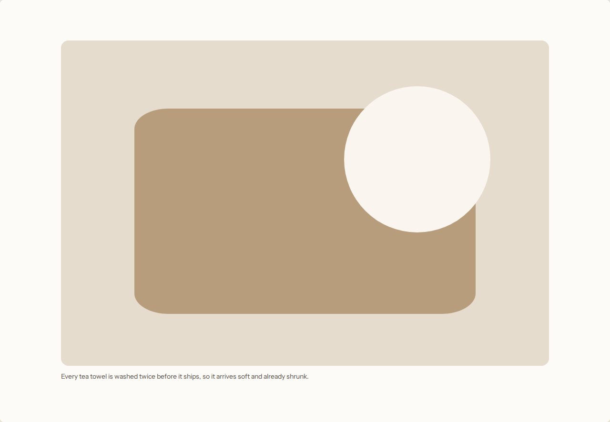
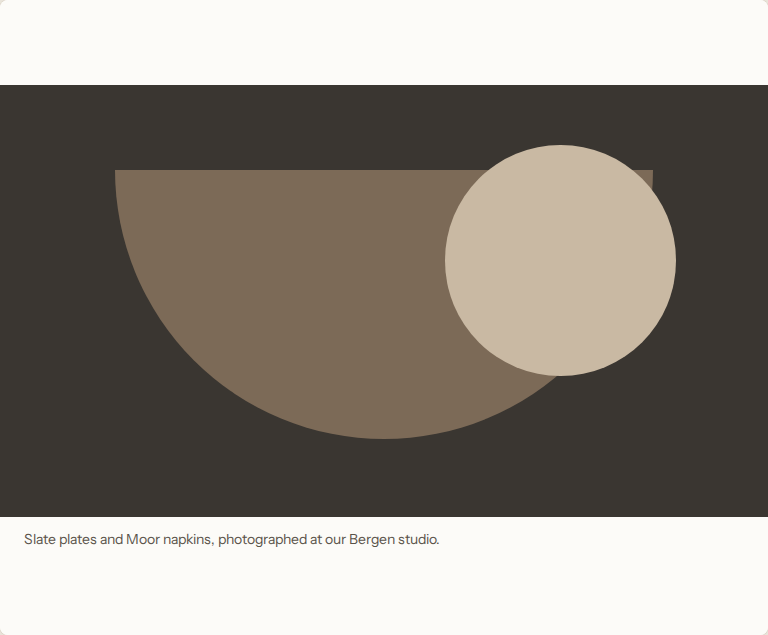
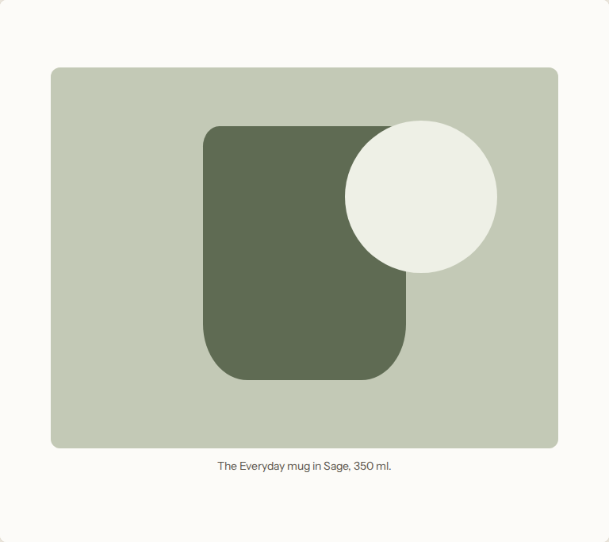
*Content width at 3:2 with `radius-xl`. Full width with no radius, the caption kept on the content grid. Narrow at 4:3 with `radius-lg` and a centred caption.*

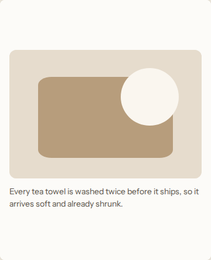
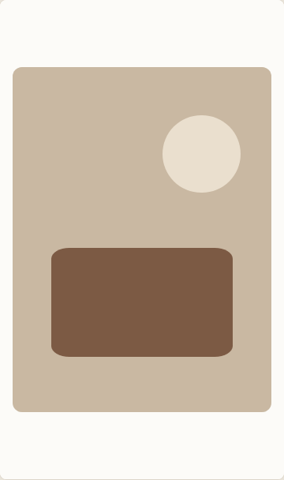
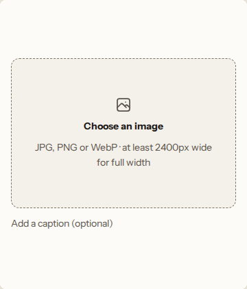
*Phone: `radius-lg`, caption 0.75rem below. Freshly inserted: a 3:2 placeholder with format guidance and a muted caption placeholder.*

**Composition**: Image (with focal point and zoom), optional link wrapper, plain layout. No `variant` field: `width` and `aspect` cover the useful combinations.

**Fields**

| Field id | Type | Required | Default | Notes |
|---|---|---|---|---|
| `image` | media | yes | — | Alt text required unless `decorative` is on. Honours the focal point and zoom. |
| `decorative` | bool | no | `false` | When on, the image renders with `alt=""`. |
| `aspect` | select | yes | `3:2` | `auto` (native ratio, no crop) · `1:1` · `4:3` · `3:2` · `16:9` · `3:4` |
| `width` | select | yes | `content` | `narrow` (40rem) · `content` (64rem) · `wide` (80rem) · `full` (edge to edge) |
| `caption` | string | no | — | Up to about 160 characters. |
| `captionAlign` | select | no | `start` | `start` · `center` |
| `link` | link | no | — | Wraps the image (not the caption) in a link. |

**Variants (by `width`)**

| width | What changes |
|---|---|
| `narrow` | 40rem column, matching the Article and Rich text bodies. `radius-lg` at every width. |
| `content` | 64rem container. `radius-lg` below 48rem, `radius-xl` from 48rem. |
| `wide` | 80rem container. `radius-lg` / `radius-xl` as for content. |
| `full` | Edge to edge, no gutters, no radius. The caption sits on the content grid (64rem + gutters), not against the screen edge. |

**Layout**

- **Below 48rem**: 1rem gutters (none for `full`). The image fills the container at the chosen ratio. Caption 0.75rem below, 0.875rem, line height 1.5, `muted`, at most 65ch wide.
- **48–64rem**: 1.5rem gutters. Content and wide switch to `radius-xl`.
- **From 64rem**: 2rem gutters. A content-width 3:2 image is 64 × 42.7rem.
- `captionAlign = center`: the caption is centred (text and box).
- `auto` aspect: the frame takes the image's own height. Very tall images are not capped, so use `3:4` for portrait shots.
- Type: one size (caption 0.875rem).

**States**

| State | What it looks like |
|---|---|
| Ideal | Image + caption at content width. |
| Minimal content | Image only. No caption space is reserved. |
| Long content | A long caption wraps within 65ch. A centred caption stays centred. |
| Loading | The frame shows a `surface-strong` fill until the image loads. |
| No image | The block renders nothing on the live site. The editor shows the placeholder. |
| With link | The image is a link. Focus shows the ring following the image's corners (inset focus ring for `full`, where an outer ring would be clipped at the screen edges). |
| Empty (freshly inserted) | A 3:2 editor placeholder with a photo icon: "Choose an image" / "JPG, PNG or WebP · at least 2400px wide for full width", and a `muted` "Add a caption (optional)" placeholder below. |

**Field → layout mapping**

- `width` → container width and radius. `image` + `aspect` → Image at that ratio. `caption` → `<figcaption>` (inside a content-width grid for `full`). `captionAlign` → caption alignment. `link` → `<a>` around the Image only.

**Keyboard & accessibility**

- Root: a `<figure>` inside a plain section wrapper (`
`). The block has no heading, so it is not a landmark.
- `alt` comes from the media library. The editor asks for it before publishing unless `decorative` is on. The caption adds context and does not replace alt text.
- With a `link`, the link's accessible name is the alt text, so write it as a destination ("Shop the linen tea towels"). It takes `Tab` and `Enter` and shows the focus ring.
- No animation or hover effect.

**Default content (Northwind Goods)**

- Image alt "Linen tea towels drying on a line in the courtyard of the Porto mill". Caption "Every tea towel is washed twice before it ships, so it arrives soft and already shrunk." (content, 3:2)
- Other examples: "Slate plates and Moor napkins, photographed at our Bergen studio." (full, 16:9; alt "Dark Slate dinner plates set on a long oak table at dusk") · "The Everyday mug in Sage, 350 ml." (narrow, 4:3, centred; alt "Sage-glazed mug on a stack of linen napkins") · 3:4 without caption (alt "Oatmeal merino crew sweater folded on a wooden bench").

**Acceptance criteria**

- [ ] The caption is `muted` on `background` 7.4:1 (1.4.3).
- [ ] Non-decorative images have alt text. Decorative ones have `alt=""` (1.1.1).
- [ ] A linked image has an accessible name that describes the destination, and a visible focus ring following its corners, inset for `full` width (2.4.4, 2.4.7, 2.4.11).
- [ ] The caption never touches the screen edge in `full`. It aligns with the 64rem content grid.
- [ ] The focal point and zoom are honoured at every aspect.
- [ ] 320px and 200% zoom: the image scales down and the caption wraps without horizontal scroll (1.4.10, 1.4.12).
- [ ] No motion.

**Do / Don't**

- Do use `full` + `16:9` for a mood break between product rows, and `narrow` inside stories.
- Do upload images at least 2400px wide for `wide` and `full`.
- Don't put text in the image. Use Hero or an image-with-text block for that.
- Don't use `auto` for very tall screenshots or infographics. Crop them or link to a document.

---

### Rich text · `rich-text`

A standalone block of formatted text with an optional heading, for brand stories, policies and care notes. It uses the shared rich-text typography defined under Article. For dated stories, use Article.

**Container** `narrow` (40rem, default) or `content` (64rem) · **Section background** default none (also `surface`) · **Section spacing** default `md` (`section-md`)

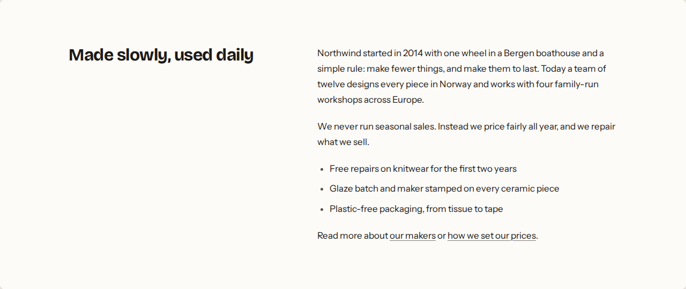
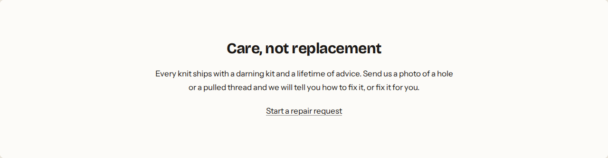
*Default story: `content` + left becomes a split with the heading in 5fr and the text in 7fr from 64rem. Centred: a single centred column.*

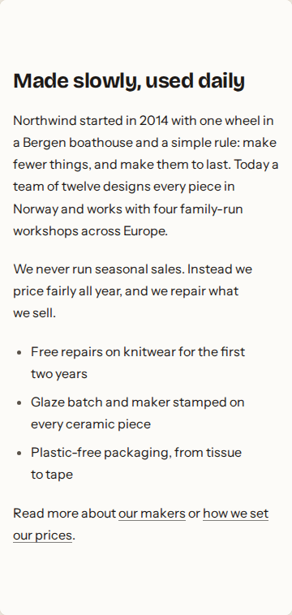
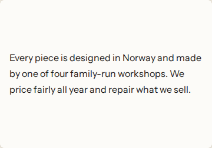
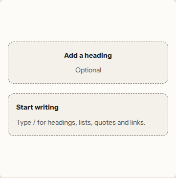
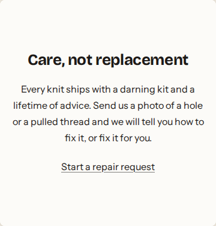
*Phone: the split stacks. Without a heading the block is a plain unlabelled wrapper. Empty: heading and "Start writing" placeholders.*

**Composition**: rich-text typography (see Article), plain layout. No `variant` field.

**Fields**

| Field id | Type | Required | Default | Notes |
|---|---|---|---|---|
| `heading` | string | no | — | Rendered as the `h2`. Without it the block is a plain `
`, not a labelled `<section>`. |
| `body` | rich-text | yes | — | Allowed: h3, h4, paragraph, bold, italic, link, lists, blockquote, inline code, divider. Tables, images and embeds are only allowed in Article, which keeps this block light. |
| `alignment` | select | yes | `left` | `left` · `center` |
| `container` | select | yes | `narrow` | `narrow` (40rem) · `content` (64rem) |

**Variants (`alignment` × `container`)**

| Combination | What changes |
|---|---|
| left × narrow | The heading stacks above the text in a 40rem column. For policies and notes. |
| left × content | **Split**: from 64rem block width the heading sits in a 5fr column and the text in 7fr (text at most 40rem), 4rem gap, top-aligned. Below 64rem it stacks. This is the default story. |
| center × narrow or content | Heading and text centred, the text column at most 44rem (40rem in narrow). Uses the centred rich-text variant: inside list markers, a centred quote mark, code left-aligned. |

**Layout**

- Heading `h2`, then the text 1.25rem below (stacked layouts).
- **Below 48rem**: 1rem gutters. `h2` 1.625rem. Text 1rem, line height 1.7.
- **48–64rem**: 1.5rem gutters. Text 1.0625rem. The split still stacks.
- **From 64rem**: 2rem gutters. The split layout, with the heading top-aligned to the first paragraph and no space under it. Centred and narrow layouts are a single column at 40rem (narrow) or 44rem (centred content).
- Type: `h2` plus the rich-text scale (the documented exception, see Article).

**States**

| State | What it looks like |
|---|---|
| Ideal | Heading, two paragraphs, a short list and links. |
| Minimal content | One paragraph, no heading. The text starts at the section's top padding. |
| Long content | The heading balance-wraps. With a long body the split heading stays at the top. It is not sticky. |
| Centred, long | The editor shows a hint above 600 characters, because long centred paragraphs are hard to read. |
| Empty (freshly inserted) | Editor placeholders "Add a heading" / "Optional" and "Start writing" / "Type / for headings, lists, quotes and links." On the live site a block with an empty body is not rendered. |

**Field → layout mapping**

- `heading` → `h2` in the head column. `body` → rich-text typography (centred variant when `alignment = center`). `alignment` + `container` → layout as in the Variants table.

**Keyboard & accessibility**

- With a heading, the block is a `<section aria-labelledby>` pointing at the `h2`. Headings inside the body start at h3.
- Links in the text are underlined, so they're not marked by colour alone, and show the standard focus ring. `Tab` moves through them in reading order and `Enter` follows them.
- Centred text is limited to short passages.

**Default content (Northwind Goods)**

- Heading "Made slowly, used daily"
- "Northwind started in 2014 with one wheel in a Bergen boathouse and a simple rule: make fewer things, and make them to last. Today a team of twelve designs every piece in Norway and works with four family-run workshops across Europe."
- "We never run seasonal sales. Instead we price fairly all year, and we repair what we sell."
- List: Free repairs on knitwear for the first two years · Glaze batch and maker stamped on every ceramic piece · Plastic-free packaging, from tissue to tape
- "Read more about [our makers] or [how we set our prices]."
- No-heading example: "Every piece is designed in Norway and made by one of four family-run workshops. We price fairly all year and repair what we sell."
- Centred example: "Care, not replacement" / "Every knit ships with a darning kit and a lifetime of advice. Send us a photo of a hole or a pulled thread and we will tell you how to fix it, or fix it for you." / link "Start a repair request".

**Acceptance criteria**

- [ ] Heading and text `text` 16.9:1 on `background`, 15.5:1 on `surface`. List markers and quote attribution `muted` 7.4:1 / 6.8:1. Quote mark `accent` 6.4:1 / 5.9:1 (computed) (1.4.3).
- [ ] Links are underlined and show the standard focus ring (1.4.1, 2.4.7).
- [ ] With a heading: a `<section>` labelled by the `h2`, body headings start at h3. Without one: a plain `
`, no landmark (1.3.1).
- [ ] The body accepts only the allowed nodes. Tables, images and embeds are rejected in this block.
- [ ] From 64rem, left × content shows the split (5fr / 7fr, 4rem gap). Below 64rem it stacks.
- [ ] Centred text caps at 44rem, and code stays left-aligned.
- [ ] 320px and 200% zoom: text reflows without horizontal scroll. Text spacing overrides don't clip anything (1.4.10, 1.4.12).
- [ ] No motion. The only hover effect is the link underline change.

**Do / Don't**

- Do use `content` + left for about-us style statements. The split looks good at a glance on desktop.
- Do keep centred text to one or two short paragraphs.
- Don't paste formatted text from a word processor with custom colours or sizes. The rich-text field strips them.
- Don't use Rich text for dated stories. Use Article, which adds the meta line, author and structured data.

---

## Commerce

Commerce blocks show data from the commerce backend (products, prices, inventory, carts, orders). Their CMS fields only configure the block and add copy. Every commerce block keeps to at most three font sizes: one heading size, 1rem and 0.875rem. Inside these blocks, the in-between sizes that some core components use (0.8125rem, 0.9375rem) snap to 0.875rem, and product and content card titles snap to 1rem. Large buttons use 1rem text.

Shared parts used by several commerce blocks:

- **Product grid**: 2 equal columns below 48rem block width, with gaps of 2rem (rows) by 1rem (columns). From 48rem: 3 columns (or 2 when the block asks for 2), gaps 3rem by 1.5rem. From 64rem: 4 columns when the block asks for 4. Each cell holds one Product card. Cards keep their column width when there are fewer cards than columns.
- **Progress bar**: 0.375rem tall, `radius-full`, track `surface-strong` with a 1px inset `border` line, fill `primary` (or `success`). The fill width animates over `duration-base` with `ease-out` (instant with reduced motion). It is decorative: it is always hidden from assistive technology and always paired with a text equivalent.

---

### Collection grid · `collection-grid`

Shows a collection's products as a filterable, sortable card grid, with a filter sidebar on desktop and a filter drawer on smaller block widths. Product data, filter values, counts and prices come from the commerce backend.

**Container** `wide` (80rem) · **Section background** default none · **Section spacing** 1.5rem top (it follows a Collection header closely), `section-md` bottom.

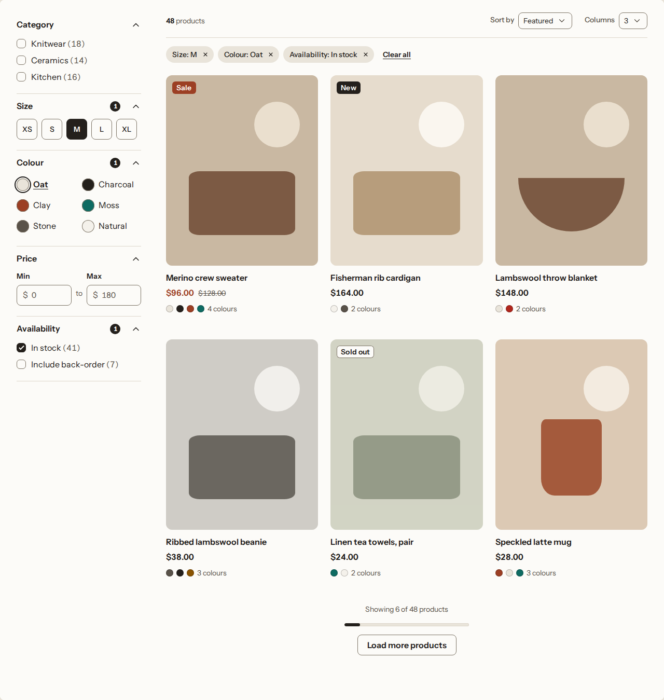
*Desktop: sticky filter sidebar (Category, Size, Colour, Price, Availability), toolbar with count, Sort by and Columns, three active chips with Clear all, 3-column grid, "Showing 6 of 48 products", progress bar and Load more products.*

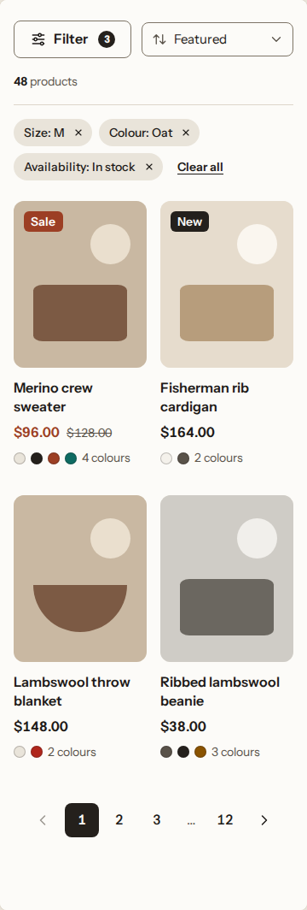
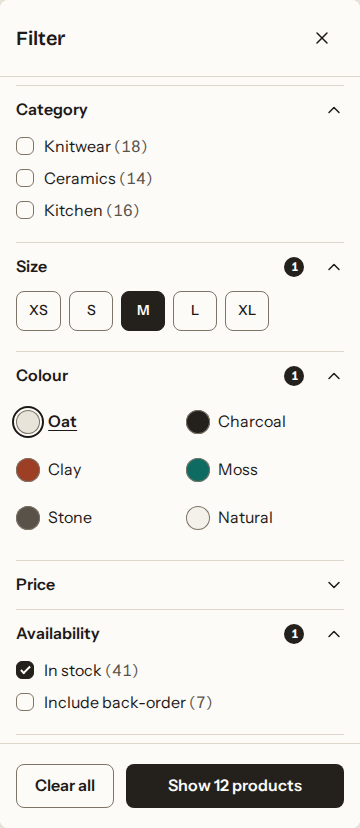
*Mobile: the Filter (3) button and the sort select share the top row; chips wrap; the grid is 2 columns; Pagination closes the list. The drawer shows the same filter groups with a sticky foot: Clear all and Show 12 products.*

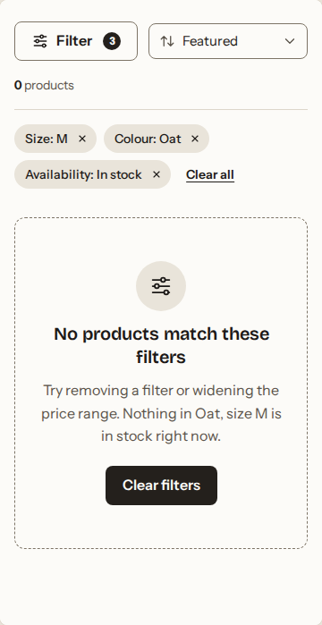
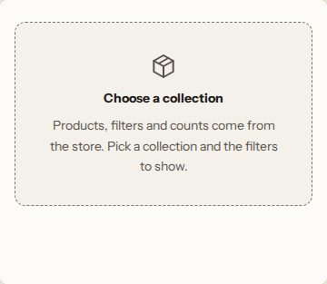
*States: no products match the filters (chips stay, Clear filters button); freshly inserted with no collection bound (editor placeholder "Choose a collection").*

Uses: Product card (with Badge, Price and swatch summary), Button (outline for Filter and Load more, primary for Show N products and Clear filters, link style for Clear all and Show all, ghost icon for close), Select (sm for Sort by and Columns on desktop; md with a leading sort icon on mobile), Checkbox (Category, Availability, and under each colour dot), Range slider (the price range, with its own typed min and max fields), removable chips (the chip used by Multi-select), count badge, Drawer, Pagination, Empty state, Skeleton, Progress bar.

**Fields**

| Field id | Type | Required | Default | Notes |
|---|---|---|---|---|
| `scope` | select | no | `collection` | `collection` · `catalogue`. What the grid lists: one collection, or every product in the store (the All products page). A block-level field rather than a meaning overloaded onto an empty `collection` — empty already means "take it from the route", which is what a collection template relies on. In `catalogue` scope the Collection filter group really filters; in `collection` scope the catalogue cannot intersect two collections, so that group is hidden. |
| `collection` | link | yes | bound on the collection template | The collection to list. Binds automatically on a collection template. Ignored when `scope` is `catalogue`. |
| `variant` | select | yes | `sidebar` | `sidebar` · `drawer-only` |
| `columns` | select | yes | `3` | `2` · `3` · `4`. Default desktop column count. Shoppers can change it with the Columns select. |
| `pageSize` | select | yes | `24` | `12` · `24` · `48` |
| `paginationStyle` | select | yes | `load-more` | `load-more` · `pages` |
| `sortOptions` | list | no | Featured, Best selling, Price low to high, Price high to low, Newest | Which sort options to offer, in order. |
| `filters` | list | no | Category, Options, Price, Availability | Filter groups, in order. `options` is one row for all of them, so the seeded five groups come from four rows. |
| `filters[].source` | select | yes | — | `category` · `collection` · `options` (one group per variant option the store has, labelled and ordered by the store — a key with no values draws none) · `option:<key>` (one named option; wins over `options` for that key, for renaming it or pinning where it sits) · `price` · `availability` |
| `filters[].label` | string | no | the source's name | Overrides the group title. |
| `filters[].collapsed` | bool | no | off | Start closed. A group with an active value always starts open. |
| `priceSlider` | bool | no | on | Off falls the price group back to the two typed fields alone, for a store whose prices sit in a few tight clusters a track cannot separate. A block-level field rather than one on the price `filters[]` row: a new child under an existing list item forces a block version bump, which retires every author's configured filter list. |
| `priceStep` | int | no | one unit of the store currency (ISK 100, USD 1) | The price slider's `step`, in whole major units — the URL carries nothing finer. At least 1. |
| `showColumnSelect` | bool | no | on | Desktop only (from 64rem block width). |
| `emptyTitle` | string | no | "No products match these filters" | |
| `emptyText` | text | no | "Try removing a filter or widening the price range." | The block appends a sentence naming the active filters. |

**Variants**

| variant | What changes |
|---|---|
| `sidebar` | From 64rem block width, filters sit in a 15rem sticky sidebar to the left of the grid. Below 64rem they open in the filter drawer from the **Filter (n)** button. |
| `drawer-only` | Filters open in the drawer at every width, so the grid gets the full width. For small catalogues or editorial pages. |

**Layout**

- **Below 48rem**: 1rem gutters. A top bar, 2-column grid (`auto | 1fr`, 0.75rem gap, 1rem below it): the **Filter** outline button (auto width, adjustments icon, the word "Filter", then a count badge 0.25rem after the word), 2.75rem tall (`target-touch`); and the sort Select filling the rest of the row, 2.5rem (`control-height`), weight 600 value text, a sort icon inside the trigger (text starts 2.5rem in), and a visually hidden "Sort by" label. Under the bar, the toolbar shows only the result count, with 1rem padding below and a 1px `border` rule. Active chips follow 1rem lower, wrapping with 0.5rem gaps, and the **Clear all** link button sits 0.5rem after the last chip. The results start 1.5rem below. The grid is always 2 columns, gaps 2rem by 1rem. Pagination or Load more sits 3rem below the grid.
- **Filter drawer (below 64rem, or always in `drawer-only`)**: a right-hand Drawer, `min(24rem, 100%)` wide. Head: "Filter" title (1.25rem heading font) and a close icon button, 1rem side padding. Body: 0.5rem × 1rem padding, the filter groups as disclosures, each trigger at least 3rem tall. Sticky foot, 2 columns (`auto | 1fr`), 1rem side padding: **Clear all** (outline, auto width) and **Show 12 products** (primary, fills the rest). The number in the button is the live count for the pending selection.
- **48–64rem**: as below 48rem, with 1.5rem gutters. The grid uses `columns`, capped at 3 (the 4-column setting shows 3 here). Grid gaps 3rem by 1.5rem.
- **From 64rem**: a `15rem | 1fr` layout with a 3rem gap, aligned to the top. The sidebar is sticky 1.5rem from the top of the viewport. The mobile top bar is hidden. The toolbar is a wrapping row: the count on the left; on the right, **Sort by** and **Columns** Selects at size sm (2rem, `control-height-sm`), each with a visible `muted` 0.875rem label (weight 500) to its left, 0.5rem apart, the two controls 1.5rem apart. The toolbar has 1rem padding below and a `border` rule. Chips follow 1rem below the rule, then the grid 1.5rem further down. The Columns select appears only from 64rem and only when `showColumnSelect` is on.
- **Filter groups (sidebar and drawer share them)**: each group has a `border` rule below it (the first also above it). The trigger is a full-width button at least 3rem tall, 0.5rem vertical padding, 1rem text weight 600, left-aligned, with the count badge ("1") pushed to the right 0.5rem before a chevron. The chevron turns 180° when the group is open (`duration-base`, `ease-out`). The open panel has 1.25rem bottom padding; its options are 0.5rem apart.
  - **Category, Collection and Availability**: Checkboxes with 1rem labels and the count "(18)" in `muted`, tabular figures. A value the store counts 0 of is shown disabled (dimmed, not operable), never hidden — counts are computed without that group's own filter applied, so a 0 means another group rules it out. A value the shopper has already ticked is never disabled. Availability offers the two values the backend counts, **In stock** and **Out of stock**.
  - **Size**: pill checkboxes in a wrapping row, 0.5rem gaps, each 2.5rem tall and at least 2.75rem wide (0 0.75rem padding). In the desktop sidebar they shrink to 2.5rem × 2.5rem minimum (0 0.5rem padding).
  - **Colour**: a 2-column grid (gaps 0.25rem × 0.75rem). Each row is at least 2.75rem tall (2.25rem in the desktop sidebar): a 1.5rem dot in the colour, outlined by a 1px inset `border-strong` line, then the colour name 0.5rem to its right. A real checkbox sits over the dot.
  - **Price**: a Range slider across the full group width with its `inputs` row on, so the span can be dragged or typed. Its `min` and `max` are the collection's own price bounds from the backend (not 0 and a round number), its `step` is `priceStep`, and `formatValue` is the store's currency formatter, so both thumbs announce and both fields read "$1,200" rather than "1200". The legend names the store's currency by its code ("Price range in USD"), so neither field needs a currency sign of its own. With `priceSlider` off, the group is the two fields alone: a 3-column grid (`1fr | auto | 1fr`, 0.5rem gaps, bottom-aligned) of the "Min" Field, the word "to" (0.875rem `muted`) and the "Max" Field. Neither field carries a currency sign of its own — the legend names the currency for both shapes, and a literal sign is the one thing that cannot follow a store that sells in something else.
- **Load more**: centred, 3rem below the grid, items 1rem apart: "Showing 6 of 48 products" (0.875rem `muted`), the Progress bar (`min(15rem, 100%)` wide), then **Load more products** (outline).

**States**

- **Ideal**: 48 products, 3 active filters shown as chips, 6 to 24 cards, then Load more with "Showing 24 of 48 products" and the progress bar.
- **Minimal**: 1 product. The grid keeps its column widths, so the card does not stretch.
- **Long content**: card titles clamp at 2 lines. Filter labels wrap. Colour names truncate with an ellipsis inside their 2-column grid.
- **Many items**: a group with 12 or more values shows the first 8, then a "Show all 14" link button.
- **No image**: the card shows the Image placeholder at 4:5.
- **Loading**: the first load — nothing on screen yet — shows the same number of Skeleton cards as the page size, and the count reads "Updating…". Once there are results on screen, a filter, sort, column or page change never goes back to skeletons: the cards stay exactly where they are, at the same height, and **the card grid alone** breathes — its opacity eases between 0.7 and 0.9 and back, about 1.4s each way, ease-in-out, for as long as the read is on its way. Nothing is drawn over the cards and nothing is added to the page, so there is no layout shift. The count reads "Updating…" and the grid is marked busy; the cards cannot be clicked while it pulses, and the filter sidebar, the drawer, the chips, the toolbar and the count all stay at full strength and fully operable, which is what lets a shopper keep changing filters while the list is on its way. Reduced motion: no animation — the grid holds a steady 0.8 opacity instead, so the state is still visible with nothing moving. Load more keeps its own treatment: every card stays put and undimmed, the count stays a number, and only the button is busy.
- **Empty results**: the Empty state in the results area (0.5rem below the chips): adjustments icon in a 3.5rem `surface-strong` circle, the title, advice that names the active filters ("Try removing a filter or widening the price range. Nothing in Oat, size M is in stock right now."), and a **Clear filters** primary button. The chips stay visible and the count reads "0 products".
- **Sold out card**: outline "Sold out" badge and a faded image. Never shown by colour alone.
- **Empty (freshly inserted)**: an editor placeholder with a box icon: "Choose a collection", "Products, filters and counts come from the store. Pick a collection and the filters to show." On the live site the block always has a bound collection.

**Field → layout mapping**

`collection` → cards, counts and filter values · `priceSlider` → the price Range slider or its two-field fallback · `priceStep` → the slider's step · `columns` → grid columns · `pageSize` → cards per page or per Load more step · `paginationStyle` → Pagination or the Load more group · `sortOptions` → Sort options · `filters[]` → filter groups (sidebar and drawer) · each active value → a chip in the active-filter list · `showColumnSelect` → the Columns select · `emptyTitle` / `emptyText` → Empty state.

**Keyboard & accessibility**

- The root is a `<section>` labelled with the collection name ("Winter knitwear products"). The grid has a visually hidden `h2` "Products". Card titles are `h3`. In the sidebar, the filters are an `<aside>` labelled "Filters"; each group trigger is a `<button>` inside an `h3`, with `aria-expanded` and `aria-controls`.
- Each group body is a `<fieldset>` with a visually hidden `<legend>` (Category, Collection, Size, Colour, Price range in USD, Availability — the price legend names whichever currency the store publishes, and reads "Price range" for a store that publishes none). Each group's count badge has the accessible name "1 selected".
- Colour filters are real checkboxes laid over the dot. The checked state shows as a 2px `text` ring around the dot (2px gap) **plus** a bold, underlined name, so it never relies on colour alone. Hover adds a 1px `border-strong` ring. The standard focus ring is drawn around the dot at a 3px offset so it clears the checked ring. Size filters are pill checkboxes: checked is a `primary` fill with `primary-contrast` text and weight 600.
- The price group is a Range slider: two `role="slider"` thumbs named "Minimum price" and "Maximum price" — named explicitly, since the group's own legend is the longer "Price range in USD" — with each thumb's `aria-valuetext` formatted as a price. Its typed fields take the same two names. Dragging a thumb is never the only way to set a price: the arrow keys move it, and the fields accept an exact figure.
- The result count is `role="status"` with `aria-live="polite"` and is updated after filtering finishes ("12 products").
- Each chip's remove button (1.5rem circle) is labelled "Remove filter Size: M". After removing a chip, focus moves to the next chip, or to the count (programmatically focusable) when none are left. **Clear all** also moves focus to the count. The chip list is labelled "Active filters".
- The filter drawer is a native `<dialog>` opened as a modal. The **Filter** button has `aria-haspopup="dialog"`, and its count badge is labelled "3 active". Focus starts on the close button ("Close filters", marked autofocus). `Esc` closes the drawer, clicking the `overlay` scrim closes it, and focus returns to the Filter button. The page does not scroll behind it.
- Filtering applies live in the sidebar: the checkbox, the chips and the URL all change at once, and the read they drive waits, so changes made within 350 ms are sent as one request and a shopper can chain several ticks without the list being fetched for each. The "Updating…" state starts at the first change, before that request exists, so nothing looks unresponsive. Sort, Columns, Load more, pagination and the drawer's **Show N products** apply immediately and carry any waiting filter change with them, so that is one request too. In the drawer, results apply only when the shopper presses **Show N products**, so screen-reader users don't hear the page change underneath them; its live count follows the same 350 ms rule.
- Sort and Columns are Selects (combobox trigger + listbox): clicking the label focuses the trigger; `↓`/`↑` move; `Enter` chooses and re-sorts; `Esc` closes without changing the sort.
- Pagination is a `<nav>` labelled "Pagination", the current page has `aria-current="page"`, and the previous link at page 1 is `aria-disabled="true"` with visually hidden text "Previous page" / "Next page". On Load more, the "Showing N of M" line and progress bar are hidden from assistive technology (the count carries the number); focus stays on the button.
- Targets: buttons 2.75rem below 48rem; the mobile sort select and size pills 2.5rem; colour rows 2.75rem (2.25rem in the desktop sidebar); the sm toolbar selects 2rem; chip remove buttons 1.5rem. All are at least 1.5rem.

| Key | Action |
|---|---|
| `Tab` / `Shift+Tab` | Filter button → sort → chips → Clear all → cards → pagination / Load more. In the sidebar: group triggers and their controls in order. |
| `Enter` / `Space` | Toggle a group, check a checkbox or pill, press a button. |
| `Esc` | Close the filter drawer or an open Select. Inside an open filter group, `Esc` collapses it and returns focus to its trigger. |
| `↓` / `↑`, `Enter` | Move and choose in the Sort and Columns Selects. |
| `←` / `→` / `↑` / `↓` on a price thumb | Move that end of the price range by the slider's step (`Shift`, `PageUp` / `PageDown` for the large step; `Home` / `End` for that thumb's own limit). |

**Default content (Northwind Goods)**

Collection "Winter knitwear", 48 products. Chips: Size: M · Colour: Oat · Availability: In stock. Filter values, every one of them derived from the catalogue itself: Category Knitwear (20), Kitchen (12), Ceramics (16) · Size XS (8), S (12), M (12), L (12), XL (8) · Colour Oat, Charcoal, Clay, Moss · Price range $24 to $164 (the collection's own bounds), both thumbs at an end, step $1 · Availability In stock (44), Out of stock (4). With a Collection group added, that collection's own memberships: The winter edit (48), Winter knitwear (20), Best sellers (24). Cards: Merino crew sweater $96.00 (was $128.00, Sale) · Fisherman rib cardigan $164.00 (New) · Lambswool throw blanket $148.00 · Ribbed lambswool beanie $38.00 · Linen tea towels, pair $24.00 (Sold out) · Speckled latte mug $28.00. Empty: "No products match these filters". Load more: "Showing 6 of 48 products" · **Load more products**. Drawer: "Filter" · **Clear all** · **Show 12 products**.

**Acceptance criteria**

- [ ] Card text `text` on `background` is 16.9:1; counts, labels and "Showing…" in `muted` are 7.4:1 (1.4.3). Sale price `accent` is 6.4:1; compare-at `muted` 7.4:1. Chip text `text` on `surface-strong` is 13.8:1.
- [ ] Control boundaries (Selects, Inputs, Checkboxes, pills, outline buttons, colour dots) use `border-strong`: 4.5:1 on `background` (1.4.11). Group dividers and the toolbar rule (`border`) are decorative only.
- [ ] Badges: Sale `accent-contrast` on `accent` 6.7:1; New `primary-contrast` on `primary` 15.6:1; count badge `primary-contrast` on `primary` 15.6:1; Sold out is an outline badge with a `border-strong` edge and `text` label.
- [ ] Checked colour: 2px `text` ring plus bold underlined name. Checked size: filled pill plus weight 600. Sold out: badge word plus faded image. No state is shown by colour alone (1.4.1).
- [ ] The standard focus ring shows on every Filter button, trigger, checkbox, pill, colour dot, chip remove button, Select, card (ring around the whole card), pagination item and button (2.4.7, 2.4.11, 2.4.13).
- [ ] The filter drawer is a native modal `<dialog>`: background inert, focus contained, `Esc` and scrim click close it, focus returns to the Filter button, the page does not scroll behind it (2.1.2, 2.4.3).
- [ ] Filtering in the drawer changes nothing on the page until **Show N products** is pressed (3.2.2).
- [ ] The price thumbs cannot cross, both are reachable with `Tab` and show the focus ring, and their typed fields commit on blur or `Enter` only — never on a keystroke — clamped to the collection's bounds and to each other (2.1.1, 2.4.7, 3.2.2).
- [ ] The count is a polite status and announces "12 products" (or "0 products") after each filter change (4.1.3).
- [ ] After removing a chip, focus lands on the next chip or on the count; after Clear all, on the count. Focus is never lost to the page top (2.4.3).
- [ ] Group triggers expose `aria-expanded` and control their panel; each group is a fieldset with a legend; each chip remove button names its filter (1.3.1, 4.1.2).
- [ ] Every target is at least 1.5rem; the Filter button and drawer foot buttons are 2.75rem below 48rem (2.5.8).
- [ ] With reduced motion, the chevron turn, drawer slide and skeleton shimmer are instant (the drawer fades).
- [ ] At 320px width and at 200% zoom the top bar, chips and 2-column grid fit with no horizontal scroll and no clipped text (1.4.10, 1.4.4); text spacing overrides do not clip chips or pills (1.4.12).
- [ ] The Columns select is absent below 64rem; `columns` = 4 shows 3 columns between 48 and 64rem.
- [ ] Selected filters are kept in the URL; the back button restores them.

**Do / Don't**

- **Do** show real counts next to filter values, computed without that group's own filter applied, and show a value the count has emptied as disabled rather than hiding it. A value the shopper has selected is never disabled.
- **Do** keep selected filters in the URL so results can be shared and the back button works: one key per group (`?price=1200-4800&category=ceramics&collection=the-winter-edit&colour=oat&availability=in_stock`), the price range as a single `<min>-<max>` value.
- **Don't** apply drawer filters on every tap on mobile. Batch them behind **Show N products**.
- **Don't** mark availability with colour alone. Sold-out cards get the outline badge and a faded image.
- **Don't** use infinite scroll with no button. Load more keeps the footer reachable and the position predictable.

---

### Product detail · `product-detail`

The product page's main buy box: gallery, title, price, rating, variant pickers, quantity, add to cart, honest stock status, delivery notes and description tabs, plus a sticky buy bar on mobile. Title, price, images, variants, inventory and ratings come from the commerce backend; the CMS fields decide what the block shows and add editorial copy.

**Container** `content` (64rem) · **Section background** default none · **Section spacing** 1rem top below 48rem block width, 2rem from 48rem; `section-md` bottom.

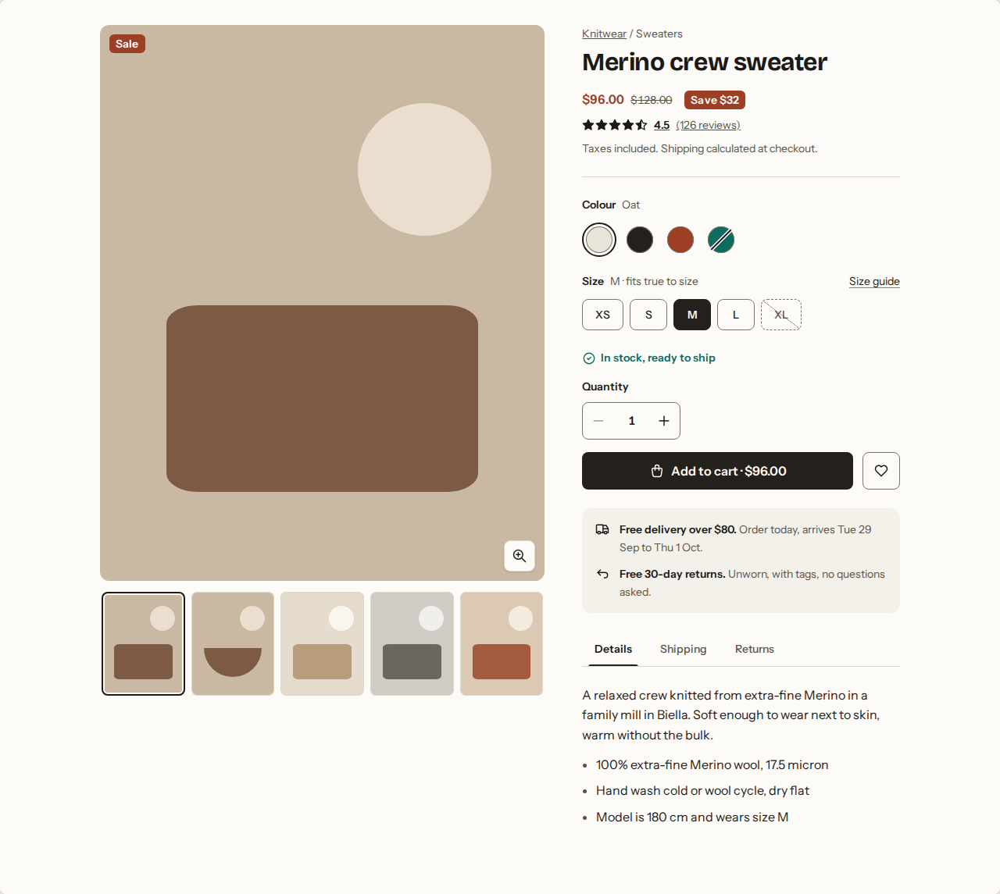
*Desktop: 7fr gallery (Sale badge, zoom button, five thumbnails, the first current) and 5fr info column (category trail, title, sale price with Save $32, rating, tax line, Colour and Size pickers with sold-out options struck through, "In stock, ready to ship", Quantity, Add to cart · $96.00, wishlist, perks panel, Details / Shipping / Returns tabs).*

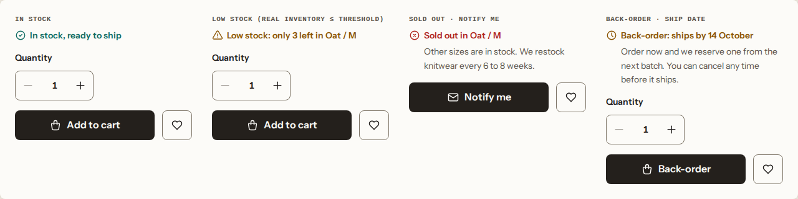
*The four stock states side by side: In stock; Low stock (real inventory at or below the threshold); Sold out with Notify me; Back-order with a ship date.*

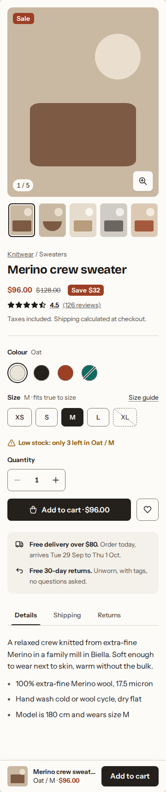
*Mobile: one column, "1 / 5" index on the image, thumbnails below, the info stack, and the Quick add bar pinned to the bottom once the main button has scrolled away. This capture shows the low-stock line.*

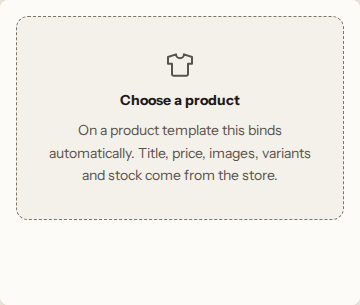
*Freshly inserted outside a product template: editor placeholder "Choose a product".*

Uses: Image (4:5 stage and thumbnails), Badge (sale, saving), Button (icon for zoom and wishlist, primary for Add to cart / Notify me / Back-order, primary in the buy bar), Lightbox, Price (sale), Rating, Variant picker (swatches and size pills), Link (category trail, Size guide), Quantity stepper, status line, Tabs, Dialog (back-in-stock sign-up).

**Fields**

| Field id | Type | Required | Default | Notes |
|---|---|---|---|---|
| `product` | link | yes | bound on the product template | Pick one by hand for a featured-product landing section. |
| `variant` | select | yes | `gallery-left` | `gallery-left` · `gallery-right` |
| `showRating` | bool | no | on | Hidden anyway when the product has fewer than 3 reviews. |
| `showQuantity` | bool | no | on | |
| `showWishlist` | bool | no | on | Off: Add to cart fills the row alone. |
| `lowStockThreshold` | select | no | `3` | `off` · `3` · `5` · `10`. "Only N left" shows only when **real** inventory is at or below this number. |
| `perks` | list | no | 2 items (below) | Delivery and returns notes under the buy button. 2 recommended. |
| `perks[].icon` | select | yes | — | `truck` · `arrow-back-up` · `leaf` · `shield-check` · `gift` |
| `perks[].title` | string | yes | — | e.g. "Free delivery over $80." |
| `perks[].text` | text | no | — | e.g. "Order today, arrives Tue 29 Sep to Thu 1 Oct." Delivery dates come from the shipping API. |
| `tabs` | list | no | Details, Shipping, Returns | |
| `tabs[].label` | string | yes | — | |
| `tabs[].body` | rich-text | yes | — | The Details tab defaults to the product description. |
| `sizeGuide` | link | no | — | Shows the "Size guide" link next to the Size legend. |
| `stickyBar` | bool | no | on | Shows the mobile buy bar. |
| `showCategory` | bool | no | on | Shows the "Knitwear / Sweaters" trail above the title. Turn it off when the page already has a Breadcrumbs block, so the trail never shows twice. |

**Variants**

| variant | What changes |
|---|---|
| `gallery-left` | Gallery 7fr on the left, info 5fr on the right. |
| `gallery-right` | Mirrored visually. Source order stays gallery then info, so the reading and focus order don't change. |

**Layout**

- **Below 48rem**: one column, 1.5rem between gallery and info. Gallery (0.75rem gaps): the main image at 4:5 with `radius-lg`; badges 0.75rem from the top-left corner (0.25rem apart); the index "1 / 5" 0.75rem from the bottom-left corner (0.875rem, tabular figures, `background` pill, 0.125rem × 0.5rem padding, `radius-full`); the zoom icon button 0.75rem from the bottom-right corner, 2.75rem, with a `border` edge and `shadow-sm` (its focus state keeps the shadow under the focus ring). Below it, a row of thumbnails sized so 5 fit exactly (0.5rem gaps), scrolling sideways (no visible scrollbar) when there are more than 5. The info stack uses 1.5rem gaps: category trail (0.875rem `muted`, links inherit the colour), title (h2 scale at 1.625rem), then 0.5rem lower a wrapping row (gaps 0.5rem × 1rem) with the price (1rem), the saving badge and the rating; the tax line (0.875rem `muted`); a `border` rule with 1.5rem above the options; Colour and Size pickers 1.25rem apart (2.75rem swatches, 2.5rem size pills); the stock line; Quantity (label, 0.5rem, stepper enlarged to 3rem to match the button); then the action row (`1fr | auto`, 0.75rem gap): **Add to cart** 3rem tall filling the row and a 3rem × 3rem wishlist outline icon button; the perks panel; the tabs.
- **Sticky buy bar (below 48rem)**: pinned to the bottom of the viewport once the main Add to cart button has scrolled out of view. 0.75rem × 1rem padding, `background`, a `border` top edge, `shadow-md`, `z-sticky`. Contents in a row with 0.75rem gaps: a 2.75rem thumbnail (`radius-sm`), a text column (0.875rem, line-height 1.35: the title on one line with an ellipsis, weight 600; then "Oat / M · $96.00"), and an **Add to cart** primary button.
- **48–64rem**: two columns, `7fr | 5fr`, 2rem gap, aligned to the top. The gallery is sticky 1.5rem from the top. The index is hidden. The buy bar is hidden.
- **From 64rem**: the same with a 3rem gap inside the 64rem container. The title uses the h2 scale at 2rem.
- **Pickers**: legend row with the legend (0.875rem, 600, selected value in `muted` 400, e.g. "Size  M · fits true to size") and, when `sizeGuide` is set, the "Size guide" link (0.875rem) at the far end; 0.75rem below it the options. Swatches: 2.75rem circles with a 3px gap and a 2px ring (transparent; `border-strong` on hover; `text` when selected). Size pills: at least 3rem wide, 2.5rem tall, 0 1rem padding, `radius-md`, `border-strong` edge; selected `primary` fill, `primary-contrast` text, weight 600.
- **Stock line**: status text 0.875rem, weight 600, 1.125rem icon, 0.375rem gap. A note (0.875rem `muted`) sits 0.25rem below it, indented 1.5rem so it lines up with the words.
- **Perks panel**: `surface`, `radius-lg`, 1rem padding, items 0.75rem apart, 0.875rem text. Each item: icon, 0.75rem, then the title (600) and the text in `muted`.
- **Tabs**: tab labels 0.875rem; panels in `text`, paragraphs and lists 0.75rem apart; bullet lists indented 1.125rem with `muted` markers, items 0.5rem apart.

**States**

- **In stock**: `success` status with the circle-check icon: "In stock, ready to ship".
- **Low stock (real inventory ≤ `lowStockThreshold`)**: `warning` status with the alert-triangle icon: "Low stock: only 3 left in Oat / M". The stepper maximum matches the inventory. Never shown for made-to-order items, and never when the threshold is `off`.
- **Sold out (selected variant)**: `danger` status with the circle-x icon: "Sold out in Oat / M", plus the note "Other sizes are in stock. We restock knitwear every 6 to 8 weeks." The quantity stepper is hidden. The main button becomes **Notify me** (mail icon) and opens the back-in-stock Dialog. Sold-out swatches and pills stay selectable, show a diagonal strike line and a dashed border, and have ", sold out" in their accessible name ("XL, sold out").
- **Back-order**: `warning` status with the clock icon: "Back-order: ships by 14 October", plus the note "Order now and we reserve one from the next batch. You can cancel any time before it ships." The button reads **Back-order**.
- **Sale**: the current price in `accent` and the compare-at price struck through in `muted`, with visually hidden "Sale price" and "Regular price" labels. The saving badge ("Save $32") is calculated from the two prices, never typed in.
- **Minimal**: one image hides the thumbnails and the index. A product with no options hides the pickers. With no reviews, the rating is hidden.
- **Long content**: the title wraps (balanced). Tab panels grow. Perks wrap. Button labels may wrap and stay centred.
- **No image**: the Image placeholder at 4:5; thumbnails hidden.
- **Empty (freshly inserted)**: outside a product template, an editor placeholder with a shirt icon: "Choose a product", "On a product template this binds automatically. Title, price, images, variants and stock come from the store."

**Field → layout mapping**

`product.images` → main image + thumbnails · `product.title` → the `h1` · `product.price` / `compareAt` → Price + saving badge · `product.options` → Variant picker fieldsets · inventory → stock line, stepper maximum and main button label · `showRating` → Rating · `showQuantity` → Quantity stepper · `showWishlist` → wishlist button · `lowStockThreshold` → low-stock rule · `perks[]` → perks panel · `tabs[]` → Tabs · `sizeGuide` → Size guide link · `stickyBar` → buy bar · `showCategory` → category trail.

**Keyboard & accessibility**

- The product title is the page's only `h1` (styled at h2 scale). The block is a `<section>` labelled by it. The gallery is `role="group"` labelled "Product images"; the info column is labelled "Product information". The category trail is a `<nav>` labelled "Breadcrumb".
- Thumbnails are buttons labelled "Show image 2 of 5: Merino crew sweater worn, front view". The current one has `aria-current="true"` and a 2px `text` inset ring with a 2px `background` gap (selection shown by shape as well as colour); others have a 1px `border` inset line, `border-strong` on hover (`duration-fast`).
- The zoom button ("Zoom image 1 of 5", `aria-haspopup="dialog"`) opens the Lightbox, a native `<dialog>` opened as a modal: `←`/`→` move between images anywhere inside it, `Esc` closes it, and focus returns to the zoom button.
- **Notify me** opens the back-in-stock Dialog (native modal `<dialog>`): focus goes to its email field, `Esc` closes it, focus returns to Notify me.
- Variant pickers are `<fieldset>` + `<legend>` radio groups whose legend includes the selection ("Colour Oat", "Size M · fits true to size"). Arrow keys move between options. Sold-out options can still be selected so shoppers can sign up for notifications.
- The stock line is `role="status"` with `aria-live="polite"` and is announced when the variant changes. Every stock state pairs an icon with words.
- The rating is labelled "Rated 4.5 out of 5, 126 reviews" and links to the reviews.
- The quantity stepper has the label "Quantity" and buttons labelled "Decrease quantity" and "Increase quantity". Its maximum follows inventory; at the limits the buttons are `aria-disabled`.
- The wishlist button is a toggle (`aria-pressed`) labelled "Save Merino crew sweater to wishlist".
- Tabs: `←`/`→` move between tabs (wrapping), `Home` and `End` jump to the first and last; only the selected tab is in the tab order; each panel has `tabindex="0"`.
- The sticky buy bar is a `region` labelled "Quick add". While the main Add to cart button is on screen the bar is hidden (not rendered), so it is absent from the accessibility tree and tab order and never duplicates the control.
- Primary actions are at least 2.75rem below 48rem; Add to cart is 3rem at every width.

| Key | Action |
|---|---|
| `Tab` | Gallery thumbnails → zoom → category links → rating link → Colour group → Size group → Size guide → stepper → Add to cart → wishlist → tabs → panel. |
| `←` `→` `↑` `↓` | Move the selection within a Colour or Size radio group. |
| `Enter` / `Space` | Show a thumbnail, open zoom, press Add to cart / Notify me, toggle the wishlist. |
| `←` / `→`, `Home` / `End` | Move between tabs. |
| `Esc` | Close the Lightbox or the back-in-stock Dialog. |

**Default content (Northwind Goods)**

Knitwear / Sweaters · **Merino crew sweater** · $96.00 (was $128.00) · Save $32 · 4.5 (126 reviews) · "Taxes included. Shipping calculated at checkout." · Colour: Oat, Charcoal, Clay, Moss (sold out) · Size: XS, S, M, L, XL (XL sold out) · "In stock, ready to ship" · Quantity 1 · **Add to cart · $96.00** · Perks: **Free delivery over $80.** Order today, arrives Tue 29 Sep to Thu 1 Oct. · **Free 30-day returns.** Unworn, with tags, no questions asked. · Tabs: Details, Shipping, Returns. Details: "A relaxed crew knitted from extra-fine Merino in a family mill in Biella. Soft enough to wear next to skin, warm without the bulk." · 100% extra-fine Merino wool, 17.5 micron · Hand wash cold or wool cycle, dry flat · Model is 180 cm and wears size M. Buy bar: Merino crew sweater · Oat / M · $96.00 · **Add to cart**.

**Acceptance criteria**

- [ ] Title and body `text` on `background` 16.9:1; category, tax line, legend values and notes `muted` 7.4:1; perks text `muted` on `surface` 6.8:1 (1.4.3).
- [ ] Sale price `accent` 6.4:1; saving and sale badges `accent-contrast` on `accent` 6.7:1; Add to cart `primary-contrast` on `primary` 15.6:1.
- [ ] Stock colours on `background`: `success` 6.2:1, `warning` 6.1:1, `danger` 6.5:1, each with its own icon and words (1.4.1).
- [ ] Swatch and pill boundaries, the stepper and the wishlist button use `border-strong` (4.5:1); the selected swatch ring is `text`; the selected pill is a `primary` fill plus weight 600; the current thumbnail has a 2px `text` ring (1.4.11, 1.4.1).
- [ ] Sold-out options are selectable, struck through, dashed, and their accessible name ends in ", sold out". No sold-out variant is pre-selected.
- [ ] "Only N left" appears only when real inventory is at or below `lowStockThreshold`; there are no countdown timers, viewer counts or invented urgency anywhere in the block.
- [ ] The standard focus ring shows on every thumbnail, the zoom button (with its shadow kept), swatch, pill, link, stepper button (inset ring), button and tab (inset ring) (2.4.7, 2.4.11, 2.4.13).
- [ ] Lightbox and back-in-stock Dialog are native modal `<dialog>`s: inert background, `Esc` closes, focus returns to the opener, no page scroll behind (2.1.2, 2.4.3).
- [ ] Changing the variant updates the stock line, which is announced politely (4.1.3); it does not move focus (3.2.2).
- [ ] The buy bar appears only below 48rem block width and only while the main button is off screen; when visible it does not cover focused content (2.4.11) and it is absent from the accessibility tree otherwise.
- [ ] Add to cart comes before the tabs in reading order; the price and stock status sit next to it (1.3.2).
- [ ] All targets at least 1.5rem; Add to cart, Notify me, wishlist and stepper 3rem; zoom 2.75rem (2.5.8).
- [ ] With reduced motion, thumbnail and ring transitions are instant; the Lightbox fades instead of sliding.
- [ ] At 320px and at 200% zoom nothing overlaps or scrolls sideways except the thumbnail strip; long titles and button labels wrap (1.4.10, 1.4.12).
- [ ] `gallery-right` mirrors visually while keeping gallery-then-info reading order.

**Do / Don't**

- **Do** show "Only N left" only from live inventory, and never for made-to-order items.
- **Do** keep the price and the stock status next to the button so shoppers don't have to scroll to check them.
- **Don't** add countdown timers, "12 people are viewing this", or made-up urgency. The block has no fields for them on purpose.
- **Don't** pre-select a sold-out variant, and don't hide sold-out options. Show them struck through so the size range stays clear.
- **Don't** put the add to cart button under the tabs. It must come before the description in reading order.

---

### Product carousel · `product-carousel`

A horizontally scrolling row of product cards, such as "You may also like" or "Recently viewed", with a heading, a view-all link, arrows and a counter. Use a Collection grid when shoppers need to filter or see everything at once.

**Container** `wide` (80rem) · **Section background** default none (`surface` recommended for recently viewed) · **Section spacing** `section-md`.

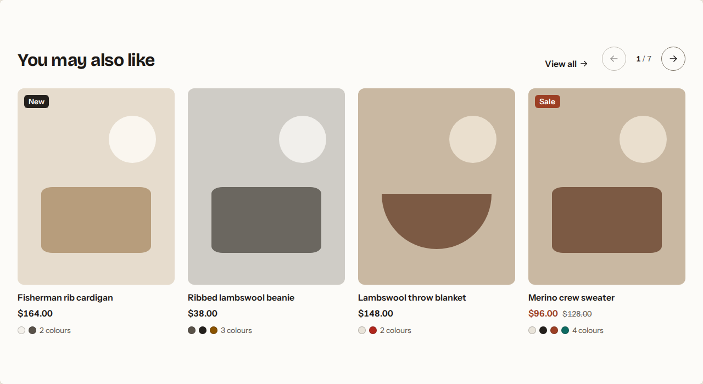
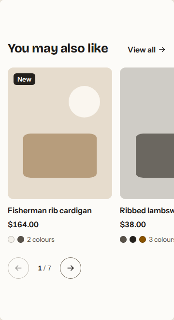
*Related products: heading, View all, and prev / "1 / 7" / next on one row at desktop; at mobile the next card peeks at the screen edge and the controls sit under the track. The previous arrow is disabled at the start.*

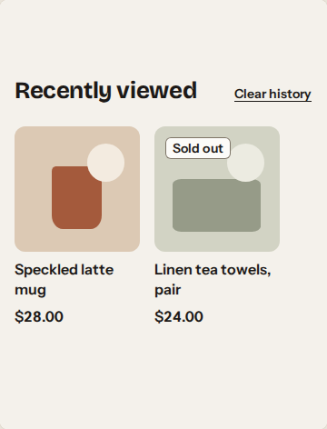
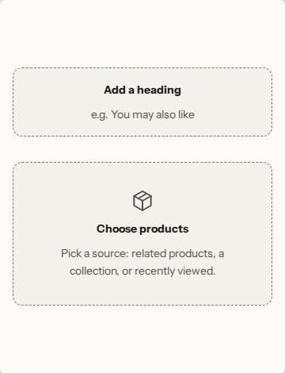
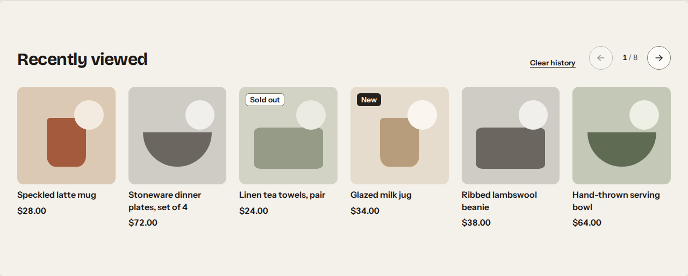
*Recently viewed on `surface`: compact 1:1 cards with title and price, Clear history instead of View all; with 2 items everything fits, so the controls are hidden. Freshly inserted: editor placeholders "Add a heading" and "Choose products".*

Uses: Product card (4:5 or compact 1:1, with Badge, Price and swatch summary), Carousel controls (arrows + counter), Link (standalone, with arrow icon), Button (link style for Clear history), Skeleton.

**Fields**

| Field id | Type | Required | Default | Notes |
|---|---|---|---|---|
| `heading` | string | yes | — | e.g. "You may also like" |
| `variant` | select | yes | `related` | `related` · `recently-viewed` · `collection` |
| `source` | link | no | — | For `collection`: the collection to pull from. `related` uses the backend recommendations for the current product. `recently-viewed` uses the shopper's local history. |
| `limit` | select | no | `8` | `4` · `8` · `12` |
| `viewAll` | link | no | — | Label and URL, e.g. "View all" → /collections/knitwear. Hidden in `recently-viewed`. |
| `showSwatches` | bool | no | on (off in `recently-viewed`) | |
| `background` | select | no | `none` | `none` · `surface` |

**Variants**

| variant | What changes |
|---|---|
| `related` / `collection` | 4:5 cards with swatches. 4 visible from 64rem, 3 from 48rem, about 1.5 below 48rem. Shows the View all link. |
| `recently-viewed` | Compact 1:1 cards with title and price only (0.5rem gap inside the card). 6 visible from 64rem, 4 from 48rem, about 2.4 below 48rem. A **Clear history** link button replaces View all. The block is hidden when the history is empty. |

**Layout**

- **Below 48rem**: a grid with the heading (h2, 1.625rem) and the link on the first row, aligned to their bottom edge (1rem between them). The track sits 1.5rem below. Slides are 66% of the track wide (42% for `recently-viewed`), 1rem apart. The track bleeds to the block edge (negative gutter margins with matching inline padding and scroll padding), so the peeking card reaches the edge of the screen. The controls sit 1.5rem under the track on the left: previous arrow, counter "1 / 7" (at least 3rem wide), next arrow, 0.5rem apart, each arrow 2.75rem.
- **48–64rem**: one row with heading | link | controls, 1.5rem apart; the track starts 2rem lower. Three slides per view, 1.5rem gaps, no edge bleed (four for `recently-viewed`).
- **From 64rem**: four slides per view (six for `recently-viewed`). The arrows are disabled at each end.

**States**

- **Ideal**: 7 products, the first slide in view, the previous arrow disabled.
- **Minimal**: when every product fits in view, the controls are hidden and the track doesn't scroll. With fewer than 2 products the block doesn't render.
- **Long content**: card titles clamp at 2 lines. A long heading wraps next to the link.
- **Many items**: `limit` caps the count at 12. The counter shows the index of the first slide in view.
- **No image**: the Image placeholder at the card's ratio.
- **Loading**: 4 Skeleton cards at the slide widths, so the layout doesn't shift.
- **Empty (freshly inserted)**: editor placeholders "Add a heading" ("e.g. You may also like") and "Choose products" ("Pick a source: related products, a collection, or recently viewed.").

**Field → layout mapping**

`heading` → the `h2` · `viewAll` → the link beside it · products (from `variant` + `source`, capped by `limit`) → slides · `variant` = `recently-viewed` → compact cards + Clear history · `showSwatches` → card swatch rows · `background` → section ground.

**Keyboard & accessibility**

- The block is a `<section>` labelled by the `h2`. The carousel wrapper has `role="region"`, `aria-roledescription="carousel"` and the same label.
- The track is a focusable list (`tabindex="0"`) labelled "You may also like, scroll for more". `←` and `→` on the focused track move one slide. Each slide is labelled "3 of 7" with `aria-roledescription="slide"`.
- The arrows are real buttons labelled "Previous products" and "Next products", disabled at the ends. If an arrow becomes disabled while it has focus, focus moves to the other arrow. The counter is `aria-hidden`, because the slide labels carry the position.
- Cards use a stretched title link; the focus ring wraps the whole card. `Tab` moves through every card in order, and the track scrolls to keep the focused card in view (scroll padding matches the gutter).
- There is no autoplay and no looping. Motion is smooth scrolling only, instant under reduced motion.
- The View all link has visually hidden context ("View all knitwear"). Swatch rows read "Available in 2 colours".

| Key | Action |
|---|---|
| `Tab` | Heading link → arrows → track → each card link in order. |
| `←` / `→` | On the focused track: previous / next slide. |
| `Enter` / `Space` | Press an arrow; `Enter` follows a card link. |

**Default content (Northwind Goods)**

"You may also like" · View all · Fisherman rib cardigan $164.00 (New) · Ribbed lambswool beanie $38.00 · Lambswool throw blanket $148.00 · Merino crew sweater $96.00 (was $128.00, Sale) · Speckled latte mug $28.00 · Hand-thrown serving bowl $64.00 · Walnut serving board $58.00. Recently viewed: Speckled latte mug $28.00 · Stoneware dinner plates, set of 4 $72.00 · Linen tea towels, pair $24.00 (Sold out) · Glazed milk jug $34.00 (New) · Ribbed lambswool beanie $38.00 · Hand-thrown serving bowl $64.00 · …, and **Clear history**.

**Acceptance criteria**

- [ ] Heading and card text `text` 16.9:1 on `background` and 15.5:1 on `surface`; counter and swatch labels `muted` 7.4:1 / 6.8:1; sale price `accent` 6.4:1 (1.4.3).
- [ ] Arrow outlines `border-strong`: 4.5:1 on `background`, 4.1:1 on `surface` (1.4.11). Disabled arrows (45% opacity) are disabled buttons.
- [ ] The standard focus ring shows on the link, both arrows, the track and every card (2.4.7, 2.4.11).
- [ ] `←`/`→` on the focused track move one slide; `Tab` reaches every card and scrolls it into view (2.1.1, 2.4.11).
- [ ] Focus never stays on a disabled arrow (2.4.3).
- [ ] No autoplay, no loop; with reduced motion scrolling is instant (2.2.2).
- [ ] Region, slide roles and "n of N" labels are exposed; the counter is hidden from assistive technology (1.3.1, 4.1.2).
- [ ] Arrows are 2.75rem at every width; the link and Clear history are at least 1.5rem (2.5.8).
- [ ] When all products fit, the controls are not rendered; with fewer than 2 products the block renders nothing.
- [ ] At 320px and 200% zoom the row scrolls inside its track only; the page has no horizontal scroll (1.4.10).
- [ ] `related` excludes the product being viewed and sold-out items.

**Do / Don't**

- **Do** let the next card peek on mobile, so shoppers can see there is more to scroll.
- **Do** leave out the product being viewed and any sold-out items from `related`.
- **Don't** autoplay or loop. Shoppers scroll this row themselves.
- **Don't** use dots for product rows. The counter and arrows scale to 12 items; dots don't.

---

### Collection header · `collection-header`

Opens a collection page with a breadcrumb, the collection title, an optional clamped description with Read more, the product count, and an optional image or sub-collection links. For a title over a photo, use the Hero block instead.

**Container** `wide` (80rem) · **Section background** default none · **Section spacing** 1.5rem top and 2rem bottom below 48rem block width; 2rem top and 3rem bottom from 48rem.

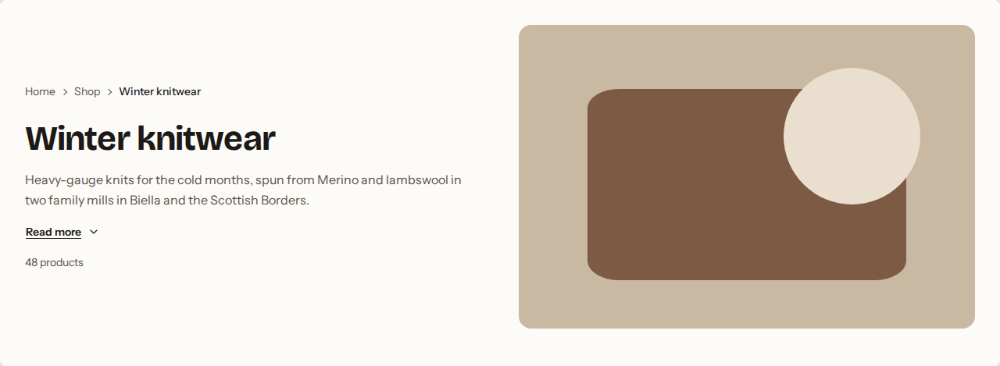
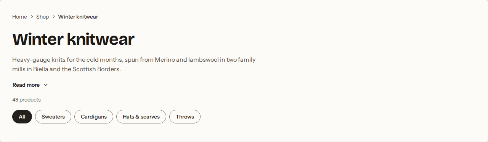
*Desktop: `image` variant (text left, 3:2 image right) and `text-only` variant with sub-collection pills and a bottom rule.*

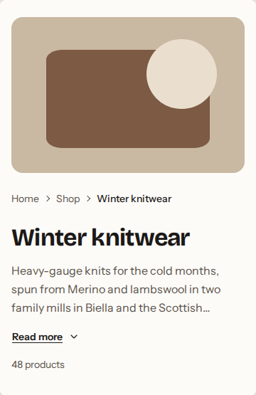
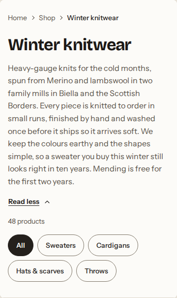
*Mobile: the image comes first; the description is clamped to 3 lines; expanded, the button reads Read less with the chevron pointing up.*

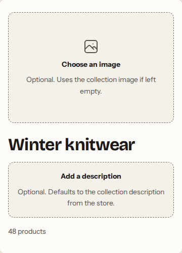
*Freshly inserted: title and count come from the store; optional placeholders "Choose an image" and "Add a description".*

Uses: Breadcrumb, Image (3:2, `radius-xl`), Button (link style with chevron, as a disclosure), pill links.

**Fields**

| Field id | Type | Required | Default | Notes |
|---|---|---|---|---|
| `collection` | link | yes | bound on the collection template | |
| `variant` | select | yes | `image` | `image` · `text-only` |
| `title` | string | no | the collection title | Overrides the collection title. |
| `description` | rich-text | no | the collection description | The first sentence or two show; the rest sits behind Read more. |
| `image` | media | no | the collection image | `image` variant only. Needs alt text, or is marked decorative. |
| `showCount` | bool | no | on | "48 products", live count. |
| `showBreadcrumb` | bool | no | on | Turn off when the page has a Breadcrumbs block. |
| `subcollections` | list | no | — | Pill links under the text, e.g. Sweaters, Cardigans. |
| `subcollections[].label` | string | yes | — | |
| `subcollections[].link` | link | yes | — | |

**Variants**

| variant | What changes |
|---|---|
| `image` | From 48rem: two equal columns, text on the left (vertically centred) and a 3:2 image with `radius-xl` on the right. Below 48rem the image comes first, above the text. |
| `text-only` | A single text column (max 48rem) with a 1px `border` rule under the block. For collections without photography, or pages where the grid should start high. |

**Layout**

- **Below 48rem**: 1rem gutters. The image (3:2, `radius-xl`, `surface-strong` frame) comes first, 1.5rem above the text. The text stack uses 1rem gaps: breadcrumb (0.875rem, 0.5rem extra space below it), the `h1` (2.125rem), the description in `muted` (max 60 characters per line) clamped to 3 lines, the **Read more** link button (0.875rem, 1rem chevron), then a wrapping row (gaps 0.75rem × 1.25rem) with the count (0.875rem `muted`, tabular figures) and the sub-collection pills (wrapping, 0.5rem gaps, 2.75rem tall).
- **48–64rem**: the `image` variant splits into `1fr | 1fr` with a 3rem gap, centred vertically. Pills are 2.25rem tall.
- **From 64rem**: the same inside 80rem. The `h1` is 2.75rem. The text column is capped at 40rem (48rem in `text-only`).
- **Pills**: 0 1rem padding, `radius-full`, 1px `border-strong` edge, 0.875rem weight 500 `text`. Hover: `text` edge and a light tint (`duration-fast`). Current: `primary` fill, `primary-contrast` text, weight 600.

**States**

- **Ideal**: title, a 1 to 2 sentence lead, the rest behind Read more, 48 products, image.
- **Expanded**: the rest of the description shows inline, the button reads **Read less** and the chevron points up (turns 180° over `duration-base`).
- **Minimal**: title and count only. With no description there is no Read more button.
- **Long content**: the title wraps (balanced). The description stays clamped at 3 lines until expanded.
- **No image**: the `image` variant falls back to the collection image; if that is missing too, it renders as `text-only`, never an empty frame.
- **Empty (freshly inserted)**: the title and count come from the store. Optional placeholders read "Choose an image" ("Optional. Uses the collection image if left empty.") and "Add a description" ("Optional. Defaults to the collection description from the store.").

**Field → layout mapping**

`title` → `h1` and the last breadcrumb item · `description` → the lead (visible) and the rest (controlled by Read more) · `showCount` → count · `image` → media · `showBreadcrumb` → Breadcrumb · `subcollections[]` → pill list.

**Keyboard & accessibility**

- The block is a `<header>` labelled by the page's only `h1`. The breadcrumb is a `<nav>` labelled "Breadcrumb", and the current page has `aria-current="page"`.
- **Read more** is a `<button>` with `aria-expanded` and `aria-controls` pointing at the rest of the text. Its label switches between "Read more" and "Read less". `Esc` on the button (or inside the expanded text) collapses it and keeps focus on the button. The 3-line clamp follows the button's state, so the visual and the accessibility tree stay in step. The button renders only when the text is longer than the clamp.
- Sub-collection pills are a list of links. The current one has `aria-current="page"` and a filled `primary` style **plus** bold weight.
- The count is plain text, not live: the grid below announces filter changes.
- The image has alt text when it shows products, or is marked decorative when it is mood only.

| Key | Action |
|---|---|
| `Tab` | Breadcrumb links → Read more → pill links. |
| `Enter` / `Space` | Toggle Read more / Read less. |
| `Esc` | Collapse the expanded description. |

**Default content (Northwind Goods)**

Home › Shop › Winter knitwear · **Winter knitwear** · "Heavy-gauge knits for the cold months, spun from Merino and lambswool in two family mills in Biella and the Scottish Borders. Every piece is knitted to order in small runs, finished by hand and washed once before it ships so it arrives soft. We keep the colours earthy and the shapes simple, so a sweater you buy this winter still looks right in ten years. Mending is free for the first two years." · 48 products · All (current), Sweaters, Cardigans, Hats & scarves, Throws.

**Acceptance criteria**

- [ ] Title `text` 16.9:1; description, count and breadcrumb `muted` 7.4:1 on `background`; Read more `text` with an underline (1.4.3).
- [ ] Pill edges `border-strong` 4.5:1 (1.4.11); the current pill is `primary-contrast` on `primary` 15.6:1 plus weight 600 and `aria-current` (1.4.1).
- [ ] No text sits over the image.
- [ ] The standard focus ring shows on breadcrumb links, Read more and pills (2.4.7, 2.4.11).
- [ ] Read more exposes `aria-expanded`, controls the hidden text, and appears only when the text overflows the clamp; `Esc` collapses it (4.1.2, 2.1.1).
- [ ] Only one `h1` on the page, and it labels the header (1.3.1).
- [ ] Pills are 2.75rem tall below 48rem and 2.25rem from 48rem; Read more at least 1.5rem (2.5.8).
- [ ] With reduced motion the chevron turn and pill transitions are instant.
- [ ] At 320px and 200% zoom the title wraps, the clamp holds, pills wrap; no horizontal scroll (1.4.10, 1.4.12).
- [ ] With no image and no collection image, the block renders as `text-only`.
- [ ] The count always comes from the store.

**Do / Don't**

- **Do** keep the visible lead short. Shoppers came for the products, and the grid should appear above the fold on desktop.
- **Do** write alt text for the image when it shows products. Mark it decorative when it's just mood.
- **Don't** put text over the image. This block has no scrim variant; use the Hero block for that.
- **Don't** fake the count ("100+ products"). It always comes from the store.

---

### Cart drawer and cart page · `cart`

The shopper's cart, as a slide-in drawer or a full page, with editable line items, a free-shipping progress note, discount codes, totals and checkout. Line items, prices, discounts and totals come from the commerce backend; the CMS fields set the copy and what the block shows.

**Container** `content` (64rem) for the page; the drawer is `min(26rem, 100%)` wide · **Section background** default none · **Section spacing** (page) 2rem top, `section-md` bottom.

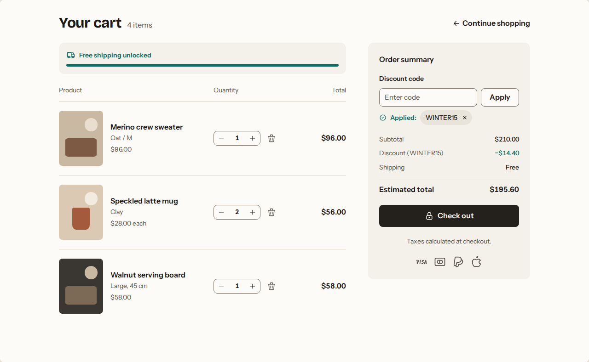
*Page at desktop: "Your cart 4 items", Continue shopping, the unlocked shipping panel, column headings, three one-row line items, and the sticky Order summary with the applied code WINTER15, totals, Check out, note and payment icons.*

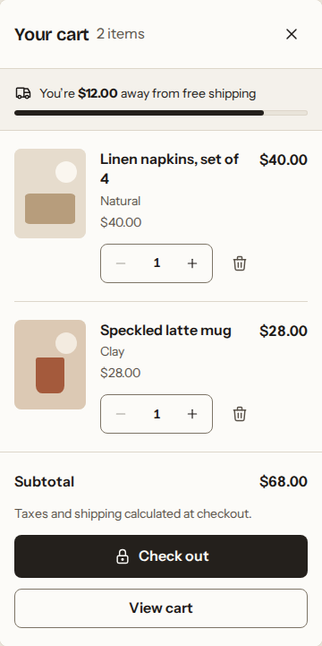
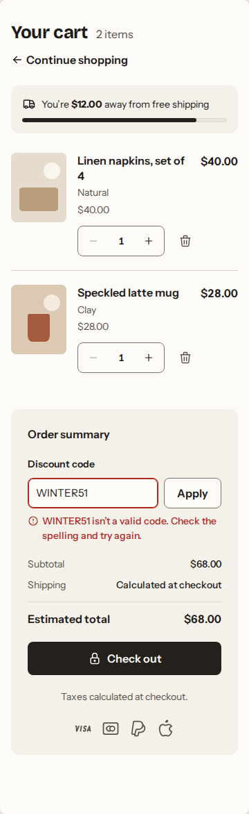
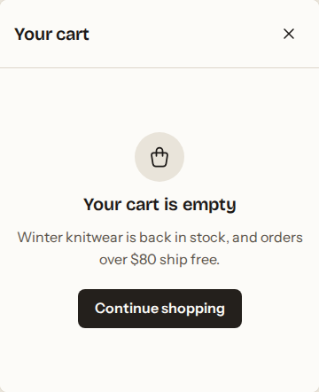
*Mobile: the drawer with the pending shipping bar and a fixed foot; the page with an invalid code error under the field; the empty drawer.*

Uses: Drawer (native modal `<dialog>`), Image (4:5 thumbnails), Quantity stepper (sm, enlarged below 48rem), Button (ghost icon for remove, primary lg link for Check out, outline for View cart and Apply, primary for Continue shopping in the empty state), Field + Input (discount code), removable chip (applied code), Price, Link (Continue shopping, with arrow-left icon), Empty state, Toast (Undo), Progress bar.

**Fields**

| Field id | Type | Required | Default | Notes |
|---|---|---|---|---|
| `variant` | select | yes | `drawer` | `drawer` (opened from the header bag) · `page` |
| `freeShippingThreshold` | string | no | — | e.g. "80.00". Empty hides the shipping bar. Must match the shipping rules in the backend. |
| `showDiscountField` | bool | no | on | `page` only |
| `showPaymentIcons` | bool | no | on | `page` only |
| `note` | text | no | "Taxes and shipping calculated at checkout." | Under the totals. |
| `emptyTitle` | string | no | "Your cart is empty" | |
| `emptyText` | text | no | — | e.g. "Winter knitwear is back in stock, and orders over $80 ship free." |
| `emptyLink` | link | no | /collections/all | **Continue shopping** target. |

**Variants**

| variant | What changes |
|---|---|
| `drawer` | A right-hand Drawer, opened as a modal `<dialog>`. Head: title, item count, close. The shipping bar spans the full drawer width on `surface`; the item list scrolls; the foot stays fixed: subtotal, note, **Check out** (primary lg, full width), **View cart** (outline, full width). No discount field, no payment icons. |
| `page` | An `h1` (h2 scale) "Your cart" with "4 items", a Continue shopping link, and from 64rem a `1fr | 22rem` layout. Left: the shipping panel, column headings (Product / Quantity / Total, from 48rem) and the items. Right: a sticky summary on `surface` with the discount code, totals, Check out, the note and payment icons. |

**Layout**

- **Line item (drawer, and page below 48rem)**: a grid `5rem | 1fr | auto` with gaps 0.75rem × 1rem and 1.25rem vertical padding, a `border` rule between items (none after the last). The thumbnail (4:5, `radius-md`) spans both rows. First row: info (0.125rem gaps, 0.875rem `muted`: the title at 1rem weight 600 in `text`, underlined on hover; the variant; the unit price, "$28.00 each" when the quantity is over 1) and, on the right, the line total (1rem, weight 600, tabular figures). Second row: the stepper and the remove icon button (trash), 0.5rem apart. Below 48rem both are 2.75rem (stepper buttons 2.75rem wide).
- **Line item (page from 48rem)**: one row, `6rem | 1fr | 11rem | 6rem` (thumbnail, info, quantity + remove, total), vertically centred. Stepper sm at 2rem (`control-height-sm`, 2.25rem input, 0.875rem) and a 2rem ghost remove button.
- **Drawer**: head padding 1rem start, 0.75rem end, at least 4rem tall, title "Your cart" (1.25rem heading font, weight 600) with the count "2 items" in body font 1rem `muted` 0.5rem after it, and the close icon button (2.75rem below 48rem). The shipping bar runs edge to edge: 1rem padding, `surface`, a `border` rule below. Body: 0 1rem padding, scrolls. Foot: 1rem side padding, 0.75rem gaps, a `border` rule above: Subtotal row (1rem, `text`, weight 600, no rule), note (0.875rem `muted`, centred), Check out, View cart. Below 26rem the drawer fills the screen width.
- **Page head**: a wrapping row (gaps 0.75rem × 1.5rem, 1.5rem below): the `h1` "Your cart" at the h2 scale (2rem, 1.625rem below 48rem) with "4 items" (body font 1rem `muted`) 0.75rem after it, baseline-aligned; the **Continue shopping** standalone link with arrow-left at the far end.
- **Page layout**: below 64rem the items stack, then the summary below them (2rem gap). From 64rem: `1fr | 22rem` with a 3rem gap; the summary is sticky 1.5rem from the top. The page shipping panel: 1rem padding, `radius-lg`, `surface`, 0.5rem below it. Column headings (from 48rem): `1fr | 11rem | 6rem`, padding 1rem top and 0.75rem bottom, a `border` rule below, 0.875rem `muted`, "Total" right-aligned.
- **Summary**: `surface`, `radius-lg`, 1.5rem padding, 1.25rem gaps. "Order summary" (1rem, weight 600). Discount: "Discount code" label, then a row (0.5rem gap) with the Input (fills the row, text shown in capitals, placeholder "Enter code" as typed) and **Apply** (outline). Totals: rows 0.5rem apart, 0.875rem, labels `muted`, values weight 500 tabular; the total row has 0.75rem padding above, a `border` rule, 1rem, `text` weight 600. Check out (primary lg, full width, lock icon, 3rem). Note (0.875rem `muted`, centred). Payment icons (Visa, Mastercard, PayPal, Apple Pay), 1.75rem, `muted`, centred, 0.75rem apart.
- **Shipping message**: 0.875rem, truck icon then the words, 0.5rem gap, then the progress bar 0.5rem below.

**States**

- **Free shipping pending**: "You’re **$12.00** away from free shipping" with the truck icon, bar filled to 85% in `primary`.
- **Free shipping unlocked**: "Free shipping unlocked" in `success` weight 600 with the truck icon; the bar is full and `success`. The message is in words, not only the bar.
- **Discount applied**: a check icon, "Applied:" (0.875rem `success` 600) and a chip "WINTER15" (`text`) whose remove button is labelled "Remove discount code WINTER15". The summary shows "Discount (WINTER15) −$14.40" in `success`.
- **Discount invalid**: the Input gets `aria-invalid="true"` and a `danger` border; the error (alert-circle icon + "WINTER51 isn’t a valid code. Check the spelling and try again.") sits under the row, linked by `aria-describedby`.
- **Updating**: the stepper and line total carry `aria-busy="true"` while the backend recalculates. The subtotal updates afterwards.
- **Removed**: the row collapses (`duration-base`, instant with reduced motion) and a Toast offers **Undo** for 6 seconds; the timer pauses on hover and focus.
- **Minimal**: one line. **Many items**: the drawer body scrolls while the head and foot stay fixed.
- **No image**: the thumbnail shows the Image placeholder.
- **Empty**: the Empty state with a shopping-bag icon, "Your cart is empty", `emptyText`, and a **Continue shopping** primary button (in the drawer it closes the drawer and goes to `emptyLink`). In the drawer the empty state has no border and 1.5rem vertical margin; the foot is hidden.

**Field → layout mapping**

`freeShippingThreshold` → shipping message + Progress bar · `showDiscountField` → discount Field · `note` → note under the totals · `showPaymentIcons` → payment icon row · `emptyTitle` / `emptyText` / `emptyLink` → Empty state.

**Keyboard & accessibility**

- The drawer is a native `<dialog>` opened as a modal, labelled by its `h2` "Your cart". It opens from the header bag button (`aria-haspopup="dialog"`). Focus starts on the close button ("Close cart", marked autofocus). `Esc` or a click on the `overlay` scrim closes it, focus returns to the bag button, and the page does not scroll behind.
- On the page: the `h1` "Your cart"; the summary is an `<aside>` labelled by its `h2` "Order summary"; the items are a `<ul>` labelled "Items in your cart".
- Each stepper is `role="group"` labelled "Quantity, Speckled latte mug"; its buttons are "Decrease quantity" and "Increase quantity".
- Each remove button names its item: "Remove Speckled latte mug, Clay". After removal, focus moves to the next item's title link, or to the empty-state heading.
- The shipping message is `role="status"`, so its changes are announced. The bar is `aria-hidden`.
- Discount results: the applied message is `role="status"`; errors are `role="alert"`.
- Page column headings are `aria-hidden` visual labels; each line total carries visually hidden "Line total". The payment icons are one image labelled "We accept Visa, Mastercard, PayPal and Apple Pay".
- Check out is a link styled as a primary lg button, 3rem tall.

| Key | Action |
|---|---|
| `Tab` | Close → item title → stepper − / input / + → remove → next item … → Check out → View cart (drawer). Page: Continue shopping → items → discount Input → Apply → applied chip remove → Check out. |
| `Enter` / `Space` | Press a stepper button, remove, Apply, Check out. `Enter` in the discount Input applies the code. |
| `Esc` | Close the drawer. |

**Default content (Northwind Goods)**

Page: Merino crew sweater · Oat / M · $96.00 · Speckled latte mug · Clay · $28.00 each × 2 · $56.00 · Walnut serving board · Large, 45 cm · $58.00 · "Free shipping unlocked" · Discount code WINTER15 applied · Subtotal $210.00 · Discount (WINTER15) −$14.40 · Shipping Free · Estimated total $195.60 · Check out · "Taxes calculated at checkout." (the page story's note). Drawer: Linen napkins, set of 4 · Natural · $40.00 + Speckled latte mug · Clay · $28.00 = Subtotal $68.00 · "You’re $12.00 away from free shipping" (threshold $80) · "Taxes and shipping calculated at checkout." · Check out · View cart. Invalid code: "WINTER51 isn’t a valid code. Check the spelling and try again."; Shipping "Calculated at checkout". Empty: "Your cart is empty" · "Winter knitwear is back in stock, and orders over $80 ship free." · Continue shopping.

**Acceptance criteria**

- [ ] Titles and totals `text` 16.9:1 on `background`, 15.5:1 on `surface`; meta, unit prices, labels and notes `muted` 7.4:1 / 6.8:1 (1.4.3).
- [ ] `success` text on the `surface` shipping panel and summary is at least 5.0:1 (6.2:1 on `background`, 5.0:1 on `surface-strong`); the `danger` error is at least 5.3:1; Check out `primary-contrast` on `primary` 15.6:1.
- [ ] Stepper, Input and View cart boundaries `border-strong`: 4.5:1 on `background`, 4.1:1 on `surface` (1.4.11). The invalid Input adds a `danger` border plus the error text and icon (1.4.1, 3.3.1).
- [ ] Shipping state is always in words; the progress bar is hidden from assistive technology (1.4.1).
- [ ] The drawer is a native modal `<dialog>`: inert background, focus contained, `Esc` closes, focus returns to the bag button, no page scroll behind (2.1.2, 2.4.3).
- [ ] The standard focus ring shows on every link, stepper button (inset ring), remove button, Input, Apply, chip remove and Check out (2.4.7, 2.4.11).
- [ ] Shipping and applied-discount messages are polite status messages; the invalid-code error is an alert linked with `aria-describedby` (4.1.3, 3.3.1, 3.3.2).
- [ ] After a remove, focus lands on the next item title or the empty-state heading; the Undo toast pauses on hover and focus and never takes focus (2.4.3, 2.2.1).
- [ ] Remove buttons and steppers are 2.75rem below 48rem; the sm stepper and remove button are 2rem from 48rem; chip remove 1.5rem (2.5.8).
- [ ] With reduced motion the drawer fades instead of sliding and the row collapse and bar fill are instant.
- [ ] At 320px and 200% zoom the drawer fills the width, line items reflow to two rows and nothing scrolls sideways (1.4.10, 1.4.12).
- [ ] No pre-ticked upsells, no "only today" timers, no "selling fast" messages; the threshold gap comes from the backend.

**Do / Don't**

- **Do** show the real threshold gap from the backend and hide the bar when no threshold is set.
- **Do** keep the remove action as easy to find as the quantity. Setting quantity to 0 isn't the only way to remove an item.
- **Don't** add surprise fees at checkout that the note didn't mention.
- **Don't** pre-tick upsells, add "only today" timers, or show "items in your cart are selling fast".

---

### Search results page · `search`

Site search: a combobox with grouped suggestions as you type, a results page mixing products and content, and a helpful no-results state. The field and its suggestion panel follow the **Search bar** core component at size lg (same views, keyboard model and data contract); the header's search opens the same search in a Search modal.

**Container** `wide` (80rem) · **Section background** default none · **Section spacing** 2rem top, `section-md` bottom.

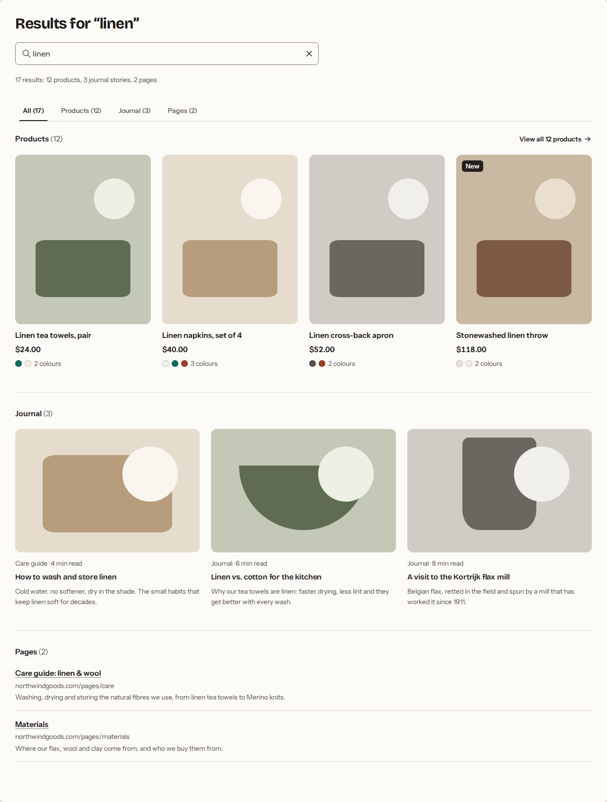
*Desktop results: h1 "Results for “linen”", the field with the query, the summary line, tabs with counts, then Products (4 columns, View all 12 products), Journal (3 cards) and Pages (ruled list with URL path and snippet).*

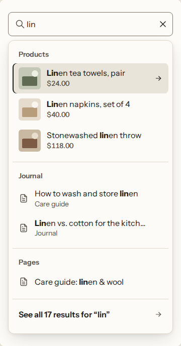
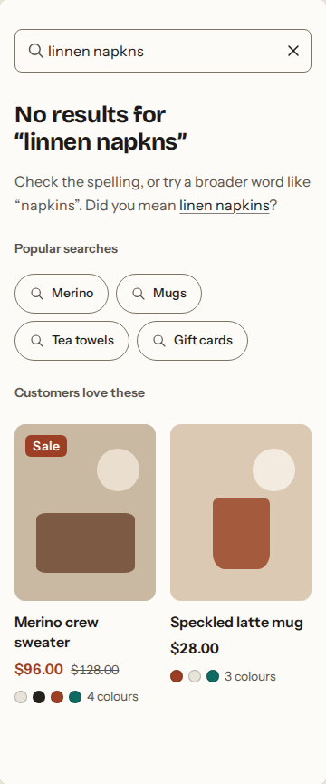
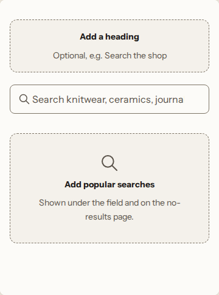
*Mobile: the suggestion panel with the matched part in bold and the first product active (fill, left bar and arrow); the no-results state with Did you mean, Popular searches and Customers love these; freshly inserted with "Add a heading" and "Add popular searches" placeholders (the field works straight away).*

Uses: Search bar (size lg), Tabs, Product card, Content card (3:2), Link, suggestion chips (links), Product grid.

**Fields**

| Field id | Type | Required | Default | Notes |
|---|---|---|---|---|
| `variant` | select | yes | `results-page` | `results-page` · `field-only` (for the header search overlay and the 404 page) |
| `heading` | string | no | "Results for “{query}”" | The `field-only` variant shows none. |
| `placeholder` | string | no | "Search knitwear, ceramics, journal…" | |
| `types` | list | no | Products, Journal, Pages | Which result groups show, in what order. |
| `types[].type` | select | yes | — | `products` · `journal` · `pages` |
| `types[].label` | string | no | the type's name | Overrides the group name. |
| `suggestionsPerGroup` | select | no | `3` | `2` · `3` · `4` |
| `popularSearches` | list | no | — | Chips shown when the field is focused but empty, and on the no-results page. |
| `popularSearches[].label` | string | yes | — | e.g. "Merino" |
| `noResultsProducts` | link | no | — | A collection shown under "Customers love these" on the no-results page. |

**Variants**

| variant | What changes |
|---|---|
| `results-page` | `h1`, the field (max 40rem), a live summary line, then tabs **All (17) · Products (12) · Journal (3) · Pages (2)**. The All tab shows each type as a section with a heading, a count and a "View all" link. |
| `field-only` | Just the field and its panel. Used in the header overlay and on the 404 page. `Enter` goes to the results page. |

**Layout**

- **Head**: a stack with 1.25rem gaps and 2rem below it: the `h1` at the h2 scale (2rem, 1.625rem below 48rem; a long query breaks anywhere), the field, and the summary line (0.875rem `muted`).
- **Field (Search bar lg)**: max 40rem wide, 3rem tall (`control-height-lg`), 1rem text, a 1.25rem `muted` search icon 0.875rem from the start (text starts 2.75rem in), and the 2rem ghost clear icon button 0.25rem from the end, shown only when there is text. It keeps the query on the results page.
- **Suggestion panel**: the Search bar panel, with these block values: full field width, 0.5rem below the field, `background`, 1px `border`, `radius-lg`, `shadow-md`, 0.5rem padding, max height `min(32rem, 70vh)` scrolling inside. Groups are 0.125rem-gapped lists separated by a `border` rule with 0.5rem padding; group labels 0.875rem weight 600 `muted` (0.5rem 0.75rem 0.25rem padding). Options at least 2.75rem, 0.5rem × 0.75rem padding, 0.75rem gaps, `radius-md`: a 2.75rem 1:1 thumbnail (`radius-sm`) for products or a `muted` file icon for journal and pages; the title (one line, ellipsis, matched part weight 700) over the price or type (0.875rem `muted`, tabular); an arrow icon at the end, visible only on the active row. A final row "See all 17 results for “lin”" (weight 600, arrow at the end) closes the list.
- **Below 48rem**: 1rem gutters. Results: products in 2 columns, articles stacked (1.5rem gaps), pages as a ruled list.
- **48–64rem**: products in 3 columns, articles in 3 columns.
- **From 64rem**: products in 4 columns, articles in 3 columns (3:2 images), pages as a list with title, URL path and snippet. Sections after the first get 3rem above, a `border` rule and 2rem padding. Section head: title (1rem, 600, the count in `muted` 400) and the "View all 12 products" standalone link (0.875rem) at the far end, 1.25rem above the content. Page rows: 1rem vertical padding (none above the first) and a `border` rule below; title link weight 600, URL path and snippet 0.875rem `muted`.
- **Popular searches chips**: wrapping, 0.5rem gaps, at least 2.75rem tall below 48rem (2.25rem from 48rem), 0 1rem padding, `radius-full`, `border-strong` edge, 0.875rem weight 500, a 1rem `muted` search icon first. Hover: `text` edge and a light tint.
- **No results**: a stack (1rem gaps, max 40rem) under the field: the `h1`, advice in `muted` with the "Did you mean" link, "Popular searches" label (0.875rem 600), chips, "Customers love these" label, then 2 to 4 product cards in the product grid.

**States**

- **Typing (panel open)**: after 2 characters, grouped suggestions appear. The active option has a `surface-strong` fill **plus** a 2px `text` bar on its left edge and the arrow icon. Hover gives the same fill.
- **Focused, empty**: the panel shows the Search bar idle view: "Popular searches" chips instead of suggestions.
- **Loading**: the summary reads "Searching…"; the clear button is replaced by a spinner. Earlier results stay on screen.
- **Results**: counts in the tab labels and section headings.
- **Minimal**: one result type. Tabs with 0 results are hidden; when only one type has results the tabs are hidden altogether.
- **Long content**: suggestion titles truncate with an ellipsis; result titles clamp at 2 lines; a long query wraps anywhere in the `h1`.
- **No results**: `h1` "No results for “linnen napkns”", advice plus "Did you mean linen napkins?" link, Popular searches chips, and 2 to 4 cards under "Customers love these".
- **Empty (freshly inserted)**: placeholders "Add a heading" ("Optional, e.g. Search the shop") and "Add popular searches" ("Shown under the field and on the no-results page."). The field works straight away.

**Field → layout mapping**

`heading` → `h1` · `placeholder` → Input placeholder · `types[]` → panel groups, tabs and result sections (in order) · `suggestionsPerGroup` → options per group · `popularSearches[]` → chips (idle panel and no-results page) · `noResultsProducts` → the no-results product grid.

**Keyboard & accessibility**

- The form is `role="search"` with a visually hidden label "Search the shop". The Input is `type="search"` with `role="combobox"`, `aria-expanded`, `aria-controls` (the panel), `aria-autocomplete="list"` and `aria-activedescendant` (the active option's id). **Focus never leaves the Input** while the panel is in use.
- The panel is `role="listbox"` with `role="group"` sections labelled by their headings (Products, Journal, Pages). Every row, chip and "See all" is `role="option"`.
- A visually hidden polite live region announces the count ("8 results for lin", "No results for teapot") once typing pauses (400ms). On the results page the summary line is `role="status"`; the no-results block is `role="status"` so it is announced when the page loads after a search.
- Result tabs: `←`/`→` (wrapping), `Home`, `End`; only the selected tab is in the tab order; each panel is focusable.
- Popular searches are links to the results page. The clear button is labelled "Clear search" and hidden when the field is empty.
- Autofocus: the field may take focus on load only on the Search page itself (as the Search bar allows); never in `field-only` on other pages.
- Sold-out products rank last in suggestions.

| Key | Action |
|---|---|
| `↓` / `↑` | Move the active option through all options, across groups (stops at the first and last). `↓` on a closed field opens it. |
| `Enter` | Follow the active option; with none active, submit the query to the results page. |
| `Esc` | First clears the active option, then clears the query, then closes the panel. Focus stays in the Input. |
| `Tab` | Close the panel and move on; options are never in the tab order. |
| `Home` / `End` | Move the caret within the text. |
| `←` / `→`, `Home` / `End` | On a result tab: move between tabs. |

**Default content (Northwind Goods)**

Query "linen": "Results for “linen”" · "17 results: 12 products, 3 journal stories, 2 pages" · Products: Linen tea towels, pair $24.00 · Linen napkins, set of 4 $40.00 · Linen cross-back apron $52.00 · Stonewashed linen throw $118.00 (New) · Journal: "How to wash and store linen" (Care guide · 4 min read), "Linen vs. cotton for the kitchen" (Journal · 6 min read), "A visit to the Kortrijk flax mill" (Journal · 8 min read) · Pages: Care guide: linen & wool (northwindgoods.com/pages/care), Materials (northwindgoods.com/pages/materials). No results: "linnen napkns" → "Check the spelling, or try a broader word like “napkins”. Did you mean linen napkins?" · Popular: Merino, Mugs, Tea towels, Gift cards · Customers love these: Merino crew sweater, Speckled latte mug.

**Acceptance criteria**

- [ ] Titles `text` 16.9:1 on `background` and 13.8:1 on the `surface-strong` active row; meta, prices, paths and group labels `muted` 7.4:1 (6.1:1 on the active row) (1.4.3).
- [ ] Field and chip boundaries `border-strong` 4.5:1 (1.4.11). The panel's `border` edge is decorative; `shadow-md` separates it.
- [ ] The active option is shown by fill, a 2px `text` bar and an arrow; matches by weight 700 (1.4.1).
- [ ] The standard focus ring shows on the Input, clear button, tabs (inset), chips, links and cards (2.4.7, 2.4.11).
- [ ] The combobox pattern works as specified: focus stays in the Input, `aria-activedescendant` follows `↓`/`↑`, `Enter`, `Esc` sequence and `Tab` behave as in the key table (2.1.1, 4.1.2).
- [ ] Suggestion counts are announced politely after typing pauses; the summary and no-results block are status messages (4.1.3).
- [ ] The panel opens only on focus, typing or `↓`, never on hover; it closes on outside click (1.4.13, 3.2.2).
- [ ] Options and chips are 2.75rem below 48rem; chips 2.25rem from 48rem; the clear button 2rem (2.5.8).
- [ ] With reduced motion the panel appears without the pop-in and the spinner pulses instead of spinning.
- [ ] At 320px and 200% zoom the field, panel and results fit without horizontal scroll; a long query wraps (1.4.10, 1.4.12).
- [ ] Tabs with 0 results are hidden; with one type the tabs are hidden.

**Do / Don't**

- **Do** keep typo tolerance and "Did you mean" on the backend. The block only displays them.
- **Do** keep the query in the field on the results page so shoppers can refine it.
- **Don't** move focus into the panel. `aria-activedescendant` keeps typing working.
- **Don't** show sold-out products at the top of suggestions. Rank them last.

---

### Order status · `order-status`

The order status page: order number and date, a four-step delivery tracker with tracking link, the items and totals, the delivery address, payment and help links. Data is bound to the order (the page URL holds a signed order token); editors fill in only the copy.

**Container** `content` (64rem) · **Section background** default none · **Section spacing** `section-md`.

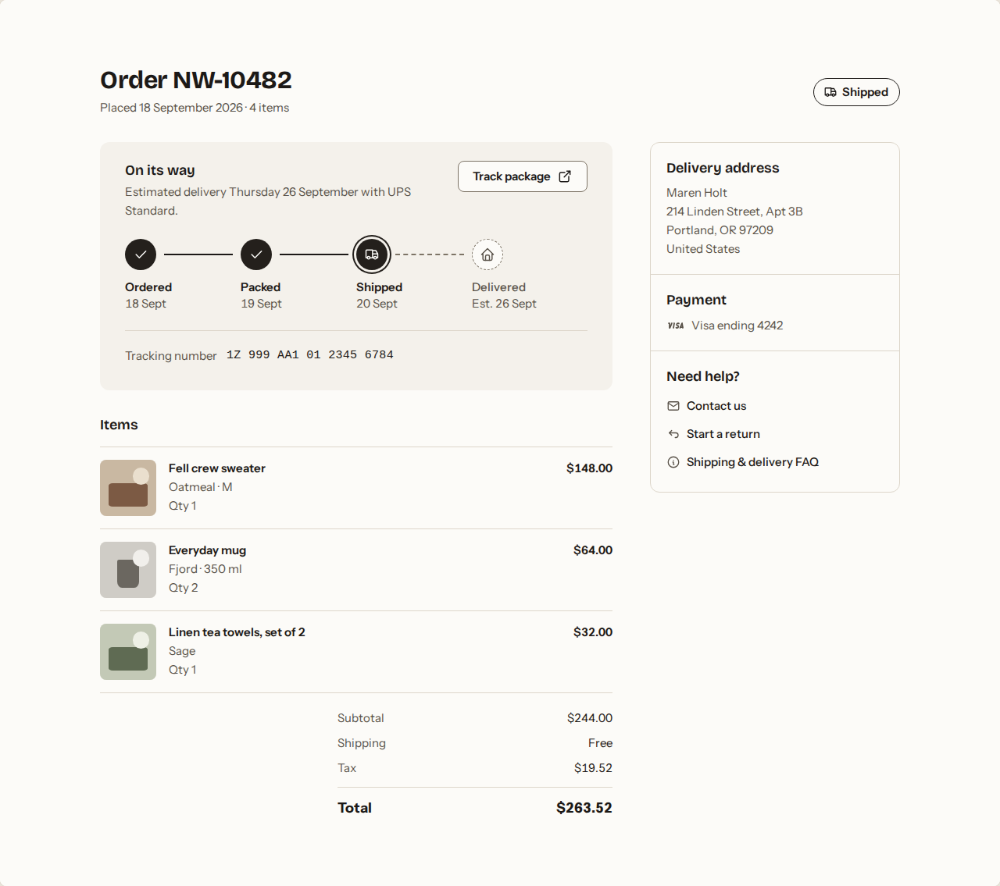
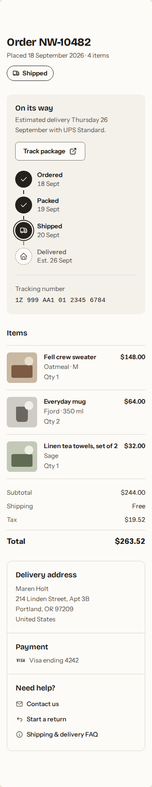
*Shipped: title "Order NW-10482", placed line, Shipped badge; the `surface` status panel with "On its way", Track package, a horizontal tracker at desktop (vertical at 360) and the tracking number; items, totals, and the details card (Delivery address, Payment, Need help?).*

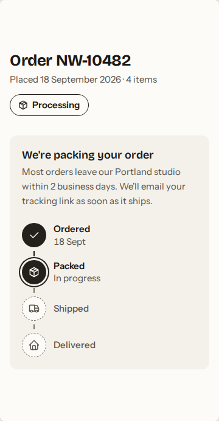
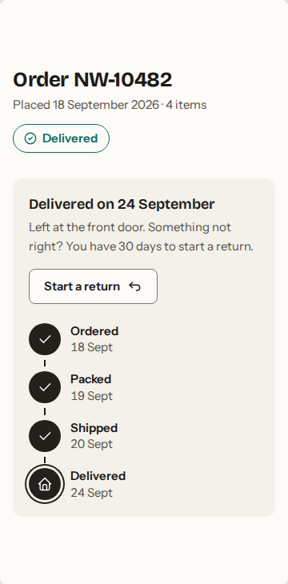
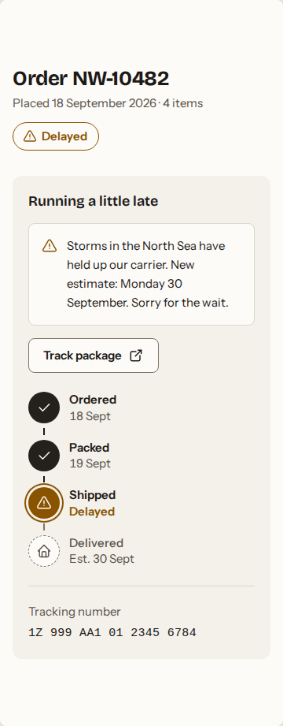
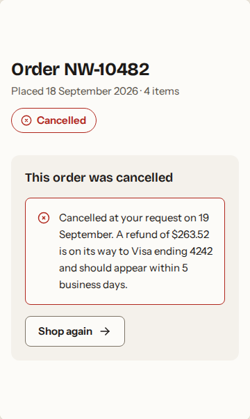
*The other four states, status panel only.*

Uses: status badge (pill with icon + word), Button (outline, 0.9375rem text: Track package with external-link icon, Start a return, Shop again), alert panels (warning, danger), Image (1:1 thumbnails), Price, Link (standalone help links with icons).

**Fields**

Editors fill in the copy. Order data comes from the order at runtime and is not editable (in the editor it renders with a sample order).

| Field id | Type | Required | Default | Notes |
|---|---|---|---|---|
| `variant` | select | no | `default` | `default` only (reserved). The state comes from the order, not from a field. |
| `processingTitle` | string | yes | "We're packing your order" | |
| `processingText` | text | no | "Most orders leave our Portland studio within 2 business days. We'll email your tracking link as soon as it ships." | |
| `shippedTitle` | string | yes | "On its way" | |
| `deliveredTitle` | string | yes | "Delivered on {date}" | |
| `deliveredText` | text | no | "Something not right? You have 30 days to start a return." | Follows the carrier's delivery note ("Left at the front door.") when there is one. |
| `delayedTitle` | string | yes | "Running a little late" | |
| `cancelledTitle` | string | yes | "This order was cancelled" | |
| `returnLink` | link | no | — | The Delivered call to action and a help link. |
| `shopAgainLink` | link | no | — | The Cancelled call to action. |
| `helpLinks` | list | no | Contact us · Start a return · Shipping & delivery FAQ | Up to 4. |
| `helpLinks[].label` | string | yes | — | |
| `helpLinks[].link` | link | yes | — | |
| `helpLinks[].icon` | select | no | — | `mail` · `arrow-back-up` · `info-circle` · `phone` · `truck` |

Order data (runtime): `number`, `placedAt`, `itemCount`, `status` (`processing` | `shipped` | `delivered` | `cancelled` | `delayed`), `steps[].date`, `carrier`, `eta`, `trackingNumber`, `trackingUrl`, `delayNote`, `cancelNote`, `lines[]` (image, title, url, variant, qty, lineTotal), `subtotal`, `shipping`, `tax`, `total`, `shippingAddress`, `payment` (brand, last4).

**Variants (states, from `status`)**

| status | Badge | Panel |
|---|---|---|
| `processing` | package · "Processing" (`text`) | Title + text. Steps: Ordered done; **Packed** current, dated "In progress"; Shipped and Delivered upcoming with no date. No call to action, no tracking row. |
| `shipped` | truck · "Shipped" (`text`) | "On its way" + ETA and carrier, outline **Track package** button with external-link icon, **Shipped** current, tracking number row. |
| `delivered` | circle-check · "Delivered" (`success`) | Delivery note + outline **Start a return** button (arrow-back-up icon). All four steps done; **Delivered** is current with the ring. |
| `delayed` | alert-triangle · "Delayed" (`warning`) | A warning alert with the delay note under the title. The current step becomes a `warning` disc with alert-triangle, and its date reads "Delayed" in `warning`, weight 600. Delivered shows the new estimate. Track package and the tracking row stay. |
| `cancelled` | circle-x · "Cancelled" (`danger`) | A danger alert with the refund note. The step tracker and tracking row are hidden. Outline **Shop again** button (arrow-right icon). |

**Layout**

- **Type**: three sizes. Title 2rem (1.625rem below 48rem, heading font 700); section headings and the total 1.125rem (heading font 600 for headings, 700 for the total); everything else 0.9375rem with line-height 1.6 (buttons too).
- **Below 48rem**: 1rem gutters. Head (2rem below it) stacks: title, "Placed 18 September 2026 · 4 items" (`muted`), then the badge (0.75rem below the text when the row wraps). The badge: at least 2.25rem tall, 0 0.875rem 0 0.75rem padding, `radius-full`, a 1px border in the badge's own colour, weight 600, icon + word, 0.375rem gap. The main column stacks with 2rem gaps. The status panel (`surface`, `radius-lg`, 1.25rem padding, 1.5rem gaps) holds the summary (heading, text, alert 0.75rem below the text on a `background` fill), then the call to action, then a **vertical** tracker: 2.5rem discs in a 2.5rem column, 0.75rem to the label (600) and date (`muted`, tabular), 1.25rem between steps, and a 2px connector between discs; then the tracking row (1.25rem padding above, a `border` rule, `muted` label, the number in monospace 0.9375rem `text`, slight letter spacing). Items follow: the "Items" heading, a `border` rule 1rem below, rows `4.5rem | 1fr | auto` with 1rem gaps and 1rem vertical padding, each with a `border` rule below (thumbnail 1:1 `radius-md`; title link 600 in `text`, underlined on hover; variant and "Qty 1" in `muted`; price top-right). Totals follow 1.25rem lower at full width: rows 0.5rem apart, labels `muted`, values tabular; the total row has 0.75rem padding above and a `border` rule. Then the details card stacked (1px `border`, `radius-lg`; each section 1.25rem padding, 0.5rem gaps, a `border` rule between sections): Delivery address (`muted`, normal style), Payment (brand icon + "Visa ending 4242" in `text`), Need help? (standalone links, weight 500, `muted` icons, at least 2.25rem tall).
- **From 36rem block width**: the tracker turns **horizontal**: 4 equal columns, disc above label and date (0.75rem below the disc), connectors running from just after one disc to just before the next, level with the disc centres.
- **48–64rem**: title 2rem. Panel padding 1.5rem top, 2rem sides and bottom. The summary text (max 34rem, grows from 18rem) sits beside the button; when there isn't room, the button wraps under the text. Head row: text on the left, badge on the right (wrapping).
- **From 64rem**: a main column plus a 20rem details column, 3rem gap, top-aligned. Totals sit right-aligned in a column at most 22rem wide.
- **Tracker marks**: done disc `primary` fill with a check in `primary-contrast`, solid 2px `text` connector after it. Current disc `primary` fill with its step icon, plus a ring: 3px `surface` gap then 2px `primary`. Upcoming disc `background` fill, `muted` icon, 1.5px dashed `border-strong` outline, dashed 2px `border-strong` connector, label weight 500 in `muted`. Warning disc `warning` fill, `background` icon, ring in `warning`.

**States**

- The five order states above, plus:
- **Long content**: long item titles wrap and the price stays top-right. Long street names wrap in the address. A long carrier name wraps the summary; the call to action moves under the text.
- **Many items**: after 10 lines, the rest collapse behind a "Show all 14 items" link-style button.
- **Missing thumbnail**: the Image placeholder at 1:1.
- **Freshly inserted (editor)**: renders with the sample order (NW-10482, shipped). Copy fields show their defaults, so there is no empty layout.

**Field → layout mapping**

`number` → `h1` ("Order NW-10482") · `placedAt` + `itemCount` → placed line · `status` → badge + panel state · `*Title` / `*Text` + `eta` / `carrier` → panel summary (`h2` + text) · `delayNote` / `cancelNote` → alert inside the summary · `trackingUrl` → Track package · `returnLink` → Start a return · `shopAgainLink` → Shop again · `steps[]` → ordered tracker list (done / current / upcoming, plus warning) · `trackingNumber` → tracking row · `lines[]` → item list · `subtotal` / `shipping` / `tax` / `total` → totals list · `shippingAddress` → `<address>` · `payment` → brand icon + "Visa ending 4242" · `helpLinks[]` → help list.

**Keyboard & accessibility**

- One `h1` (the order number). Each region has an `h2`: the status title, "Items", "Delivery address", "Payment" and "Need help?". The details column is an `<aside>` labelled "Order details". The totals are a description list.
- The badge includes a visually hidden "Status:" prefix. Its meaning never depends on colour: each state has its own icon and word.
- The tracker is an `<ol>` labelled "Delivery progress". Each step has a visible word and date and a visually hidden state (", completed" / ", not yet"). The current step has `aria-current="step"`. Discs are `aria-hidden`. States differ without colour: done = check icon and solid connector; current = ring and bold label; upcoming = dashed outline, dashed connector and lighter label; warning = alert icon and the word "Delayed".
- Alerts use `role="status"`. When the state changes (for example after polling), the panel re-renders and the change is announced.
- **Track package** opens the carrier site. The external-link icon shows this, and the accessible name is "Track package (opens carrier site)" (visually hidden text).
- Tab order: Track or return button → item title links → help links.
- Targets: buttons 2.75rem below 48rem, help links 2.25rem, item links at least 1.5rem.

| Key | Action |
|---|---|
| `Tab` | Call-to-action button → item links → help links. |
| `Enter` | Follow a link or press a button. |

**Default content (Northwind Goods)**

Order NW-10482 · Placed 18 September 2026 · 4 items · Shipped. "On its way": "Estimated delivery Thursday 26 September with UPS Standard." Steps: Ordered 18 Sept · Packed 19 Sept · Shipped 20 Sept · Delivered Est. 26 Sept. Tracking number 1Z 999 AA1 01 2345 6784.
Lines: Fell crew sweater (Oatmeal · M, Qty 1, $148.00) · Everyday mug (Fjord · 350 ml, Qty 2, $64.00) · Linen tea towels, set of 2 (Sage, Qty 1, $32.00). Subtotal $244.00 · Shipping Free · Tax $19.52 · Total $263.52.
Ship to Maren Holt, 214 Linden Street, Apt 3B, Portland, OR 97209, United States. Visa ending 4242. Need help? Contact us · Start a return · Shipping & delivery FAQ.
Delivered: "Delivered on 24 September" · "Left at the front door. Something not right? You have 30 days to start a return." Delay note: "Storms in the North Sea have held up our carrier. New estimate: Monday 30 September. Sorry for the wait." (Delivered step: Est. 30 Sept). Cancel note: "Cancelled at your request on 19 September. A refund of $263.52 is on its way to Visa ending 4242 and should appear within 5 business days."

**Acceptance criteria**

- [ ] Title, labels and prices `text` 16.9:1 (15.5:1 on the `surface` panel); meta, dates, address and upcoming steps `muted` 7.4:1 / 6.8:1 (1.4.3).
- [ ] Badges on `background`: `text` 16.9:1, `success` 6.2:1, `warning` 6.1:1, `danger` 6.5:1; the "Delayed" date in `warning` on `surface` is at least 5.0:1; the `background` icon on the `warning` disc 6.1:1; `primary-contrast` on `primary` discs 15.6:1.
- [ ] Upcoming disc outlines and dashed connectors use `border-strong` (4.1:1 on `surface`) (1.4.11).
- [ ] No state relies on colour: every badge has icon + word; steps differ by icon, ring, line style and weight (1.4.1).
- [ ] The standard focus ring shows on every button and link (2.4.7, 2.4.11).
- [ ] The tracker exposes the list, the current step (`aria-current="step"`) and each step's state in words (1.3.1, 4.1.2).
- [ ] State changes after polling are announced through the status alert (4.1.3).
- [ ] Track package's accessible name says it opens the carrier site.
- [ ] Buttons 2.75rem below 48rem; help links 2.25rem; item links at least 1.5rem (2.5.8).
- [ ] The tracker switches from vertical to horizontal at 36rem block width; cancelled orders show no tracker.
- [ ] At 320px and 200% zoom nothing scrolls sideways; long titles, addresses and carrier names wrap (1.4.10, 1.4.12).
- [ ] There is no motion to reduce; any panel re-render is instant.

**Do / Don't**

- **Do** write status copy in plain, warm language and give a date whenever there is one.
- **Do** keep the delay note specific: the cause, the new date and an apology.
- **Don't** show a tracker for cancelled orders.
- **Don't** colour the whole panel for warnings. The alert and the step icon carry the state.

---

### Trust strip · `trust-strip`

A quiet strip of 3–4 store promises (shipping, returns, secure payment, handmade), each an icon with a short line, with an optional row of accepted payment marks. With only 1–2 promises, use an Announcement bar instead.

**Container** `wide` (80rem) · **Section background** default `surface` (option: none) · **Section spacing** `sm` (`section-sm`, 2rem to 3rem).

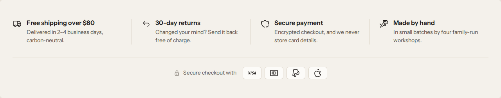
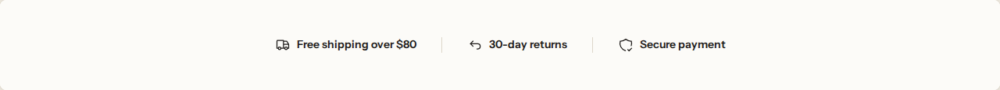
*Desktop: `columns` with dividers and the "Secure checkout with" payment row; `inline` as one centred row of icon + title.*

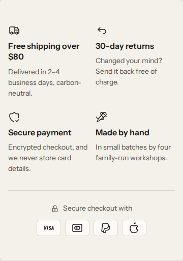
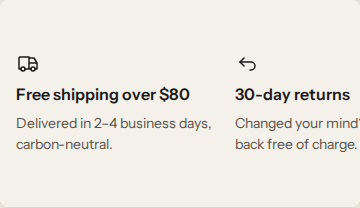
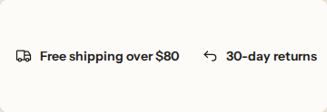
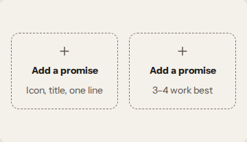
*Mobile: 2×2 grid with the payment row below; a sideways-scrolling row where the next item is cut off; the inline row scrolling on one line; freshly inserted with two "Add a promise" tiles.*

Uses: icons, Link (optional item links), payment marks (monochrome icons on chips). No buttons.

**Fields**

| Field id | Type | Required | Default | Notes |
|---|---|---|---|---|
| `variant` | select | yes | `columns` | `columns` (icon, title and one line) · `inline` (icon + title only, one centred row) |
| `items` | list | yes | 4 items (below) | 3–4 items. A fifth is rejected in the editor. |
| `items[].icon` | select | yes | — | `truck` · `arrow-back-up` · `shield-check` · `needle-thread` · `leaf` · `recycle` · `gift` · `lock` · `package` · `clock` |
| `items[].title` | string | yes | — | 2–5 words, e.g. "30-day returns". |
| `items[].text` | string | no | — | One line, up to about 60 characters. Only shown in `columns`. |
| `items[].link` | link | no | — | Makes the title a link (e.g. to the returns policy). |
| `mobileLayout` | select | no | `grid` | `grid` (2×2 below 48rem) · `scroll` (a single row that scrolls sideways) |
| `showPayments` | bool | no | on | |
| `paymentsLabel` | string | no | "Secure checkout with" | |
| `payments` | list | no | Visa, Mastercard, PayPal, Apple Pay | Chosen from `visa` · `mastercard` · `paypal` · `apple-pay`. Each maps to an icon plus a visually hidden name. |
| `background` | select | no | `surface` | `surface` · `none` |

**Variants**

| variant | What changes |
|---|---|
| `columns` | From 48rem: equal columns with the icon beside the title and text. From 64rem, 1px `border` dividers between items with 1.5rem padding each side. Below 48rem: a 2×2 grid with the icon above the text, or a scrolling row. |
| `inline` | Titles only (0.875rem, weight 600) in one centred row with 1.25rem icons (0.5rem to the title). From 48rem items are 2rem apart; from 64rem they are split by `border` dividers with 2rem padding each side. Use it directly under the header or hero. Below 48rem, choose `scroll`: the row stays on one line and scrolls. |

**Layout**

- **Type**: two sizes. Title 1rem weight 600 (0.875rem in `inline`), text 0.875rem, line-height 1.5.
- **Below 48rem**: 1rem gutters. `grid`: 2 columns, gaps 1.5rem × 1rem; each item stacks the icon (1.5rem, stroke 1.5, `text`), then 0.5rem lower the title, then the text in `muted`. `scroll`: slides 62% of the width, snapping to the gutter, bleeding to the screen edge so the cut-off next item shows that the row scrolls (no visible scrollbar); in `inline` + `scroll`, slides size to their content, 1.5rem apart, and titles never wrap. The payment row wraps and centres.
- **48–64rem**: all items in one row of equal widths, 1.5rem gaps, icon to the left of the title and text (0.75rem gap, the icon spans both lines).
- **From 64rem**: 80rem container. Items are split by 1px `border` dividers, 1.5rem padding each side, no outer padding on the first and last.
- **Payment row**: 2rem below the items, a `border` rule, 1.5rem padding above; centred and wrapping (gaps 0.75rem × 1rem), `muted`: a 1rem lock icon and the label, then the marks list (0.5rem gaps). Each mark is a 3rem × 2rem chip, `background` fill, 1px inset `border` line, `radius-sm`, with a 1.5rem monochrome icon in `text`.

**States**

- **Ideal**: 4 promises + 4 payment marks.
- **Minimal**: 3 promises, no text, no payments. The `inline` variant is designed for this.
- **Long content**: titles wrap inside their column; text wraps to 2–3 lines. In `inline` + `scroll`, titles never wrap.
- **Many items**: at most 4.
- **No image**: not applicable (icons only).
- **Empty (freshly inserted)**: two "Add a promise" tiles ("Icon, title, one line"; "3–4 work best"). The live site shows nothing until at least one item has a title.

**Field → layout mapping**

`items[]` → list items (icon, title, text) · `items[].link` → title link · `mobileLayout` = `scroll` → scrolling row below 48rem · `showPayments` / `paymentsLabel` / `payments` → payment row · `background` → section ground.

**Keyboard & accessibility**

- A `<section>` labelled by a visually hidden `h2` "Why shop with Northwind", so the strip still appears in the heading outline.
- Icons are decorative (`aria-hidden`). The title carries the meaning.
- Payment marks are icons with visually hidden names (Visa, Mastercard, PayPal, Apple Pay) in a list labelled "Accepted payment methods". Marks are monochrome `text` on `background` chips, never brand colours.
- With `mobileLayout` = `scroll` below 48rem, the list is a focusable `region` (`tabindex="0"`) labelled "Why shop with us, scrolls sideways"; `←`/`→` scroll it (native). If items have links, `Tab` moves through them in order.
- Item links are at least 1.5rem tall. There is no hover-only behaviour.

| Key | Action |
|---|---|
| `Tab` | The scrolling region (scroll layout only), then item links in order. |
| `←` / `→` | Scroll the focused region. |
| `Enter` | Follow an item link. |

**Default content (Northwind Goods)**

- truck · **Free shipping over $80**: "Delivered in 2–4 business days, carbon-neutral."
- arrow-back-up · **30-day returns**: "Changed your mind? Send it back free of charge."
- shield-check · **Secure payment**: "Encrypted checkout, and we never store card details."
- needle-thread · **Made by hand**: "In small batches by four family-run workshops."
- Payments: lock · "Secure checkout with" Visa · Mastercard · PayPal · Apple Pay.

**Acceptance criteria**

- [ ] Titles and icons `text` 15.5:1 on `surface` (16.9:1 on `background`); text and the payments label `muted` 6.8:1 on `surface` (7.4:1 on `background`) (1.4.3).
- [ ] Payment marks are `text` on `background` chips (16.9:1); dividers and chip edges (`border`) are decorative.
- [ ] Icons are hidden from assistive technology; each payment mark has a hidden name; the hidden `h2` labels the section (1.1.1, 1.3.1).
- [ ] The scrolling region (scroll layout) takes focus, shows the standard focus ring and scrolls with `←`/`→` (2.1.1, 2.4.7). Item links show the standard focus ring.
- [ ] Item links are at least 1.5rem tall (2.5.8).
- [ ] At 320px and 200% zoom the grid layout reflows without horizontal page scroll; the scroll layout scrolls only inside its own region (1.4.10, 1.4.12).
- [ ] Nothing moves on its own; no motion to reduce.
- [ ] The editor refuses a fifth item; the live site renders nothing with no titled item.

**Do / Don't**

- **Do** state concrete promises (numbers and days) that match the store policies.
- **Do** use `inline` directly under a hero, and `columns` above the footer or on product pages.
- **Don't** add filler stats ("10,000+ happy customers") or badges you can't back up.
- **Don't** colour the icons or payment marks with brand colours. The strip stays neutral.

---

## Sample pages

The sample pages show how the blocks compose into the four core Northwind Goods templates. Pages have no fields of their own: each is an ordered list of blocks with their settings.

**Page spacing rule (all pages)**: when two sections with the same background sit next to each other, the second one drops its top padding. The first block's bottom padding is then the only gap, so the page never gets the doubled gap (up to 12rem) that two stacked `section-md` paddings would make. When the background changes, both paddings stay: the colour change marks the break, and the padding keeps content off the edge. The page renderer applies this by comparing each block's background with the one before it. Non-section blocks (Breadcrumbs, Header, Announcement bar) don't take part.

**Shared page facts**: Portland, Oregon studio; US dollars; free shipping over $80; 30-day returns; 10% off for newsletter sign-ups. Every page has exactly one `h1`. Every `aria-labelledby`, `aria-controls`, `for` and dialog opener resolves to an element on the same page; ids are unique. Radio groups have page-unique names.

---

### Home page · template `index`

The Northwind Goods home page, assembled from nine blocks, from the announcement bar to the footer. The only `h1` is the Hero heading.

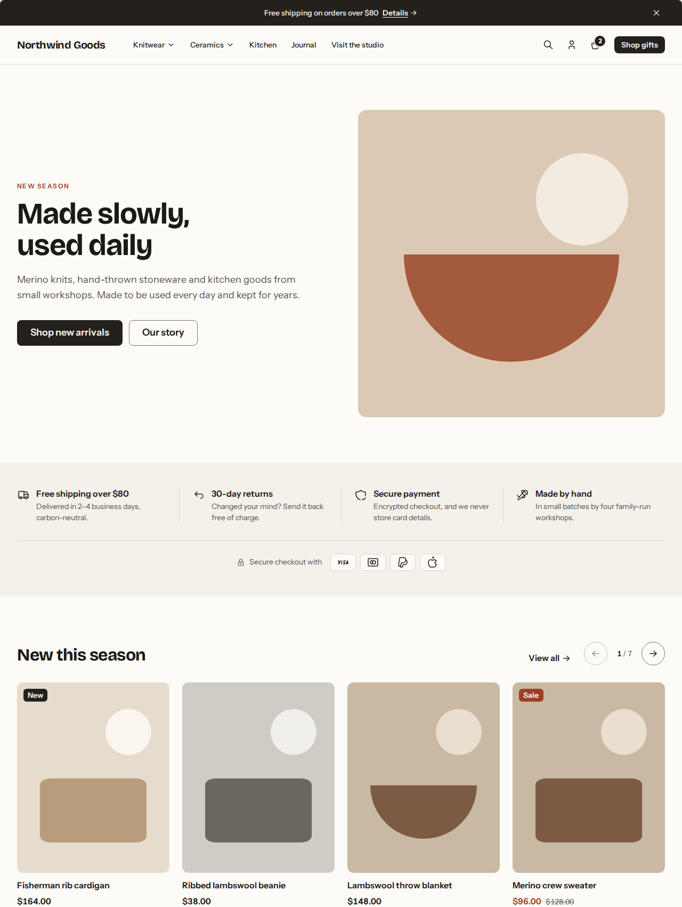
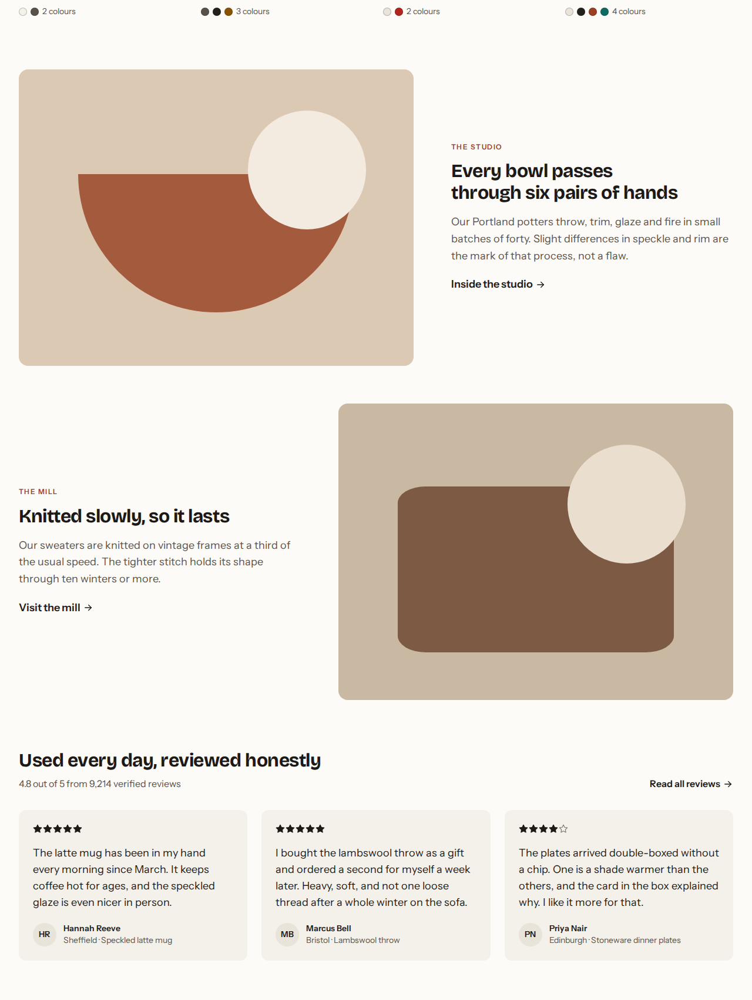
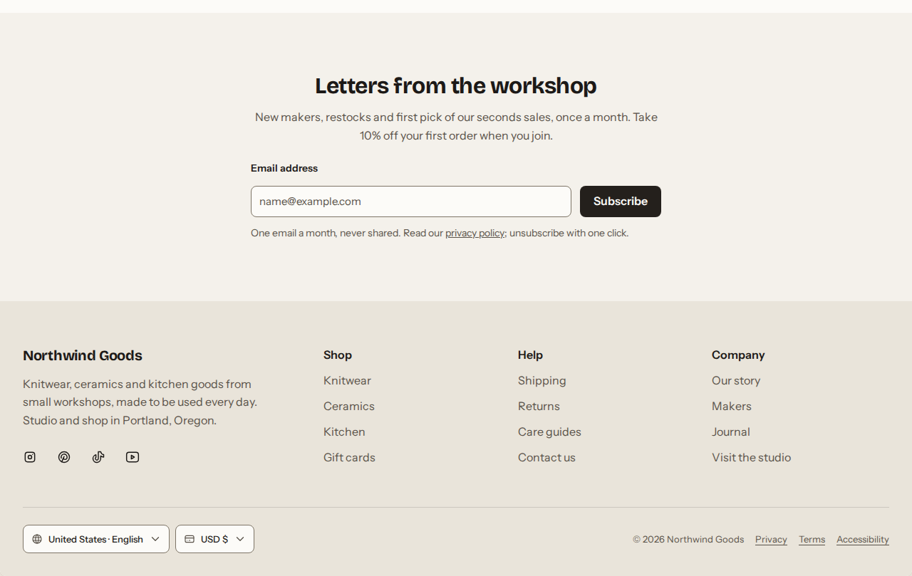
*Desktop, three consecutive slices of one tall capture: announcement bar, header, Hero "Made slowly, used daily", Trust strip band, "New this season" carousel; split content ("The studio", "The mill") and reviews; newsletter band and footer.*

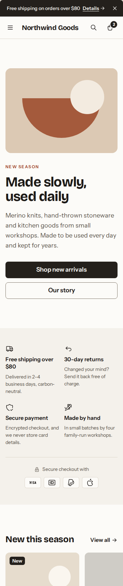
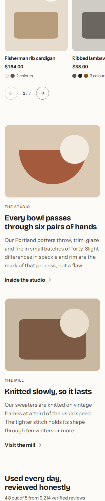
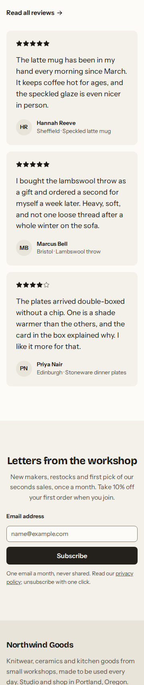
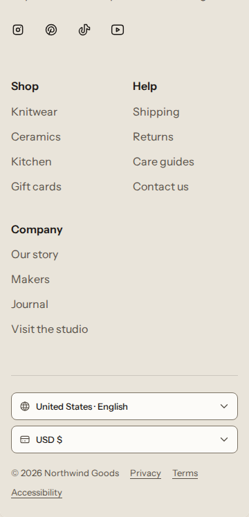
*Mobile, four consecutive slices of one tall capture: the same order, stacked.*

**Block order**

| # | Block | Variant / settings | Container | Section background | Spacing to the next block |
|---|---|---|---|---|---|
| 1 | Announcement bar `announcement-bar` | `primary`, dismissable | `wide` | `primary` | Sits flush on the header. |
| 2 | Header `header` | `default`, sticky | `wide` | `background` | Header border bottom, then the hero's full top padding. |
| 3 | Hero `hero` | `image-right` | `wide` | none | Full `section-md` on both sides. A background change follows, so nothing collapses. |
| 4 | Trust strip `trust-strip` | `columns` | `wide` | `surface`, spacing `sm` | Surface band with its own `section-sm` padding. |
| 5 | Product carousel `product-carousel` | `related` layout, heading "New this season", 7 items | `wide` | none | Full top padding (the ground changes from `surface` to none). |
| 6 | Split content `split-content` | `image-left`, rows alternate | `wide` | none | **Top padding collapsed** (same ground as the carousel). |
| 7 | Testimonials `testimonials` | `grid`, 3 reviews | `wide` | none | **Top padding collapsed** (same ground as split content). |
| 8 | Newsletter `newsletter` | `centered` | `content` | `surface` | Full padding; the ground changes on both sides. |
| 9 | Footer `footer` | `default`, `showNewsletter` **off** | `wide` | `surface-strong` | Last block. |

**Why this order**

- **Offer, then navigation, then the promise.** The announcement carries the one site-wide offer (free shipping over $80). The header follows, and the Hero states what Northwind sells ("Made slowly, used daily") next to one strong product image, with the only `h1`.
- **Reassurance straight after the hero.** The trust strip answers "can I buy here safely?" (shipping, returns, payment, handmade) before any product is shown. Its `surface` band also separates the hero from the product row.
- **Product before story.** "New this season" puts products above the fold on most laptops, because a commerce home page should sell first. The split-content rows ("The studio", "The mill") then explain the price and the craft to people who scroll on.
- **Social proof after the story.** The reviews back up the craft claims in customers' words.
- **Ask last.** The newsletter comes when interest is highest, just before the footer. The footer's own sign-up is off so the page never shows the same form twice.
- Feature grid was left out because its default copy repeats the trust strip (shipping, returns). Split content adds new information instead.

**Spacing rules**: the page rule above. Collapsed tops: Split content and Testimonials. Everything else keeps full padding because the ground changes (primary → background → none → `surface` → none → `surface` → `surface-strong`).

**Content notes**: the carousel title, its View all hidden text ("new arrivals") and the track label read "New this season"; otherwise the carousel uses its default content. The header's mobile menu is a real Drawer (native modal `<dialog>`) opened by the menu button; desktop mega-menus start closed.

**Acceptance criteria**

- [ ] Blocks render in the order above with the listed variants, containers and backgrounds.
- [ ] Exactly one `h1` (the Hero heading); every block heading is `h2`; the heading outline has no skipped levels (1.3.1).
- [ ] Split content and Testimonials have no top padding; all other gaps are one full section padding (no doubled gaps).
- [ ] Only one newsletter form appears (the footer's is off).
- [ ] The mobile menu opens as a native modal `<dialog>` from the menu button and returns focus to it on `Esc` (2.1.2, 2.4.3).
- [ ] The sticky header never hides the focused element when tabbing down the page (2.4.11).
- [ ] Tab order follows the visual order from the announcement bar to the footer (2.4.3); every focusable element shows the standard focus ring (2.4.7).
- [ ] All id references resolve within the page.
- [ ] At 320px and 200% zoom the page has no horizontal scroll except inside the carousel track (1.4.10).
- [ ] All copy matches the shared page facts (Portland, $80, 30 days, 10%).

---

### Product page · template `product`

The Northwind Goods product page for the Merino crew sweater, assembled from seven blocks. The only `h1` is the product title in Product detail.

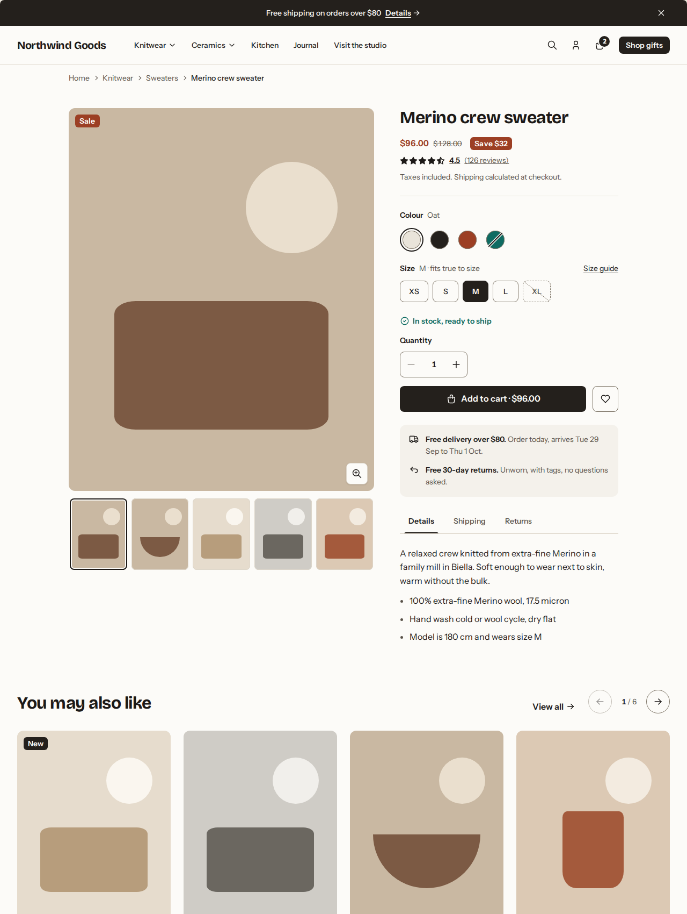
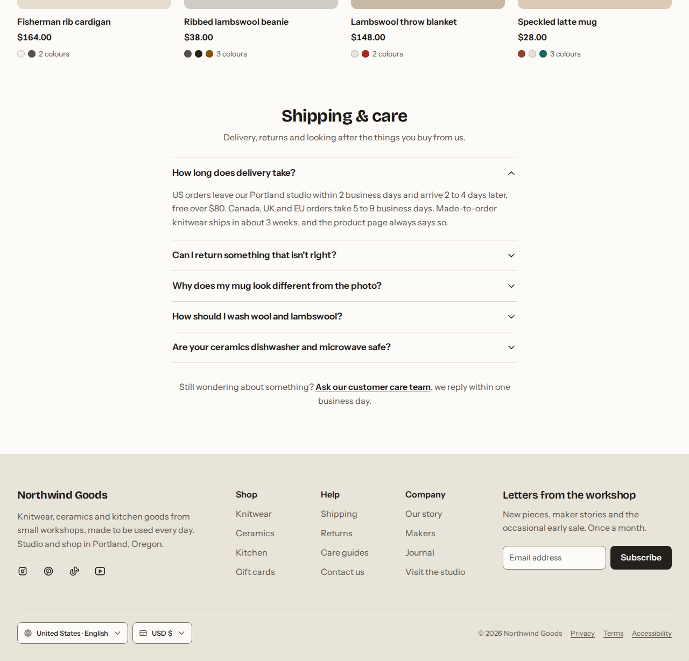
*Desktop, two consecutive slices of one tall capture: announcement bar, header, breadcrumbs, Product detail, "You may also like" (1 / 6); the "Shipping & care" FAQ and the footer with its newsletter.*

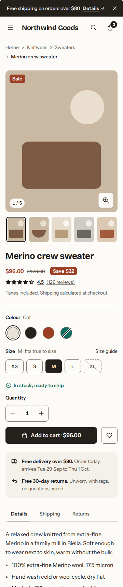
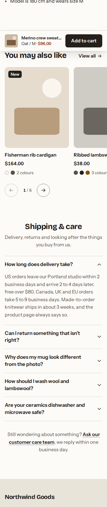
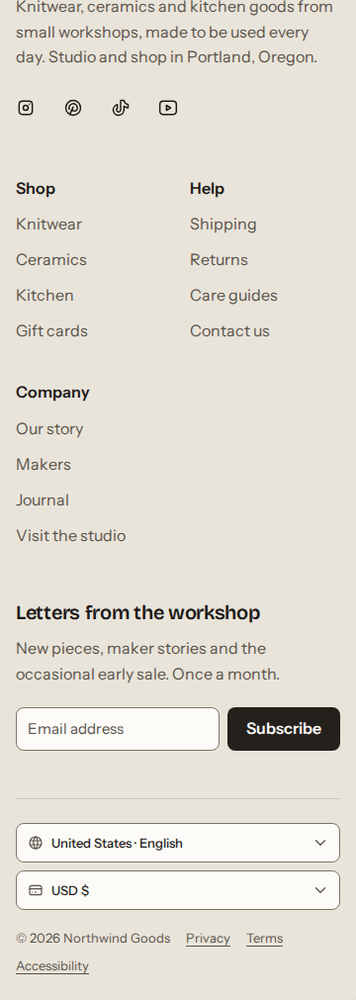
*Mobile, three consecutive slices: the buy box, then the Quick add bar pinned to the bottom while the carousel and FAQ scroll past, then the footer.*

**Block order**

| # | Block | Variant / settings | Container | Section background | Spacing to the next block |
|---|---|---|---|---|---|
| 1 | Announcement bar `announcement-bar` | `primary`, dismissable | `wide` | `primary` | Flush on the header. |
| 2 | Header `header` | `default`, sticky | `wide` | `background` | Flush on the breadcrumbs. |
| 3 | Breadcrumbs `breadcrumbs` | Trail: Home › Knitwear › Sweaters › Merino crew sweater | `content` (matches Product detail) | none (not a section) | Its own 0.75rem (`space-3`) padding. Product detail's short top padding follows (1rem, 2rem from 48rem). |
| 4 | Product detail `product-detail` | default: sale, in stock, Details tab open; `showCategory` **off**; sticky buy bar on (below 48rem only) | `content` | none | Its own `section-md` bottom padding. |
| 5 | Product carousel `product-carousel` | `related`, "You may also like", 6 items | `wide` | none | **Top padding collapsed** (same ground as Product detail). |
| 6 | FAQ `faq` | `one-column`, first item open, retitled "Shipping & care" | `narrow` | none | **Top padding collapsed** (same ground as the carousel). |
| 7 | Footer `footer` | `default`, newsletter on | `wide` | `surface-strong` | Last block. |

**Why this order**

- **Buy box first.** The breadcrumbs orient the shopper, and Product detail puts the gallery, price, options and Add to cart in the first viewport. Below 48rem, the sticky buy bar keeps Add to cart within reach while the shopper scrolls.
- **Cross-sell before the fine print.** "You may also like" catches shoppers who aren't convinced while they are still browsing. The current product is removed from the list, so the slide labels and counter read "of 6".
- **Questions last.** The FAQ answers delivery, returns and care questions at the point of doubt, just before the footer. The product tabs cover this item's shipping and returns in brief; the FAQ adds the store-wide policy.

**Spacing rules**: the page rule above. All content blocks use the default ground, so the carousel and the FAQ both lose their top padding and every gap is one `section-md`. The footer's `surface-strong` band is the only background change.

**Content notes**: Product detail's `showCategory` is off because the Breadcrumbs block gives the full trail. The Breadcrumbs block uses the `content` container, so the trail lines up with the gallery's left edge. The FAQ copy follows the store facts: US orders ship from the Portland studio within 2 business days and arrive 2 to 4 days later, free over $80; US returns are free; oven temperatures are given in °F first. Its intro reads "Delivery, returns and looking after the things you buy from us." and it ends with "Still wondering about something? Ask our customer care team, we reply within one business day."

**Acceptance criteria**

- [ ] Blocks render in the order above; exactly one `h1` (the product title); the trail is shown once (1.3.1).
- [ ] The carousel and the FAQ have no top padding; no doubled gaps.
- [ ] The carousel excludes the Merino crew sweater and shows "1 / 6" and "n of 6" slide labels.
- [ ] The buy bar appears only below 48rem and only while the main Add to cart is off screen; it never covers the focused element and the sticky header never does either (2.4.11).
- [ ] Colour and Size radio groups have page-unique names; no two instances share a selection.
- [ ] Tab order: header → breadcrumbs → Product detail (gallery before info) → carousel → FAQ → footer (2.4.3); every focusable element shows the standard focus ring (2.4.7).
- [ ] All modals on the page (menu drawer, Lightbox, back-in-stock Dialog, cart drawer) are native modal `<dialog>`s that close with `Esc` and return focus (2.1.2).
- [ ] At 320px and 200% zoom there is no horizontal page scroll (1.4.10).
- [ ] No fake urgency anywhere on the page: low stock only from real inventory, no timers.

---

### Collection page · template `collection`

The Northwind Goods collection page for "The winter edit", assembled from six blocks. The only `h1` is the Collection header title.

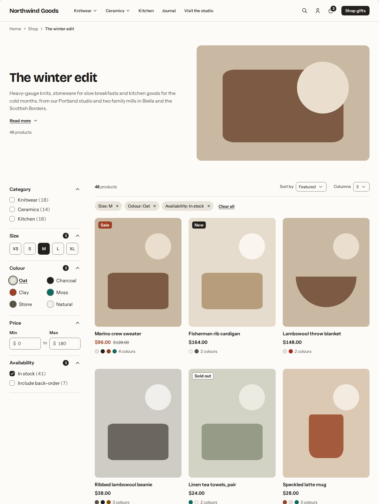
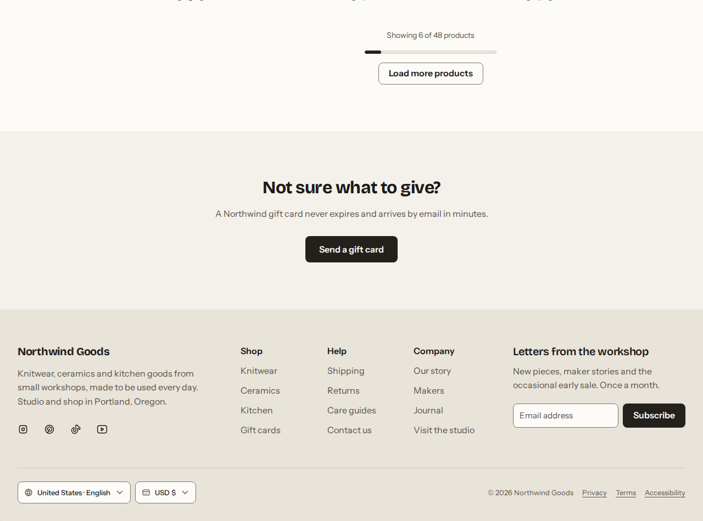
*Desktop, two consecutive slices of one tall capture: header, breadcrumbs, Collection header with image, the Collection grid with sidebar filters and chips; Load more, the gift-card call to action and the footer.*

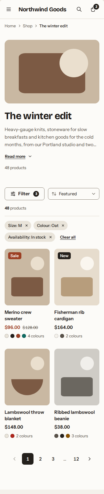
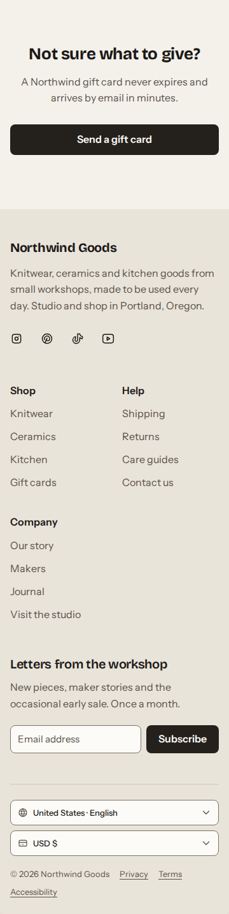
*Mobile, two consecutive slices: breadcrumbs, image-first Collection header, Filter (3) + sort, chips, 2-column grid and pagination; then the call to action and footer.*

**Block order**

| # | Block | Variant / settings | Container | Section background | Spacing to the next block |
|---|---|---|---|---|---|
| 1 | Header `header` | `default`, sticky | `wide` | `background` | Flush on the breadcrumbs. |
| 2 | Breadcrumbs `breadcrumbs` | Trail: Home › Shop › The winter edit | `wide` | none (not a section) | Its own 0.75rem (`space-3`) padding. |
| 3 | Collection header `collection-header` | `image`, description clamped, `showBreadcrumb` **off** | `wide` | none | Its own padding (2rem bottom, 3rem from 48rem). The grid's short 1.5rem top padding follows, so the two read as one unit. |
| 4 | Collection grid `collection-grid` | `sidebar`, 3 columns, 3 active chips; Load more from 64rem, pagination below 48rem | `wide` | none | Its own `section-md` bottom padding. |
| 5 | Call to action `call-to-action` | `subtle` (gift card) | `content` | `surface` | Full padding; the ground changes, so nothing collapses. |
| 6 | Footer `footer` | `default`, newsletter on | `wide` | `surface-strong` | Last block. |

**Why this order**

- **Where am I, what is this, how many?** The breadcrumbs and the Collection header answer these in one short band. The header's own breadcrumb is off so the trail isn't shown twice.
- **Grid immediately.** The product grid with filters is the reason for the page, so nothing sits between it and the header.
- **One soft next step.** After the last product row, a quiet `subtle` gift-card call to action gives undecided shoppers another route. The accent `banner` variant (discount code) was not used, because the 10% offer already lives in the newsletter; a second promotion here would compete with the grid.

**Spacing rules**: the page rule above. No pair needs collapsing: Collection header to Collection grid is already tight by design (the grid's short top padding), and each later block changes the background.

**Content notes**: the collection is "The winter edit" (the name the Hero image-background story uses), because its filters and products span knitwear, ceramics and kitchen goods. Description lead: "Heavy-gauge knits, stoneware for slow breakfasts and kitchen goods for the cold months, from our Portland studio and two family mills in Biella and the Scottish Borders." The rest of the clamped text is the Collection header default. The grid section is labelled "The winter edit products". The filter drawer is a native modal `<dialog>` opened by the mobile Filter button; its primary button reads "Show 48 products" to match the count. The paging style follows the block width: Load more at desktop widths, Pagination at mobile widths (as shown).

**Acceptance criteria**

- [ ] Blocks render in the order above; exactly one `h1` (the collection title); the breadcrumb trail is shown once (1.3.1).
- [ ] The grid starts directly under the Collection header with its 1.5rem top padding; the call to action keeps full padding on its `surface` band.
- [ ] The filter drawer opens from the Filter button as a native modal `<dialog>`, closes with `Esc`, returns focus to the Filter button, and applies filters only on Show N products (2.1.2, 2.4.3, 3.2.2).
- [ ] The result count announces changes; the Collection header count is not live (4.1.3).
- [ ] The sticky header and sticky sidebar never hide the focused element (2.4.11).
- [ ] Tab order: header → breadcrumbs → Read more → filters (sidebar) or Filter / sort (mobile) → chips → cards → Load more / pagination → call to action → footer (2.4.3); the standard focus ring shows everywhere (2.4.7).
- [ ] At 320px and 200% zoom there is no horizontal page scroll (1.4.10).
- [ ] Only one promotion (the gift card) appears between the grid and the footer.

---

### Article page · template `article`

A Northwind Goods journal post, "How we glaze our stoneware", assembled from six blocks. The only `h1` is the Article title.

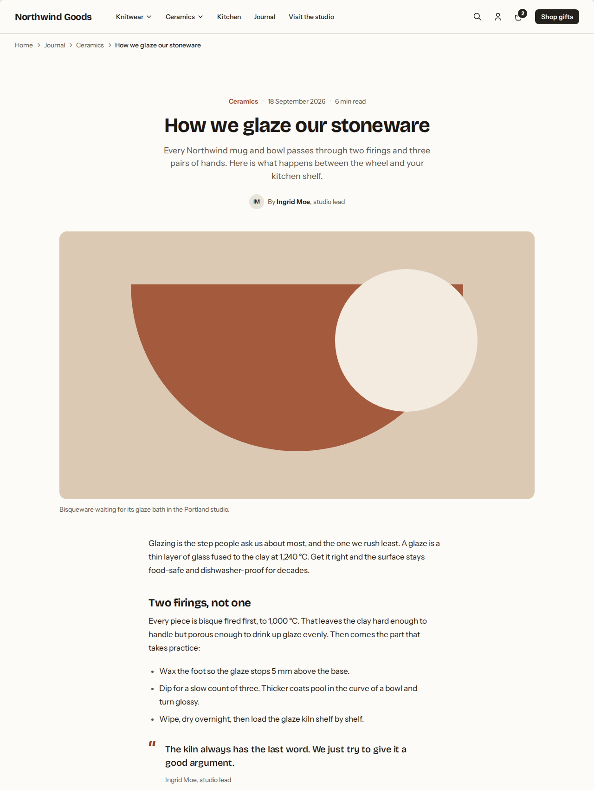
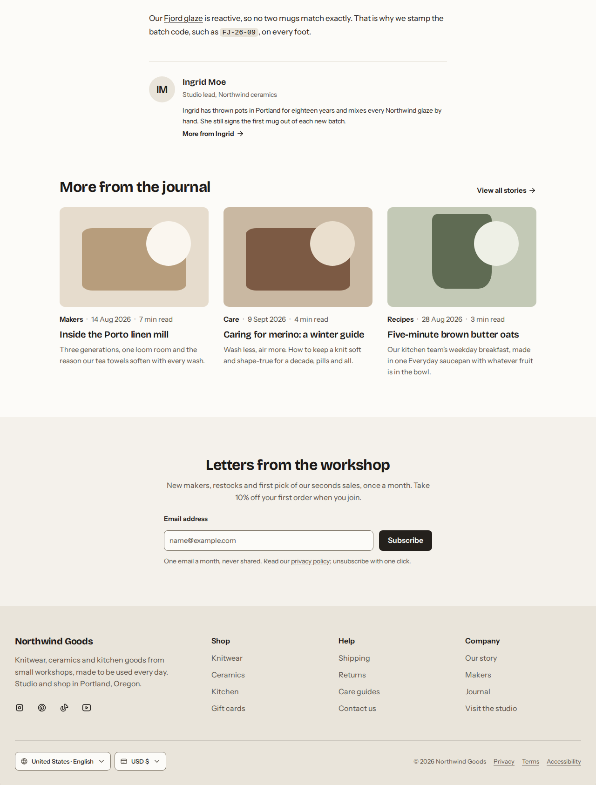
*Desktop, two consecutive slices of one tall capture: header, breadcrumbs, article header, cover with caption, body with the pull quote; the rest of the body, the author card, "More from the journal", newsletter and footer.*

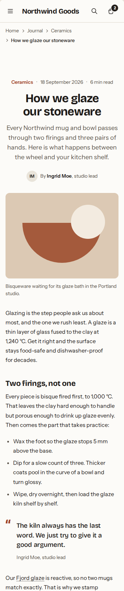
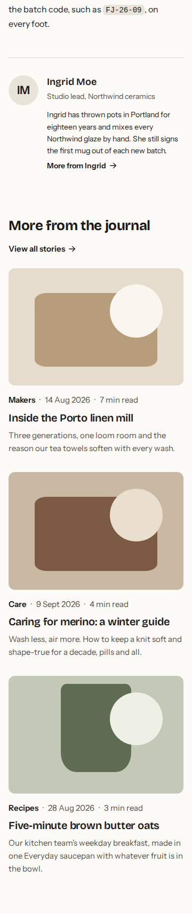
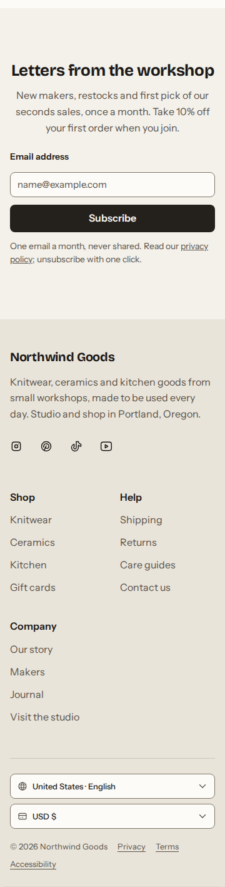
*Mobile, three consecutive slices: the article, the author card and three related stories stacked, then the newsletter and footer.*

**Block order**

| # | Block | Variant / settings | Container | Section background | Spacing to the next block |
|---|---|---|---|---|---|
| 1 | Header `header` | `default`, sticky | `wide` | `background` | Flush on the breadcrumbs. |
| 2 | Breadcrumbs `breadcrumbs` | Trail: Home › Journal › Ceramics › How we glaze our stoneware | `wide` | none (not a section) | Its own 0.75rem (`space-3`) padding. The article's full top padding follows. |
| 3 | Article `article` | fixed layout | `content` for the header and cover, `narrow` for the body and author card | none | Its own `section-md` bottom padding. |
| 4 | Article list `article-list` | `grid`, 3 related stories, no filters, no pagination, heading "More from the journal" | `content` | none | **Top padding collapsed** (same ground as the article). |
| 5 | Newsletter `newsletter` | `centered` | `content` | `surface` | Full padding; the ground changes. |
| 6 | Footer `footer` | `default`, `showNewsletter` **off** | `wide` | `surface-strong` | Last block. |

**Why this order**

- **Read first.** The breadcrumbs place the post in the journal. The Article block holds everything the reader came for: header, cover, body with its own pull quote, and the author card.
- **Then keep reading.** Three related stories give the natural next click. The current post is left out; the mill story takes its place.
- **Then subscribe.** A reader who reached the end is the likeliest to sign up, so the newsletter comes next, with the footer's own form off to avoid a duplicate.
- **No separate Quote or Image block.** The body already has a blockquote ("The kiln always has the last word…") and a captioned cover image. Either block would sit after the author card, which closes the post, and read as an afterthought. Images and quotes belong inside the rich-text body.

**Spacing rules**: the page rule above. The related-stories list loses its top padding, so it follows the author card at one `section-md` gap instead of two. The newsletter and footer keep full padding (ground changes).

**Content notes**: the studio is Portland (cover caption "Bisqueware waiting for its glaze bath in the Portland studio." and author bio), matching the footer, the Split content studio story and the FAQ. In the related list the heading is "More from the journal" with a "View all stories" link; category filters and pagination are removed (they belong on the journal index); the three stories are "Inside the Porto linen mill" (Makers · 14 Aug 2026 · 7 min read), "Caring for merino: a winter guide" (Care · 9 Sept 2026 · 4 min read) and "Five-minute brown butter oats" (Recipes · 28 Aug 2026 · 3 min read).

**Acceptance criteria**

- [ ] Blocks render in the order above; exactly one `h1` (the article title); the related list heading is `h2` (1.3.1).
- [ ] The related list has no top padding; the newsletter and footer keep full padding.
- [ ] The current post does not appear in the related list; only one newsletter form appears on the page.
- [ ] The body text column is `narrow` (40rem) and the cover `content` (64rem) at desktop; at 320px and 200% zoom the body reflows with no horizontal scroll, and code such as `FJ-26-09` wraps or scrolls inside its own box (1.4.10, 1.4.12).
- [ ] Tab order: header → breadcrumbs → article links → author link → related cards → View all stories → newsletter → footer (2.4.3); the standard focus ring shows everywhere (2.4.7).
- [ ] The sticky header never hides the focused element (2.4.11).
- [ ] Studio location reads Portland in every block on the page.

---

## Definition of done

A block is done when:

- [ ] It is built only from Spec 1 components plus layout, and matches its reference images at 1280 and 360 (and the variants and states shown).
- [ ] Every field in its table exists with the given type, requirement and default, and all visible text is inline-editable.
- [ ] Every variant, and every state in "States every block must handle" plus the block's own states, renders correctly, in the editor and on the live site.
- [ ] Its layout switches on the block's own width at 48 / 64rem and works inside a narrow column.
- [ ] Every item in its acceptance checklist passes, plus the Spec 1 testing protocol.
- [ ] Modal parts (drawers, lightboxes, confirmations) use the native `<dialog>` opened as a modal, and focus returns to the opener.
- [ ] Its default story renders a clean 1280px thumbnail for the block picker.
- [ ] The four sample pages assemble from the finished blocks and pass the page-level checks (landmarks, one `h1`, skip link, no hidden focus under the sticky header).
